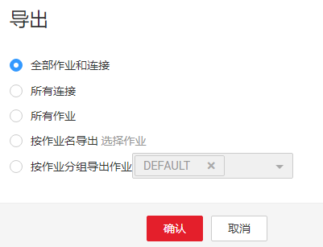

# 批量管理作业

## 操作场景

这里以表/文件迁移的作业为例进行介绍，指导用户批量管理CDM作业，提供以下操作：

-   作业分组管理
-   批量运行作业
-   批量删除作业
-   批量导出作业
-   批量导入作业

批量导出、导入作业的功能，适用以下场景：

-   CDM集群间作业迁移：例如需要将作业从老版本集群迁移到新版本的集群。
-   备份作业：例如需要将CDM集群停掉或删除来降低成本时，可以先通过批量导出把作业脚本保存下来，仅在需要的时候再重新创建集群和重新导入作业。
-   批量创建作业任务：可以先手工创建一个作业，导出作业配置（导出的文件为JSON格式），然后参考该作业配置，在JSON文件中批量复制出更多作业，最后导入CDM以实现批量创建作业。

## 操作步骤

1.  进入CDM主界面，单击左侧导航上的“集群管理“，选择集群后的“作业管理“。
2.  单击“表/文件迁移“显示作业列表，提供以下批量操作：
    -   **作业分组**

        CDM支持对分组进行新增、修改、查找、删除。删除分组时，会将组内的所有作业都删除。

        创建作业的第三步任务配置中，如果已经将作业分配到了不同的分组中，则这里可以按分组显示作业、按组批量启动作业、按分组导出作业等操作。

    -   **批量运行作业**

        勾选一个或多个作业后，单击“运行“可批量启动作业。

    -   **批量删除作业**

        勾选一个或多个作业后，单击“删除“可批量删除作业。

    -   **批量导出作业**

        单击“导出“，弹出批量导出页面，如[图1](#zh-cn_topic_0108275436_fig637116146149)。

        **图 1**  批量导出页面  
        

        -   全部作业和连接：勾选此项表示一次性导出所有作业和连接。
        -   全部作业：勾选此项表示一次性导出所有作业。
        -   全部连接：勾选此项表示一次性导出所有连接。
        -   按作业名导出：勾选此项并选择需要导出的作业，单击确认即可导出所选作业。
        -   按分组导出：勾选此项并下拉选择需要导出的分组，单击确认即可导出所选分组。

        批量导出可将需要导出的作业导出保存为JSON文件，用于备份或导入到别的集群中。

        > **说明：** 
        >由于安全原因，CDM导出作业时没有导出连接密码，连接密码全部使用“Add password here“替换。

    -   **批量导入作业**

        单击“导入“，选择JSON格式的文件导入或文本导入。

        -   文件导入：待导入的作业文件必须为JSON格式（大小不超过1M）。如果待导入的作业文件是之前从CDM中导出的，则导入前必须先编辑JSON文件，将“Add password here“替换为对应连接的正确密码，再执行导入操作。
        -   文本导入：无法正确上传本地JSON文件时可选择该方式。将作业的JSON文本直接粘贴到输入框即可。

