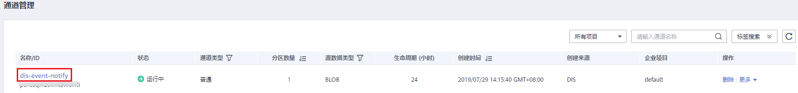
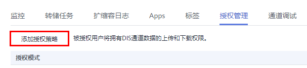
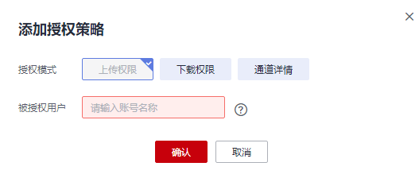

# 授权管理

通过添加授权策略，可实现被授权的其他用户拥有DIS通道的上传和下载权限。

1.  单击通道名称，进入所选通道的管理页面。

    **图 1**  通道列表  
    

2.  选择“授权管理“，单击“添加授权策略“。

    **图 2**  授权管理  
    

3.  选择授权模式，再在“被授权用户“文本框中，设置用户信息。

    > **说明：** 
    >-   支持通配符"\*"，表示授权所有帐号；
    >-   支持添加多帐号，用","隔开
    >-   支持授权某帐号下的特定用户，输入帐号名，单击"查询用户"按钮，选择用户。

    **图 3**  添加权限  
    

