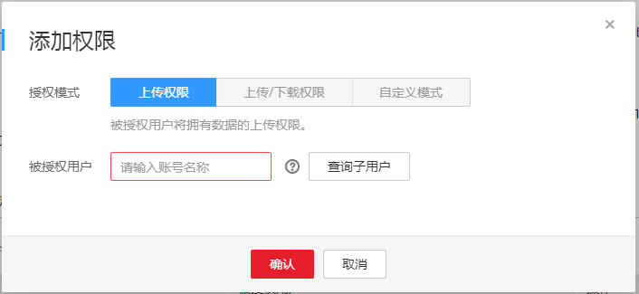

# 授权管理

通过添加授权策略，可实现被授权的其他用户拥有DIS通道的上传权限。

1.  单击通道名称，进入所选通道的管理页面。
2.  选择“授权管理“，单击“添加授权策略“，

    在“被授权用户“文本框中，设置用户信息。

    > **说明：**   
    >-   支持通配符"\*"，表示授权所有账号；  
    >-   支持添加多账号，用","隔开  
    >-   支持授权某账号下的特定用户，输入账号名，单击"查询用户"按钮，选择用户。  

    **图 1**  添加权限  
    

