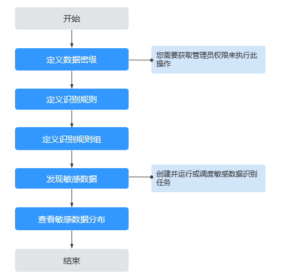

# 敏感数据简介

## 敏感数据定义

敏感数据主要指未经个人或集团授权被他人使用，有可能给个人或集团带来严重损害的数据。

以《GBT 35273-2017 信息安全技术个人信息安全规范》为例，个人敏感数据有：

-   个人财产信息 （存款、信贷、消费流水）
-   个人健康生理信息（体检信息、医疗记录）
-   个人身份信息（身份证、社保卡、驾驶证）

## 敏感数据的保护方式

-   **敏感数据识别与添加标签**

    从海量数据中将数据进行分类分级，方便进行不同粒度和级别的安全管理。

-   **数据泄露检测与防护**

    如果出现频繁访问敏感数据的异常行为，可以及时进行风险告警。

-   **数据静态脱敏、数据水印**

    对于已标记特定安全级别的敏感数据，可在对外提供数据时进行脱敏或者加水印。

-   **个人信息合规**

    精准区分和保护个人数据，避免产生合规问题。

-   **满足GDPR要求**

    满足GDPR关于在海量数据中找到和保护敏感数据的要求，可对敏感数据的使用进行审计。

-   **数据安全合规检查**

    通过对敏感数据的分析，制定数据安全合规管理制度，帮助企业建设以及改善信息安全合规管理体系。

## 敏感数据识别流程

在执行识别敏感数据任务之前，您可通过[图1](#fig6960633345)了解敏感数据识别流程。

**图 1**  敏感数据识别流程图  

1.  [定义数据密级](定义数据密级.md)

    在对数据进行操作前，为数据定义密级，用以明确涉密的范围。

2.  [定义识别规则](定义识别规则.md)

    定义敏感数据识别标准。

3.  [定义识别规则组](定义识别规则组.md)

    通过定义敏感数据识别规则及规则组，来有效识别数据库内的敏感数据。

4.  [敏感数据发现](发现敏感数据.md)

    创建并运行敏感数据识别任务。

5.  [敏感数据分布](查看敏感数据分布.md)

    查看敏感数据识别任务识别出的敏感数据。

