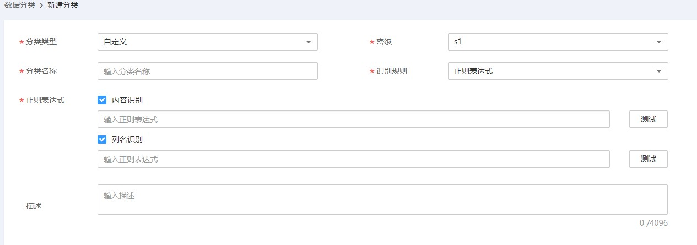

# 数据分类

本章主要介绍如何创建数据分类规则。

## 新建分类规则

1.  在DGC控制台首页，选择对应工作空间的“数据资产“模块，进入数据资产页面。

    **图 1**  选择数据资产  
    

1.  选择“数据安全  \>  数据分类“，在“分类规则“页签中，单击“新建“。

    系统弹出“新建分类“对话框，填写相关配置，完成创建分类规则。支持按模板创建（内置）规则和自定义规则两种方式。

    **图 2**  配置分类规则  
    

    **表 1**  配置分类规则参数说明

    
    <table><thead align="left"><tr id="zh-cn_topic_0228579160_row69262252365"><th class="cellrowborder" valign="top" width="18.37%" id="mcps1.2.3.1.1">
配置

    </th>
    <th class="cellrowborder" valign="top" width="81.63%" id="mcps1.2.3.1.2">
说明

    </th>
    </tr>
    </thead>
    <tbody><tr id="zh-cn_topic_0228579160_row89261252369"><td class="cellrowborder" valign="top" width="18.37%" headers="mcps1.2.3.1.1 ">
分类类型

    </td>
    <td class="cellrowborder" valign="top" width="81.63%" headers="mcps1.2.3.1.2 ">
即规则所属分类，支持内置（按模板添加）和自定义添加。

    </td>
    </tr>
    <tr id="zh-cn_topic_0228579160_row09261825143613"><td class="cellrowborder" valign="top" width="18.37%" headers="mcps1.2.3.1.1 ">
密级

    </td>
    <td class="cellrowborder" valign="top" width="81.63%" headers="mcps1.2.3.1.2 ">
对配置的数据进行等级划分。如果现有的分级不满足需求，请进入数据密级管理页面进行设置，详情请参见<a href="数据密级.md">数据密级</a>。

    </td>
    </tr>
    <tr id="zh-cn_topic_0228579160_row1756141118398"><td class="cellrowborder" valign="top" width="18.37%" headers="mcps1.2.3.1.1 ">
分类模板

    </td>
    <td class="cellrowborder" valign="top" width="81.63%" headers="mcps1.2.3.1.2 ">
分类类型选择“内置”，呈现此参数。如果选择“内置”，用户可以根据实际需要选择系统内置的敏感数据识别定义模板，例如：时间、手机号、车牌号。

    </td>
    </tr>
    <tr id="zh-cn_topic_0228579160_row1892618257367"><td class="cellrowborder" valign="top" width="18.37%" headers="mcps1.2.3.1.1 ">
分类名称

    </td>
    <td class="cellrowborder" valign="top" width="81.63%" headers="mcps1.2.3.1.2 "><ul id="zh-cn_topic_0228579160_ul1046183594415"><li>分类类型选择“内置”，分类名称自动关联分类模板生成。</li><li>分类类型选择“自定义”，用户可以自行填写分类名称。
 说明： 

定义数据分类规则，名称必须唯一。

    

    </li></ul>
    </td>
    </tr>
    <tr id="zh-cn_topic_0228579160_row149262025153620"><td class="cellrowborder" valign="top" width="18.37%" headers="mcps1.2.3.1.1 ">
识别规则

    </td>
    <td class="cellrowborder" valign="top" width="81.63%" headers="mcps1.2.3.1.2 ">
分类类型选择“自定义”，呈现此参数，支持正则表达式。

    </td>
    </tr>
    <tr id="zh-cn_topic_0228579160_row109267256367"><td class="cellrowborder" valign="top" width="18.37%" headers="mcps1.2.3.1.1 ">
正则表达式

    </td>
    <td class="cellrowborder" valign="top" width="81.63%" headers="mcps1.2.3.1.2 "><ul id="zh-cn_topic_0228579160_ul9722746459"><li>内容识别：提供的数据识别方式之一，自定义正则表达式。</li><li>列名识别：提供字段名精确匹配和模糊匹配方式，支持多个字段匹配。</li></ul>
    </td>
    </tr>
    <tr id="zh-cn_topic_0228579160_row11345752143719"><td class="cellrowborder" valign="top" width="18.37%" headers="mcps1.2.3.1.1 ">
描述

    </td>
    <td class="cellrowborder" valign="top" width="81.63%" headers="mcps1.2.3.1.2 ">
对当前规则进行简单描述。

    </td>
    </tr>
    </tbody>
    </table>

## 新建分组

1.  在DGC控制台首页，选择对应工作空间的“数据资产“模块，进入数据资产页面。

    **图 3**  选择数据资产  
    

1.  选择“数据安全  \>  数据分类“，在“分组“页签中，单击“新建“。

    系统弹出“新建分组“对话框，填写相关配置，单击“确定”，完成创建分组。

    参数设置参考[表2](#table8554125143016)，并勾选左侧列表中的分类规则。

    用户所勾选的规则将显示在右侧列表中。

    **表 2**  参数配置表

    
    <table><thead align="left"><tr id="row15555105113018"><th class="cellrowborder" valign="top" width="16.78%" id="mcps1.2.3.1.1">
配置

    </th>
    <th class="cellrowborder" valign="top" width="83.22%" id="mcps1.2.3.1.2">
说明

    </th>
    </tr>
    </thead>
    <tbody><tr id="row45551451133019"><td class="cellrowborder" valign="top" width="16.78%" headers="mcps1.2.3.1.1 ">
名称

    </td>
    <td class="cellrowborder" valign="top" width="83.22%" headers="mcps1.2.3.1.2 ">
规则组名称只能包含中文、英文字母、数字和下划线。

    </td>
    </tr>
    <tr id="row55551514304"><td class="cellrowborder" valign="top" width="16.78%" headers="mcps1.2.3.1.1 ">
描述

    </td>
    <td class="cellrowborder" valign="top" width="83.22%" headers="mcps1.2.3.1.2 ">
为更好的识别规则组，此处加以描述信息。描述信息只能包含英文字母、数字、“_”，且长度不能超过4096个字符。

    </td>
    </tr>
    </tbody>
    </table>

