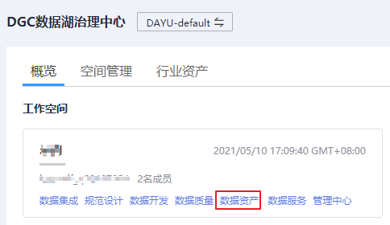

# 数据密级

本章主要介绍数据密级管理，包括密级的创建、删除和调整优先级。

## 进入数据密级管理页面

1.  在DGC控制台首页，选择对应工作空间的“数据资产“模块，进入数据资产页面。

    **图 1**  选择数据资产  
    

1.  选择“数据安全  \>  数据密级“，用户可以在该页面新建、管理和删除分级，也可以调整分级的优先级。
    -   创建分级：单击“数据密级“页签左上角的“新建“，输入名称和描述。
    -   删除：在“数据密级“页签，勾选不需要的分级，单击左上角的“删除“。
    -   调整优先级：在“数据密级“页签，单击相应分级后的上移（提高优先级）和下移（降低优先级）。

