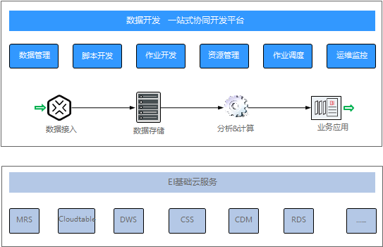

# 数据开发概述

数据开发是一个一站式的大数据协同开发平台，提供全托管的大数据调度能力。它可管理多种大数据服务，极大降低用户使用大数据的门槛，帮助您快速构建大数据处理中心。

数据开发模块历史上曾作为数据湖工厂（Data Lake Factory，后简称DLF）服务，因此在本文中，“数据湖工厂”、“DLF”均可用于指代“数据开发”模块。

## 数据开发简介

使用数据开发模块，用户可进行数据管理、脚本开发、作业开发、作业调度、运维监控等操作，轻松完成整个数据的处理分析流程。

**图 1**  数据开发模块架构  

## 数据开发的主要功能

**表 1**  数据开发的主要功能

<table><thead align="left"><tr id="row1996431113011"><th class="cellrowborder" valign="top" width="21.54%" id="mcps1.2.3.1.1">
支持的功能

</th>
<th class="cellrowborder" valign="top" width="78.46%" id="mcps1.2.3.1.2">
说明

</th>
</tr>
</thead>
<tbody><tr id="row69603183016"><td class="cellrowborder" valign="top" width="21.54%" headers="mcps1.2.3.1.1 ">
数据管理

</td>
<td class="cellrowborder" valign="top" width="78.46%" headers="mcps1.2.3.1.2 "><ul id="ul16418350123019"><li>支持管理DWS、DLI、MRS Hive等多种数据仓库。</li><li>支持可视化和DDL方式管理数据库表。</li></ul>
</td>
</tr>
<tr id="row5971831173011"><td class="cellrowborder" valign="top" width="21.54%" headers="mcps1.2.3.1.1 ">
脚本开发

</td>
<td class="cellrowborder" valign="top" width="78.46%" headers="mcps1.2.3.1.2 "><ul id="ul59173063110"><li>提供在线脚本编辑器，支持多人协作进行SQL、Shell、Python脚本在线代码开发和调测。</li><li>支持使用变量和函数。</li></ul>
</td>
</tr>
<tr id="row5979317303"><td class="cellrowborder" valign="top" width="21.54%" headers="mcps1.2.3.1.1 ">
作业开发

</td>
<td class="cellrowborder" valign="top" width="78.46%" headers="mcps1.2.3.1.2 "><ul id="ul09950193113"><li>提供图形化设计器，支持拖拉拽方式快速构建数据处理工作流。</li><li>预设数据集成、SQL、Shell等多种任务类型，通过任务间依赖完成复杂数据分析处理。</li><li>支持导入和导出作业。</li></ul>
</td>
</tr>
<tr id="row59743193017"><td class="cellrowborder" valign="top" width="21.54%" headers="mcps1.2.3.1.1 ">
资源管理

</td>
<td class="cellrowborder" valign="top" width="78.46%" headers="mcps1.2.3.1.2 ">
支持统一管理在脚本开发和作业开发使用到的file、jar、archive类型的资源。

</td>
</tr>
<tr id="row139743117307"><td class="cellrowborder" valign="top" width="21.54%" headers="mcps1.2.3.1.1 ">
作业调度

</td>
<td class="cellrowborder" valign="top" width="78.46%" headers="mcps1.2.3.1.2 ">
支持单次调度、周期调度和事件驱动调度，周期调度支持分钟、小时、天、周、月多种调度周期。

</td>
</tr>
<tr id="row02941014203211"><td class="cellrowborder" valign="top" width="21.54%" headers="mcps1.2.3.1.1 ">
运维监控

</td>
<td class="cellrowborder" valign="top" width="78.46%" headers="mcps1.2.3.1.2 "><ul id="ul13385402325"><li>支持对作业进行运行、暂停、恢复、终止等多种操作。</li><li>支持查看作业和其内各任务节点的运行详情。</li><li>支持配置多种方式报警，作业和任务发生错误时可及时通知相关人，保证业务正常运行。</li></ul>
</td>
</tr>
</tbody>
</table>

## 数据开发中的对象

-   数据连接：定义访问数据实体存储（计算）空间所需信息的集合，包括连接类型、名称和登录信息等。
-   解决方案：解决方案为用户提供便捷的、系统的方式管理作业，更好地实现业务需求和目标。每个解决方案可以包含一个或多个业务相关的作业，一个作业可以被多个解决方案复用。

-   作业：作业由一个或多个节点组成，共同执行以完成对数据的一系列操作。
-   脚本：脚本（Script）是一种批处理文件的延伸，是一种纯文本保存的程序，一般来说的计算机脚本程序是确定的一系列控制计算机进行运算操作动作的组合，在其中可以实现一定的逻辑分支等。
-   节点：定义对数据执行的操作。
-   资源：用户可以上传自定义的代码或文本文件作为资源，以便在节点运行时调用。

-   表达式：数据开发作业中的节点参数可以使用表达式语言（Expression Language，简称EL），根据运行环境动态生成参数值。数据开发EL表达式包含简单的算术和逻辑计算，引用内嵌对象，包括作业对象和一些工具类对象。

-   环境变量：环境变量是在操作系统中一个具有特定名字的对象，它包含了一个或者多个应用程序所将使用到的信息。
-   补数据：手工触发周期方式调度的作业任务，生成某时间段内的实例。

