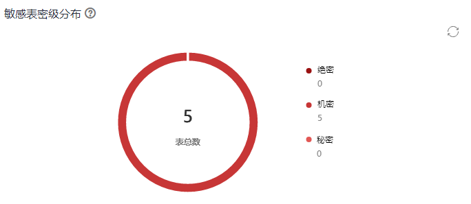
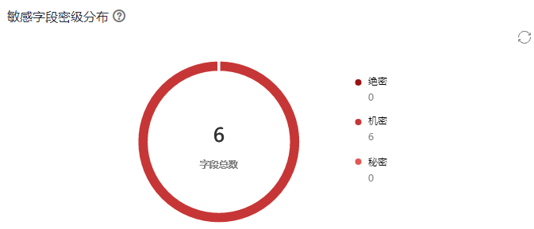
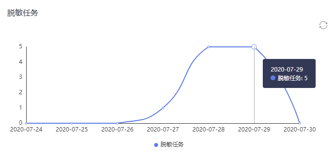
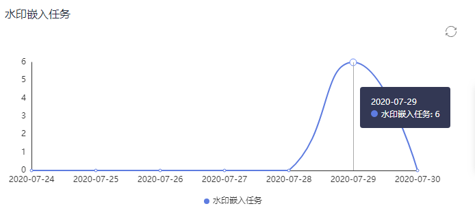

# 数据总览

总览页面为您提供数据的全局视图，包括查看数据概况、数据分析报表。

## 查看数据概况

在总览页，用户可以根据日期，查看不同数据源类型，例如数据仓库服务（DWS）、数据湖探索（DLI）和MapReduce服务（MRS Hive）类型的数据连接所包含的数据库中的敏感数据，包括敏感表总数、敏感字段总数、脱敏表数、嵌入水印表数、水印溯源数。

**图 1**  数据概况  

## 数据分析报表

-   敏感表密级分布图

    展示敏感发现任务识别出的表的密级分布，密级和用户定义的一致。右侧显示用户定义的密级及其关联的敏感表数目。

    敏感数据识别任务的创建和运行，参考[创建敏感数据发现任务](发现敏感数据.md#section191138181)和[调度运行敏感数据发现任务](发现敏感数据.md#section1526433521717)。

    **图 2**  敏感表密级分布图  
    

-   敏感字段密级分布图

    展示敏感发现任务识别出的表敏感字段，密级和用户定义的一致。右侧显示用户定义的密级及其关联的敏感字段数目。

    敏感数据识别任务的创建和运行，参考[创建敏感数据发现任务](发现敏感数据.md#section191138181)和[调度运行敏感数据发现任务](发现敏感数据.md#section1526433521717)。

    **图 3**  敏感字段密级分布图  
    

-   脱敏任务趋势图

    敏感任务趋势图利用日期对应的脱敏任务数来反映任务趋势变化。数据脱敏任务创建和运行，参考[创建静态脱敏任务](管理静态脱敏任务.md#section191138181)和[调度运行静态脱敏任务](管理静态脱敏任务.md#section626310576535)。

    **图 4**  脱敏任务趋势图  
    

-   水印嵌入趋势图

    水印嵌入任务趋势图利用日期对应的水印嵌入任务数来反映任务趋势变化。

    水印嵌入任务创建和运行，参考[创建数据水印嵌入任务](嵌入数据水印.md#section191138181)和[调度运行数据水印嵌入任务](嵌入数据水印.md#section919710226580)。

    **图 5**  水印嵌入任务趋势图  
    

