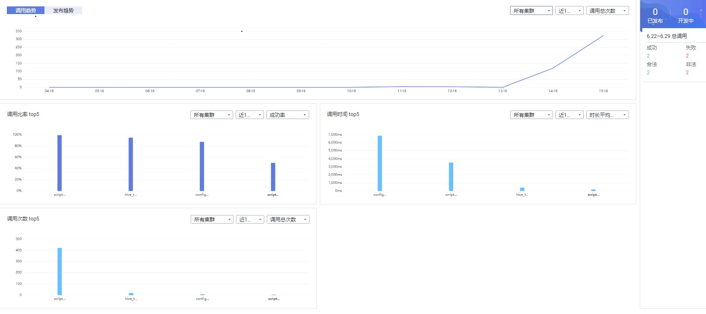

# 数据服务概览

DGC数据服务旨在为企业搭建统一的数据服务总线，帮助企业统一管理对内对外的API服务。数据服务为您提供快速将数据表生成数据API的能力，涵盖API发布、管理、运维、售卖的全生命周期管理，帮助您简单、快速、低成本、低风险地实现微服务聚合、前后端分离、系统集成，向合作伙伴、开发者开放功能和数据。

相对于数据共享交换或其他数据开放形式，使用数据服务进行数据开放具备如下优势：

-   统一接口标准，减少上层应用对接工作量。
-   将数据逻辑沉淀至数据平台，实现应用逻辑与数据逻辑解耦，在减少数据模型的重复开发的同时，避免数据逻辑调整带来的“散弹式修改”。
-   将数据逻辑相关的存储与计算资源下沉到数据平台，降低应用侧的资源消耗。
-   减少大量明细、敏感数据在应用侧的暴露，同时通过API 审核发布、鉴权流控、动态脱敏等手段，提升数据安全能力。

值得注意的是，数据服务是通过将数据逻辑封装成统一标准的Restful 风格API从而实现数据开放，适用于小批量数据的快速响应交互场景。如果为大量数据开放的场景，更适于通过数据共享交换或其他方案实现，这种情况下，建议您通过[数据安全](概述.md)进行权限管控、敏感数据识别、数据脱敏、数据水印等手段保护数据安全。

数据服务采用Serverless架构，您只需关注API本身的查询逻辑，无需关心运行环境等基础设施，数据服务会为您准备好计算资源，并支持弹性扩展，零运维成本。

**图 1**  数据服务架构图  

## API开放方使用流程

您作为API提供者，需要实现一个或一组API的开放，那么您需要先后完成以下工作：

1.  [准备工作](准备工作-9.md)

    如果您需要使用数据服务专享版，需要先[购买专享版集群](购买专享版集群.md)。

    另外，在创建API前，您还需要[新建审核人](新建审核人.md)。

2.  [创建API](创建API.md)

    创建API包含[生成API](创建API.md)和[注册API](注册API.md)。其中，生成API支持两种方式（[向导模式生成API](配置模式生成API.md)和[脚本模式生成API](脚本模式生成API.md)）。

3.  [调试API](调试API.md)

    API创建后需要验证服务是否正常，管理控制台提供了调试功能。

4.  [发布API](发布API.md)

    只有将API发布后，API才支持被调用。

5.  [（可选）管理API](管理API.md)

    您可以根据您的需要，对已创建发布的API进行管理。

6.  [（可选）流量控制](流量控制.md)

    为了保护后端服务的稳定的考虑，您可以对API进行流量控制。

## API调用方使用流程

您作为API调用者，需要实现一个API的调用，那么您需要完成以下工作：

1.  获取API

    从服务目录获取需要调用API。仅在API发布后，才支持被调用。

2.  （可选）创建应用并获取授权

    对于使用APP和IAM认证的API，需要完成[创建应用](调用API.md#zh-cn_topic_0179716875_section266103219405)和[将API授权给应用](调用API.md#zh-cn_topic_0179716875_section173071443114111)。在API调用过程中，使用所创建应用的密钥对（AppKey、AppSecret），数据服务根据密钥对进行身份核对，完成鉴权。关于使用APP认证的方法，具体请参考[数据服务SDK参考](https://support.huaweicloud.com/sdkreference-dgc/dgc_06_1001.html)。

3.  [调用API](调用API.md#zh-cn_topic_0179716875_section13147154512613)

    API调用者完成以上步骤后，可以参考[数据服务SDK参考](https://support.huaweicloud.com/sdkreference-dgc/dgc_06_1001.html)进行API调用。

## 总览页面说明

在总览页用户可以看到丰富的监控数据视图。数据服务总览页面分别从API开放方和API调用方的视角，统计了API的相关度量数据。

**图 2**  API总览  

**表 1**  API开放方数据统计

<table><thead align="left"><tr id="zh-cn_topic_0179716868_row143585194153"><th class="cellrowborder" valign="top" width="17.46%" id="mcps1.2.3.1.1">
界面

</th>
<th class="cellrowborder" valign="top" width="82.54%" id="mcps1.2.3.1.2">
说明

</th>
</tr>
</thead>
<tbody><tr id="zh-cn_topic_0179716868_row735814192156"><td class="cellrowborder" valign="top" width="17.46%" headers="mcps1.2.3.1.1 ">
发布趋势

</td>
<td class="cellrowborder" valign="top" width="82.54%" headers="mcps1.2.3.1.2 ">
从每天、每周、每月、每年的维度统计了API开放方发布的API数量。

</td>
</tr>
<tr id="row595103413217"><td class="cellrowborder" valign="top" width="17.46%" headers="mcps1.2.3.1.1 ">
调用趋势

</td>
<td class="cellrowborder" valign="top" width="82.54%" headers="mcps1.2.3.1.2 ">
从半天、每天、每周、每月的维度统计了API开放方发布的API，被调用的次数。

</td>
</tr>
<tr id="row8882155612413"><td class="cellrowborder" valign="top" width="17.46%" headers="mcps1.2.3.1.1 ">
调用比率TOP5

</td>
<td class="cellrowborder" valign="top" width="82.54%" headers="mcps1.2.3.1.2 ">
统计API开放方所开放的API，被调用的比率，包含成功率、失败率、合法率和非法率。

</td>
</tr>
<tr id="row6152175102514"><td class="cellrowborder" valign="top" width="17.46%" headers="mcps1.2.3.1.1 ">
调用时间TOP5

</td>
<td class="cellrowborder" valign="top" width="82.54%" headers="mcps1.2.3.1.2 ">
统计API开放方所开放的API，被调用时长，支持统计的维度包含时长平均总值、成功时长平均总值，失败时长平均总值。

</td>
</tr>
<tr id="row220519162516"><td class="cellrowborder" valign="top" width="17.46%" headers="mcps1.2.3.1.1 ">
调用次数TOP5

</td>
<td class="cellrowborder" valign="top" width="82.54%" headers="mcps1.2.3.1.2 ">
统计API开放方所开放的API，被调用次数排名TOP5的，支持统计的维度包含调用总次数、成功次数、失败次数、合法次数和非法次数。

</td>
</tr>
<tr id="zh-cn_topic_0179716868_row1635817194157"><td class="cellrowborder" valign="top" width="17.46%" headers="mcps1.2.3.1.1 ">
已发布

</td>
<td class="cellrowborder" valign="top" width="82.54%" headers="mcps1.2.3.1.2 ">
统计API开放方已成功发布至服务市场的API数量。

</td>
</tr>
<tr id="zh-cn_topic_0179716868_row1335817192157"><td class="cellrowborder" valign="top" width="17.46%" headers="mcps1.2.3.1.1 ">
开发中

</td>
<td class="cellrowborder" valign="top" width="82.54%" headers="mcps1.2.3.1.2 ">
统计API开放方开发中的API数量。

</td>
</tr>
<tr id="zh-cn_topic_0179716868_row183581619181512"><td class="cellrowborder" valign="top" width="17.46%" headers="mcps1.2.3.1.1 ">
申请者

</td>
<td class="cellrowborder" valign="top" width="82.54%" headers="mcps1.2.3.1.2 ">
统计API开放方已成功发布的API，被申请调用的应用数量。

</td>
</tr>
<tr id="zh-cn_topic_0179716868_row835891961510"><td class="cellrowborder" valign="top" width="17.46%" headers="mcps1.2.3.1.1 ">
调用成功

</td>
<td class="cellrowborder" valign="top" width="82.54%" headers="mcps1.2.3.1.2 ">
统计API开放方已成功发布的API，被应用成功调用的次数。

</td>
</tr>
<tr id="row14400181172412"><td class="cellrowborder" valign="top" width="17.46%" headers="mcps1.2.3.1.1 ">
调用失败

</td>
<td class="cellrowborder" valign="top" width="82.54%" headers="mcps1.2.3.1.2 ">
统计API开放方已成功发布的API，被应用调用失败的次数。

</td>
</tr>
<tr id="zh-cn_topic_0179716868_row18755546152511"><td class="cellrowborder" valign="top" width="17.46%" headers="mcps1.2.3.1.1 ">
总调用次数

</td>
<td class="cellrowborder" valign="top" width="82.54%" headers="mcps1.2.3.1.2 ">
统计API开放方已成功发布的API，被应用调用的总次数。

</td>
</tr>
</tbody>
</table>

**图 3**  调用总览  

**表 2**  API调用方数据统计

<table><thead align="left"><tr id="zh-cn_topic_0179716868_row279784543412"><th class="cellrowborder" valign="top" width="16.830000000000002%" id="mcps1.2.3.1.1">
界面

</th>
<th class="cellrowborder" valign="top" width="83.17%" id="mcps1.2.3.1.2">
说明

</th>
</tr>
</thead>
<tbody><tr id="zh-cn_topic_0179716868_row15797174503416"><td class="cellrowborder" valign="top" width="16.830000000000002%" headers="mcps1.2.3.1.1 ">
调用趋势

</td>
<td class="cellrowborder" valign="top" width="83.17%" headers="mcps1.2.3.1.2 ">
从每天、每周、每月、每年的维度统计了API调用方调用的API数量。

</td>
</tr>
<tr id="zh-cn_topic_0179716868_row8797104511340"><td class="cellrowborder" valign="top" width="16.830000000000002%" headers="mcps1.2.3.1.1 ">
调用比率

</td>
<td class="cellrowborder" valign="top" width="83.17%" headers="mcps1.2.3.1.2 ">
统计调用方最近7天内调用API的成功和失败比例。

</td>
</tr>
<tr id="zh-cn_topic_0179716868_row5798194533415"><td class="cellrowborder" valign="top" width="16.830000000000002%" headers="mcps1.2.3.1.1 ">
已申请

</td>
<td class="cellrowborder" valign="top" width="83.17%" headers="mcps1.2.3.1.2 ">
统计API调用方，在数据服务平台申请调用的API数量。

</td>
</tr>
<tr id="zh-cn_topic_0179716868_row18798845193414"><td class="cellrowborder" valign="top" width="16.830000000000002%" headers="mcps1.2.3.1.1 ">
调用成功

</td>
<td class="cellrowborder" valign="top" width="83.17%" headers="mcps1.2.3.1.2 ">
统计API调用方在数据服务平台成功调用API的次数。

</td>
</tr>
<tr id="zh-cn_topic_0179716868_row11798945203417"><td class="cellrowborder" valign="top" width="16.830000000000002%" headers="mcps1.2.3.1.1 ">
总调用次数

</td>
<td class="cellrowborder" valign="top" width="83.17%" headers="mcps1.2.3.1.2 ">
统计API调用方在数据服务平台调用API的总次数。

</td>
</tr>
</tbody>
</table>

