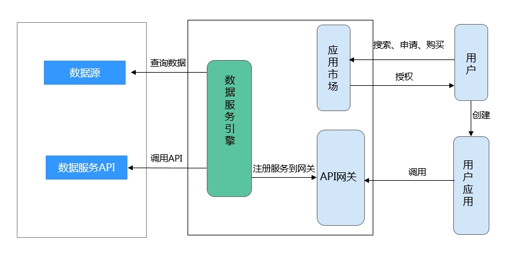
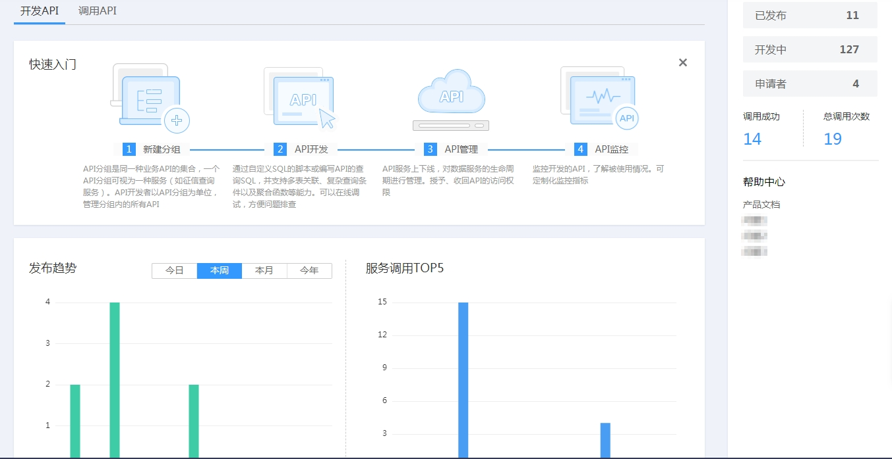
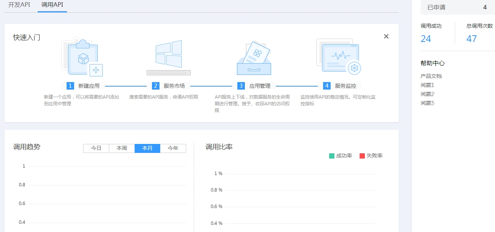

# 数据服务概览

本章将从数据API生成、API注册、API调用和API运营等方面，为您介绍数据服务功能。

DAYU数据服务旨在为企业搭建统一的数据服务总线，帮助企业统一管理对内对外的API服务。数据服务为您提供快速将数据表生成数据API的能力，同时支持您将现有的API快速注册到数据服务平台以统一管理和发布。

数据服务采用Serverless架构，您只需关注API本身的查询逻辑，无需关心运行环境等基础设施，数据服务会为您准备好计算资源，并支持弹性扩展，零运维成本。

**图 1**  数据服务架构图  

## 总览页面说明

数据服务总览页面分别从API开放方和API调用方的视角，统计了API的相关度量数据。

**图 2**  开发API总览  

**表 1**  API开放方数据统计

<table><thead align="left"><tr id="zh-cn_topic_0179716868_row143585194153"><th class="cellrowborder" valign="top" width="16.830000000000002%" id="mcps1.2.3.1.1">
界面

</th>
<th class="cellrowborder" valign="top" width="83.17%" id="mcps1.2.3.1.2">
说明

</th>
</tr>
</thead>
<tbody><tr id="zh-cn_topic_0179716868_row735814192156"><td class="cellrowborder" valign="top" width="16.830000000000002%" headers="mcps1.2.3.1.1 ">
发布趋势

</td>
<td class="cellrowborder" valign="top" width="83.17%" headers="mcps1.2.3.1.2 ">
从每天、每周、每月、每年的维度统计了API开放方发布的API数量。

</td>
</tr>
<tr id="zh-cn_topic_0179716868_row1535816199152"><td class="cellrowborder" valign="top" width="16.830000000000002%" headers="mcps1.2.3.1.1 ">
服务调用TOP5

</td>
<td class="cellrowborder" valign="top" width="83.17%" headers="mcps1.2.3.1.2 ">
统计API开放方所开放的API，被调用排名TOP5的。

</td>
</tr>
<tr id="zh-cn_topic_0179716868_row1635817194157"><td class="cellrowborder" valign="top" width="16.830000000000002%" headers="mcps1.2.3.1.1 ">
已发布

</td>
<td class="cellrowborder" valign="top" width="83.17%" headers="mcps1.2.3.1.2 ">
统计API开放方已成功发布至服务市场的API数量。

</td>
</tr>
<tr id="zh-cn_topic_0179716868_row1335817192157"><td class="cellrowborder" valign="top" width="16.830000000000002%" headers="mcps1.2.3.1.1 ">
开发中

</td>
<td class="cellrowborder" valign="top" width="83.17%" headers="mcps1.2.3.1.2 ">
统计API开放方开发中的API数量。

</td>
</tr>
<tr id="zh-cn_topic_0179716868_row183581619181512"><td class="cellrowborder" valign="top" width="16.830000000000002%" headers="mcps1.2.3.1.1 ">
申请者

</td>
<td class="cellrowborder" valign="top" width="83.17%" headers="mcps1.2.3.1.2 ">
统计API开放方已成功发布的API，被申请调用的应用数量。

</td>
</tr>
<tr id="zh-cn_topic_0179716868_row835891961510"><td class="cellrowborder" valign="top" width="16.830000000000002%" headers="mcps1.2.3.1.1 ">
调用成功

</td>
<td class="cellrowborder" valign="top" width="83.17%" headers="mcps1.2.3.1.2 ">
统计API开放方已成功发布的API，被应用成功调用的次数。

</td>
</tr>
<tr id="zh-cn_topic_0179716868_row18755546152511"><td class="cellrowborder" valign="top" width="16.830000000000002%" headers="mcps1.2.3.1.1 ">
总调用次数

</td>
<td class="cellrowborder" valign="top" width="83.17%" headers="mcps1.2.3.1.2 ">
统计API开放方已成功发布的API，被应用调用的总次数。

</td>
</tr>
</tbody>
</table>

**图 3**  调用API总览  

**表 2**  API调用方数据统计

<table><thead align="left"><tr id="zh-cn_topic_0179716868_row279784543412"><th class="cellrowborder" valign="top" width="16.830000000000002%" id="mcps1.2.3.1.1">
界面

</th>
<th class="cellrowborder" valign="top" width="83.17%" id="mcps1.2.3.1.2">
说明

</th>
</tr>
</thead>
<tbody><tr id="zh-cn_topic_0179716868_row15797174503416"><td class="cellrowborder" valign="top" width="16.830000000000002%" headers="mcps1.2.3.1.1 ">
调用趋势

</td>
<td class="cellrowborder" valign="top" width="83.17%" headers="mcps1.2.3.1.2 ">
从每天、每周、每月、每年的维度统计了API调用方调用的API数量。

</td>
</tr>
<tr id="zh-cn_topic_0179716868_row8797104511340"><td class="cellrowborder" valign="top" width="16.830000000000002%" headers="mcps1.2.3.1.1 ">
调用比率

</td>
<td class="cellrowborder" valign="top" width="83.17%" headers="mcps1.2.3.1.2 ">
统计调用方最近7天内调用API的成功和失败比例。

</td>
</tr>
<tr id="zh-cn_topic_0179716868_row5798194533415"><td class="cellrowborder" valign="top" width="16.830000000000002%" headers="mcps1.2.3.1.1 ">
已申请

</td>
<td class="cellrowborder" valign="top" width="83.17%" headers="mcps1.2.3.1.2 ">
统计API调用方，在数据服务平台申请调用的API数量。

</td>
</tr>
<tr id="zh-cn_topic_0179716868_row18798845193414"><td class="cellrowborder" valign="top" width="16.830000000000002%" headers="mcps1.2.3.1.1 ">
调用成功

</td>
<td class="cellrowborder" valign="top" width="83.17%" headers="mcps1.2.3.1.2 ">
统计API调用方在数据服务平台成功调用API的次数。

</td>
</tr>
<tr id="zh-cn_topic_0179716868_row11798945203417"><td class="cellrowborder" valign="top" width="16.830000000000002%" headers="mcps1.2.3.1.1 ">
总调用次数

</td>
<td class="cellrowborder" valign="top" width="83.17%" headers="mcps1.2.3.1.2 ">
统计API调用方在数据服务平台调用API的总次数。

</td>
</tr>
</tbody>
</table>

## API开放方使用流程

您作为API提供者，需要实现一个或一组API的开放，那么您需要先后完成以下工作：

1.  [创建API分组](向导模式生成API.md#zh-cn_topic_0180012632_section18624154416414)

    API分组相当于API的集合，您在创建API前，需要先创建API分组。

2.  [绑定域名](向导模式生成API.md#zh-cn_topic_0180012632_section26161510162815)

    开放API前，您需要为API分组绑定一个或多个独立域名（即自定义域名），API调用者通过访问独立域名来调用您开放的API。

3.  创建API

    创建API包含两种方式，[生成API](生成API.md#dayu_01_0303)和[注册API](注册API.md#dayu_01_0307)。其中，生成API支持两种方式（[向导模式生成API](向导模式生成API.md#dayu_01_0305)和[脚本模式生成API](脚本模式生成API.md#dayu_01_0306)）。

4.  [发布API](发布API.md#dayu_01_0308)

    只有将API发布至服务市场，API才支持被调用。

## API调用方使用流程

API调用者实现一个API的调用，需要完成以下工作：

1.  获取API

    获取API：从服务市场获取API。

2.  [创建应用并获取授权](调用API.md#zh-cn_topic_0179716875_section266103219405)

    对于使用APP认证的API，需要在数据服务中创建一个应用，以生成应用ID和密钥对（AppKey、AppSecret）。将创建的应用绑定API后，才可以使用APP认证调用API。您需要联系API提供者，提供您的应用信息，获得授权。在API调用过程中，把密钥对替换SDK中的密钥对，数据服务根据密钥对进行身份核对，完成鉴权。关于使用APP认证的方法，具体请参考《数据服务SDK参考》。

3.  调用API

    API调用者完成以上准备工作后，可以参考[调用API](调用API.md#zh-cn_topic_0179716875_section13147154512613)进行调用。

