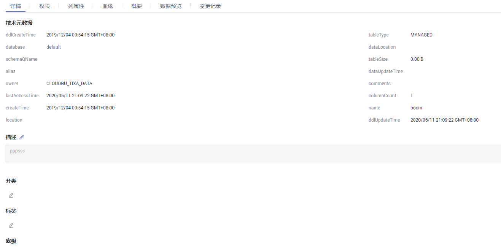
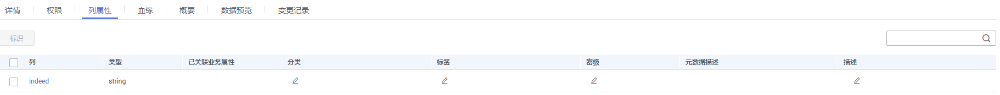

# 数据目录

通过数据目录可以对资产进行搜索、过滤、查看详情、查看血缘、查看关系、添加分类与标签等操作。

## 资产搜索

通过资产名称和描述的关键字或按所有属性搜索资产，支持模糊搜索。

1.  在DGC控制台首页，选择对应工作空间的“数据资产“模块，进入数据资产页面。

    **图 1**  选择数据资产  
    

1.  选择“数据地图  \>  数据目录“。
2.  在资产搜索输入框输入需要查找的数据关键字进行搜索，搜索结果以列表方式显示。

    按名称和描述搜索：表示按照资产的名称和描述进行搜索。

    按所有属性搜索：表示按照资产的全部属性（即详情页中展示的属性）进行搜索。

    > **说明：** 
    >-   支持保存当前设置的搜索条件。
    >-   支持导入搜索条件。

## 资产筛选

对资产搜索结果，可以基于条件进行筛选，支持的筛选条件类别如下：

-   数据连接：数据资产所属数据连接名称。
-   类型：数据资产所属类型。
-   分类：数据资产所属分类。
-   标签：数据资产所包含的标签。
-   密级：数据资产所属密级。

如下通过资产类型过滤搜索结果，其他类同。

1.  在类型过滤区域，选择“Table“，搜索结果显示属于Table类型的资产。
2.  类型过滤条件按照名称排序，默认只显示前五种类型，单击“全部“，显示系统目前支持的所有资产类型。

## 资产详情

以查看数据表详情为例。

1.  在资产搜索结果列表，单击任意数据表，进入数据表详情页面。
2.  在“详情“页签，可查看技术元数据基本属性、编辑描述；可给数据表添加标签和密级；可给数据表的列和OBS对象添加或删除分类、标签和密级。

    **图 2**  查看详情  
    

3.  在“列属性“页签，可查看数据表的列属性，给数据列添加或删除分类、标签和密级，并编辑描述。

    **图 3**  管理列属性  
    

4.  在“血缘“页签，可查看数据表的血缘关系，包括血缘和影响。如何配置数据血缘请参见[节点数据血缘](节点数据血缘.md)。节点配置血缘关系后，作业执行时可以自动解析，然后数据资产采集元数据时会采集上来，在数据资产中展示。
5.  在“概要“页签，查看数据表的概要信息（当前仅支持DWS、DLI类型数据表查看概要）。

    单击“更新“，可更新概要信息。

6.  在“数据预览“页签，查看数据表脱敏后的效果。
7.  在“变更记录“页签，查看数据表变更详情。

