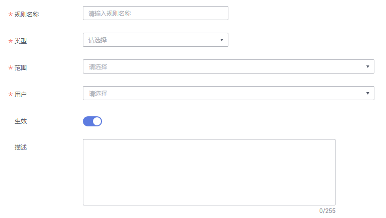

# 数据目录权限

本章节主要介绍数据目录权限管理。

## 约束与限制

-   仅管理员角色的用户支持创建、删除、修改数据目录权限规则和设置数据目录权限生效状态。
-   开发者、运维者和访客角色的用户仅支持查看数据目录权限规则和规则列表。

## 管理数据目录权限规则

1.  在DGC控制台首页，选择对应工作空间的“数据资产“模块，进入数据资产页面。

    **图 1**  选择数据资产  
    

1.  选择“数据权限  \>  数据目录权限“，单击“新建“，配置数据目录权限规则。

    1.  规则名称：设置数据权限规则的名称。
    2.  类型：当前支持从标签、密级和分类的维度进行过滤筛选。
    3.  范围：选择实际的标签、密级和分类。
    4.  用户：配置的数据目录权限规则所适配的用户。
    5.  生效：打开，表示该数据目录权限规则生效。反之，不生效。

    > **说明：** 
    >数据目录权限规则生效后，仅该数据目录权限规则所适配的用户，可管理限定标签或者分类的数据资产。例如设置类型为标签，范围选择test，用户设置为A，当开启权限规则后，A用户只可管理test标签的资产。

    **图 2**  新建规则  
    

2.  在数据权限规则列表中，选择对应规则后的编辑和删除，可修改和删除数据权限规则。

