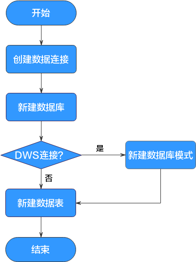

# 数据管理流程

数据管理功能可以协助用户快速建立数据模型，为后续的脚本和作业开发提供数据实体。通过数据管理，您可以：

-   支持管理DWS、MRS Hive等多种数据仓库。
-   支持可视化和DDL方式管理数据库表。

> **说明：** 
>如果您在使用数据开发前，已参考[使用DGC前的准备](使用DGC前的准备.md)创建了数据连接和对应的数据库和数据表，则可跳过数据管理操作，直接进入[脚本开发](脚本开发流程.md)或[作业开发](作业开发流程.md)。

数据管理的使用流程如下：

**图 1**  数据管理流程  

1.  创建数据连接，连接相关数据湖底座服务。具体请参见[新建数据连接](新建数据连接.md)。
2.  基于相应服务，新建数据库。具体请参见[新建数据库](新建数据库.md)。
3.  如果是DWS连接，则需要新建数据库模式；否则直接新建数据表。具体请参见[（可选）新建数据库模式](（可选）新建数据库模式.md)和[新建数据表](新建数据表.md)。

