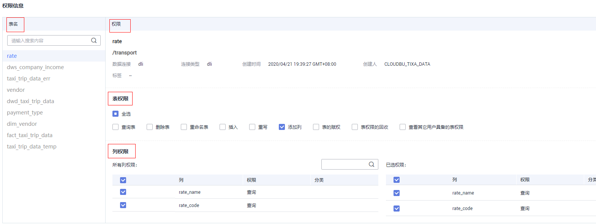
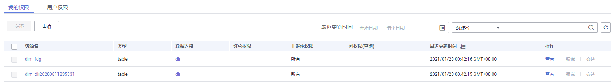
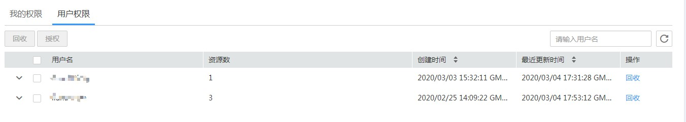
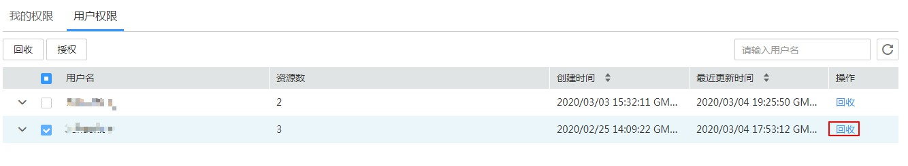
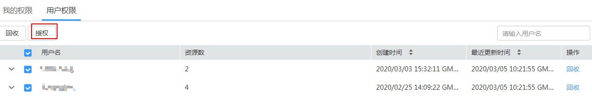

# 数据表权限

用户可以在我的权限页面，查看工作空间内自己拥有的表和列权限，并对表和列的权限进行申请或交还。

管理员角色的用户具备管理“用户权限”的功能，即管理员可查看已在该工作空间内申请过权限的所有用户的资源权限。

## 申请表/列权限

> **说明：** 
>-   当前版本仅支持DLI数据表权限控制。
>-   因申请表/列权限，需要审批人审批后方生效。所以申请表/列权限前，请先参见[•管理审批人](审批中心.md#section143151153934)新建审批人。

1.  在DGC控制台首页，选择对应工作空间的“数据资产“模块，进入数据资产页面。

    **图 1**  选择数据资产  
    

1.  选择“数据权限  \>  数据表权限“，在“我的权限“页签中单击“申请“。
2.  输入使用场景说明，选择对应数据连接、数据库和数据表。
3.  选择需要申请的表/列权限。

    -   申请单张表/列权限。

        勾选自己当前无权限但需要使用的表权限/列权限。

    -   申请多张表/列权限。

        批量选择多张表后，在权限信息页面依次勾选需要使用的表/列权限。

    **图 2**  申请表/列权限信息  
    

4.  单击“确定“，系统弹出提交对话框。配置审批人后，单击“确定“。
5.  等待审批人审批。待审批人审批后，权限即生效。

## 管理自有表权限

当用户需要对已申请的表/字段权限进行管理，包含查看、编辑和交还权限，请参见本节进行操作。

1.  在DGC控制台首页，选择对应工作空间的“数据资产“模块，进入数据资产页面。

    **图 3**  选择数据资产  
    

1.  选择“数据权限  \>  数据表权限“，在“我的权限“页签中。勾选已申请权限对应资源名前的复选框。

    -   操作 \> 查看，查看用户已申请的权限详情。
    -   操作 \> 编辑，可修改用户已申请的数据表权限。
    -   操作 \> 交还，可交还用户已申请的数据表权限。

    **图 4**  管理表权限  
    

## 审计用户权限

管理员可在“用户权限“页面查看同一工作空间内，分别有哪些帐号拥有表和字段的权限，并可回收不必要的表和字段的权限，也可对用户进行批量授权。

> **说明：** 
>仅空间管理员可审计用户权限，包含查看用户列表、回收用户权限、对用户进行授权。

-   查看拥有表权限的帐号和对应的资产列表

    选择“数据表权限 \> 用户权限”，查看同一工作空间内，已申请表权限的帐号。

    **图 5**  查看拥有表权限的帐号  
    

-   回收用户的资产权限

    -   选择“数据表权限 \> 用户权限”，单击帐号后操作列的“回收“，可回收该帐号所有的资产权限。
    -   选择“数据表权限 \> 用户权限”，勾选用户名前的复选框，单击左上角“回收“，支持批量回收用户资产权限。

    **图 6**  回收用户的资产权限  
    

-   对用户授权

    **图 7**  授权  
    

-   在资产上管理用户的权限

    选择“数据表权限 \> 用户权限”，单击帐号前的下拉列表，展开该用户所拥有的资产。单击对应特定资产操作列的“查看“、“编辑“和“回收“，完成在资产上管理用户的权限。

    **图 8**  基于资产管理用户权限  
    

