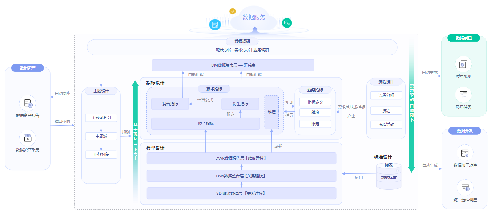

# 数据规范使用流程

DGC规范设计的流程如下：

**图 1**  规范设计流程  

1.  **准备工作**：
    -   **添加审核人**：在规范设计中，业务流程中的步骤都需要经过审批，因此，需要先添加审核人。只有工作空间管理员角色的用户才具有添加审核人的权限。
    -   **管理配置中心**：规范设计中提供了丰富的自定义选项，统一通过配置中心提供，您需要根据自己的业务需要进行自定义配置。

2.  **数据调研**：基于现有业务数据、行业现状进行数据调查、需求梳理、业务调研，输出企业业务流程以及数据主题划分。
    -   **主题设计**：通过分层架构表达对数据的分类和定义，帮助厘清数据资产，明确业务领域和业务对象的关联关系。
        -   **主题域分组**：基于业务场景对主题域进行分组。
        -   **主题域**：互不重叠数据的高层面的数据分类，用于管理其下一级的业务对象。
        -   **业务对象**：指企业运作和管理中不可缺少的重要人、事、物信息。

    -   **流程设计**：针对流程的一个结构化的整体框架，描述了企业流程的分类、层级以及边界、范围、输入/输出关系等，反映了企业的商业模式及业务特点。

3.  **标准设计**：新建码表&数据标准。
    -   **新建码表**：通常只包括一系列允许的值和附加文本描述，与数据标准关联用于生成值域校验质量监控。
    -   **新建数据标准**：用于描述公司层面需共同遵守的属性层数据含义和业务规则。其描述了公司层面对某个数据的共同理解，这些理解一旦确定下来，就应作为企业层面的标准在企业内被共同遵守。

4.  **模型设计：**应用关系建模和维度建模的方法，进行分层建模。
    -   **关系建模**：基于关系建模，新建SDI层和DWI层两个模型。
        -   **SDI**：Source Data Integration，又称贴源数据层。SDI是源系统数据的简单落地。
        -   **DWI**：Data Warehouse Integration，又称数据整合层。DWI整合多个源系统数据，对源系统进来的数据进行整合、清洗，并基于三范式进行关系建模。

    -   **维度建模**：基于维度建模，新建DWR层模型并发布维度和事实表。
        -   **DWR**：Data Warehouse Report，又称数据报告层。DWR基于多维模型，和DWI层数据粒度保持一致。
        -   **维度**：维度是用于观察和分析业务数据的视角，支撑对数据进行汇聚、钻取、切片分析，用于SQL中的GROUP BY条件。
        -   **事实表**：归属于某个业务过程的事实逻辑表，可以丰富具体业务过程所对应事务的详细信息。

5.  **指标设计**：新建业务指标和技术指标，技术指标又分为原子指标、衍生指标和复合指标。
    -   **指标**：指标一般由指标名称和指标数值两部分组成，指标名称及其涵义体现了指标质的规定性和量的规定性两个方面的特点，指标数值反映了指标在具体时间、地点、条件下的数量表现。

        业务指标用于指导技术指标，而技术指标是对业务指标的具体实现。

    -   **原子指标**：原子指标中的度量和属性来源于多维模型中的维度表和事实表，与多维模型所属的业务对象保持一致，与多维模型中的最细数据粒度保持一致。

        原子指标中仅含有唯一度量，所含其它所有与该度量、该业务对象相关的属性，旨在用于支撑指标的敏捷自助消费。

    -   **衍生指标**：是原子指标通过添加限定、维度卷积而成，限定、维度均来源于原子指标关联表的属性。
    -   **复合指标**：由一个或多个衍生指标叠加计算而成，其中的维度、限定均继承于衍生指标。

        注意，不能脱离衍生指标、维度和限定的范围，去产生新的维度和限定。

6.  **数据集市建设**：新建DM层并发布汇总表。
    -   **DM \(Data Mart\)**：又称数据集市。DM面向展现层，数据有多级汇总。
    -   **汇总表**：汇总表是由一个特定的分析对象（如会员）及其相关的统计指标组成的。组成一个汇总逻辑表的统计指标都具有相同的统计粒度（如会员），汇总逻辑表面向用户提供了以统计粒度（如会员）为主题的所有统计数据（如会员主题集市）。

