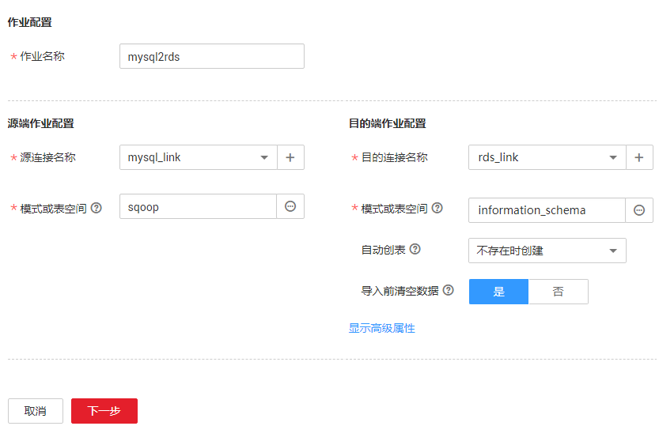

# 整库迁移

## 操作场景

CDM支持在同构、异构数据源之间进行整库迁移，迁移原理与[新建表/文件迁移作业](新建表-文件迁移作业.md)相同，关系型数据库的每张表、Elasticsearch的每个类型、MongoDB的每个集合都会作为一个子任务并发执行。

批量数据迁移支持整库迁移的数据源如[表1](#zh-cn_topic_0108275392_table511520544346)所示。

**表 1**  批量数据迁移支持整库迁移的数据源

<table><tbody><tr id="zh-cn_topic_0108275392_row161158545349"><th class="firstcol" rowspan="2" valign="top" id="mcps1.2.8.1.1">
<strong id="zh-cn_topic_0108275392_b142551914164712">源端数据类型</strong>

</th>
<td class="cellrowborder" colspan="6" valign="top" headers="mcps1.2.8.1.1 ">
<strong id="zh-cn_topic_0108275392_b19313191910475">目的端数据类型</strong>

</td>
</tr>
<tr id="zh-cn_topic_0108275392_row71159549347"><td class="cellrowborder" valign="top" headers="mcps1.2.8.1.1 ">
<strong id="zh-cn_topic_0108275392_b10833173314018">RDS for MySQL</strong>

</td>
<td class="cellrowborder" valign="top" headers="mcps1.2.8.1.1 ">
<strong id="zh-cn_topic_0108275392_b6835103316407">MRS(Hive)</strong>

</td>
<td class="cellrowborder" valign="top" headers="mcps1.2.8.1.1 ">
<strong id="zh-cn_topic_0108275392_b13837143316408">DWS</strong>

</td>
<td class="cellrowborder" valign="top" headers="mcps1.2.8.1.1 ">
<strong id="zh-cn_topic_0108275392_b10838193314018">CSS</strong>

</td>
<td class="cellrowborder" valign="top" headers="mcps1.2.8.1.1 ">
<strong id="zh-cn_topic_0108275392_b18840183314010">OBS</strong>

</td>
<td class="cellrowborder" valign="top" headers="mcps1.2.8.1.1 ">
<strong id="zh-cn_topic_0108275392_b1879637175315">CloudTable</strong>

</td>
</tr>
<tr id="zh-cn_topic_0108275392_row1311505473411"><th class="firstcol" valign="top" width="20%" id="mcps1.2.8.3.1">
<strong id="zh-cn_topic_0108275392_b1946414251405">MySQL</strong>

</th>
<td class="cellrowborder" valign="top" width="20%" headers="mcps1.2.8.3.1 ">
<strong id="zh-cn_topic_0108275392_b570271391414">√</strong>

</td>
<td class="cellrowborder" valign="top" width="15%" headers="mcps1.2.8.3.1 ">
<strong id="zh-cn_topic_0108275392_b673091313148">√</strong>

</td>
<td class="cellrowborder" valign="top" width="10%" headers="mcps1.2.8.3.1 ">
<strong id="zh-cn_topic_0108275392_b1573361313145">√</strong>

</td>
<td class="cellrowborder" valign="top" width="10%" headers="mcps1.2.8.3.1 ">
×

</td>
<td class="cellrowborder" valign="top" width="10%" headers="mcps1.2.8.3.1 ">
<strong id="zh-cn_topic_0108275392_b558981811141">√</strong>

</td>
<td class="cellrowborder" valign="top" width="15%" headers="mcps1.2.8.3.1 ">
×

</td>
</tr>
<tr id="zh-cn_topic_0108275392_row8453323123614"><th class="firstcol" valign="top" width="20%" id="mcps1.2.8.4.1">
<strong id="zh-cn_topic_0108275392_b1146742524012">PostgreSQL</strong>

</th>
<td class="cellrowborder" valign="top" width="20%" headers="mcps1.2.8.4.1 ">
<strong id="zh-cn_topic_0108275392_b15735191311149">√</strong>

</td>
<td class="cellrowborder" valign="top" width="15%" headers="mcps1.2.8.4.1 ">
<strong id="zh-cn_topic_0108275392_b4737413121414">√</strong>

</td>
<td class="cellrowborder" valign="top" width="10%" headers="mcps1.2.8.4.1 ">
<strong id="zh-cn_topic_0108275392_b137391613161416">√</strong>

</td>
<td class="cellrowborder" valign="top" width="10%" headers="mcps1.2.8.4.1 ">
×

</td>
<td class="cellrowborder" valign="top" width="10%" headers="mcps1.2.8.4.1 ">
<strong id="zh-cn_topic_0108275392_b11592201813145">√</strong>

</td>
<td class="cellrowborder" valign="top" width="15%" headers="mcps1.2.8.4.1 ">
×

</td>
</tr>
<tr id="zh-cn_topic_0108275392_row20742182393615"><th class="firstcol" valign="top" width="20%" id="mcps1.2.8.5.1">
<strong id="zh-cn_topic_0108275392_b1946892510404">Microsoft SQL Server</strong>

</th>
<td class="cellrowborder" valign="top" width="20%" headers="mcps1.2.8.5.1 ">
<strong id="zh-cn_topic_0108275392_b17406134146">√</strong>

</td>
<td class="cellrowborder" valign="top" width="15%" headers="mcps1.2.8.5.1 ">
<strong id="zh-cn_topic_0108275392_b47421313191418">√</strong>

</td>
<td class="cellrowborder" valign="top" width="10%" headers="mcps1.2.8.5.1 ">
<strong id="zh-cn_topic_0108275392_b7744151314141">√</strong>

</td>
<td class="cellrowborder" valign="top" width="10%" headers="mcps1.2.8.5.1 ">
×

</td>
<td class="cellrowborder" valign="top" width="10%" headers="mcps1.2.8.5.1 ">
×

</td>
<td class="cellrowborder" valign="top" width="15%" headers="mcps1.2.8.5.1 ">
×

</td>
</tr>
<tr id="zh-cn_topic_0108275392_row1157212483614"><th class="firstcol" valign="top" width="20%" id="mcps1.2.8.6.1">
<strong id="zh-cn_topic_0108275392_b184701259400">Oracle</strong>

</th>
<td class="cellrowborder" valign="top" width="20%" headers="mcps1.2.8.6.1 ">
<strong id="zh-cn_topic_0108275392_b574611313146">√</strong>

</td>
<td class="cellrowborder" valign="top" width="15%" headers="mcps1.2.8.6.1 ">
<strong id="zh-cn_topic_0108275392_b87481613121418">√</strong>

</td>
<td class="cellrowborder" valign="top" width="10%" headers="mcps1.2.8.6.1 ">
<strong id="zh-cn_topic_0108275392_b375041312145">√</strong>

</td>
<td class="cellrowborder" valign="top" width="10%" headers="mcps1.2.8.6.1 ">
×

</td>
<td class="cellrowborder" valign="top" width="10%" headers="mcps1.2.8.6.1 ">
<strong id="zh-cn_topic_0108275392_b175950185148">√</strong>

</td>
<td class="cellrowborder" valign="top" width="15%" headers="mcps1.2.8.6.1 ">
×

</td>
</tr>
<tr id="zh-cn_topic_0108275392_row101161654153413"><th class="firstcol" valign="top" width="20%" id="mcps1.2.8.7.1">
<strong id="zh-cn_topic_0108275392_b124721225164017">Elasticsearch</strong>

</th>
<td class="cellrowborder" valign="top" width="20%" headers="mcps1.2.8.7.1 ">
×

</td>
<td class="cellrowborder" valign="top" width="15%" headers="mcps1.2.8.7.1 ">
×

</td>
<td class="cellrowborder" valign="top" width="10%" headers="mcps1.2.8.7.1 ">
×

</td>
<td class="cellrowborder" valign="top" width="10%" headers="mcps1.2.8.7.1 ">
<strong id="zh-cn_topic_0108275392_b1067023211141">√</strong>

</td>
<td class="cellrowborder" valign="top" width="10%" headers="mcps1.2.8.7.1 ">
×

</td>
<td class="cellrowborder" valign="top" width="15%" headers="mcps1.2.8.7.1 ">
×

</td>
</tr>
<tr id="zh-cn_topic_0108275392_row5834144612397"><th class="firstcol" valign="top" width="20%" id="mcps1.2.8.8.1">
<strong id="zh-cn_topic_0108275392_b1447419254402">MongoDB</strong>

</th>
<td class="cellrowborder" valign="top" width="20%" headers="mcps1.2.8.8.1 ">
×

</td>
<td class="cellrowborder" valign="top" width="15%" headers="mcps1.2.8.8.1 ">
×

</td>
<td class="cellrowborder" valign="top" width="10%" headers="mcps1.2.8.8.1 ">
<strong id="zh-cn_topic_0108275392_b6673113251416">√</strong>

</td>
<td class="cellrowborder" valign="top" width="10%" headers="mcps1.2.8.8.1 ">
×

</td>
<td class="cellrowborder" valign="top" width="10%" headers="mcps1.2.8.8.1 ">
×

</td>
<td class="cellrowborder" valign="top" width="15%" headers="mcps1.2.8.8.1 ">
×

</td>
</tr>
<tr id="zh-cn_topic_0108275392_row165534414538"><th class="firstcol" valign="top" width="20%" id="mcps1.2.8.9.1">
<strong id="zh-cn_topic_0108275392_b5344141413543">HBase</strong>

</th>
<td class="cellrowborder" valign="top" width="20%" headers="mcps1.2.8.9.1 ">
×

</td>
<td class="cellrowborder" valign="top" width="15%" headers="mcps1.2.8.9.1 ">
×

</td>
<td class="cellrowborder" valign="top" width="10%" headers="mcps1.2.8.9.1 ">
×

</td>
<td class="cellrowborder" valign="top" width="10%" headers="mcps1.2.8.9.1 ">
×

</td>
<td class="cellrowborder" valign="top" width="10%" headers="mcps1.2.8.9.1 ">
×

</td>
<td class="cellrowborder" valign="top" width="15%" headers="mcps1.2.8.9.1 ">
<strong id="zh-cn_topic_0108275392_b10676123218148">√</strong>

</td>
</tr>
</tbody>
</table>

源端的这些数据库可以是部署在本地数据中心，或在ECS上自建的数据库，也可以是第三方云的数据库服务。

## 自动建表时的字段类型映射

CDM迁移数据库时支持在目的端自动建表。CDM在数据仓库服务（Data Warehouse Service，简称DWS）中自动建表时，DWS的表与源表的字段类型映射关系如[图1](#zh-cn_topic_0108275370_zh-cn_topic_0108275392_fig662181513539)所示。例如使用CDM将Oracle整库迁移到DWS，CDM在DWS上自动建表，会将Oracle的**NUMBER\(3,0\)**字段映射到DWS的**SMALLINT**。

**图 1**  DWS端自动建表时的字段映射1  

## 前提条件

-   已[新建连接](新建连接.md)。
-   CDM集群与待迁移数据源可以正常通信。

## 操作步骤

1.  [登录DAYU控制台](https://console.huaweicloud.com/dayu/)，找到所需要的DAYU实例，单击实例卡片上的“进入控制台”，进入概览页面。

    选择“空间管理”页签，完成工作空间的创建。

    在工作空间列表中，找到所需要的工作空间。

1.  单击相应工作空间的“数据集成“。

    系统跳转至数据集成页面。

1.  选择批量数据迁移集群管理，进入集群管理界面。选择集群后的“作业管理“。
2.  单击“整库迁移  \>  新建作业“，进入作业参数配置界面。

    **图 2**  创建整库迁移作业  
    

3.  配置源端作业参数，根据待迁移的数据库类型配置对应参数，如[表2](#zh-cn_topic_0108275370_table14973632102118)所示。

    **表 2**  源端作业参数

    
    <table><thead align="left"><tr id="zh-cn_topic_0108275370_row20487414102118"><th class="cellrowborder" valign="top" width="22.900000000000002%" id="mcps1.2.5.1.1">
源端数据库类型

    </th>
    <th class="cellrowborder" valign="top" width="17.64%" id="mcps1.2.5.1.2">
源端参数

    </th>
    <th class="cellrowborder" valign="top" width="46.489999999999995%" id="mcps1.2.5.1.3">
参数说明

    </th>
    <th class="cellrowborder" valign="top" width="12.97%" id="mcps1.2.5.1.4">
取值样例

    </th>
    </tr>
    </thead>
    <tbody><tr id="zh-cn_topic_0108275370_row54909470102118"><td class="cellrowborder" rowspan="2" valign="top" width="22.900000000000002%" headers="mcps1.2.5.1.1 "><ul id="zh-cn_topic_0108275370_ul21600492111710"><li>Oracle</li><li>MySQL</li><li>PostgreSQL</li><li>Microsoft SQL Server</li></ul>
    </td>
    <td class="cellrowborder" valign="top" width="17.64%" headers="mcps1.2.5.1.2 ">
模式或表空间

    </td>
    <td class="cellrowborder" valign="top" width="46.489999999999995%" headers="mcps1.2.5.1.3 ">
待抽取数据的数据库名称。单击输入框后面的按钮可进入模式选择界面，用户也可以直接输入模式或表空间名称。

    
如果选择界面没有待选择的模式或表空间，请确认对应连接里的帐号是否有元数据查询的权限。

    </td>
    <td class="cellrowborder" valign="top" width="12.97%" headers="mcps1.2.5.1.4 ">
schema

    </td>
    </tr>
    <tr id="zh-cn_topic_0108275370_row7145183822214"><td class="cellrowborder" valign="top" headers="mcps1.2.5.1.1 ">
Where子句

    </td>
    <td class="cellrowborder" valign="top" headers="mcps1.2.5.1.2 ">
该参数适用于整库迁移中的所有子表，配置子表抽取范围的Where子句，不配置时抽取整表。如果待迁移的表中没有Where子句的字段，则迁移失败。

    
该参数支持配置为时间宏变量，实现抽取指定日期的数据，详细说明请参见<a href="关系数据库增量迁移.md#zh-cn_topic_0108275332_section7506134317385">Where子句</a>。

    </td>
    <td class="cellrowborder" valign="top" headers="mcps1.2.5.1.3 ">
age &gt; 18 and age &lt;= 60

    </td>
    </tr>
    <tr id="zh-cn_topic_0108275370_row3465350616546"><td class="cellrowborder" valign="top" width="22.900000000000002%" headers="mcps1.2.5.1.1 ">
Elasticsearch

    </td>
    <td class="cellrowborder" valign="top" width="17.64%" headers="mcps1.2.5.1.2 ">
索引

    </td>
    <td class="cellrowborder" valign="top" width="46.489999999999995%" headers="mcps1.2.5.1.3 ">
待抽取数据的索引，支持配置为通配符，一次迁移多个符合通配符条件的索引。例如这里配置为cdm*时，CDM将迁移所有名称为cdm开头的索引：cdm01、cdmB3、cdm_45……

    
如果源端配置为迁移多个索引时，目的端的作业参数“索引”将不允许配置。

    </td>
    <td class="cellrowborder" valign="top" width="12.97%" headers="mcps1.2.5.1.4 ">
cdm*

    </td>
    </tr>
    <tr id="zh-cn_topic_0108275370_row71301631104116"><td class="cellrowborder" valign="top" width="22.900000000000002%" headers="mcps1.2.5.1.1 ">
MongoDB

    </td>
    <td class="cellrowborder" valign="top" width="17.64%" headers="mcps1.2.5.1.2 ">
数据库名称

    </td>
    <td class="cellrowborder" valign="top" width="46.489999999999995%" headers="mcps1.2.5.1.3 ">
待迁移的数据库名称，源连接中配置的用户需要拥有读取该数据库的权限。

    </td>
    <td class="cellrowborder" valign="top" width="12.97%" headers="mcps1.2.5.1.4 ">
mongodb

    </td>
    </tr>
    </tbody>
    </table>

4.  配置目的端作业参数，根据待导入数据的云服务配置对应参数，如[表3](#zh-cn_topic_0108275370_table3756825811856)所示。

    **表 3**  目的端作业参数

    
    <table><thead align="left"><tr id="zh-cn_topic_0108275370_row857879011856"><th class="cellrowborder" valign="top" width="30%" id="mcps1.2.4.1.1">
目的端云服务

    </th>
    <th class="cellrowborder" valign="top" width="25%" id="mcps1.2.4.1.2">
目的端参数

    </th>
    <th class="cellrowborder" valign="top" width="45%" id="mcps1.2.4.1.3">
参数说明

    </th>
    </tr>
    </thead>
    <tbody><tr id="zh-cn_topic_0108275370_row5397196611856"><td class="cellrowborder" rowspan="4" valign="top" width="30%" headers="mcps1.2.4.1.1 "><ul id="zh-cn_topic_0108275370_ul30873331112157"><li>MRS（Hive）</li><li>云数据库 MySQL</li></ul>
    </td>
    <td class="cellrowborder" valign="top" width="25%" headers="mcps1.2.4.1.2 ">
模式或表空间

    </td>
    <td class="cellrowborder" valign="top" width="45%" headers="mcps1.2.4.1.3 ">
待写入数据的数据库名称。

    </td>
    </tr>
    <tr id="zh-cn_topic_0108275370_row1115014411856"><td class="cellrowborder" valign="top" headers="mcps1.2.4.1.1 ">
自动创表

    </td>
    <td class="cellrowborder" valign="top" headers="mcps1.2.4.1.2 ">
写入表时，用户选择的操作：<ul id="zh-cn_topic_0108275370_ul12109569172733"><li>不自动创建：CDM不自动建表。</li><li>不存在时创建：当目的端数据库没有源端里的表时，CDM会自动创建表。</li><li>先删除后创建：当目的端存在与源端重名的表时，CDM先删除重名的表，再重新在目的端创建该表。</li></ul>
    

    </td>
    </tr>
    <tr id="zh-cn_topic_0108275370_row828266111856"><td class="cellrowborder" valign="top" headers="mcps1.2.4.1.1 ">
导入开始前

    </td>
    <td class="cellrowborder" valign="top" headers="mcps1.2.4.1.2 ">
导入数据前，选择是否清除目的表的数据：<ul id="zh-cn_topic_0108275370_ul944616526261"><li>不清除：写入数据前不清除目标表中数据，数据追加写入。</li><li>清除全部数据：写入数据前会清除目标表中数据。</li><li>清除部分数据：需要配置“where条件”参数，CDM根据条件选择性删除目标表的数据。</li></ul>
    

    </td>
    </tr>
    <tr id="zh-cn_topic_0108275370_row1257365817182"><td class="cellrowborder" valign="top" headers="mcps1.2.4.1.1 ">
where条件

    </td>
    <td class="cellrowborder" valign="top" headers="mcps1.2.4.1.2 ">
导入前根据条件删除目的表的数据，例如“age &gt; 18 and age &lt;= 60”。

    </td>
    </tr>
    <tr id="zh-cn_topic_0108275370_row4578109811856"><td class="cellrowborder" rowspan="2" valign="top" width="30%" headers="mcps1.2.4.1.1 ">
云搜索服务

    </td>
    <td class="cellrowborder" valign="top" width="25%" headers="mcps1.2.4.1.2 ">
索引

    </td>
    <td class="cellrowborder" valign="top" width="45%" headers="mcps1.2.4.1.3 ">
写入数据到哪个索引。整库迁移多个索引时，这里的作业参数“索引”将不允许配置，CDM在目的端自动创建索引。

    </td>
    </tr>
    <tr id="zh-cn_topic_0108275370_row18839153213388"><td class="cellrowborder" valign="top" headers="mcps1.2.4.1.1 ">
导入前清空数据

    </td>
    <td class="cellrowborder" valign="top" headers="mcps1.2.4.1.2 ">
写入数据前，选择是否清除目标类型中数据。

    </td>
    </tr>
    <tr id="zh-cn_topic_0108275370_row155309408"><td class="cellrowborder" valign="top" width="30%" headers="mcps1.2.4.1.1 ">
数据仓库服务（DWS）

    </td>
    <td class="cellrowborder" valign="top" width="25%" headers="mcps1.2.4.1.2 ">
-

    </td>
    <td class="cellrowborder" valign="top" width="45%" headers="mcps1.2.4.1.3 ">
整库迁移到DWS时，目的端作业参数请参见<a href="配置关系数据库目的端参数.md">配置关系数据库目的端参数</a>。

    </td>
    </tr>
    <tr id="zh-cn_topic_0108275370_row430918215529"><td class="cellrowborder" valign="top" width="30%" headers="mcps1.2.4.1.1 ">
对象存储服务（OBS）

    </td>
    <td class="cellrowborder" valign="top" width="25%" headers="mcps1.2.4.1.2 ">
-

    </td>
    <td class="cellrowborder" valign="top" width="45%" headers="mcps1.2.4.1.3 ">
整库迁移到OBS时，目的端作业参数请参见<a href="配置OBS目的端参数.md">配置OBS目的端参数</a>。

    </td>
    </tr>
    </tbody>
    </table>

5.  如果是关系型数据库整库迁移，则作业参数配置完成后，单击“下一步“会进入表的选择界面，您可以根据自己的需求选择迁移哪些表到目的端。
6.  单击“下一步“配置任务参数，单击“显示高级属性“展开可选参数。

    **图 3**  任务参数1  
    

    各参数说明如[表4](#zh-cn_topic_0108275458_table62790900104257)所示。

    **表 4**  任务配置参数

    
    <table><thead align="left"><tr id="zh-cn_topic_0108275458_row65473362104257"><th class="cellrowborder" valign="top" width="22.240000000000002%" id="mcps1.2.4.1.1">
参数

    </th>
    <th class="cellrowborder" valign="top" width="59.09000000000001%" id="mcps1.2.4.1.2">
说明

    </th>
    <th class="cellrowborder" valign="top" width="18.67%" id="mcps1.2.4.1.3">
取值样例

    </th>
    </tr>
    </thead>
    <tbody><tr id="zh-cn_topic_0108275458_row275513314335"><td class="cellrowborder" valign="top" width="22.240000000000002%" headers="mcps1.2.4.1.1 ">
作业失败重试

    </td>
    <td class="cellrowborder" valign="top" width="59.09000000000001%" headers="mcps1.2.4.1.2 ">
如果作业执行失败，可选择自动重试三次或者不重试。

    
建议仅对文件类作业或启用了导入阶段表的数据库作业配置自动重试，避免自动重试重复写入数据导致数据不一致。

    </td>
    <td class="cellrowborder" valign="top" width="18.67%" headers="mcps1.2.4.1.3 ">
不重试

    </td>
    </tr>
    <tr id="zh-cn_topic_0108275458_row3631134372219"><td class="cellrowborder" valign="top" width="22.240000000000002%" headers="mcps1.2.4.1.1 ">
作业分组

    </td>
    <td class="cellrowborder" valign="top" width="59.09000000000001%" headers="mcps1.2.4.1.2 ">
选择作业的分组，默认分组为“DEFAULT”。在CDM“作业管理”界面，支持作业分组显示、按组批量启动作业、按分组导出作业等操作。

    </td>
    <td class="cellrowborder" valign="top" width="18.67%" headers="mcps1.2.4.1.3 ">
DEFAULT

    </td>
    </tr>
    <tr id="zh-cn_topic_0108275458_row30305653162435"><td class="cellrowborder" valign="top" width="22.240000000000002%" headers="mcps1.2.4.1.1 ">
是否定时执行

    </td>
    <td class="cellrowborder" valign="top" width="59.09000000000001%" headers="mcps1.2.4.1.2 ">
如果选择“是”，可以配置作业自动启动的时间、重复周期和有效期，具体请参见<a href="配置定时任务.md">配置定时任务</a>。

    </td>
    <td class="cellrowborder" valign="top" width="18.67%" headers="mcps1.2.4.1.3 ">
否

    </td>
    </tr>
    <tr id="zh-cn_topic_0108275458_row16101193015491"><td class="cellrowborder" valign="top" width="22.240000000000002%" headers="mcps1.2.4.1.1 ">
抽取并发数

    </td>
    <td class="cellrowborder" valign="top" width="59.09000000000001%" headers="mcps1.2.4.1.2 ">
设置同时执行的抽取任务数，一般保持默认即可。

    </td>
    <td class="cellrowborder" valign="top" width="18.67%" headers="mcps1.2.4.1.3 ">
1

    </td>
    </tr>
    <tr id="zh-cn_topic_0108275458_row29830202153334"><td class="cellrowborder" valign="top" width="22.240000000000002%" headers="mcps1.2.4.1.1 ">
加载（写入）并发数

    </td>
    <td class="cellrowborder" valign="top" width="59.09000000000001%" headers="mcps1.2.4.1.2 ">
加载（写入）时并发执行的Loader数量。

    
仅当HBase或Hive作为目的数据源时该参数才显示。

    </td>
    <td class="cellrowborder" valign="top" width="18.67%" headers="mcps1.2.4.1.3 ">
3

    </td>
    </tr>
    <tr id="zh-cn_topic_0108275458_row52808246153537"><td class="cellrowborder" valign="top" width="22.240000000000002%" headers="mcps1.2.4.1.1 ">
是否写入脏数据

    </td>
    <td class="cellrowborder" valign="top" width="59.09000000000001%" headers="mcps1.2.4.1.2 ">
选择是否记录脏数据，默认不记录脏数据。

    </td>
    <td class="cellrowborder" valign="top" width="18.67%" headers="mcps1.2.4.1.3 ">
是

    </td>
    </tr>
    <tr id="zh-cn_topic_0108275458_row9411130214937"><td class="cellrowborder" valign="top" width="22.240000000000002%" headers="mcps1.2.4.1.1 ">
脏数据写入连接

    </td>
    <td class="cellrowborder" valign="top" width="59.09000000000001%" headers="mcps1.2.4.1.2 ">
当“是否写入脏数据”为“是”才显示该参数。

    
脏数据要写入的连接，目前只支持写入到OBS连接。

    </td>
    <td class="cellrowborder" valign="top" width="18.67%" headers="mcps1.2.4.1.3 ">
obs_link

    </td>
    </tr>
    <tr id="zh-cn_topic_0108275458_row22967022215317"><td class="cellrowborder" valign="top" width="22.240000000000002%" headers="mcps1.2.4.1.1 ">
OBS桶

    </td>
    <td class="cellrowborder" valign="top" width="59.09000000000001%" headers="mcps1.2.4.1.2 ">
当“脏数据写入连接”为OBS类型的连接时，才显示该参数。

    
写入脏数据的OBS桶的名称。

    </td>
    <td class="cellrowborder" valign="top" width="18.67%" headers="mcps1.2.4.1.3 ">
dirtydata

    </td>
    </tr>
    <tr id="zh-cn_topic_0108275458_row39573864104257"><td class="cellrowborder" valign="top" width="22.240000000000002%" headers="mcps1.2.4.1.1 ">
脏数据目录

    </td>
    <td class="cellrowborder" valign="top" width="59.09000000000001%" headers="mcps1.2.4.1.2 ">
“是否写入脏数据”选择为“是”时，该参数才显示。

    
OBS上存储脏数据的目录，只有在配置了脏数据目录的情况下才会记录脏数据。

    
用户可以进入脏数据目录，查看作业执行过程中处理失败的数据或者被清洗过滤掉的数据，针对该数据可以查看源数据中哪些数据不符合转换、清洗规则。

    </td>
    <td class="cellrowborder" valign="top" width="18.67%" headers="mcps1.2.4.1.3 ">
/user/dirtydir

    </td>
    </tr>
    <tr id="zh-cn_topic_0108275458_row45605180153618"><td class="cellrowborder" valign="top" width="22.240000000000002%" headers="mcps1.2.4.1.1 ">
单个分片的最大错误记录数

    </td>
    <td class="cellrowborder" valign="top" width="59.09000000000001%" headers="mcps1.2.4.1.2 ">
当“是否写入脏数据”为“是”才显示该参数。

    
单个map的错误记录超过设置的最大错误记录数则任务自动结束，已经导入的数据不支持回退。推荐使用临时表作为导入的目标表，待导入成功后再改名或合并到最终数据表。

    </td>
    <td class="cellrowborder" valign="top" width="18.67%" headers="mcps1.2.4.1.3 ">
0

    </td>
    </tr>
    <tr id="zh-cn_topic_0108275458_row1290616161888"><td class="cellrowborder" valign="top" width="22.240000000000002%" headers="mcps1.2.4.1.1 ">
作业运行完是否删除

    </td>
    <td class="cellrowborder" valign="top" width="59.09000000000001%" headers="mcps1.2.4.1.2 ">
选择作业执行后的操作：<ul id="zh-cn_topic_0108275458_ul1614319128911"><li>不删除：作业执行完不删除。</li><li>成功后删除：仅作业执行成功时删除该作业，适合海量一次性作业。</li><li>删除：作业执行完删除该作业，不管执行成功或失败都会删除。</li></ul>
    

    </td>
    <td class="cellrowborder" valign="top" width="18.67%" headers="mcps1.2.4.1.3 ">
不删除

    </td>
    </tr>
    </tbody>
    </table>

7.  单击“保存“，或者“保存并运行“。

    作业任务启动后，每个待迁移的表都会生成一个子任务，单击整库迁移的作业名称，可查看子任务列表。

