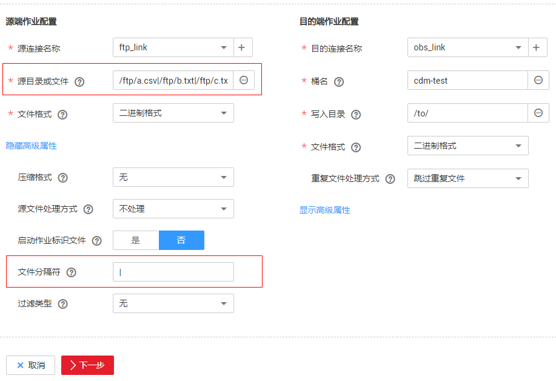

# 文件列表迁移

从FTP/SFTP/NAS/OBS/OSS/KODO/SFS导出文件时，CDM支持文件列表迁移，用户可以单次迁移多个指定的文件（最多50个），导出的多个文件只能写到目的端的同一个目录。

在[创建表/文件迁移的作业](新建表-文件迁移作业.md)时，如果源端数据源为FTP/SFTP/NAS/OBS/OSS/KODO/SFS，CDM源端的作业参数“源目录或文件“支持输入多个文件名（最多50个），文件名之间默认使用“|“分隔，您也可以自定义文件分隔符，从而实现文件列表迁移。

**图 1**  文件列表迁移  

> **说明：**   
>1.  CDM迁移文件或对象时支持文件级增量迁移（通过配置跳过重复文件实现），但不支持断点续传。  
>    例如要迁移3个文件，第2个文件迁移到一半时由于网络原因失败，再次启动迁移任务时，会跳过第1个文件，从第2个文件开始重新传，但不能从第2个文件失败的位置重新传。  
>2.  文件迁移时，单个任务支持千万数量的文件，如果待迁移目录下文件过多，建议拆分到不同目录并创建多个任务。  

