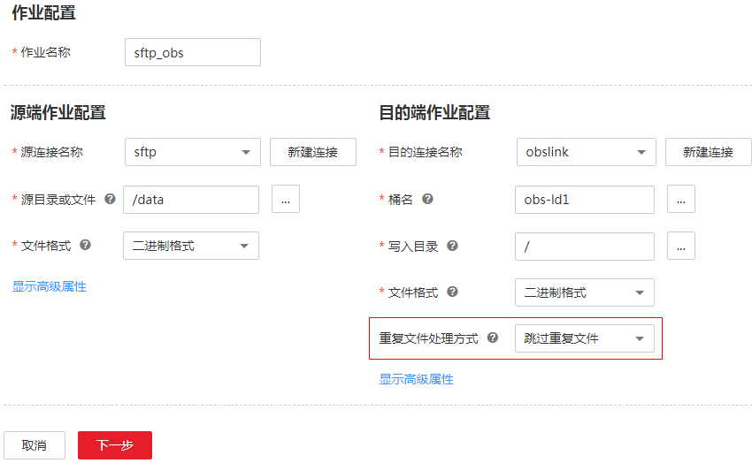
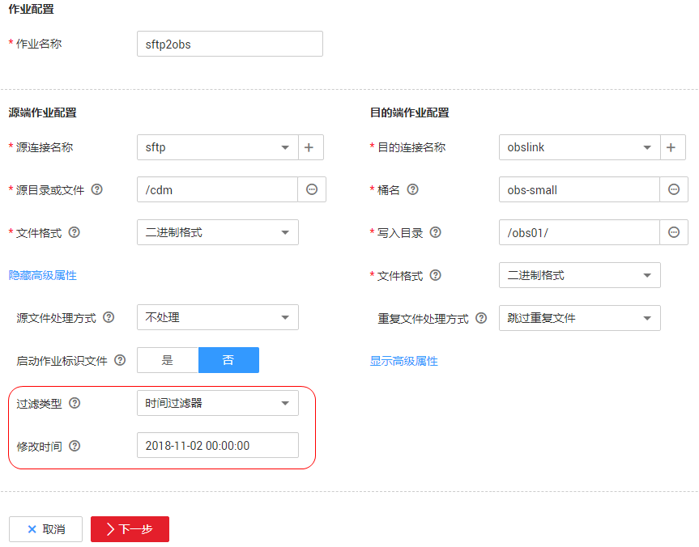

# 文件增量迁移

CDM支持对文件类数据源进行增量迁移，全量迁移完成之后，第二次运行作业时可以导出全部新增的文件，或者只导出特定的目录/文件。

目前CDM支持以下文件增量迁移方式：

1.  **增量导出全部新增的文件**
    -   适用场景：源端和目的端数据源都为文件类型（OBS/OSS/HDFS/FTP/SFTP/NAS）。
    -   关键配置：[跳过重复文件](#zh-cn_topic_0108275366_section1265543752816)+[定时执行作业](配置定时任务.md)。
    -   前提条件：无。

2.  **增量导出指定目录的文件**
    -   适用场景：源端数据源为文件类型（OBS/OSS/HDFS/FTP/SFTP/NAS），目的端没有要求。这种增量迁移方式，只追加写入文件，不会更新或删除已存在的记录。
    -   关键配置：[文件/路径过滤器](#zh-cn_topic_0108275366_section1070082019442)+[定时执行作业](配置定时任务.md)。
    -   前提条件：源端目录或文件名带有时间字段。

3.  **增量导出指定时间以后的文件**
    -   适用场景：源端数据源为文件类型（OBS/OSS/HDFS/FTP/SFTP/NAS），目的端没有要求。这里的指定时间，是指文件的修改时间，当文件的修改时间晚于指定的时间，CDM才迁移该文件。
    -   关键配置：[时间过滤器](#zh-cn_topic_0108275366_section2012420511142)+[定时执行作业](配置定时任务.md)。
    -   前提条件：无。

## 跳过重复文件

-   参数位置：在[新建表/文件迁移作业](新建表-文件迁移作业.md)时，如果源端和目的端数据源都为文件类型，那么目的端作业参数中可以看到“重复文件处理方式“参数，该参数可选择：替换重复文件、跳过重复文件或停止任务。
-   参数原理：当源端和目的端存在文件名、文件大小都相同的文件时，CDM才会判定该文件为重复文件。
-   配置样例：
    1.  源目录或文件：配置为一个目录的路径，CDM可以将该目录下的所有文件导入到目的端。
    2.  文件格式：选择“二进制格式“，CDM不解析文件直接原样复制，适合文件到文件的迁移。
    3.  重复文件处理方式：选择“跳过重复文件“。

        **图 1**  跳过重复文件  
        

    4.  配置作业定时自动执行。

这样就可以定期把新增的文件导入到目的端目录，实现增量同步。

## 文件/路径过滤器

-   参数位置：在[新建表/文件迁移作业](新建表-文件迁移作业.md)时，如果源端数据源为文件类型，那么源端作业参数的高级属性中可以看到“过滤类型“参数，该参数可选择：通配符或时间过滤器。
-   参数原理：“过滤类型“选择“通配符“时，CDM就可以通过用户配置的通配符过滤文件或路径，CDM只迁移满足指定条件的文件或路径。
-   配置样例：

    例如源端文件名带有时间字段“2017-10-15 20:25:26“，这个时刻生成的文件为“/opt/data/file\_20171015202526.data“，则在创建作业时，参数配置如下：

    1.  过滤类型：选择“通配符“。
    2.  文件过滤器：配置为**\*$\{dateformat\(yyyyMMdd,-1,DAY\)\}\***（这是CDM支持的日期宏变量格式，详见[使用时间宏变量完成增量同步](使用时间宏变量完成增量同步.md)）。

        **图 2**  文件过滤  
        

    3.  配置作业定时自动执行，“重复周期“为1天。

这样每天就可以把昨天生成的文件都导入到目的端目录，实现增量同步。

文件增量迁移场景下，“路径过滤器“的使用方法同“文件过滤器“一样，需要路径名称里带有时间字段，这样可以定期增量同步指定目录下的所有文件。

## 时间过滤器

-   参数位置：在[新建表/文件迁移作业](新建表-文件迁移作业.md)如果源端数据源为文件类型，那么源端作业配置下的高级属性中，“过滤类型“参数可以选择“时间过滤器“。
-   参数原理：“修改时间“参数中输入一个时间值后，只有修改时间晚于该时间的文件才会被CDM迁移。
-   配置样例：

    例如需要CDM只同步2018年11月2日以后生成的文件到目的端，则参数配置如下：

    1.  过滤类型：选择为“时间过滤器“。
    2.  修改时间：配置为**2018-11-02 00:00:00**（格式要求为yyyy-MM-dd HH:mm:ss）。

        **图 3**  时间过滤器  
        

    3.  重复文件处理方式：选择“跳过重复文件“。
    4.  配置作业定时自动执行。

这样CDM作业就只迁移2018年11月2日以后生成的文件，下次作业再启动时就可以实现增量同步。

