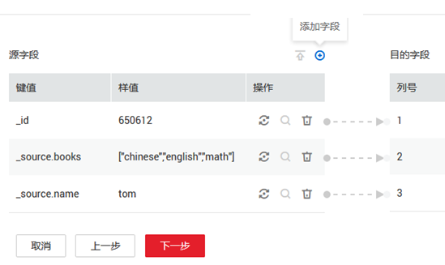
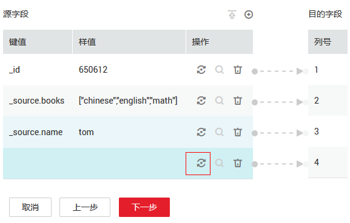

# 文件格式介绍<a name="dayu_01_0108"></a>

在创建CDM作业时，有些场景下源端、目的端的作业参数中需要选择“文件格式“，这里分别介绍这几种文件格式的使用场景、子参数、公共参数、使用示例等。

-   [CSV格式](#zh-cn_topic_0123434186_section469044274219)
-   [JSON格式](#zh-cn_topic_0123434186_section869714051913)
-   [二进制格式](#zh-cn_topic_0123434186_section39751230182317)
-   [文件格式的公共参数](#zh-cn_topic_0123434186_section148391468257)
-   [文件格式问题解决方法](#zh-cn_topic_0123434186_section5636174252511)

## CSV格式<a name="zh-cn_topic_0123434186_section469044274219"></a>

如果想要读取或写入某个CSV文件，请在选择“文件格式“的时候选择“CSV格式“。CSV格式的主要有以下使用场景：

-   文件导入到数据库、NoSQL。
-   数据库、NoSQL导出到文件。

选择了CSV格式后，通常还可以配置以下可选子参数：

[1.换行符](#zh-cn_topic_0123434186_li19945541171217)

[2.字段分隔符](#zh-cn_topic_0123434186_li2018172316145)

[3.编码类型](#zh-cn_topic_0123434186_li969133717144)

[4.使用包围符](#zh-cn_topic_0123434186_li183111219131712)

[5.使用正则表达式分隔字段](#zh-cn_topic_0123434186_li1183030141819)

[6.首行为标题行](#zh-cn_topic_0123434186_li1425617365187)

[7.写入文件大小](#zh-cn_topic_0123434186_li207411446121814)

1.  <a name="zh-cn_topic_0123434186_li19945541171217"></a>**换行符**

    用于分隔文件中的行的字符，支持单字符和多字符，也支持特殊字符。特殊字符可以使用URL编码输入，例如：

    **表 1**  特殊字符对应的URL编码

    <a name="zh-cn_topic_0123434186_table11215204115"></a>
    <table><thead align="left"><tr id="zh-cn_topic_0123434186_row1040751510415"><th class="cellrowborder" valign="top" width="50%" id="mcps1.2.3.1.1"><p id="zh-cn_topic_0123434186_p204071115124113"><a name="zh-cn_topic_0123434186_p204071115124113"></a><a name="zh-cn_topic_0123434186_p204071115124113"></a>特殊字符</p>
    </th>
    <th class="cellrowborder" valign="top" width="50%" id="mcps1.2.3.1.2"><p id="zh-cn_topic_0123434186_p1840721520413"><a name="zh-cn_topic_0123434186_p1840721520413"></a><a name="zh-cn_topic_0123434186_p1840721520413"></a>URL编码</p>
    </th>
    </tr>
    </thead>
    <tbody><tr id="zh-cn_topic_0123434186_row1540713155418"><td class="cellrowborder" valign="top" width="50%" headers="mcps1.2.3.1.1 "><p id="zh-cn_topic_0123434186_p44072015114114"><a name="zh-cn_topic_0123434186_p44072015114114"></a><a name="zh-cn_topic_0123434186_p44072015114114"></a>空格</p>
    </td>
    <td class="cellrowborder" valign="top" width="50%" headers="mcps1.2.3.1.2 "><p id="zh-cn_topic_0123434186_p1440771510415"><a name="zh-cn_topic_0123434186_p1440771510415"></a><a name="zh-cn_topic_0123434186_p1440771510415"></a>%20</p>
    </td>
    </tr>
    <tr id="zh-cn_topic_0123434186_row14073155415"><td class="cellrowborder" valign="top" width="50%" headers="mcps1.2.3.1.1 "><p id="zh-cn_topic_0123434186_p1140771544120"><a name="zh-cn_topic_0123434186_p1140771544120"></a><a name="zh-cn_topic_0123434186_p1140771544120"></a>Tab</p>
    </td>
    <td class="cellrowborder" valign="top" width="50%" headers="mcps1.2.3.1.2 "><p id="zh-cn_topic_0123434186_p18407815194117"><a name="zh-cn_topic_0123434186_p18407815194117"></a><a name="zh-cn_topic_0123434186_p18407815194117"></a>%09</p>
    </td>
    </tr>
    <tr id="zh-cn_topic_0123434186_row1940717151413"><td class="cellrowborder" valign="top" width="50%" headers="mcps1.2.3.1.1 "><p id="zh-cn_topic_0123434186_p14407131514413"><a name="zh-cn_topic_0123434186_p14407131514413"></a><a name="zh-cn_topic_0123434186_p14407131514413"></a>%</p>
    </td>
    <td class="cellrowborder" valign="top" width="50%" headers="mcps1.2.3.1.2 "><p id="zh-cn_topic_0123434186_p94071215154113"><a name="zh-cn_topic_0123434186_p94071215154113"></a><a name="zh-cn_topic_0123434186_p94071215154113"></a>%25</p>
    </td>
    </tr>
    <tr id="zh-cn_topic_0123434186_row104071515204115"><td class="cellrowborder" valign="top" width="50%" headers="mcps1.2.3.1.1 "><p id="zh-cn_topic_0123434186_p740701511413"><a name="zh-cn_topic_0123434186_p740701511413"></a><a name="zh-cn_topic_0123434186_p740701511413"></a>回车</p>
    </td>
    <td class="cellrowborder" valign="top" width="50%" headers="mcps1.2.3.1.2 "><p id="zh-cn_topic_0123434186_p12407815204110"><a name="zh-cn_topic_0123434186_p12407815204110"></a><a name="zh-cn_topic_0123434186_p12407815204110"></a>%0d</p>
    </td>
    </tr>
    <tr id="zh-cn_topic_0123434186_row2407161514112"><td class="cellrowborder" valign="top" width="50%" headers="mcps1.2.3.1.1 "><p id="zh-cn_topic_0123434186_p14071715104112"><a name="zh-cn_topic_0123434186_p14071715104112"></a><a name="zh-cn_topic_0123434186_p14071715104112"></a>换行</p>
    </td>
    <td class="cellrowborder" valign="top" width="50%" headers="mcps1.2.3.1.2 "><p id="zh-cn_topic_0123434186_p8407215194111"><a name="zh-cn_topic_0123434186_p8407215194111"></a><a name="zh-cn_topic_0123434186_p8407215194111"></a>%0a</p>
    </td>
    </tr>
    <tr id="zh-cn_topic_0123434186_row1140712158416"><td class="cellrowborder" valign="top" width="50%" headers="mcps1.2.3.1.1 "><p id="zh-cn_topic_0123434186_p13407415164111"><a name="zh-cn_topic_0123434186_p13407415164111"></a><a name="zh-cn_topic_0123434186_p13407415164111"></a>标题开头\u0001 (SOH)</p>
    </td>
    <td class="cellrowborder" valign="top" width="50%" headers="mcps1.2.3.1.2 "><p id="zh-cn_topic_0123434186_p54079158413"><a name="zh-cn_topic_0123434186_p54079158413"></a><a name="zh-cn_topic_0123434186_p54079158413"></a>%01</p>
    </td>
    </tr>
    </tbody>
    </table>

2.  <a name="zh-cn_topic_0123434186_li2018172316145"></a>**字段分隔符**

    用于分隔CSV文件中的列的字符，支持单字符和多字符，也支持特殊字符，详见[表1](#zh-cn_topic_0123434186_table11215204115)。

3.  <a name="zh-cn_topic_0123434186_li969133717144"></a>**编码类型**

    文件的编码类型，默认是UTF-8，中文的编码有时会采用GBK。

    如果源端指定该参数，则使用指定的编码类型去解析文件；目的端指定该参数，则写入文件的时候，以指定的编码类型写入。

4.  <a name="zh-cn_topic_0123434186_li183111219131712"></a>**使用包围符**
    -   数据库、NoSQL导出到CSV文件（“使用包围符“在目的端）：当源端某列数据的字符串中出现字段分隔符时，目的端可以通过开启“使用包围符“，将该字符串括起来，作为一个整体写入CSV文件。CDM目前只使用双引号（”）作为包围符。如[图1](#zh-cn_topic_0123434186_fig87952010132518)所示，数据库的name字段的值中包含了字段分隔符逗号：

        **图 1**  包含字段分隔符的字段值<a name="zh-cn_topic_0123434186_fig87952010132518"></a>  
        

        不使用包围符的时候，导出的CSV文件，数据会显示为：

        ```
        3.hello,world,abc
        ```

        如果使用包围符，导出的数据则为：

        ```
        3,"hello,world",abc
        ```

        如果数据库中的数据已经包含了双引号（”），那么使用包围符后，导出的CSV文件的包围符会是三个双引号（”””）。例如字段的值为：a"hello,world"c，使用包围符后导出的数据为：

        ```
        """a"hello,world"c"""
        ```

    -   CSV文件导出到数据库、NoSQL（“使用包围符“在源端）：CSV文件为源的时候，并且其中数据是被包围符括起来的，如果想把数据正确的导入到数据库，就需要在源端开启“使用包围符“，这样包围符内的值的，会写入一个字段内。

5.  <a name="zh-cn_topic_0123434186_li1183030141819"></a>**使用正则表达式分隔字段**

    这个功能是针对一些复杂的半结构化文本，例如日志文件的解析，详见：[使用正则表达式分隔半结构化文本](正则表达式分隔半结构化文本.md)。

6.  <a name="zh-cn_topic_0123434186_li1425617365187"></a>**首行为标题行**

    这个参数是针对CSV文件导出到其它地方的场景，如果源端指定了该参数，CDM在抽取数据时将第一行作为标题行。在传输CSV文件的时候会跳过标题行，这时源端抽取的行数，会比目的端写入的行数多一行，并在日志文件中进行说明跳过了标题行。

7.  <a name="zh-cn_topic_0123434186_li207411446121814"></a>**写入文件大小**

    这个参数是针对数据库导出到CSV文件的场景，如果一张表的数据量比较大，那么导出到CSV文件的时候，会生成一个很大的文件，有时会不方便下载或查看。这时可以在目的端指定该参数，这样会生成多个指定大小的CSV文件，避免导出的文件过大。该参数的数据类型为整型，单位为MB。


## JSON格式<a name="zh-cn_topic_0123434186_section869714051913"></a>

这里主要介绍JSON文件格式的以下内容：

-   [CDM支持解析的JSON类型](#zh-cn_topic_0123434186_li17316535702)
-   [记录节点](#zh-cn_topic_0123434186_li131971342489)
-   [从JSON文件复制数据](#zh-cn_topic_0123434186_li179647275105)

1.  <a name="zh-cn_topic_0123434186_li17316535702"></a>**CDM支持解析的JSON类型：JSON对象、JSON数组。**
    -   JSON对象：JSON文件包含单个对象，或者以行分隔/串连的多个对象。
        1.  单一对象JSON：

            ```
            {
                 "took" : 190,
                 "timed_out" : false,
                 "total" : 1000001,
                 "max_score" : 1.0
             }
            ```

        2.  行分隔的JSON对象：

            ```
            {"took" : 188, "timed_out" : false, "total" : 1000003, "max_score" : 1.0 }
            {"took" : 189, "timed_out" : false, "total" : 1000004, "max_score" : 1.0 }
            ```

        3.  串连的JSON对象：

            ```
            {
                "took": 190,
                "timed_out": false,
                "total": 1000001,
                "max_score": 1.0
             }
             {
                "took": 191,
                "timed_out": false,
                "total": 1000002,
                "max_score": 1.0
             }
            ```

    -   JSON数组：JSON文件是包含多个JSON对象的数组。

        ```
        [{
              "took" : 190,
              "timed_out" : false,
              "total" : 1000001,
              "max_score" : 1.0
          },
          {
              "took" : 191,
              "timed_out" : false,
              "total" : 1000001,
              "max_score" : 1.0
          }]
        ```

2.  <a name="zh-cn_topic_0123434186_li131971342489"></a>**记录节点**

    记录数据的根节点。该节点对应的数据为JSON数组，CDM会以同一模式从该数组中提取数据。多层嵌套的JSON节点以字符“.“分割。

3.  <a name="zh-cn_topic_0123434186_li179647275105"></a>**从JSON文件复制数据**
    1.  示例一：从行分隔/串连的多个对象中提取数据。JSON文件包含了多个JSON对象，例如：

        ```
         {
            "took": 190,
            "timed_out": false,
            "total": 1000001,
            "max_score": 1.0
         }
         {
            "took": 191,
            "timed_out": false,
            "total": 1000002,
            "max_score": 1.0
         }
         {
            "took": 192,
            "timed_out": false,
            "total": 1000003,
            "max_score": 1.0
         }
        ```

        如果您想要从该JSON对象中提取数据，使用以下格式写入到数据库，只需要在作业第一步指定文件格式为“JSON格式“，指定JSON类型为“JSON对象“，然后在作业第二步进行字段匹配即可。

        <a name="zh-cn_topic_0123434186_table1033515144111"></a>
        <table><thead align="left"><tr id="zh-cn_topic_0123434186_row342391519414"><th class="cellrowborder" valign="top" width="25%" id="mcps1.1.5.1.1"><p id="zh-cn_topic_0123434186_p842331524111"><a name="zh-cn_topic_0123434186_p842331524111"></a><a name="zh-cn_topic_0123434186_p842331524111"></a>took</p>
        </th>
        <th class="cellrowborder" valign="top" width="25%" id="mcps1.1.5.1.2"><p id="zh-cn_topic_0123434186_p204232155416"><a name="zh-cn_topic_0123434186_p204232155416"></a><a name="zh-cn_topic_0123434186_p204232155416"></a>timedOut</p>
        </th>
        <th class="cellrowborder" valign="top" width="25%" id="mcps1.1.5.1.3"><p id="zh-cn_topic_0123434186_p184231515204115"><a name="zh-cn_topic_0123434186_p184231515204115"></a><a name="zh-cn_topic_0123434186_p184231515204115"></a>total</p>
        </th>
        <th class="cellrowborder" valign="top" width="25%" id="mcps1.1.5.1.4"><p id="zh-cn_topic_0123434186_p1842311153412"><a name="zh-cn_topic_0123434186_p1842311153412"></a><a name="zh-cn_topic_0123434186_p1842311153412"></a>maxScore</p>
        </th>
        </tr>
        </thead>
        <tbody><tr id="zh-cn_topic_0123434186_row7423815204111"><td class="cellrowborder" valign="top" width="25%" headers="mcps1.1.5.1.1 "><p id="zh-cn_topic_0123434186_p0423615114112"><a name="zh-cn_topic_0123434186_p0423615114112"></a><a name="zh-cn_topic_0123434186_p0423615114112"></a>190</p>
        </td>
        <td class="cellrowborder" valign="top" width="25%" headers="mcps1.1.5.1.2 "><p id="zh-cn_topic_0123434186_p144237152413"><a name="zh-cn_topic_0123434186_p144237152413"></a><a name="zh-cn_topic_0123434186_p144237152413"></a>false</p>
        </td>
        <td class="cellrowborder" valign="top" width="25%" headers="mcps1.1.5.1.3 "><p id="zh-cn_topic_0123434186_p1842311584114"><a name="zh-cn_topic_0123434186_p1842311584114"></a><a name="zh-cn_topic_0123434186_p1842311584114"></a>1000001</p>
        </td>
        <td class="cellrowborder" valign="top" width="25%" headers="mcps1.1.5.1.4 "><p id="zh-cn_topic_0123434186_p44231015144115"><a name="zh-cn_topic_0123434186_p44231015144115"></a><a name="zh-cn_topic_0123434186_p44231015144115"></a>1.0</p>
        </td>
        </tr>
        <tr id="zh-cn_topic_0123434186_row204231915134116"><td class="cellrowborder" valign="top" width="25%" headers="mcps1.1.5.1.1 "><p id="zh-cn_topic_0123434186_p4423161517413"><a name="zh-cn_topic_0123434186_p4423161517413"></a><a name="zh-cn_topic_0123434186_p4423161517413"></a>191</p>
        </td>
        <td class="cellrowborder" valign="top" width="25%" headers="mcps1.1.5.1.2 "><p id="zh-cn_topic_0123434186_p942318159415"><a name="zh-cn_topic_0123434186_p942318159415"></a><a name="zh-cn_topic_0123434186_p942318159415"></a>false</p>
        </td>
        <td class="cellrowborder" valign="top" width="25%" headers="mcps1.1.5.1.3 "><p id="zh-cn_topic_0123434186_p94230156413"><a name="zh-cn_topic_0123434186_p94230156413"></a><a name="zh-cn_topic_0123434186_p94230156413"></a>1000002</p>
        </td>
        <td class="cellrowborder" valign="top" width="25%" headers="mcps1.1.5.1.4 "><p id="zh-cn_topic_0123434186_p10423181584110"><a name="zh-cn_topic_0123434186_p10423181584110"></a><a name="zh-cn_topic_0123434186_p10423181584110"></a>1.0</p>
        </td>
        </tr>
        <tr id="zh-cn_topic_0123434186_row174237156417"><td class="cellrowborder" valign="top" width="25%" headers="mcps1.1.5.1.1 "><p id="zh-cn_topic_0123434186_p164231715154112"><a name="zh-cn_topic_0123434186_p164231715154112"></a><a name="zh-cn_topic_0123434186_p164231715154112"></a>192</p>
        </td>
        <td class="cellrowborder" valign="top" width="25%" headers="mcps1.1.5.1.2 "><p id="zh-cn_topic_0123434186_p342319156418"><a name="zh-cn_topic_0123434186_p342319156418"></a><a name="zh-cn_topic_0123434186_p342319156418"></a>false</p>
        </td>
        <td class="cellrowborder" valign="top" width="25%" headers="mcps1.1.5.1.3 "><p id="zh-cn_topic_0123434186_p164238154417"><a name="zh-cn_topic_0123434186_p164238154417"></a><a name="zh-cn_topic_0123434186_p164238154417"></a>1000003</p>
        </td>
        <td class="cellrowborder" valign="top" width="25%" headers="mcps1.1.5.1.4 "><p id="zh-cn_topic_0123434186_p1042311534118"><a name="zh-cn_topic_0123434186_p1042311534118"></a><a name="zh-cn_topic_0123434186_p1042311534118"></a>1.0</p>
        </td>
        </tr>
        </tbody>
        </table>

    2.  <a name="zh-cn_topic_0123434186_li1993894912175"></a>示例二：从记录节点中提取数据。JSON文件包含了单个的JSON对象，但是其中有效的数据在一个数据节点下，例如：

        ```
        {
            "took": 190,
            "timed_out": false,
            "hits": {
                "total": 1000001,
                "max_score": 1.0,
                "hits": 
                 [{
                    "_id": "650612",
                    "_source": {
                        "name": "tom",
                        "books": ["chinese","english","math"]
                    }
                 },
                 {
                     "_id": "650616",
                     "_source": {
                         "name": "tom",
                         "books": ["chinese","english","math"]
                     }
                 },
               {
                     "_id": "650618",
                     "_source": {
                         "name": "tom",
                         "books": ["chinese","english","math"]
                     }
                 }]
             }
         }
        ```

        如果想以如下格式写入到数据库，则需要在作业第一步指定文件格式为“JSON格式“，指定JSON类型为“JSON对象“，并且指定记录节点为“hits.hits“，然后在作业第二步进行字段匹配。

        <a name="zh-cn_topic_0123434186_table1897893910448"></a>
        <table><thead align="left"><tr id="zh-cn_topic_0123434186_row15978193913443"><th class="cellrowborder" valign="top" width="25%" id="mcps1.1.4.1.1"><p id="zh-cn_topic_0123434186_p1099385144412"><a name="zh-cn_topic_0123434186_p1099385144412"></a><a name="zh-cn_topic_0123434186_p1099385144412"></a>ID</p>
        </th>
        <th class="cellrowborder" valign="top" width="25%" id="mcps1.1.4.1.2"><p id="zh-cn_topic_0123434186_p6993251104416"><a name="zh-cn_topic_0123434186_p6993251104416"></a><a name="zh-cn_topic_0123434186_p6993251104416"></a>SourceName</p>
        </th>
        <th class="cellrowborder" valign="top" width="50%" id="mcps1.1.4.1.3"><p id="zh-cn_topic_0123434186_p2993551164411"><a name="zh-cn_topic_0123434186_p2993551164411"></a><a name="zh-cn_topic_0123434186_p2993551164411"></a>SourceBooks</p>
        </th>
        </tr>
        </thead>
        <tbody><tr id="zh-cn_topic_0123434186_row39781391440"><td class="cellrowborder" valign="top" width="25%" headers="mcps1.1.4.1.1 "><p id="zh-cn_topic_0123434186_p137311210468"><a name="zh-cn_topic_0123434186_p137311210468"></a><a name="zh-cn_topic_0123434186_p137311210468"></a>650612</p>
        </td>
        <td class="cellrowborder" valign="top" width="25%" headers="mcps1.1.4.1.2 "><p id="zh-cn_topic_0123434186_p1497853944417"><a name="zh-cn_topic_0123434186_p1497853944417"></a><a name="zh-cn_topic_0123434186_p1497853944417"></a>tom</p>
        </td>
        <td class="cellrowborder" valign="top" width="50%" headers="mcps1.1.4.1.3 "><p id="zh-cn_topic_0123434186_p597810391447"><a name="zh-cn_topic_0123434186_p597810391447"></a><a name="zh-cn_topic_0123434186_p597810391447"></a>["chinese","english","math"]</p>
        </td>
        </tr>
        <tr id="zh-cn_topic_0123434186_row11978193964414"><td class="cellrowborder" valign="top" width="25%" headers="mcps1.1.4.1.1 "><p id="zh-cn_topic_0123434186_p1037391244619"><a name="zh-cn_topic_0123434186_p1037391244619"></a><a name="zh-cn_topic_0123434186_p1037391244619"></a>650616</p>
        </td>
        <td class="cellrowborder" valign="top" width="25%" headers="mcps1.1.4.1.2 "><p id="zh-cn_topic_0123434186_p097893916447"><a name="zh-cn_topic_0123434186_p097893916447"></a><a name="zh-cn_topic_0123434186_p097893916447"></a>tom</p>
        </td>
        <td class="cellrowborder" valign="top" width="50%" headers="mcps1.1.4.1.3 "><p id="zh-cn_topic_0123434186_p14978183915445"><a name="zh-cn_topic_0123434186_p14978183915445"></a><a name="zh-cn_topic_0123434186_p14978183915445"></a>["chinese","english","math"]</p>
        </td>
        </tr>
        <tr id="zh-cn_topic_0123434186_row897823994417"><td class="cellrowborder" valign="top" width="25%" headers="mcps1.1.4.1.1 "><p id="zh-cn_topic_0123434186_p1037321254612"><a name="zh-cn_topic_0123434186_p1037321254612"></a><a name="zh-cn_topic_0123434186_p1037321254612"></a>650618</p>
        </td>
        <td class="cellrowborder" valign="top" width="25%" headers="mcps1.1.4.1.2 "><p id="zh-cn_topic_0123434186_p1197819395448"><a name="zh-cn_topic_0123434186_p1197819395448"></a><a name="zh-cn_topic_0123434186_p1197819395448"></a>tom</p>
        </td>
        <td class="cellrowborder" valign="top" width="50%" headers="mcps1.1.4.1.3 "><p id="zh-cn_topic_0123434186_p129781839154420"><a name="zh-cn_topic_0123434186_p129781839154420"></a><a name="zh-cn_topic_0123434186_p129781839154420"></a>["chinese","english","math"]</p>
        </td>
        </tr>
        </tbody>
        </table>

    3.  示例三：从JSON数组中提取数据。JSON文件是包含了多个JSON对象的JSON数组，例如：

        ```
        [{
              "took" : 190,
              "timed_out" : false,
              "total" : 1000001,
              "max_score" : 1.0
          },
          {
              "took" : 191,
              "timed_out" : false,
              "total" : 1000002,
              "max_score" : 1.0
          }]
        ```

        如果想以如下格式写入到数据库，需要在作业第一步指定文件格式为“JSON格式“，指定JSON类型为“JSON数组“，然后在作业第二步进行字段匹配。

        <a name="zh-cn_topic_0123434186_table465715154118"></a>
        <table><thead align="left"><tr id="zh-cn_topic_0123434186_row1542361519414"><th class="cellrowborder" valign="top" width="25%" id="mcps1.1.5.1.1"><p id="zh-cn_topic_0123434186_p44231515184111"><a name="zh-cn_topic_0123434186_p44231515184111"></a><a name="zh-cn_topic_0123434186_p44231515184111"></a>took</p>
        </th>
        <th class="cellrowborder" valign="top" width="25%" id="mcps1.1.5.1.2"><p id="zh-cn_topic_0123434186_p6423101594117"><a name="zh-cn_topic_0123434186_p6423101594117"></a><a name="zh-cn_topic_0123434186_p6423101594117"></a>timedOut</p>
        </th>
        <th class="cellrowborder" valign="top" width="25%" id="mcps1.1.5.1.3"><p id="zh-cn_topic_0123434186_p7423101519413"><a name="zh-cn_topic_0123434186_p7423101519413"></a><a name="zh-cn_topic_0123434186_p7423101519413"></a>total</p>
        </th>
        <th class="cellrowborder" valign="top" width="25%" id="mcps1.1.5.1.4"><p id="zh-cn_topic_0123434186_p12423151574120"><a name="zh-cn_topic_0123434186_p12423151574120"></a><a name="zh-cn_topic_0123434186_p12423151574120"></a>maxScore</p>
        </th>
        </tr>
        </thead>
        <tbody><tr id="zh-cn_topic_0123434186_row164236151413"><td class="cellrowborder" valign="top" width="25%" headers="mcps1.1.5.1.1 "><p id="zh-cn_topic_0123434186_p19423101514120"><a name="zh-cn_topic_0123434186_p19423101514120"></a><a name="zh-cn_topic_0123434186_p19423101514120"></a>190</p>
        </td>
        <td class="cellrowborder" valign="top" width="25%" headers="mcps1.1.5.1.2 "><p id="zh-cn_topic_0123434186_p1242317157413"><a name="zh-cn_topic_0123434186_p1242317157413"></a><a name="zh-cn_topic_0123434186_p1242317157413"></a>false</p>
        </td>
        <td class="cellrowborder" valign="top" width="25%" headers="mcps1.1.5.1.3 "><p id="zh-cn_topic_0123434186_p242371564116"><a name="zh-cn_topic_0123434186_p242371564116"></a><a name="zh-cn_topic_0123434186_p242371564116"></a>1000001</p>
        </td>
        <td class="cellrowborder" valign="top" width="25%" headers="mcps1.1.5.1.4 "><p id="zh-cn_topic_0123434186_p0423915164111"><a name="zh-cn_topic_0123434186_p0423915164111"></a><a name="zh-cn_topic_0123434186_p0423915164111"></a>1.0</p>
        </td>
        </tr>
        <tr id="zh-cn_topic_0123434186_row242381504118"><td class="cellrowborder" valign="top" width="25%" headers="mcps1.1.5.1.1 "><p id="zh-cn_topic_0123434186_p142311510411"><a name="zh-cn_topic_0123434186_p142311510411"></a><a name="zh-cn_topic_0123434186_p142311510411"></a>191</p>
        </td>
        <td class="cellrowborder" valign="top" width="25%" headers="mcps1.1.5.1.2 "><p id="zh-cn_topic_0123434186_p94231915184114"><a name="zh-cn_topic_0123434186_p94231915184114"></a><a name="zh-cn_topic_0123434186_p94231915184114"></a>false</p>
        </td>
        <td class="cellrowborder" valign="top" width="25%" headers="mcps1.1.5.1.3 "><p id="zh-cn_topic_0123434186_p154233151418"><a name="zh-cn_topic_0123434186_p154233151418"></a><a name="zh-cn_topic_0123434186_p154233151418"></a>1000002</p>
        </td>
        <td class="cellrowborder" valign="top" width="25%" headers="mcps1.1.5.1.4 "><p id="zh-cn_topic_0123434186_p4423415164116"><a name="zh-cn_topic_0123434186_p4423415164116"></a><a name="zh-cn_topic_0123434186_p4423415164116"></a>1.0</p>
        </td>
        </tr>
        </tbody>
        </table>

    4.  示例四：在解析JSON文件的时候搭配转换器。在[示例二](#zh-cn_topic_0123434186_li1993894912175)前提下，想要把hits.max\_score字段附加到所有记录中，即以如下格式写入到数据库中：

        <a name="zh-cn_topic_0123434186_table31723405471"></a>
        <table><thead align="left"><tr id="zh-cn_topic_0123434186_row18172164024710"><th class="cellrowborder" valign="top" width="20%" id="mcps1.1.5.1.1"><p id="zh-cn_topic_0123434186_p456274815477"><a name="zh-cn_topic_0123434186_p456274815477"></a><a name="zh-cn_topic_0123434186_p456274815477"></a>ID</p>
        </th>
        <th class="cellrowborder" valign="top" width="20%" id="mcps1.1.5.1.2"><p id="zh-cn_topic_0123434186_p1562184815473"><a name="zh-cn_topic_0123434186_p1562184815473"></a><a name="zh-cn_topic_0123434186_p1562184815473"></a>SourceName</p>
        </th>
        <th class="cellrowborder" valign="top" width="40%" id="mcps1.1.5.1.3"><p id="zh-cn_topic_0123434186_p1856214817475"><a name="zh-cn_topic_0123434186_p1856214817475"></a><a name="zh-cn_topic_0123434186_p1856214817475"></a>SourceBooks</p>
        </th>
        <th class="cellrowborder" valign="top" width="20%" id="mcps1.1.5.1.4"><p id="zh-cn_topic_0123434186_p15621148194720"><a name="zh-cn_topic_0123434186_p15621148194720"></a><a name="zh-cn_topic_0123434186_p15621148194720"></a>MaxScore</p>
        </th>
        </tr>
        </thead>
        <tbody><tr id="zh-cn_topic_0123434186_row1417215407479"><td class="cellrowborder" valign="top" width="20%" headers="mcps1.1.5.1.1 "><p id="zh-cn_topic_0123434186_p3317154044915"><a name="zh-cn_topic_0123434186_p3317154044915"></a><a name="zh-cn_topic_0123434186_p3317154044915"></a>650612</p>
        </td>
        <td class="cellrowborder" valign="top" width="20%" headers="mcps1.1.5.1.2 "><p id="zh-cn_topic_0123434186_p61723402479"><a name="zh-cn_topic_0123434186_p61723402479"></a><a name="zh-cn_topic_0123434186_p61723402479"></a>tom</p>
        </td>
        <td class="cellrowborder" valign="top" width="40%" headers="mcps1.1.5.1.3 "><p id="zh-cn_topic_0123434186_p1017211402473"><a name="zh-cn_topic_0123434186_p1017211402473"></a><a name="zh-cn_topic_0123434186_p1017211402473"></a>["chinese","english","math"]</p>
        </td>
        <td class="cellrowborder" valign="top" width="20%" headers="mcps1.1.5.1.4 "><p id="zh-cn_topic_0123434186_p21723408470"><a name="zh-cn_topic_0123434186_p21723408470"></a><a name="zh-cn_topic_0123434186_p21723408470"></a>1.0</p>
        </td>
        </tr>
        <tr id="zh-cn_topic_0123434186_row1817215400471"><td class="cellrowborder" valign="top" width="20%" headers="mcps1.1.5.1.1 "><p id="zh-cn_topic_0123434186_p1533434017495"><a name="zh-cn_topic_0123434186_p1533434017495"></a><a name="zh-cn_topic_0123434186_p1533434017495"></a>650616</p>
        </td>
        <td class="cellrowborder" valign="top" width="20%" headers="mcps1.1.5.1.2 "><p id="zh-cn_topic_0123434186_p61721540174711"><a name="zh-cn_topic_0123434186_p61721540174711"></a><a name="zh-cn_topic_0123434186_p61721540174711"></a>tom</p>
        </td>
        <td class="cellrowborder" valign="top" width="40%" headers="mcps1.1.5.1.3 "><p id="zh-cn_topic_0123434186_p514618150496"><a name="zh-cn_topic_0123434186_p514618150496"></a><a name="zh-cn_topic_0123434186_p514618150496"></a>["chinese","english","math"]</p>
        </td>
        <td class="cellrowborder" valign="top" width="20%" headers="mcps1.1.5.1.4 "><p id="zh-cn_topic_0123434186_p617215403475"><a name="zh-cn_topic_0123434186_p617215403475"></a><a name="zh-cn_topic_0123434186_p617215403475"></a>1.0</p>
        </td>
        </tr>
        <tr id="zh-cn_topic_0123434186_row71721540184719"><td class="cellrowborder" valign="top" width="20%" headers="mcps1.1.5.1.1 "><p id="zh-cn_topic_0123434186_p2334940134915"><a name="zh-cn_topic_0123434186_p2334940134915"></a><a name="zh-cn_topic_0123434186_p2334940134915"></a>650618</p>
        </td>
        <td class="cellrowborder" valign="top" width="20%" headers="mcps1.1.5.1.2 "><p id="zh-cn_topic_0123434186_p17172184012471"><a name="zh-cn_topic_0123434186_p17172184012471"></a><a name="zh-cn_topic_0123434186_p17172184012471"></a>tom</p>
        </td>
        <td class="cellrowborder" valign="top" width="40%" headers="mcps1.1.5.1.3 "><p id="zh-cn_topic_0123434186_p17162816184914"><a name="zh-cn_topic_0123434186_p17162816184914"></a><a name="zh-cn_topic_0123434186_p17162816184914"></a>["chinese","english","math"]</p>
        </td>
        <td class="cellrowborder" valign="top" width="20%" headers="mcps1.1.5.1.4 "><p id="zh-cn_topic_0123434186_p1172740174715"><a name="zh-cn_topic_0123434186_p1172740174715"></a><a name="zh-cn_topic_0123434186_p1172740174715"></a>1.0</p>
        </td>
        </tr>
        </tbody>
        </table>

        则需要在作业第一步指定文件格式为“JSON格式“，指定JSON类型为“JSON对象“，并且指定记录节点为“hits.hits“，然后在作业第二步添加转换器，操作步骤如下：

        1.  单击添加字段，新增一个字段。

            **图 2**  添加字段<a name="zh-cn_topic_0123434186_fig118821833182616"></a>  
            

        2.  在添加的新字段后面，单击添加字段转换器。

            **图 3**  添加字段转换器<a name="zh-cn_topic_0123434186_fig66941443192614"></a>  
            

        3.  创建“表达式转换“的转换器，表达式输入”1.0”，然后保存。

            **图 4**  配置字段转换器<a name="zh-cn_topic_0123434186_fig168681459132613"></a>  
            


## 二进制格式<a name="zh-cn_topic_0123434186_section39751230182317"></a>

如果想要在文件系统间按原样复制文件，则可以选择二进制格式。二进制格式传输文件到文件的速率、性能都最优，且不需要在作业第二步进行字段匹配。

-   **文件传输的目录结构**

    CDM的文件传输，支持单文件，也支持一次传输目录下所有的文件。传输到目的端后，目录结构会保持原样。

-   **增量迁移文件**

    使用CDM进行二进制传输文件时，目的端有一个参数“重复文件处理方式“，可以用作文件的增量迁移，具体请参见[文件增量迁移](文件增量迁移.md)。

    增量迁移文件的时候，选择“重复文件处理方式“为“跳过重复文件“，这样如果源端有新增的文件，或者是迁移过程中出现了失败，只需要再次运行任务，已经迁移过的文件就不会再次迁移。

-   **写入到临时文件**

    二进制迁移文件时候，可以在目的端指定是否写入到临时文件。如果指定了该参数，在文件复制过程中，会将文件先写入到一个临时文件中，迁移成功后，再进行rename或move操作，在目的端恢复文件。

-   **生成文件MD5值**

    对每个传输的文件都生成一个MD5值，并将该值记录在一个新文件中，新文件以“.md5“作为后缀，并且可以指定MD5值生成的目录。


## 文件格式的公共参数<a name="zh-cn_topic_0123434186_section148391468257"></a>

-   **源文件处理方式**

    CDM在文件复制成功后，可以对源端文件进行操作，允许两种方式：重命名源文件或者删除源文件。

-   **启动作业标识文件**

    这个主要用于自动化场景中，CDM配置了定时任务，周期去读取源端文件，但此时源端的文件正在生成中，CDM此时读取会造成重复写入或者是读取失败。所以，可以在源端作业参数中指定启动作业标识文件为“ok.txt“，在源端生成文件成功后，再在文件目录下生成“ok.txt“，这样CDM就能读取到完整的文件。

    另外，可以设置超时时间，在超时时间内，CDM会周期去查询标识文件是否存在，超时后标识文件还不存在的话，则作业任务失败。

    启动作业标识文件本身不会被迁移。

-   **作业成功标识文件**

    文件系统为目的端的时候，当任务成功时，在目的端的目录下，生成一个空的文件，标识文件名由用户来指定。一般和“启动作业标识文件“搭配使用。

    这里需要注意的是，不要和传输的文件混淆，例如传输文件为finish.txt，但如果作业成功标识文件也设置为finish.txt，这样会造成这两个文件相互覆盖。

-   **过滤器**

    使用CDM迁移文件的时候，可以使用过滤器来过滤文件。支持通过通配符或时间过滤器来过滤文件。

    -   选择通配符时，CDM只迁移满足过滤条件的目录或文件。
    -   选择时间过滤器时，只有文件的修改时间晚于输入的时间才会被传输。

    例如：用户的“/table/“目录下存储了很多数据表的目录，并且按天进行了划分：DRIVING\_BEHAVIOR\_20180101～DRIVING\_BEHAVIOR\_20180630，保存了DRIVING\_BEHAVIOR从1月到6月的所有数据。如果只想迁移DRIVING\_BEHAVIOR的3月份的表数据。那么需要在作业第一步指定源目录为“/table“，过滤类型选择“通配符“，然后指定“路径过滤器“为“DRIVING\_BEHAVIOR\_201803\*“。


## 文件格式问题解决方法<a name="zh-cn_topic_0123434186_section5636174252511"></a>

1.  数据库的数据导出到CSV文件，由于数据中含有分隔符逗号，造成导出的CSV文件中数据混乱。

    CDM提供了以下几种解决方法：

    1.  指定字段分隔符

        使用数据库中不存在的字符，或者是极少见的不可打印字符来作为字段分隔符。例如：可以在目的端指定“字段分隔符“为“%01“，这样导出的字段分隔符就是“\\u0001“，详情可见[表1](#zh-cn_topic_0123434186_table11215204115)。

    2.  使用包围符

        在目的端作业参数中开启“使用包围符“，这样数据库中如果字段包含了字段分隔符，在导出到CSV文件的时候，CDM会使用包围符将该字段括起来，使之作为一个字段的值写入CSV文件。

2.  数据库的数据包含换行符

    场景：使用CDM先将MySQL中的某张表（表的某个字段值中包含了换行符\\n）导出到CSV格式的文件中，然后再使用CDM将导出的CSV文件导入到MRS HBase，发现导出的CSV文件中出现了数据被截断的情况。

    解决方法：指定换行符。

    在使用CDM将MySQL的表数据导出到CSV文件时，指定目的端的换行符为“%01“（确保这个值不会出现在字段值中），这样导出的CSV文件中换行符就是“%01“。然后再使用CDM将CSV文件导入到MRS HBase时，指定源端的换行符为“%01“，这样就避免了数据被截断的问题。


