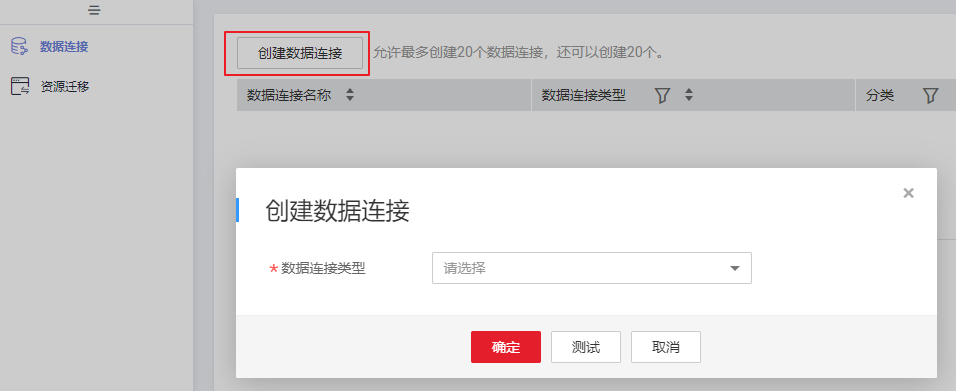
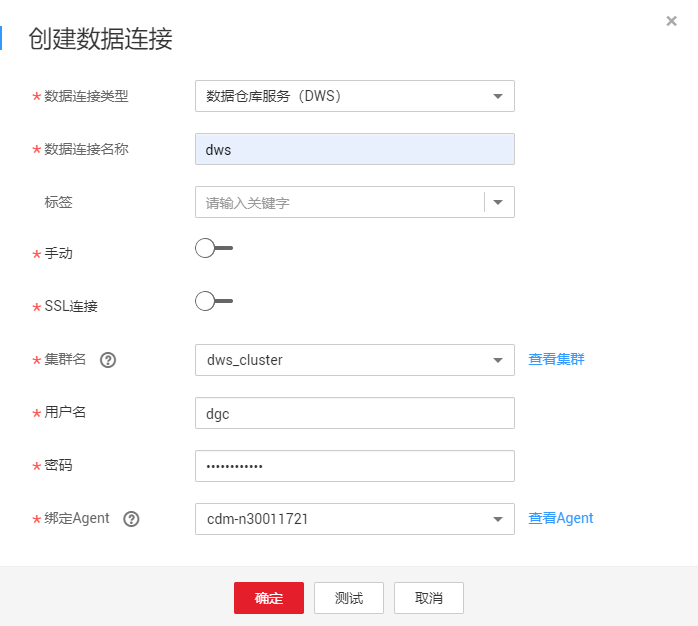
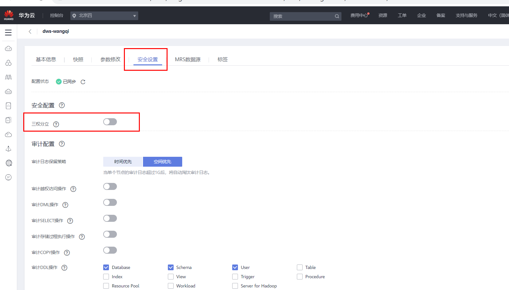

# 新建DWS连接

本章节以新建DWS连接为例，介绍如何建立DGC与数据仓库底座之间的数据连接。

## 前提条件

-   在创建数据连接前，请确保您已创建所要连接的数据湖（如DGC所支持的数据库、云服务等）。
    -   在创建DWS类型的数据连接前，您需要先在DWS服务中创建集群，并且具有KMS密钥的查看权限。
    -   在创建MRS HBase、MRS Hive、MRS Kafka、MRS Ranger、MRS Spark、MRS Presto类型的数据连接前，需确保您已购买MRS集群，并且在创建数据链接时已购买选择所需要的组件。
    -   在创建RDS类型的数据连接前，请确保您已创建RDS数据库实例。DGC平台目前仅支持RDS中的MySQL和PostgreSQL数据库引擎。

-   在创建数据连接前，请确保待连接的数据湖与DGC实例之间网络互通。
    -   如果数据湖为云下的数据库，则需要通过公网或者专线打通网络，确保数据源所在的主机可以访问公网，并且防火墙规则已开放连接端口。
    -   如果数据湖为云上服务（如DWS、MRS等），则网络互通需满足如下条件：
        -   DGC实例（指DGC实例中的批量数据迁移集群）与云上服务处于不同区域的情况下，需要通过公网或者专线打通网络。
        -   DGC实例（指DGC实例中的批量数据迁移集群）与云上服务同区域情况下，同虚拟私有云、同子网、同安全组的不同实例默认网络互通；如果同虚拟私有云但是子网或安全组不同，还需配置路由规则及安全组规则，配置路由规则请参见[如何配置路由规则](https://support.huaweicloud.com/bestpractice-vpc/bestpractice_0009.html#bestpractice_0009__zh-cn_topic_0252060877_li16617547103419)章节，配置安全组规则请参见[如何配置安全组规则](https://support.huaweicloud.com/usermanual-ecs/zh-cn_topic_0140323152.html)《虚拟私有云\(VPC\)使用指南》中的“安全组 \> 添加安全组规则”章节。
        -   此外，您还必须确保该云服务的实例与DGC工作空间所属的企业项目必须相同，如果不同，您需要修改工作空间的企业项目。

## 创建数据连接

1.  在DGC控制台首页，选择对应工作空间的“管理中心“模块，进入管理中心页面。

    **图 1**  选择管理中心  
    

1.  在管理中心页面，单击“数据连接”，进入数据连接页面。

    **图 2**  创建数据连接  
    

1.  单击“创建数据连接“，在弹出的对话框中，选择“数据连接类型”为“数据仓库服务（DWS）”，并参见[表1](#table11826143220444)配置相关参数。

    **图 3**  创建数据连接  
    

    **图 4**  DWS连接配置参数  
    

    **表 1**  DWS数据连接

    
    <table><thead align="left"><tr id="dgc_01_0009_zh-cn_topic_0141836082_row10331275523"><th class="cellrowborder" valign="top" width="21.52%" id="mcps1.2.4.1.1">
参数

    </th>
    <th class="cellrowborder" valign="top" width="9.81%" id="mcps1.2.4.1.2">
是否必选

    </th>
    <th class="cellrowborder" valign="top" width="68.67%" id="mcps1.2.4.1.3">
说明

    </th>
    </tr>
    </thead>
    <tbody><tr id="dgc_01_0009_zh-cn_topic_0141836082_row73322712520"><td class="cellrowborder" valign="top" width="21.52%" headers="mcps1.2.4.1.1 ">
数据连接名称

    </td>
    <td class="cellrowborder" valign="top" width="9.81%" headers="mcps1.2.4.1.2 ">
是

    </td>
    <td class="cellrowborder" valign="top" width="68.67%" headers="mcps1.2.4.1.3 ">
数据连接的名称，只能包含英文字母、数字、下划线和中划线，且长度为1~50个字符。

    </td>
    </tr>
    <tr id="dgc_01_0009_row186884187567"><td class="cellrowborder" valign="top" width="21.52%" headers="mcps1.2.4.1.1 ">
标签

    </td>
    <td class="cellrowborder" valign="top" width="9.81%" headers="mcps1.2.4.1.2 ">
否

    </td>
    <td class="cellrowborder" valign="top" width="68.67%" headers="mcps1.2.4.1.3 ">
标识数据连接的属性。设置标签后，便于统一管理。可自行设置标签，也可在下拉框中选择已在<a href="标签管理.md">标签管理</a>中创建的标签。

    
 说明： 

标签的名称，只能包含中文、英文字母、数字和下划线，不能以下划线开头。且长度不能超过100个字符。

    

    </td>
    </tr>
    <tr id="dgc_01_0009_zh-cn_topic_0141836082_row85665553579"><td class="cellrowborder" valign="top" width="21.52%" headers="mcps1.2.4.1.1 ">
手动

    </td>
    <td class="cellrowborder" valign="top" width="9.81%" headers="mcps1.2.4.1.2 ">
是

    </td>
    <td class="cellrowborder" valign="top" width="68.67%" headers="mcps1.2.4.1.3 ">
通过单击或来关闭或开启手动开关：

    <ul id="dgc_01_0009_ul397819617341"><li>当“手动”关闭时候，“IP”和“端口”不需要填写。</li><li>当“手动”打开时候，“IP”和“端口”需要填写。</li></ul>
    </td>
    </tr>
    <tr id="dgc_01_0009_zh-cn_topic_0141836082_row1223798105810"><td class="cellrowborder" valign="top" width="21.52%" headers="mcps1.2.4.1.1 ">
IP

    </td>
    <td class="cellrowborder" valign="top" width="9.81%" headers="mcps1.2.4.1.2 ">
否

    </td>
    <td class="cellrowborder" valign="top" width="68.67%" headers="mcps1.2.4.1.3 ">
“手动”打开时需要填写该项，表示通过内部网络访问集群数据库的IP地址。内网访问IP地址在创建集群时自动生成。

    </td>
    </tr>
    <tr id="dgc_01_0009_zh-cn_topic_0141836082_row370619114587"><td class="cellrowborder" valign="top" width="21.52%" headers="mcps1.2.4.1.1 ">
端口

    </td>
    <td class="cellrowborder" valign="top" width="9.81%" headers="mcps1.2.4.1.2 ">
否

    </td>
    <td class="cellrowborder" valign="top" width="68.67%" headers="mcps1.2.4.1.3 ">
“手动”打开时需要填写该项，表示创建DWS集群时指定的数据库端口号。请确保您已在安全组规则中开放此端口，以便DGC实例可以通过该端口连接DWS集群数据库。

    </td>
    </tr>
    <tr id="dgc_01_0009_row18044675113"><td class="cellrowborder" valign="top" width="21.52%" headers="mcps1.2.4.1.1 ">
SSL连接

    </td>
    <td class="cellrowborder" valign="top" width="9.81%" headers="mcps1.2.4.1.2 ">
是

    </td>
    <td class="cellrowborder" valign="top" width="68.67%" headers="mcps1.2.4.1.3 ">
DWS支持SSL通道加密和证书认证两种方式进行客户端与服务器端的通信。您可以通过服务器端是否强制使用SSL连接进行设置。开关打开，即只能通过SSL方式连接。开关关闭，即两种方式均可。默认关闭。

    </td>
    </tr>
    <tr id="dgc_01_0009_zh-cn_topic_0141836082_row733122725220"><td class="cellrowborder" valign="top" width="21.52%" headers="mcps1.2.4.1.1 ">
集群名

    </td>
    <td class="cellrowborder" valign="top" width="9.81%" headers="mcps1.2.4.1.2 ">
是

    </td>
    <td class="cellrowborder" valign="top" width="68.67%" headers="mcps1.2.4.1.3 ">
选择DWS集群。

    </td>
    </tr>
    <tr id="dgc_01_0009_zh-cn_topic_0141836082_row033327105212"><td class="cellrowborder" valign="top" width="21.52%" headers="mcps1.2.4.1.1 ">
用户名

    </td>
    <td class="cellrowborder" valign="top" width="9.81%" headers="mcps1.2.4.1.2 ">
是

    </td>
    <td class="cellrowborder" valign="top" width="68.67%" headers="mcps1.2.4.1.3 ">
数据库的用户名，创建DWS集群时指定的用户名。

    </td>
    </tr>
    <tr id="dgc_01_0009_zh-cn_topic_0141836082_row1833627155213"><td class="cellrowborder" valign="top" width="21.52%" headers="mcps1.2.4.1.1 ">
密码

    </td>
    <td class="cellrowborder" valign="top" width="9.81%" headers="mcps1.2.4.1.2 ">
是

    </td>
    <td class="cellrowborder" valign="top" width="68.67%" headers="mcps1.2.4.1.3 ">
数据库的访问密码，创建DWS集群时指定的密码。

    </td>
    </tr>
    <tr id="dgc_01_0009_zh-cn_topic_0141836082_row33317279521"><td class="cellrowborder" valign="top" width="21.52%" headers="mcps1.2.4.1.1 ">
KMS密钥

    </td>
    <td class="cellrowborder" valign="top" width="9.81%" headers="mcps1.2.4.1.2 ">
是

    </td>
    <td class="cellrowborder" valign="top" width="68.67%" headers="mcps1.2.4.1.3 ">
通过KMS加密和解密用户密码和密钥对的密码，选择KMS中已创建的密钥。

    </td>
    </tr>
    <tr id="dgc_01_0009_row0789422174317"><td class="cellrowborder" valign="top" width="21.52%" headers="mcps1.2.4.1.1 ">
连接方式

    </td>
    <td class="cellrowborder" valign="top" width="9.81%" headers="mcps1.2.4.1.2 ">
是

    </td>
    <td class="cellrowborder" valign="top" width="68.67%" headers="mcps1.2.4.1.3 ">
连接方式：

    <ul id="dgc_01_0009_ul26441227194317"><li>通过代理连接：需要配置“绑定Agent”，绑定由批量数据迁移集群提供的代理服务。</li><li>直接连接</li></ul>
    </td>
    </tr>
    <tr id="dgc_01_0009_zh-cn_topic_0141836082_row633182715526"><td class="cellrowborder" valign="top" width="21.52%" headers="mcps1.2.4.1.1 ">
绑定Agent

    </td>
    <td class="cellrowborder" valign="top" width="9.81%" headers="mcps1.2.4.1.2 ">
是

    </td>
    <td class="cellrowborder" valign="top" width="68.67%" headers="mcps1.2.4.1.3 ">
批量数据迁移集群提供了DGC与非全托管服务通信的代理，所以创建DWS的数据连接时，请选择一个批量数据迁移集群。如果没有可用的批量数据迁移集群，请先创建一个批量数据迁移集群。

    </td>
    </tr>
    </tbody>
    </table>

2.  单击“测试”，测试数据连接的连通性。如果无法连通，数据连接将无法创建。
3.  测试通过后，单击“确定”，创建数据连接。

## 参考

1.  创建DWS数据连接，开启SSL连接时测试连接失败？

    可能是由于DWS集群的三权分立功能导致的。请在DWS控制台，点击进入对应的DWS集群后，选择“安全设置”，然后关闭三权分立功能。

    **图 5**  关闭DWS集群三权分立功能  
    

2.  为什么DWS数据连接突然无法获取数据库或表的信息？

    可能是由于CDM集群被关闭导致。

