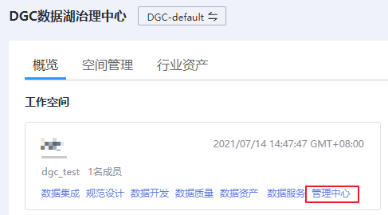
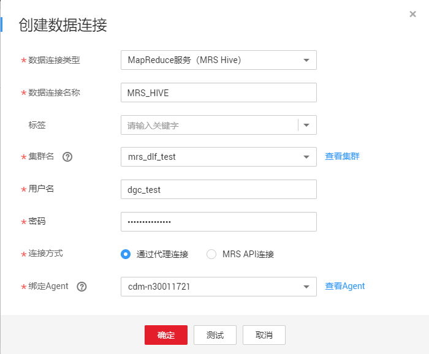

# 新建MRS Hive连接

本章节以新建MRS Hive连接为例，介绍如何建立DGC与数据湖底座之间的数据连接。

## 前提条件

-   在创建数据连接前，请确保您已创建所要连接的数据湖（如DGC所支持的数据库、云服务等）。
    -   在创建DWS类型的数据连接前，您需要先在DWS服务中创建集群，并且具有KMS密钥的查看权限。
    -   在创建MRS HBase、MRS Hive、MRS Kafka、MRS Ranger、MRS Spark、MRS Presto类型的数据连接前，需确保您已购买MRS集群，并且在创建数据链接时已购买选择所需要的组件。
    -   在创建RDS类型的数据连接前，请确保您已创建RDS数据库实例。DGC平台目前仅支持RDS中的MySQL和PostgreSQL数据库引擎。

-   在创建数据连接前，请确保待连接的数据湖与DGC实例之间网络互通。
    -   如果数据湖为云下的数据库，则需要通过公网或者专线打通网络，确保数据源所在的主机可以访问公网，并且防火墙规则已开放连接端口。
    -   如果数据湖为云上服务（如DWS、MRS等），则网络互通需满足如下条件：
        -   DGC实例（指DGC实例中的批量数据迁移集群）与云上服务处于不同区域的情况下，需要通过公网或者专线打通网络。
        -   DGC实例（指DGC实例中的批量数据迁移集群）与云上服务同区域情况下，同虚拟私有云、同子网、同安全组的不同实例默认网络互通；如果同虚拟私有云但是子网或安全组不同，还需配置路由规则及安全组规则，配置路由规则请参见[如何配置路由规则](https://support.huaweicloud.com/bestpractice-vpc/bestpractice_0009.html#bestpractice_0009__zh-cn_topic_0252060877_li16617547103419)章节，配置安全组规则请参见[如何配置安全组规则](https://support.huaweicloud.com/usermanual-ecs/zh-cn_topic_0140323152.html)《虚拟私有云\(VPC\)使用指南》中的“安全组 \> 添加安全组规则”章节。
        -   此外，您还必须确保该云服务的实例与DGC工作空间所属的企业项目必须相同，如果不同，您需要修改工作空间的企业项目。

## 创建数据连接

1.  在DGC控制台首页，选择对应工作空间的“管理中心“模块，进入管理中心页面。

    **图 1**  选择管理中心  
    

1.  在管理中心页面，单击“数据连接”，进入数据连接页面。

    **图 2**  创建数据连接  
    

1.  单击“创建数据连接“，在弹出的对话框中，选择“数据连接类型”为“MapReduce服务（MRS Hive）”，并参见[表1](#table11826143220444)配置相关参数。

    **图 3**  创建数据连接  
    

    > **说明：** 
    >为保证规范设计、数据质量、数据资产、数据服务等组件能够使用该连接，此处连接方式应配置为“通过代理连接”。

    **图 4**  MRS Hive连接配置参数  
    

    **表 1**  MRS Hive数据连接

    
    <table><thead align="left"><tr id="dgc_01_0009_zh-cn_topic_0141836082_row183332775217"><th class="cellrowborder" valign="top" width="20.18%" id="mcps1.2.4.1.1">
参数

    </th>
    <th class="cellrowborder" valign="top" width="9.48%" id="mcps1.2.4.1.2">
是否必选

    </th>
    <th class="cellrowborder" valign="top" width="70.34%" id="mcps1.2.4.1.3">
说明

    </th>
    </tr>
    </thead>
    <tbody><tr id="dgc_01_0009_zh-cn_topic_0141836082_row1233202785217"><td class="cellrowborder" valign="top" width="20.18%" headers="mcps1.2.4.1.1 ">
数据连接名称

    </td>
    <td class="cellrowborder" valign="top" width="9.48%" headers="mcps1.2.4.1.2 ">
是

    </td>
    <td class="cellrowborder" valign="top" width="70.34%" headers="mcps1.2.4.1.3 ">
数据连接的名称，只能包含英文字母、数字、下划线和中划线，且长度为1~50个字符。

    </td>
    </tr>
    <tr id="dgc_01_0009_row107734113312"><td class="cellrowborder" valign="top" width="20.18%" headers="mcps1.2.4.1.1 ">
标签

    </td>
    <td class="cellrowborder" valign="top" width="9.48%" headers="mcps1.2.4.1.2 ">
否

    </td>
    <td class="cellrowborder" valign="top" width="70.34%" headers="mcps1.2.4.1.3 ">
标识数据连接的属性。设置标签后，便于统一管理。可自行设置标签，也可在下拉框中选择已在<a href="标签管理.md">标签管理</a>中创建的标签。

    
 说明： 

标签的名称，只能包含中文、英文字母、数字和下划线，不能以下划线开头。且长度不能超过100个字符。

    

    </td>
    </tr>
    <tr id="dgc_01_0009_zh-cn_topic_0141836082_row83352725213"><td class="cellrowborder" valign="top" width="20.18%" headers="mcps1.2.4.1.1 ">
集群名

    </td>
    <td class="cellrowborder" valign="top" width="9.48%" headers="mcps1.2.4.1.2 ">
是

    </td>
    <td class="cellrowborder" valign="top" width="70.34%" headers="mcps1.2.4.1.3 ">
选择Hive所属的MRS集群。如果在下拉列表中无法显示MRS集群，请检查MRS集群与DGC实例是否网络互通。

    
需确保MRS集群和DGC实例之间网络互通，网络互通需满足如下条件：<ul id="dgc_01_0009_ul1715617232281"><li>DGC实例（指DGC实例中的批量数据迁移集群）与MRS集群处于不同区域的情况下，需要通过公网或者专线打通网络。</li><li>DGC实例（指DGC实例中的批量数据迁移集群）与MRS集群同区域情况下，同虚拟私有云、同子网、同安全组的不同实例默认网络互通；如果同虚拟私有云但子网或安全组不同，还需配置路由规则及安全组规则，配置路由规则请参见<a href="https://support.huaweicloud.com/bestpractice-vpc/bestpractice_0009.html#bestpractice_0009__zh-cn_topic_0252060877_li16617547103419" target="_blank" rel="noopener noreferrer">如何配置路由规则</a>章节，配置安全组规则请参见<a href="https://support.huaweicloud.com/usermanual-ecs/zh-cn_topic_0140323152.html" target="_blank" rel="noopener noreferrer">如何配置安全组规则</a>章节。</li><li>此外，还需确保该MRS集群与DGC工作空间所属的企业项目相同，如果不同，您需要修改工作空间的企业项目。</li></ul>
    

    </td>
    </tr>
    <tr id="dgc_01_0009_row14166102033317"><td class="cellrowborder" valign="top" width="20.18%" headers="mcps1.2.4.1.1 ">
连接方式

    </td>
    <td class="cellrowborder" valign="top" width="9.48%" headers="mcps1.2.4.1.2 ">
是

    </td>
    <td class="cellrowborder" valign="top" width="70.34%" headers="mcps1.2.4.1.3 ">
连接方式：

    <ul id="dgc_01_0009_ul18801710104013"><li>通过代理连接</li><li>MRS API连接
选择MRS API连接时，有这些约束：

    <ol id="dgc_01_0009_dgc_01_0009_ol1416110265526"><li>无法查看表和字段。</li><li>在SQL编辑器运行SQL时，只能以日志形式显示执行结果。</li><li>该直连方式数据治理功能无法使用。</li></ol>
    </li></ul>
    </td>
    </tr>
    <tr id="dgc_01_0009_row173341643113510"><td class="cellrowborder" valign="top" width="20.18%" headers="mcps1.2.4.1.1 ">
用户名

    </td>
    <td class="cellrowborder" valign="top" width="9.48%" headers="mcps1.2.4.1.2 ">
是

    </td>
    <td class="cellrowborder" valign="top" width="70.34%" headers="mcps1.2.4.1.3 ">
MRS集群的用户名，通过代理连接的时候，是必选项。

    
如果要创建MRS安全集群的数据连接，不能使用admin用户。因为admin用户是默认的管理页面用户，这个用户无法作为安全集群的认证用户来使用。您可以参考<a href="创建数据连接.md#section52193714195">创建MRS安全集群的kerberos认证用户</a>创建一个新的MRS用户，然后在创建MRS数据连接时，“用户名”和“密码”填写为新建的MRS用户及其密码。
 说明： 
<ul id="dgc_01_0009_dgc_01_0009_ul17715141011134"><li>MRS 3.1.0及之后版本集群，所创建的用户至少需具备Manager_viewer的角色权限才能在管理中心创建连接；如果需要对应组件的进行库、表、数据的操作，还需要添加对应组件的用户组权限。</li><li>MRS 3.1.0版本之前的集群，所创建的用户需要具备Manager_administrator或System_administrator权限，才能在管理中心创建连接。</li><li>仅具备Manager_tenant或Manager_auditor权限，无法创建连接。</li></ul>
    

    

    </td>
    </tr>
    <tr id="dgc_01_0009_row158567463331"><td class="cellrowborder" valign="top" width="20.18%" headers="mcps1.2.4.1.1 ">
密码

    </td>
    <td class="cellrowborder" valign="top" width="9.48%" headers="mcps1.2.4.1.2 ">
是

    </td>
    <td class="cellrowborder" valign="top" width="70.34%" headers="mcps1.2.4.1.3 ">
MRS集群的访问密码，通过代理连接的时候，是必选项。

    </td>
    </tr>
    <tr id="dgc_01_0009_row217816439338"><td class="cellrowborder" valign="top" width="20.18%" headers="mcps1.2.4.1.1 ">
KMS密钥

    </td>
    <td class="cellrowborder" valign="top" width="9.48%" headers="mcps1.2.4.1.2 ">
是

    </td>
    <td class="cellrowborder" valign="top" width="70.34%" headers="mcps1.2.4.1.3 ">
KMS密钥名称。通过代理连接的时候，是必选项。

    </td>
    </tr>
    <tr id="dgc_01_0009_zh-cn_topic_0141836082_row1333627175218"><td class="cellrowborder" valign="top" width="20.18%" headers="mcps1.2.4.1.1 ">
绑定Agent

    </td>
    <td class="cellrowborder" valign="top" width="9.48%" headers="mcps1.2.4.1.2 ">
是

    </td>
    <td class="cellrowborder" valign="top" width="70.34%" headers="mcps1.2.4.1.3 ">
MRS为非全托管服务，DGC无法直接与非全托管服务进行连接。批量数据迁移集群提供了DGC与非全托管服务通信的代理，所以创建MRS Hive的数据连接时，请选择一个批量数据迁移集群。如果没有可用的批量数据迁移集群，请先创建一个批量数据迁移集群。

    </td>
    </tr>
    </tbody>
    </table>

2.  单击“测试”，测试数据连接的连通性。如果无法连通，数据连接将无法创建。
3.  测试通过后，单击“确定”，创建数据连接。

## 参考

1.  在创建数据连接的界面上MRS Hive集群不显示？？

    出现该问题的可能原因有：

    -   创建MRS集群时未选择Hive/HBase组件。
    -   创建MRS数据连接时所选择的CDM集群和MRS集群网络不互通。

        CDM集群作为网络代理，与MRS集群需网络互通才可以成功创建基于MRS的数据连接。

2.  为什么Hive数据连接突然无法获取数据库或表的信息？

    可能是由于CDM集群被关闭导致。

