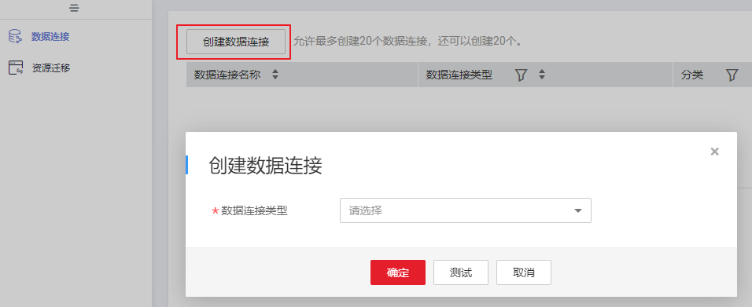
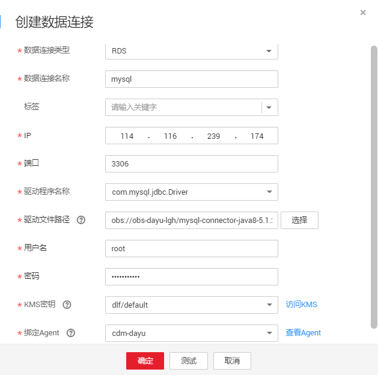

# 新建MySQL连接

本章节以新建MySQL连接为例，介绍如何建立DGC与数据库底座之间的数据连接。

## 前提条件

-   在创建数据连接前，请确保您已创建所要连接的数据湖（如DGC所支持的数据库、云服务等）。
    -   在创建DWS类型的数据连接前，您需要先在DWS服务中创建集群，并且具有KMS密钥的查看权限。
    -   在创建MRS HBase、MRS Hive、MRS Kafka、MRS Ranger、MRS Spark、MRS Presto类型的数据连接前，需确保您已购买MRS集群，并且在创建数据链接时已购买选择所需要的组件。
    -   在创建RDS类型的数据连接前，请确保您已创建RDS数据库实例。DGC平台目前仅支持RDS中的MySQL和PostgreSQL数据库引擎。

-   在创建数据连接前，请确保待连接的数据湖与DGC实例之间网络互通。
    -   如果数据湖为云下的数据库，则需要通过公网或者专线打通网络，确保数据源所在的主机可以访问公网，并且防火墙规则已开放连接端口。
    -   如果数据湖为云上服务（如DWS、MRS等），则网络互通需满足如下条件：
        -   DGC实例（指DGC实例中的批量数据迁移集群）与云上服务处于不同区域的情况下，需要通过公网或者专线打通网络。
        -   DGC实例（指DGC实例中的批量数据迁移集群）与云上服务同区域情况下，同虚拟私有云、同子网、同安全组的不同实例默认网络互通；如果同虚拟私有云但是子网或安全组不同，还需配置路由规则及安全组规则，配置路由规则请参见[如何配置路由规则](https://support.huaweicloud.com/bestpractice-vpc/bestpractice_0009.html#bestpractice_0009__zh-cn_topic_0252060877_li16617547103419)章节，配置安全组规则请参见[如何配置安全组规则](https://support.huaweicloud.com/usermanual-ecs/zh-cn_topic_0140323152.html)《虚拟私有云\(VPC\)使用指南》中的“安全组 \> 添加安全组规则”章节。
        -   此外，您还必须确保该云服务的实例与DGC工作空间所属的企业项目必须相同，如果不同，您需要修改工作空间的企业项目。

## 创建数据连接

1.  在DGC控制台首页，选择对应工作空间的“管理中心“模块，进入管理中心页面。

    **图 1**  选择管理中心  
    

1.  在管理中心页面，单击“数据连接”，进入数据连接页面。

    **图 2**  创建数据连接  
    

1.  单击“创建数据连接“，在弹出的对话框中，选择“数据连接类型”为“RDS”，并参见[表1](#table11826143220444)配置相关参数。

    **图 3**  创建数据连接  
    

    > **说明：** 
    >-   不建议使用MySQL\(待下线\)连接器，推荐使用RDS连接MySQL数据源。
    >-   RDS数据连接方式依赖于OBS。如果没有与DGC同区域的OBS，则不支持RDS数据连接。

    **图 4**  RDS连接配置参数  
    

    **表 1**  RDS数据连接

    
    <table><thead align="left"><tr id="dgc_01_0009_zh-cn_topic_0141836082_row14785613295"><th class="cellrowborder" valign="top" width="21.18%" id="mcps1.2.4.1.1">
参数

    </th>
    <th class="cellrowborder" valign="top" width="9.47%" id="mcps1.2.4.1.2">
是否必选

    </th>
    <th class="cellrowborder" valign="top" width="69.35%" id="mcps1.2.4.1.3">
说明

    </th>
    </tr>
    </thead>
    <tbody><tr id="dgc_01_0009_zh-cn_topic_0141836082_row14755612299"><td class="cellrowborder" valign="top" width="21.18%" headers="mcps1.2.4.1.1 ">
数据连接名称

    </td>
    <td class="cellrowborder" valign="top" width="9.47%" headers="mcps1.2.4.1.2 ">
是

    </td>
    <td class="cellrowborder" valign="top" width="69.35%" headers="mcps1.2.4.1.3 ">
数据连接的名称，只能包含英文字母、数字、下划线和中划线，且长度为1~50个字符。

    </td>
    </tr>
    <tr id="dgc_01_0009_row16372172795310"><td class="cellrowborder" valign="top" width="21.18%" headers="mcps1.2.4.1.1 ">
标签

    </td>
    <td class="cellrowborder" valign="top" width="9.47%" headers="mcps1.2.4.1.2 ">
否

    </td>
    <td class="cellrowborder" valign="top" width="69.35%" headers="mcps1.2.4.1.3 ">
标识数据连接的属性。设置标签后，便于统一管理。可自行设置标签，也可在下拉框中选择已在<a href="标签管理.md">标签管理</a>中创建的标签。

    
 说明： 

标签的名称，只能包含中文、英文字母、数字和下划线，不能以下划线开头。且长度不能超过100个字符。

    

    </td>
    </tr>
    <tr id="dgc_01_0009_zh-cn_topic_0141836082_row26676209301"><td class="cellrowborder" valign="top" width="21.18%" headers="mcps1.2.4.1.1 ">
IP

    </td>
    <td class="cellrowborder" valign="top" width="9.47%" headers="mcps1.2.4.1.2 ">
是

    </td>
    <td class="cellrowborder" valign="top" width="69.35%" headers="mcps1.2.4.1.3 ">
RDS的访问地址。

    
如果为RDS数据源，可以通过RDS管理控制台获取访问地址：

    <ol id="dgc_01_0009_zh-cn_topic_0141836082_ol126164591245"><li>根据注册的帐号登录管理控制台。</li><li>单击“关系型数据库服务”，从左侧列表选择实例管理。</li><li>单击某一个实例名称，进入实例基本信息页面。</li></ol>
    
在连接信息标签中可以获取到内网地址。

    </td>
    </tr>
    <tr id="dgc_01_0009_zh-cn_topic_0141836082_row1550872653018"><td class="cellrowborder" valign="top" width="21.18%" headers="mcps1.2.4.1.1 ">
端口

    </td>
    <td class="cellrowborder" valign="top" width="9.47%" headers="mcps1.2.4.1.2 ">
是

    </td>
    <td class="cellrowborder" valign="top" width="69.35%" headers="mcps1.2.4.1.3 ">
RDS的访问端口。

    
如果为RDS数据源，可以通过RDS管理控制台获取访问端口：

    <ol id="dgc_01_0009_zh-cn_topic_0141836082_ol1691415261753"><li>根据注册的帐号登录管理控制台。</li><li>单击“关系型数据库服务”，左侧列表选择实例管理。</li><li>单击某一个实例名称，进入实例基本信息页面。</li></ol>
    
在连接信息标签中可以获取到数据库端口。

    </td>
    </tr>
    <tr id="dgc_01_0009_zh-cn_topic_0141836082_row202902023183018"><td class="cellrowborder" valign="top" width="21.18%" headers="mcps1.2.4.1.1 ">
驱动程序名称

    </td>
    <td class="cellrowborder" valign="top" width="9.47%" headers="mcps1.2.4.1.2 ">
是

    </td>
    <td class="cellrowborder" valign="top" width="69.35%" headers="mcps1.2.4.1.3 ">
驱动程序名称：

    <ul id="dgc_01_0009_zh-cn_topic_0141836082_ul0230558162416"><li>com.mysql.jdbc.Driver</li><li>org.postgresql.Driver</li></ul>
    </td>
    </tr>
    <tr id="dgc_01_0009_zh-cn_topic_0141836082_row5818565297"><td class="cellrowborder" valign="top" width="21.18%" headers="mcps1.2.4.1.1 ">
驱动文件路径

    </td>
    <td class="cellrowborder" valign="top" width="9.47%" headers="mcps1.2.4.1.2 ">
是

    </td>
    <td class="cellrowborder" valign="top" width="69.35%" headers="mcps1.2.4.1.3 ">
驱动文件在OBS上的路径。需要您自行到官网下载.jar格式驱动并上传至OBS中。

    <ul id="dgc_01_0009_ul1675912820153"><li>MySQL驱动：获取地址https://downloads.mysql.com/archives/c-j/，建议5.1.48版本。</li><li>PostgreSQL驱动：获取地址https://jdbc.postgresql.org/download.html，建议42.1.4版本。</li></ul>
    
 说明： 

如果需要更新驱动文件，则需要先在数据集成页面重启CDM集群，然后通过编辑数据连接的方式重新选择新版本驱动，更新驱动才能生效。

    

    </td>
    </tr>
    <tr id="dgc_01_0009_zh-cn_topic_0141836082_row78155622914"><td class="cellrowborder" valign="top" width="21.18%" headers="mcps1.2.4.1.1 ">
用户名

    </td>
    <td class="cellrowborder" valign="top" width="9.47%" headers="mcps1.2.4.1.2 ">
是

    </td>
    <td class="cellrowborder" valign="top" width="69.35%" headers="mcps1.2.4.1.3 ">
数据库的用户名，创建集群的时候，输入的用户名。

    </td>
    </tr>
    <tr id="dgc_01_0009_zh-cn_topic_0141836082_row98155617296"><td class="cellrowborder" valign="top" width="21.18%" headers="mcps1.2.4.1.1 ">
密码

    </td>
    <td class="cellrowborder" valign="top" width="9.47%" headers="mcps1.2.4.1.2 ">
是

    </td>
    <td class="cellrowborder" valign="top" width="69.35%" headers="mcps1.2.4.1.3 ">
数据库的访问密码，创建集群的时候，输入的密码。

    </td>
    </tr>
    <tr id="dgc_01_0009_zh-cn_topic_0141836082_row98135692916"><td class="cellrowborder" valign="top" width="21.18%" headers="mcps1.2.4.1.1 ">
KMS密钥

    </td>
    <td class="cellrowborder" valign="top" width="9.47%" headers="mcps1.2.4.1.2 ">
是

    </td>
    <td class="cellrowborder" valign="top" width="69.35%" headers="mcps1.2.4.1.3 ">
KMS密钥名称。

    
通过KMS管理控制台获取密钥名称：

    <ol id="dgc_01_0009_zh-cn_topic_0141836082_ol1374275212517"><li>根据注册的帐号登录管理控制台。</li><li>单击“密钥管理服务”，左侧列表选择密钥管理。</li></ol>
    
在密钥列表可以获取到密钥名称。

    </td>
    </tr>
    <tr id="dgc_01_0009_zh-cn_topic_0141836082_row138356102920"><td class="cellrowborder" valign="top" width="21.18%" headers="mcps1.2.4.1.1 ">
绑定Agent

    </td>
    <td class="cellrowborder" valign="top" width="9.47%" headers="mcps1.2.4.1.2 ">
是

    </td>
    <td class="cellrowborder" valign="top" width="69.35%" headers="mcps1.2.4.1.3 ">
RDS为非全托管服务，DGC无法直接与非全托管服务进行连接。批量数据迁移集群提供了DGC与非全托管服务通信的代理，所以创建RDS的数据连接时，请选择一个批量数据迁移集群。如果没有可用的批量数据迁移集群，请先创建一个批量数据迁移集群。

    </td>
    </tr>
    </tbody>
    </table>

2.  单击“测试”，测试数据连接的连通性。如果无法连通，数据连接将无法创建。
3.  测试通过后，单击“确定”，创建数据连接。

## 参考

1.  创建RDS类型的数据连接时，需要注意哪些事项？

    创建RDS类型的数据连接时，需要绑定由CDM集群提供的代理服务，目前不支持低于1.8.6版本的CDM集群。

