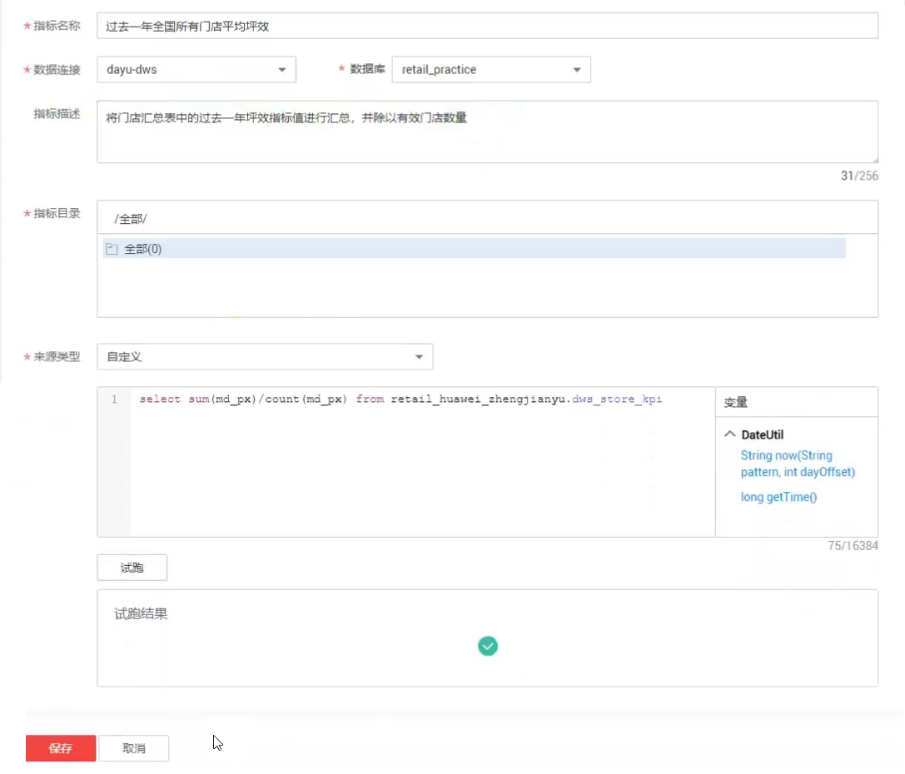
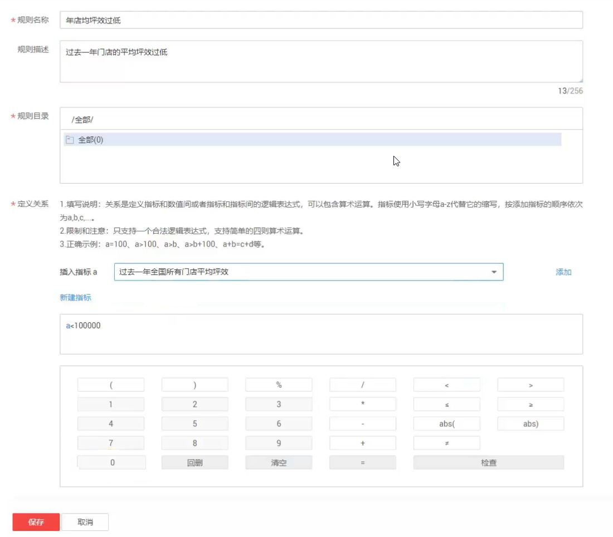
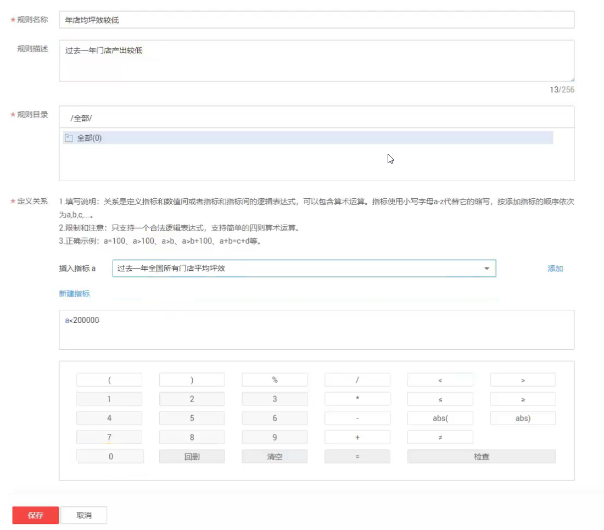
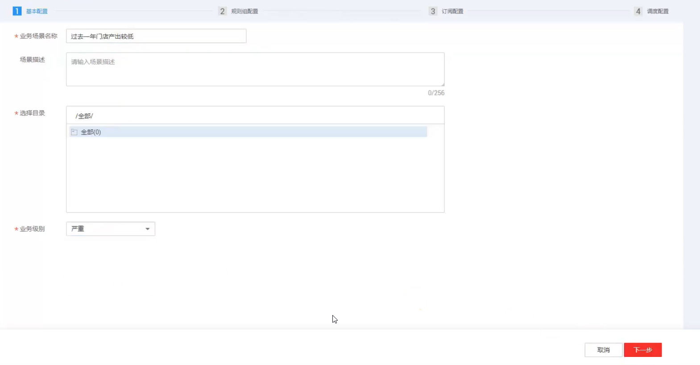
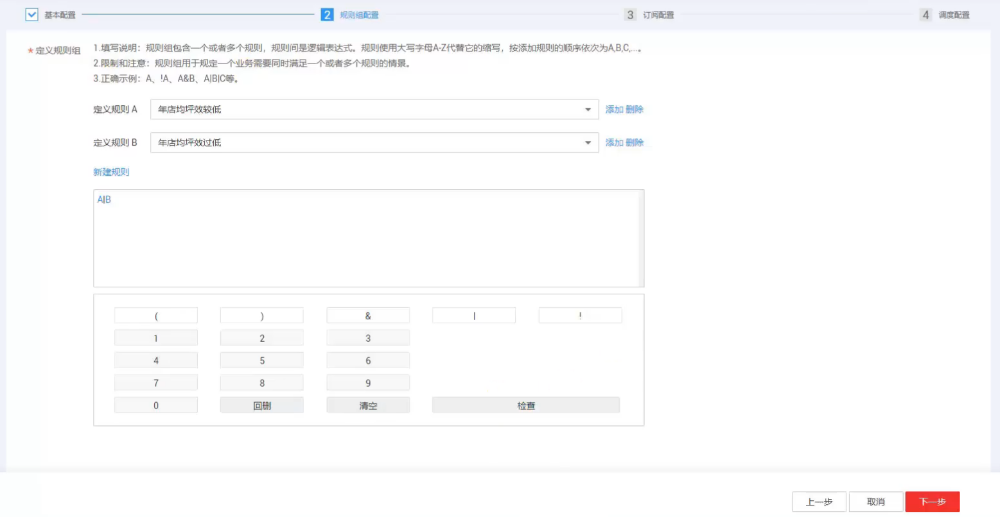
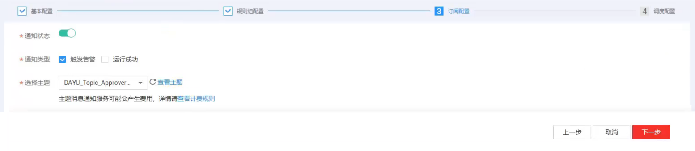

# 新建一个业务场景

## 场景说明

业务场景用于监控业务指标。本例以新建一个业务场景为里，介绍如何使用业务指标监控功能。

## 操作步骤

1.  进入DGC控制台首页的数据质量模块。
2.  新建业务指标。
    1.  单击左侧导航“指标管理”。
    2.  单击页面上方的“新建”，如下图所示。

        

    3.  单击“试跑”，查看试跑运行成功的结果。
    4.  单击“保存”，完成指标的创建。

3.  新建规则。
    1.  单击左侧导航“指标管理”。
    2.  单击页面上方的“新建”，创建第一条规则。
    3.  输入参数值，如下图所示。

        

    4.  单击“保存”。
    5.  单击页面上方的“新建”，创建第二条规则。
    6.  输入参数值，如下图所示。

        

    7.  单击“保存”。

4.  新建业务场景。
    1.  单击左侧导航“业务场景管理”。
    2.  单击页面上方的“新建”，输入场景的基本配置参数，如下图所示。

        

    3.  单击“下一步”，输入规则组的配置参数，如下图所示。

        

    4.  单击“下一步”，配置订阅信息，如下图所示。

        

    5.  单击“下一步”，配置调度信息，如下图所示。

        

    6.  单击“提交”，完成作业场景的创建。

5.  在业务场景管理列表中，单击操作列的“运行”，跳转到运维管理模块。
    1.  单击右上角的刷新按钮，可以查看业务场景的运行状态为成功。
    2.  单击运行结果，可查看具体的坪效结果。

