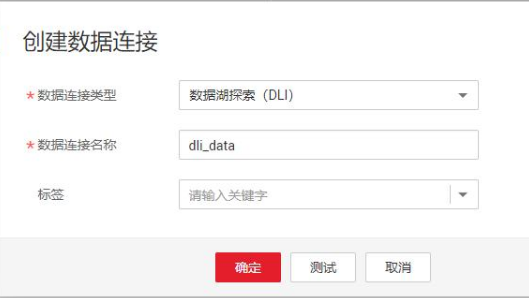
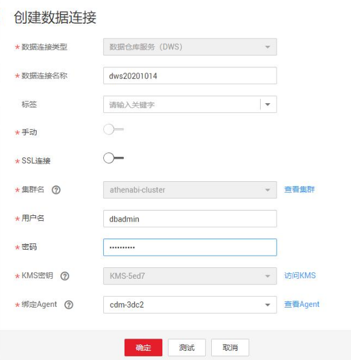
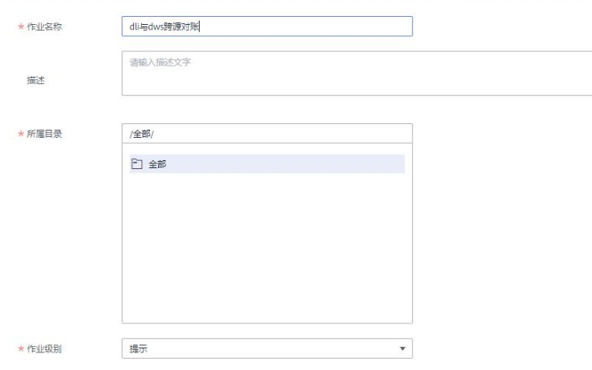
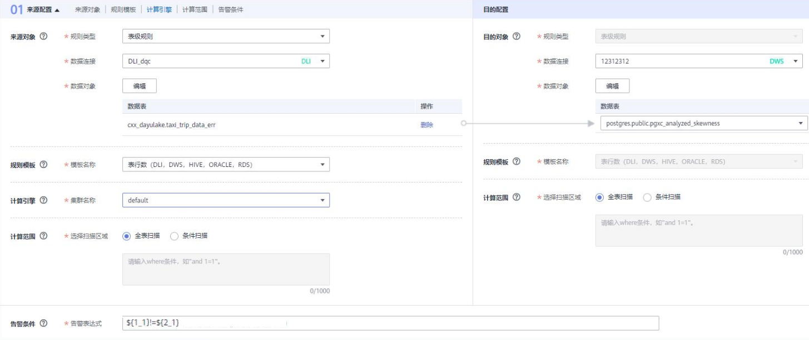
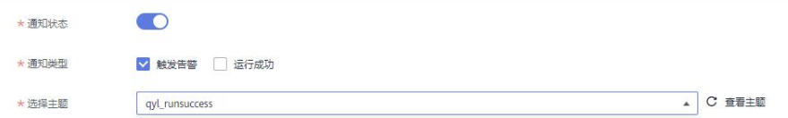
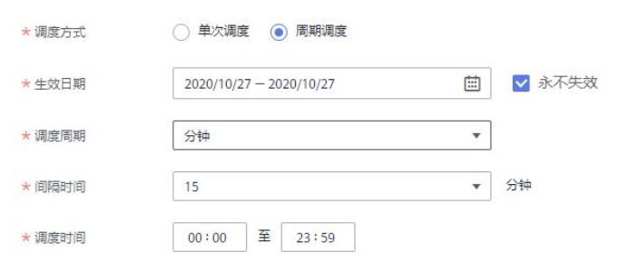
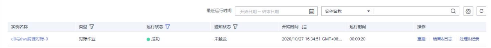
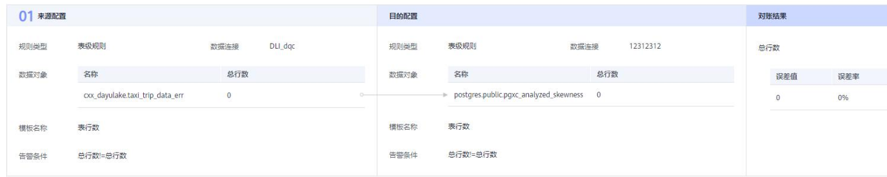

# 新建一个对账作业实例

## 场景说明

数据对账对于数据开发和数据迁移流程中的数据一致性至关重要，而跨源数据对账的能力是检验数据迁移或数据加工前后是否一致的关键指标。本章分别以DLI和DWS作为数据源，介绍如何通过DGC中的数据质量模块实现跨源数据对账的基本一致性校验。

## 环境准备

需要准备好对账的数据源，即通过管理中心分别创建数据连接，用于跨源数据对账。

## 操作步骤

1.  建立跨源数据连接。
    1.  创建DLI数据连接。在DGC管理中心模块，单击创建数据连接，数据连接类型选择“数据湖探索（DLI）”，输入数据连接名称，单击“测试”，提示连接成功，单击“确定”。

        

    2.  创建DWS数据连接。在DGC管理中心模块，单击创建数据连接，数据连接类型选择“数据仓库服务（DWS）”，输入数据连接名称，设置其他参数，如下图所示，单击“测试”，提示连接成功，单击“确定”。

        

2.  创建对账作业。
    1.  在DGC数据质量模块，单击左侧导航菜单“对账作业”。
    2.  单击“新建”，配置对账作业的基本信息，如下图所示。

        

    3.  单击“下一步”，进入规则配置页面。您需要点击规则卡片中的，然后配置对账规则，如下图所示。

        

        > **说明：** 
        >-   需要分别配置源端和目的端的信息。
        >-   配置告警条件，其中点击左侧的表行数（$\{1\_1\}）表示左侧源端选中表的行数，点击右侧表行数（$\{2\_1\}）表示目的端表行数。此处配置告警条件为$\{1\_1\}!=$\{2\_1\}，表示当左侧表行数与右侧表行数不一致时，触发报警并显示报警状态。

    4.  单击“下一步”，配置订阅信息，如下图所示。

        

        > **说明：** 
        >勾选触发告警表示作业报警时发送通知到对应的smn主题，勾选运行成功表示不报警时发送通知到SMN主题。

    5.  单击“下一步”，配置调度方式，如下图所示。

        

        > **说明：** 
        >单次调度表示需要手动触发运行，周期性调度表示会按照配置定期触发作业运行。此处以当天配置为例，设置每15分钟触发运行一次对账作业为例的配置。

    6.  单击“提交”，对账作业创建完成。

3.  查看对账作业。
    1.  单击对应的对账作业操作列中的运行链接，运行对账作业后，自动跳转到运维管理页面。
    2.  单击结果&日志查看运行结果和运行日志，等待作业运行结束后，如下图所示。

        

## 结果分析

至此，完成了通过DGC数据质量模块中的对账作业功能实现了DLI和DWS两种不同数据源中的表行数一致性对账功能。

运行结果中，左侧表示源端表行数规则运行结果，右侧表示目的端表行数规则运行结果。

误差率表示两端数据行数的差异比率，此处误差率为0表示两端一致。

