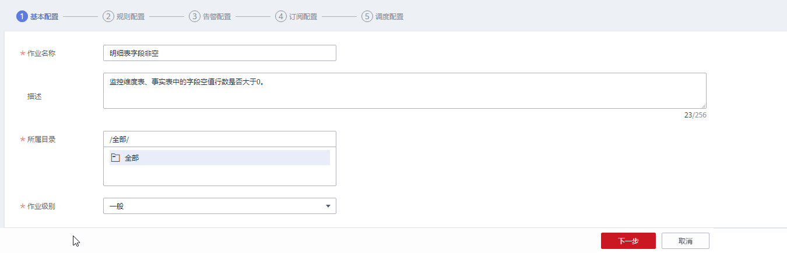
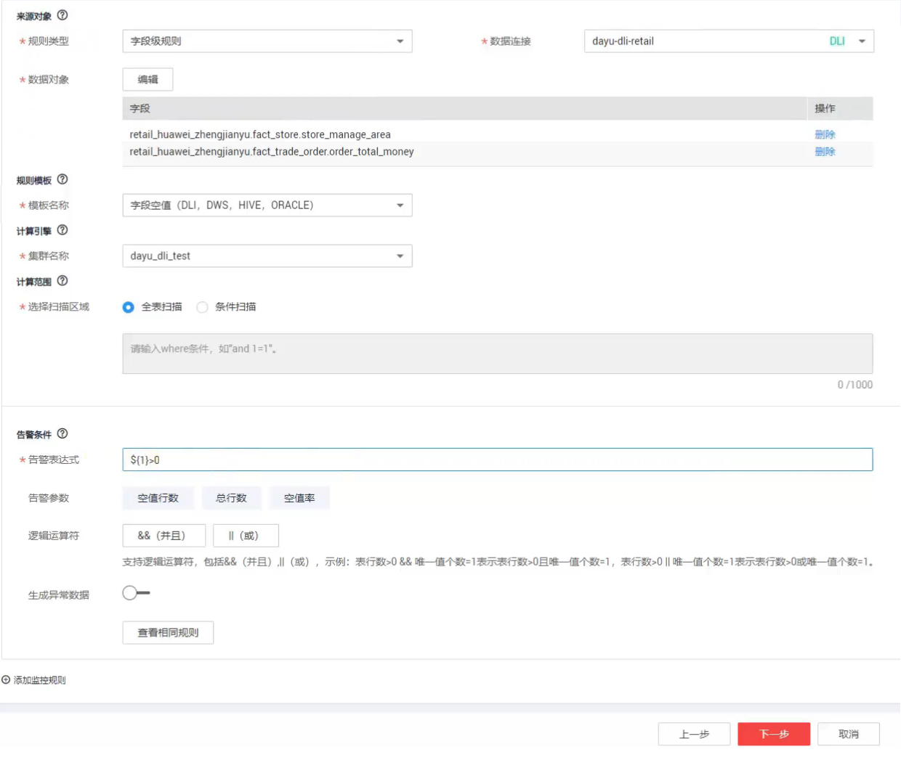
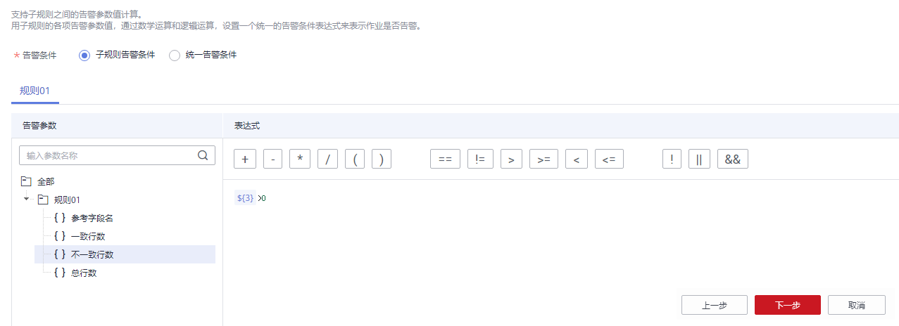
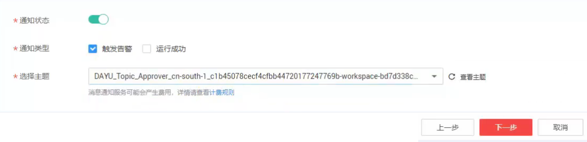
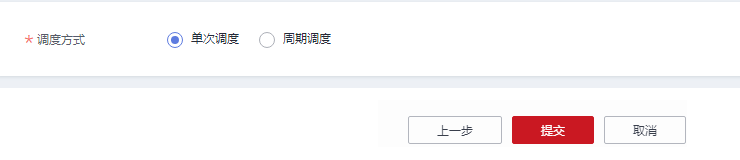
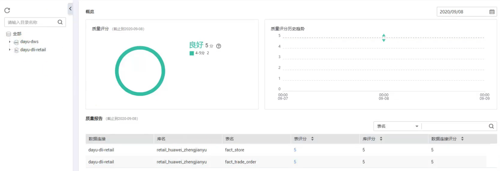
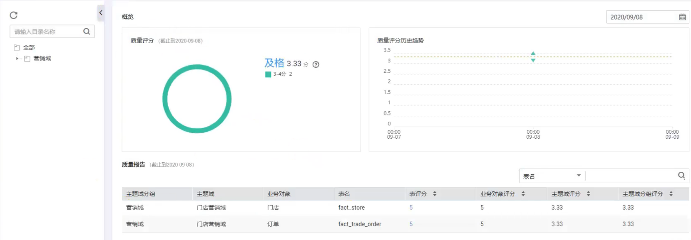

# 新建一个质量作业

## 场景说明

开发质量作业是为了监控数据质量。本章以新建一个质量作业为例，介绍如何开发质量作业。

## 操作步骤

1.  进入DGC控制台首页的数据质量模块。
2.  创建规则模板。
    1.  单击左侧导航“规则模板”，默认展示系统自定义的规则。数据质量的规则包含6个维度，分别是：完整性、唯一性、及时性、有效性、准确性、一致性。
    2.  单击“新建”，可自定义创建规则。

        > **说明：** 
        >本例使用系统自定义的规则即可。

3.  创建质量作业。
    1.  单击左侧导航“质量作业”。
    2.  单击“新建”，配置质量作业的基本信息，如下图所示。

        

    3.  单击“下一步”，进入规则配置页面。您需要点击规则卡片中的，然后配置规则信息，如下图所示。

        

    4.  单击“下一步”，配置告警信息，如下图所示。

        

    5.  单击“下一步”，配置订阅信息，如下图所示。

        

    6.  单击“下一步”，配置调度信息，入下图所示。

        

    7.  单击“提交”，完成质量作业的创建。

4.  在质量作业表中，单击操作列的“运行”，跳转到运维管理模块。
    1.  待质量作业运行成功后，单击左侧导航菜单的“质量报告”
    2.  默认展示技术报告，如下图所示。

        

    3.  单击“业务报告”页签，查看业务报告，如下图所示。

        

