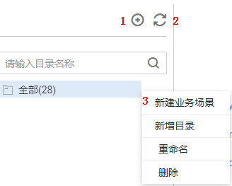

# 新建业务场景

管理所有业务场景，场景定义了规则间的逻辑关系，使用目录维护业务场景。

## 入口说明

基于规则创建业务场景，需要选择业务场景归属目录，请参见[图1](#zh-cn_topic_0141836089_fig1873510559263)创建归属目录。

**图 1**  新建业务场景的归属目录  

**表 1**  导航栏按键说明

<table><thead align="left"><tr id="zh-cn_topic_0141836089_row352545110274"><th class="cellrowborder" valign="top" width="15.040000000000001%" id="mcps1.2.3.1.1">
序号

</th>
<th class="cellrowborder" valign="top" width="84.96000000000001%" id="mcps1.2.3.1.2">
说明

</th>
</tr>
</thead>
<tbody><tr id="zh-cn_topic_0141836089_row352525182710"><td class="cellrowborder" valign="top" width="15.040000000000001%" headers="mcps1.2.3.1.1 ">
1

</td>
<td class="cellrowborder" valign="top" width="84.96000000000001%" headers="mcps1.2.3.1.2 ">
新建目录

</td>
</tr>
<tr id="zh-cn_topic_0141836089_row55274511271"><td class="cellrowborder" valign="top" width="15.040000000000001%" headers="mcps1.2.3.1.1 ">
2

</td>
<td class="cellrowborder" valign="top" width="84.96000000000001%" headers="mcps1.2.3.1.2 ">
刷新目录

</td>
</tr>
<tr id="zh-cn_topic_0141836089_row205282051102719"><td class="cellrowborder" valign="top" width="15.040000000000001%" headers="mcps1.2.3.1.1 ">
3

</td>
<td class="cellrowborder" valign="top" width="84.96000000000001%" headers="mcps1.2.3.1.2 ">
选择全部 ，单击右键，可新建业务场景、新建目录、删除目录并对目录重命名。

</td>
</tr>
</tbody>
</table>

## 新建业务场景

1.  [登录DAYU控制台](https://console.huaweicloud.com/dayu/)，找到所需要的DAYU实例，单击实例卡片上的“进入控制台”，进入概览页面。

    选择“空间管理”页签，完成工作空间的创建。

    在工作空间列表中，找到所需要的工作空间。

1.  单击相应工作空间的“数据质量“。

    系统跳转至数据质量页面。

1.  选择“业务指标监控  \>  业务场景管理“。
2.  单击“新建场景“，在弹出的对话框中，参见[表2](#zh-cn_topic_0141836089_table105313428316)配置相关参数，新建场景。

    **表 2**  配置业务场景参数

    
    <table><thead align="left"><tr id="zh-cn_topic_0141836089_row553544283118"><th class="cellrowborder" valign="top" width="21.05%" id="mcps1.2.3.1.1">
参数名

    </th>
    <th class="cellrowborder" valign="top" width="78.95%" id="mcps1.2.3.1.2">
说明

    </th>
    </tr>
    </thead>
    <tbody><tr id="zh-cn_topic_0141836089_row26881649125512"><td class="cellrowborder" colspan="2" valign="top" headers="mcps1.2.3.1.1 mcps1.2.3.1.2 ">
基本配置

    </td>
    </tr>
    <tr id="zh-cn_topic_0141836089_row18536164263118"><td class="cellrowborder" valign="top" width="21.05%" headers="mcps1.2.3.1.1 ">
业务场景名称

    </td>
    <td class="cellrowborder" valign="top" width="78.95%" headers="mcps1.2.3.1.2 ">
业务场景的名称，只能包含中文、英文字母、数字、“_”，且长度为1~64个字符。

    </td>
    </tr>
    <tr id="zh-cn_topic_0141836089_row5550175812324"><td class="cellrowborder" valign="top" width="21.05%" headers="mcps1.2.3.1.1 ">
场景描述

    </td>
    <td class="cellrowborder" valign="top" width="78.95%" headers="mcps1.2.3.1.2 ">
为更好的识别业务场景 ，此处加以描述信息。描述信息长度不能超过256个字符。

    </td>
    </tr>
    <tr id="zh-cn_topic_0141836089_row015812693317"><td class="cellrowborder" valign="top" width="21.05%" headers="mcps1.2.3.1.1 ">
选择目录

    </td>
    <td class="cellrowborder" valign="top" width="78.95%" headers="mcps1.2.3.1.2 ">
业务场景的存储目录，可选择已创建的目录。目录创建请参见<a href="#zh-cn_topic_0141836089_fig1873510559263">图1</a>。

    </td>
    </tr>
    <tr id="zh-cn_topic_0141836089_row16547723015"><td class="cellrowborder" valign="top" width="21.05%" headers="mcps1.2.3.1.1 ">
业务级别

    </td>
    <td class="cellrowborder" valign="top" width="78.95%" headers="mcps1.2.3.1.2 ">
支持提示，一般，严重和致命四种业务级别，业务级别决定发出通知消息的模板样式。

    </td>
    </tr>
    <tr id="zh-cn_topic_0141836089_row670553113316"><td class="cellrowborder" colspan="2" valign="top" headers="mcps1.2.3.1.1 mcps1.2.3.1.2 ">
规则组配置

    </td>
    </tr>
    <tr id="zh-cn_topic_0141836089_row1966675578"><td class="cellrowborder" valign="top" width="21.05%" headers="mcps1.2.3.1.1 ">
定义规则组

    </td>
    <td class="cellrowborder" valign="top" width="78.95%" headers="mcps1.2.3.1.2 ">
规则组包含一个或者多个规则，规则间是逻辑表达式。

    </td>
    </tr>
    <tr id="zh-cn_topic_0141836089_row129461147659"><td class="cellrowborder" valign="top" width="21.05%" headers="mcps1.2.3.1.1 ">
定义规则A

    </td>
    <td class="cellrowborder" valign="top" width="78.95%" headers="mcps1.2.3.1.2 ">
支持从下拉框中选择已定义的规则。

    
单击“添加”，可插入多条规则。

    </td>
    </tr>
    <tr id="zh-cn_topic_0141836089_row119306406712"><td class="cellrowborder" colspan="2" valign="top" headers="mcps1.2.3.1.1 mcps1.2.3.1.2 ">
订阅配置

    </td>
    </tr>
    <tr id="zh-cn_topic_0141836089_row10507946979"><td class="cellrowborder" valign="top" width="21.05%" headers="mcps1.2.3.1.1 ">
通知状态

    </td>
    <td class="cellrowborder" valign="top" width="78.95%" headers="mcps1.2.3.1.2 ">
通过单击或来关闭或开启通知开关。

    </td>
    </tr>
    <tr id="zh-cn_topic_0141836089_row1173619431579"><td class="cellrowborder" valign="top" width="21.05%" headers="mcps1.2.3.1.1 ">
通知类型

    </td>
    <td class="cellrowborder" valign="top" width="78.95%" headers="mcps1.2.3.1.2 ">
包含如下类型：

    <ul id="zh-cn_topic_0141836089_ul1592931421312"><li>触发告警</li><li>运行成功</li></ul>
    </td>
    </tr>
    <tr id="zh-cn_topic_0141836089_row5989191561815"><td class="cellrowborder" valign="top" width="21.05%" headers="mcps1.2.3.1.1 ">
选择主题

    </td>
    <td class="cellrowborder" valign="top" width="78.95%" headers="mcps1.2.3.1.2 ">
选择消息通知的主题。

    </td>
    </tr>
    </tbody>
    </table>

3.  单击“下一步“，选择调度方式，支持单次调度和周期调度两种方式，周期调度的相关参数配置请参见[表3](#zh-cn_topic_0141836089_table117064413127)。

    **表 3**  配置周期调度参数

    
    <table><thead align="left"><tr id="zh-cn_topic_0141836089_row5714194151214"><th class="cellrowborder" valign="top" width="27.58%" id="mcps1.2.3.1.1">
参数名

    </th>
    <th class="cellrowborder" valign="top" width="72.42%" id="mcps1.2.3.1.2">
说明

    </th>
    </tr>
    </thead>
    <tbody><tr id="zh-cn_topic_0141836089_row871554191219"><td class="cellrowborder" valign="top" width="27.58%" headers="mcps1.2.3.1.1 ">
生效日期

    </td>
    <td class="cellrowborder" valign="top" width="72.42%" headers="mcps1.2.3.1.2 ">
调度任务的生效时间段

    </td>
    </tr>
    <tr id="zh-cn_topic_0141836089_row2071644141217"><td class="cellrowborder" valign="top" width="27.58%" headers="mcps1.2.3.1.1 ">
调度周期

    </td>
    <td class="cellrowborder" valign="top" width="72.42%" headers="mcps1.2.3.1.2 ">
选择调度任务的执行周期，并配置相关参数。

    <ul id="zh-cn_topic_0141836089_ul1937815611617"><li>分</li><li>小时</li><li>天</li><li>周</li></ul>
    </td>
    </tr>
    <tr id="zh-cn_topic_0141836089_row3896645121511"><td class="cellrowborder" valign="top" width="27.58%" headers="mcps1.2.3.1.1 ">
启动调度

    </td>
    <td class="cellrowborder" valign="top" width="72.42%" headers="mcps1.2.3.1.2 ">
勾选复选框，则表示立即启动此调度任务。

    </td>
    </tr>
    </tbody>
    </table>

