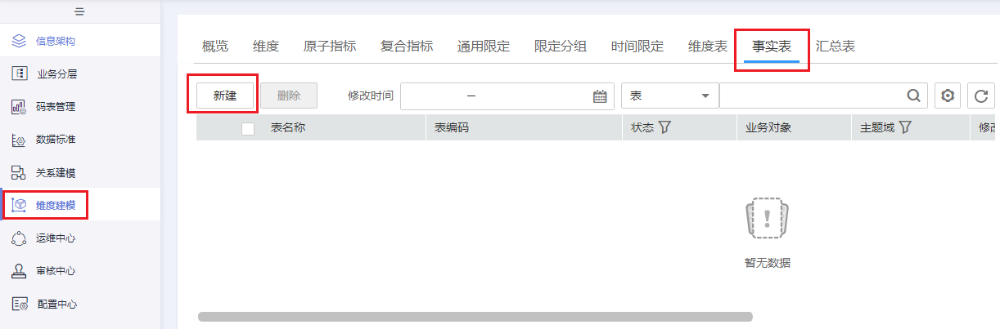
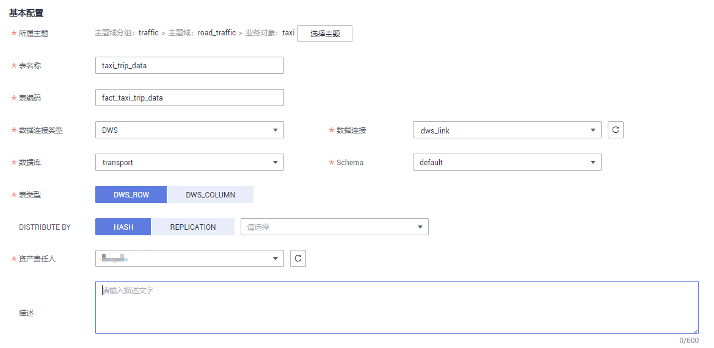
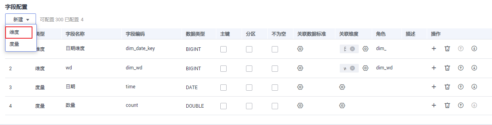
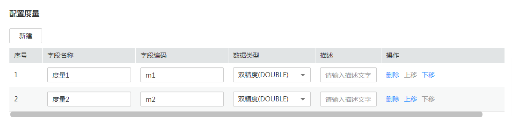

# 新建事实表

归属于某个业务过程的事实逻辑表，可以丰富具体业务过程所对应事务的详细信息。创建事实逻辑表即完成公共的事务明细数据沉淀，从而便于提取业务中事务相关的明细数据。

## 新建事实表并发布

1.  [登录DAYU控制台](https://console.huaweicloud.com/dayu/)，找到所需要的DAYU实例，单击实例卡片上的“进入控制台”，进入概览页面。

    选择“空间管理”页签，完成工作空间的创建。

    在工作空间列表中，找到所需要的工作空间。

1.  单击相应工作空间的“规范设计“。

    系统跳转至规范设计页面。

1.  在规范设计页面，单击左侧导航树中的“维度建模“，选择“事实表“页签，然后单击“新建“按钮。

    **图 1**  事实表页面1  
    

2.  在“新建事实表“页面，完成如下配置：
    1.  设置“基本配置”参数：

        **图 2**  事实表基本配置  
        

        **表 1**  基本配置参数说明

        
        <table><thead align="left"><tr id="zh-cn_topic_0171848092_row4386133175415"><th class="cellrowborder" valign="top" width="18.7%" id="mcps1.2.3.1.1">
参数名称

        </th>
        <th class="cellrowborder" valign="top" width="81.3%" id="mcps1.2.3.1.2">
说明

        </th>
        </tr>
        </thead>
        <tbody><tr id="zh-cn_topic_0171848092_row15386173110547"><td class="cellrowborder" valign="top" width="18.7%" headers="mcps1.2.3.1.1 ">
业务分层

        </td>
        <td class="cellrowborder" valign="top" width="81.3%" headers="mcps1.2.3.1.2 ">
单击“选择分层”，选择事实表所属的主题域分组、主题域和业务对象。

        </td>
        </tr>
        <tr id="zh-cn_topic_0171848092_row113871731165418"><td class="cellrowborder" valign="top" width="18.7%" headers="mcps1.2.3.1.1 ">
表编码

        </td>
        <td class="cellrowborder" valign="top" width="81.3%" headers="mcps1.2.3.1.2 ">
只能以英文字母开头，支持英文字母、数字、下划线。

        </td>
        </tr>
        <tr id="zh-cn_topic_0171848092_row138783110549"><td class="cellrowborder" valign="top" width="18.7%" headers="mcps1.2.3.1.1 ">
表名称

        </td>
        <td class="cellrowborder" valign="top" width="81.3%" headers="mcps1.2.3.1.2 ">
只能以中文或英文字母开头，支持中文、英文字母、数字和下划线。

        </td>
        </tr>
        <tr id="zh-cn_topic_0171848092_row23870319547"><td class="cellrowborder" valign="top" width="18.7%" headers="mcps1.2.3.1.1 ">
数据连接类型

        </td>
        <td class="cellrowborder" valign="top" width="81.3%" headers="mcps1.2.3.1.2 ">
根据下拉框选择对应的数据连接类型。

        </td>
        </tr>
        <tr id="zh-cn_topic_0171848092_row10387163112546"><td class="cellrowborder" valign="top" width="18.7%" headers="mcps1.2.3.1.1 ">
数据连接

        </td>
        <td class="cellrowborder" valign="top" width="81.3%" headers="mcps1.2.3.1.2 ">
根据下拉框选择对应的数据连接。

        </td>
        </tr>
        <tr id="zh-cn_topic_0171848092_row8387133155412"><td class="cellrowborder" valign="top" width="18.7%" headers="mcps1.2.3.1.1 ">
数据库

        </td>
        <td class="cellrowborder" valign="top" width="81.3%" headers="mcps1.2.3.1.2 ">
根据下拉框选择对应的数据库。

        </td>
        </tr>
        <tr id="zh-cn_topic_0171848092_row1438833165414"><td class="cellrowborder" valign="top" width="18.7%" headers="mcps1.2.3.1.1 ">
资产责任人

        </td>
        <td class="cellrowborder" valign="top" width="81.3%" headers="mcps1.2.3.1.2 ">
根据下拉框选择对应的资产责任人。

        </td>
        </tr>
        <tr id="zh-cn_topic_0171848092_row938816316549"><td class="cellrowborder" valign="top" width="18.7%" headers="mcps1.2.3.1.1 ">
描述

        </td>
        <td class="cellrowborder" valign="top" width="81.3%" headers="mcps1.2.3.1.2 ">
描述信息。支持的长度0~600字符。

        </td>
        </tr>
        </tbody>
        </table>

    2.  在“配置维度“区域，单击“添加“可选择一个或多个已创建的维度，单击“确定”后，会将维度的主键字段添加到列表中。

        单击“上移”或“下移”可以调整维度的顺序。

        **图 3**  配置维度  
        

        **表 2**  维度

        
        <table><thead align="left"><tr id="zh-cn_topic_0171848092_row18554103410121"><th class="cellrowborder" valign="top" width="15.76%" id="mcps1.2.3.1.1">
参数名称

        </th>
        <th class="cellrowborder" valign="top" width="84.24000000000001%" id="mcps1.2.3.1.2">
说明

        </th>
        </tr>
        </thead>
        <tbody><tr id="zh-cn_topic_0171848092_row85551234191219"><td class="cellrowborder" valign="top" width="15.76%" headers="mcps1.2.3.1.1 ">
字段名称

        </td>
        <td class="cellrowborder" valign="top" width="84.24000000000001%" headers="mcps1.2.3.1.2 ">
自动显示所添加的维度的主键名称，一般不需要修改。

        
只能以中文或英文字母开头，支持中文、英文字母、数字和下划线。

        </td>
        </tr>
        <tr id="zh-cn_topic_0171848092_row2055533471216"><td class="cellrowborder" valign="top" width="15.76%" headers="mcps1.2.3.1.1 ">
字段编码

        </td>
        <td class="cellrowborder" valign="top" width="84.24000000000001%" headers="mcps1.2.3.1.2 ">
自动显示所添加的维度的主键名称，一般不需要修改。

        
只能以英文字母开头，支持英文字母、数字、下划线。

        </td>
        </tr>
        <tr id="zh-cn_topic_0171848092_row165551234121216"><td class="cellrowborder" valign="top" width="15.76%" headers="mcps1.2.3.1.1 ">
数据类型

        </td>
        <td class="cellrowborder" valign="top" width="84.24000000000001%" headers="mcps1.2.3.1.2 ">
显示该维度的数据类型。

        </td>
        </tr>
        <tr id="zh-cn_topic_0171848092_row1555834101218"><td class="cellrowborder" valign="top" width="15.76%" headers="mcps1.2.3.1.1 ">
是否主键

        </td>
        <td class="cellrowborder" valign="top" width="84.24000000000001%" headers="mcps1.2.3.1.2 ">
选中时表示该字段为主键。

        </td>
        </tr>
        <tr id="zh-cn_topic_0171848092_row721214791814"><td class="cellrowborder" valign="top" width="15.76%" headers="mcps1.2.3.1.1 ">
是否分区

        </td>
        <td class="cellrowborder" valign="top" width="84.24000000000001%" headers="mcps1.2.3.1.2 ">
选中时表示该字段为分区字段。

        </td>
        </tr>
        <tr id="zh-cn_topic_0171848092_row16980105712157"><td class="cellrowborder" valign="top" width="15.76%" headers="mcps1.2.3.1.1 ">
关联维度

        </td>
        <td class="cellrowborder" valign="top" width="84.24000000000001%" headers="mcps1.2.3.1.2 ">
显示当前关联的维度名称。单击“更换”可以更换关联的维度。

        </td>
        </tr>
        <tr id="zh-cn_topic_0171848092_row164191461510"><td class="cellrowborder" valign="top" width="15.76%" headers="mcps1.2.3.1.1 ">
描述

        </td>
        <td class="cellrowborder" valign="top" width="84.24000000000001%" headers="mcps1.2.3.1.2 ">
描述信息。

        </td>
        </tr>
        </tbody>
        </table>

    3.  在“配置事实表属性“区域，单击“新建“添加事实属性。

        可添加多个事实属性，对于在“配置维度”中已经添加过的字段，可以不用再重复添加到事实属性中。

        **图 4**  配置事实属性  
        

        **表 3**  事实属性参数

        
        <table><thead align="left"><tr id="zh-cn_topic_0171848092_row1732122114214"><th class="cellrowborder" valign="top" width="15.76%" id="mcps1.2.3.1.1">
参数名称

        </th>
        <th class="cellrowborder" valign="top" width="84.24000000000001%" id="mcps1.2.3.1.2">
说明

        </th>
        </tr>
        </thead>
        <tbody><tr id="zh-cn_topic_0171848092_row1332222132111"><td class="cellrowborder" valign="top" width="15.76%" headers="mcps1.2.3.1.1 ">
字段名称

        </td>
        <td class="cellrowborder" valign="top" width="84.24000000000001%" headers="mcps1.2.3.1.2 ">
只能以中文或英文字母开头，支持中文、英文字母、数字和下划线。

        </td>
        </tr>
        <tr id="zh-cn_topic_0171848092_row1132216217214"><td class="cellrowborder" valign="top" width="15.76%" headers="mcps1.2.3.1.1 ">
字段编码

        </td>
        <td class="cellrowborder" valign="top" width="84.24000000000001%" headers="mcps1.2.3.1.2 ">
只能以英文字母开头，支持英文字母、数字、下划线。

        </td>
        </tr>
        <tr id="zh-cn_topic_0171848092_row7322142172113"><td class="cellrowborder" valign="top" width="15.76%" headers="mcps1.2.3.1.1 ">
数据类型

        </td>
        <td class="cellrowborder" valign="top" width="84.24000000000001%" headers="mcps1.2.3.1.2 ">
显示该维度的数据类型。

        </td>
        </tr>
        <tr id="zh-cn_topic_0171848092_row4322202117216"><td class="cellrowborder" valign="top" width="15.76%" headers="mcps1.2.3.1.1 ">
是否主键

        </td>
        <td class="cellrowborder" valign="top" width="84.24000000000001%" headers="mcps1.2.3.1.2 ">
选中时为主键。

        </td>
        </tr>
        <tr id="zh-cn_topic_0171848092_row133221321182116"><td class="cellrowborder" valign="top" width="15.76%" headers="mcps1.2.3.1.1 ">
是否分区

        </td>
        <td class="cellrowborder" valign="top" width="84.24000000000001%" headers="mcps1.2.3.1.2 ">
选中时为分区字段。

        </td>
        </tr>
        <tr id="zh-cn_topic_0171848092_row8322122112116"><td class="cellrowborder" valign="top" width="15.76%" headers="mcps1.2.3.1.1 ">
描述

        </td>
        <td class="cellrowborder" valign="top" width="84.24000000000001%" headers="mcps1.2.3.1.2 ">
描述信息。

        </td>
        </tr>
        </tbody>
        </table>

    4.  在“配置度量“区域，单击“新建“添加度量。

        **图 5**  配置度量  
        

        **表 4**  度量参数

        
        <table><thead align="left"><tr id="zh-cn_topic_0171848092_row1382575573816"><th class="cellrowborder" valign="top" width="15.76%" id="mcps1.2.3.1.1">
参数名称

        </th>
        <th class="cellrowborder" valign="top" width="84.24000000000001%" id="mcps1.2.3.1.2">
说明

        </th>
        </tr>
        </thead>
        <tbody><tr id="zh-cn_topic_0171848092_row482585511381"><td class="cellrowborder" valign="top" width="15.76%" headers="mcps1.2.3.1.1 ">
字段名称

        </td>
        <td class="cellrowborder" valign="top" width="84.24000000000001%" headers="mcps1.2.3.1.2 ">
只能以中文或英文字母开头，支持中文、英文字母、数字和下划线。

        </td>
        </tr>
        <tr id="zh-cn_topic_0171848092_row682513552389"><td class="cellrowborder" valign="top" width="15.76%" headers="mcps1.2.3.1.1 ">
字段编码

        </td>
        <td class="cellrowborder" valign="top" width="84.24000000000001%" headers="mcps1.2.3.1.2 ">
只能以英文字母开头，支持英文字母、数字、下划线。

        </td>
        </tr>
        <tr id="zh-cn_topic_0171848092_row2825135517387"><td class="cellrowborder" valign="top" width="15.76%" headers="mcps1.2.3.1.1 ">
数据类型

        </td>
        <td class="cellrowborder" valign="top" width="84.24000000000001%" headers="mcps1.2.3.1.2 ">
显示该维度的数据类型。

        </td>
        </tr>
        <tr id="zh-cn_topic_0171848092_row082665512389"><td class="cellrowborder" valign="top" width="15.76%" headers="mcps1.2.3.1.1 ">
描述

        </td>
        <td class="cellrowborder" valign="top" width="84.24000000000001%" headers="mcps1.2.3.1.2 ">
描述信息。

        </td>
        </tr>
        </tbody>
        </table>

3.  单击“发布“，提交事实表的发布审核。
4.  等待审核人员审核事实表。

    审核通过后，事实表在数据库中就创建好了。

5.  返回“维度建模 \> 事实表“页面，在列表中找到刚发布的事实表，单击“更多 \> 发布日志“查看发布日志。

    表发布并通过审核后，系统会进行创建表、同步数据资产操作，通过“发布日志“可以查看流程处理的日志详情，同时可以查看操作是否成功以及处理失败的原因。

    -   如果“发布日志“显示成功，无错误日志，说明表在数据库中创建成功。
    -   如果“发布日志”中出现错误日志，说明表创建失败。

        请根据错误日志定位错误原因，问题解决后再单击“发布日志”对话框中的“重新同步“再次下发同步命令。在处理过程中，如果您有任何问题，请联系技术支持人员。

## 管理事实表

事实表创建好之后，进入规范设计的“维度建模 \> 事实表“页面，您可以对事实表进行编辑、发布、下线、查看发布日志或删除操作。

**图 6**  事实表页面2  

-   **编辑事实表**
    1.  在事实表列表中，找到需要编辑的事实表，单击“编辑“，进入编辑事实表页面。
    2.  根据实际需要编辑相关内容。
    3.  单击“保存“，保存设置的信息；单击“发布“，发布设置的信息。

-   **发布事实表**
    1.  在需要发布的事实表右侧，单击“发布“，弹出“提交发布“对话框。
    2.  在下拉菜单中选择审核人。
    3.  单击“确定提交“。

-   **查看发布日志**
    1.  在列表中找到所需要的事实表，在右侧单击“更多 \> 发布日志“，弹出“发布日志“对话框。
    2.  如果“发布日志”中有错误日志，说明发布失败。您可以单击“重新同步“同步该事实表的元数据信息到DAYU的其他模块中。
    3.  完成后，单击“取消“关闭窗口。

-   **下线事实表**
    1.  在需要下线的事实表右侧，选择“更多 \> 下线“，系统弹出“提交下线“对话框。
    2.  在下拉菜单中选择审核人。
    3.  单击“确认提交“。

        > **说明：**   
        >-   下线及删除事实逻辑表的前提是无依赖引用，如使用事实表定义维度等。  

-   **删除事实表**
    1.  勾选需要删除的事实表行，单击左上角“删除“，系统弹出“删除“对话框。
    2.  单击“确定“。

