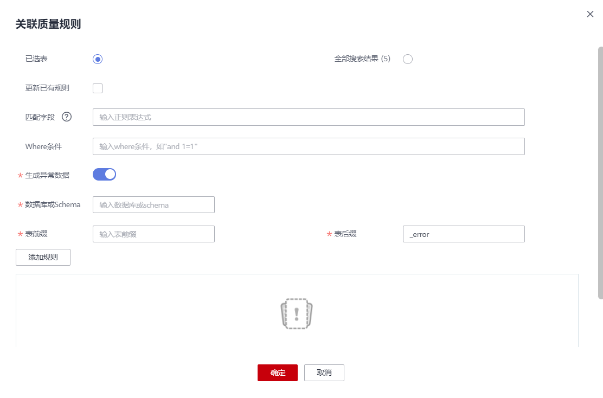
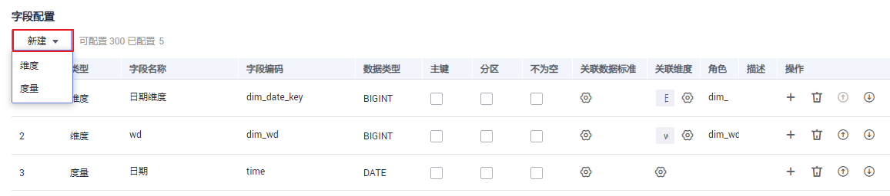
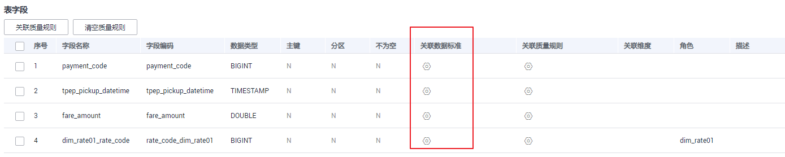
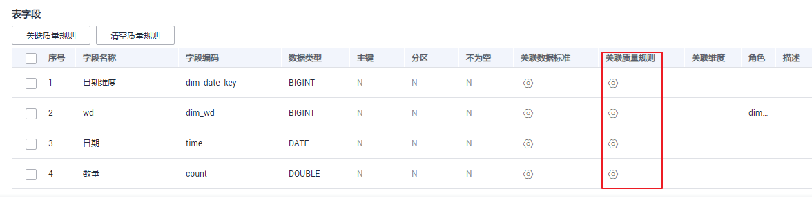
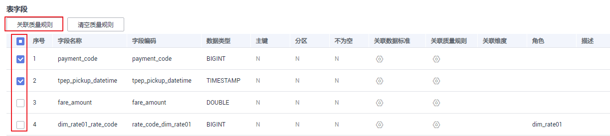
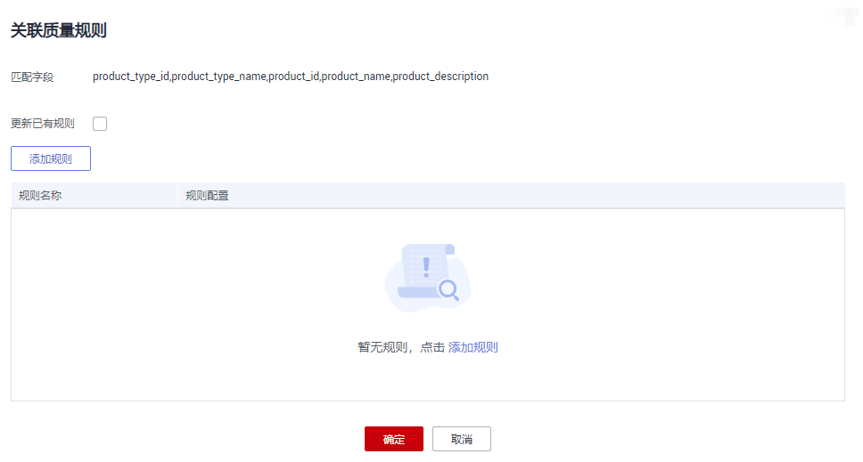

# 新建事实表

归属于某个业务过程的事实逻辑表，可以丰富具体业务过程所对应事务的详细信息。创建事实逻辑表即完成公共的事务明细数据沉淀，从而便于提取业务中事务相关的明细数据。

## 新建事实表并发布

1.  在DGC控制台首页，选择对应工作空间的“规范设计“模块，进入规范设计页面。

    **图 1**  选择规范设计  
    

2.  在规范设计控制台，单击左侧导航树中的“维度建模“，选择“事实表“页签。
3.  在左侧主题树中选中一个主题，然后单击“新建“按钮。
4.  在“新建事实表“页面，完成如下配置：
    1.  设置“基本配置”参数：

        **图 2**  事实表基本配置  
        

        **表 1**  基本配置参数说明

        
        <table><thead align="left"><tr id="zh-cn_topic_0171848092_row4386133175415"><th class="cellrowborder" valign="top" width="18.7%" id="mcps1.2.3.1.1">
参数名称

        </th>
        <th class="cellrowborder" valign="top" width="81.3%" id="mcps1.2.3.1.2">
说明

        </th>
        </tr>
        </thead>
        <tbody><tr id="zh-cn_topic_0171848092_row15386173110547"><td class="cellrowborder" valign="top" width="18.7%" headers="mcps1.2.3.1.1 ">
所属主题

        </td>
        <td class="cellrowborder" valign="top" width="81.3%" headers="mcps1.2.3.1.2 ">
单击“选择主题”，选择表所属的主题域分组、主题域和业务对象。

        </td>
        </tr>
        <tr id="zh-cn_topic_0171848092_row138783110549"><td class="cellrowborder" valign="top" width="18.7%" headers="mcps1.2.3.1.1 ">
表名称

        </td>
        <td class="cellrowborder" valign="top" width="81.3%" headers="mcps1.2.3.1.2 ">
只能包含中文、英文字母、数字、左右括号、中划线和下划线，且以中文和英文字母开头。

        </td>
        </tr>
        <tr id="row51227251758"><td class="cellrowborder" valign="top" width="18.7%" headers="mcps1.2.3.1.1 ">
表编码

        </td>
        <td class="cellrowborder" valign="top" width="81.3%" headers="mcps1.2.3.1.2 ">
只能以英文字母开头，支持英文字母、数字、下划线。

        </td>
        </tr>
        <tr id="zh-cn_topic_0171848092_row23870319547"><td class="cellrowborder" valign="top" width="18.7%" headers="mcps1.2.3.1.1 ">
数据连接类型

        </td>
        <td class="cellrowborder" valign="top" width="81.3%" headers="mcps1.2.3.1.2 ">
在下拉框中选择对应的数据连接类型。

        </td>
        </tr>
        <tr id="zh-cn_topic_0171848092_row10387163112546"><td class="cellrowborder" valign="top" width="18.7%" headers="mcps1.2.3.1.1 ">
数据连接

        </td>
        <td class="cellrowborder" valign="top" width="81.3%" headers="mcps1.2.3.1.2 ">
在下拉框中选择对应的数据连接。维度建模建议使用统一的数据连接。

        </td>
        </tr>
        <tr id="zh-cn_topic_0171848092_row8387133155412"><td class="cellrowborder" valign="top" width="18.7%" headers="mcps1.2.3.1.1 ">
数据库

        </td>
        <td class="cellrowborder" valign="top" width="81.3%" headers="mcps1.2.3.1.2 ">
在下拉框中选择对应的数据库。

        </td>
        </tr>
        <tr id="row2917135151420"><td class="cellrowborder" valign="top" width="18.7%" headers="mcps1.2.3.1.1 ">
队列

        </td>
        <td class="cellrowborder" valign="top" width="81.3%" headers="mcps1.2.3.1.2 ">
DLI队列。该参数仅DLI连接类型有效。

        </td>
        </tr>
        <tr id="row10926123021616"><td class="cellrowborder" valign="top" width="18.7%" headers="mcps1.2.3.1.1 ">
schema

        </td>
        <td class="cellrowborder" valign="top" width="81.3%" headers="mcps1.2.3.1.2 ">
DWS或POSTGRESQL的模式。该参数在DWS或POSTGRESQL连接类型有效。

        </td>
        </tr>
        <tr id="row146063812165"><td class="cellrowborder" valign="top" width="18.7%" headers="mcps1.2.3.1.1 ">
表类型

        </td>
        <td class="cellrowborder" valign="top" width="81.3%" headers="mcps1.2.3.1.2 ">
DWS连接类型的表支持以下表类型：

        <ul id="ul44087216447"><li>DWS_ROW：行存表。行存储是指将表按行存储到硬盘分区上。</li><li>DWS_COLUMN：列存表。列存储是指将表按列存储到硬盘分区上。</li></ul>
        
MRS_HIVE仅支持HIVE_TABLE类型。

        </td>
        </tr>
        <tr id="row16203123421614"><td class="cellrowborder" valign="top" width="18.7%" headers="mcps1.2.3.1.1 ">
DISTRIBUTE BY

        </td>
        <td class="cellrowborder" valign="top" width="81.3%" headers="mcps1.2.3.1.2 ">
该参数仅DWS连接类型有效，为非必选项。您需要先添加表字段，才能在此下拉列表中选择某一个表字段作为DISTRIBUTE BY字段，可选取多个字段。

        
DWS表当前支持复制（Replication）和散列（Hash）两种分布策略。

        <ul id="ul4948144213"><li><strong id="b1868451921417">REPLICATION</strong>：在每一个DN节点上存储一份全量表数据。这种存储方式的优点是每个DN上都有此表的全量数据，在join操作中可以避免数据重分布操作，从而减小网络开销；缺点是每个DN都保留了表的完整数据，造成数据的冗余。一般情况下只有较小的维度表才会定义为Replication表。</li><li><strong id="b73401025161410">HASH</strong>：采用这种分布方式，需要为用户表指定一个分布列（distribute key）。当插入一条记录时，系统会根据分布列的值进行hash运算后，将数据存储在对应的DN中。对于Hash分布表，在读/写数据时可以利用各个节点的IO资源，大大提升表的读/写速度。一般情况下大表（1000000条记录以上）定义为Hash表。</li></ul>
        </td>
        </tr>
        <tr id="zh-cn_topic_0171848092_row1438833165414"><td class="cellrowborder" valign="top" width="18.7%" headers="mcps1.2.3.1.1 ">
资产责任人

        </td>
        <td class="cellrowborder" valign="top" width="81.3%" headers="mcps1.2.3.1.2 ">
根据下拉框选择对应的资产责任人。只有工作空间管理员或开发者、运维者角色的用户才可以设置为责任人。

        </td>
        </tr>
        <tr id="zh-cn_topic_0171848092_row938816316549"><td class="cellrowborder" valign="top" width="18.7%" headers="mcps1.2.3.1.1 ">
描述

        </td>
        <td class="cellrowborder" valign="top" width="81.3%" headers="mcps1.2.3.1.2 ">
描述信息。支持的长度0~600字符。

        </td>
        </tr>
        </tbody>
        </table>

    2.  在“字段配置“区域，单击“新建“创建维度或度量，选择维度可勾选一个或多个已创建的维度，单击“确定”后，会将维度的代理键字段添加到列表中。

        单击“上移”或“下移”可以调整维度的顺序。

        **图 3**  配置维度  
        

        **表 2**  字段配置

        
        <table><thead align="left"><tr id="zh-cn_topic_0171848092_row18554103410121"><th class="cellrowborder" valign="top" width="15.76%" id="mcps1.2.3.1.1">
参数名称

        </th>
        <th class="cellrowborder" valign="top" width="84.24000000000001%" id="mcps1.2.3.1.2">
说明

        </th>
        </tr>
        </thead>
        <tbody><tr id="zh-cn_topic_0171848092_row85551234191219"><td class="cellrowborder" valign="top" width="15.76%" headers="mcps1.2.3.1.1 ">
字段名称

        </td>
        <td class="cellrowborder" valign="top" width="84.24000000000001%" headers="mcps1.2.3.1.2 ">
自动显示所添加的维度的代理键名称，一般不需要修改。

        
只能包含中文、英文字母、数字、左右括号、中划线和下划线，且以中文和英文字母开头。

        </td>
        </tr>
        <tr id="zh-cn_topic_0171848092_row2055533471216"><td class="cellrowborder" valign="top" width="15.76%" headers="mcps1.2.3.1.1 ">
字段编码

        </td>
        <td class="cellrowborder" valign="top" width="84.24000000000001%" headers="mcps1.2.3.1.2 ">
自动显示所添加的维度的代理键名称，一般不需要修改。

        
只能以英文字母开头，支持英文字母、数字、下划线。

        </td>
        </tr>
        <tr id="zh-cn_topic_0171848092_row165551234121216"><td class="cellrowborder" valign="top" width="15.76%" headers="mcps1.2.3.1.1 ">
数据类型

        </td>
        <td class="cellrowborder" valign="top" width="84.24000000000001%" headers="mcps1.2.3.1.2 ">
显示该维度或度量的数据类型。

        </td>
        </tr>
        <tr id="zh-cn_topic_0171848092_row1555834101218"><td class="cellrowborder" valign="top" width="15.76%" headers="mcps1.2.3.1.1 ">
主键

        </td>
        <td class="cellrowborder" valign="top" width="84.24000000000001%" headers="mcps1.2.3.1.2 ">
选中时表示该字段为主键。

        </td>
        </tr>
        <tr id="zh-cn_topic_0171848092_row721214791814"><td class="cellrowborder" valign="top" width="15.76%" headers="mcps1.2.3.1.1 ">
分区

        </td>
        <td class="cellrowborder" valign="top" width="84.24000000000001%" headers="mcps1.2.3.1.2 ">
选中时表示该字段为分区字段。

        </td>
        </tr>
        <tr id="row10141105445010"><td class="cellrowborder" valign="top" width="15.76%" headers="mcps1.2.3.1.1 ">
不为空

        </td>
        <td class="cellrowborder" valign="top" width="84.24000000000001%" headers="mcps1.2.3.1.2 ">
是否限制该字段不为空。

        </td>
        </tr>
        <tr id="row6927101412363"><td class="cellrowborder" valign="top" width="15.76%" headers="mcps1.2.3.1.1 ">
关联数据标准

        </td>
        <td class="cellrowborder" valign="top" width="84.24000000000001%" headers="mcps1.2.3.1.2 ">
如果您已创建数据标准，在“数据标准”列，单击按钮可以选择一个数据标准与字段相关联。在“配置中心 &gt; 功能配置”页面中的“模型设计业务流程步骤 &gt; 创建质量作业”勾选的情况下，将字段关联数据标准后，表发布上线后，就会自动生成一个质量作业，每个关联了数据标准的字段会生成一个质量规则，基于数据标准对字段进行质量监控，您可以前往DGC数据质量模块的“质量作业”页面进行查看。

        
如果您还未创建数据标准，请参见<a href="新建数据标准.md">新建数据标准</a>进行创建。

        </td>
        </tr>
        <tr id="zh-cn_topic_0171848092_row16980105712157"><td class="cellrowborder" valign="top" width="15.76%" headers="mcps1.2.3.1.1 ">
关联维度

        </td>
        <td class="cellrowborder" valign="top" width="84.24000000000001%" headers="mcps1.2.3.1.2 ">
显示当前关联的维度名称。单击可以更换关联的维度。只有维度属性的事实表需要绑定维度，度量属性的事实表不需要进行此操作。

        </td>
        </tr>
        <tr id="row2575193263620"><td class="cellrowborder" valign="top" width="15.76%" headers="mcps1.2.3.1.1 ">
角色

        </td>
        <td class="cellrowborder" valign="top" width="84.24000000000001%" headers="mcps1.2.3.1.2 ">
当同一个维度被添加多次时，需要设置不同的角色来加以区分。例如，<a href="#zh-cn_topic_0171848092_fig1844217716541">图3</a>中所示的第3、4个字段。

        </td>
        </tr>
        <tr id="zh-cn_topic_0171848092_row164191461510"><td class="cellrowborder" valign="top" width="15.76%" headers="mcps1.2.3.1.1 ">
描述

        </td>
        <td class="cellrowborder" valign="top" width="84.24000000000001%" headers="mcps1.2.3.1.2 ">
描述信息。

        </td>
        </tr>
        </tbody>
        </table>

    3.  在“字段配置“区域，单击“新建“添加度量。

        **图 4**  配置度量  
        

        **表 3**  度量参数

        
        <table><thead align="left"><tr id="zh-cn_topic_0171848092_row1382575573816"><th class="cellrowborder" valign="top" width="15.76%" id="mcps1.2.3.1.1">
参数名称

        </th>
        <th class="cellrowborder" valign="top" width="84.24000000000001%" id="mcps1.2.3.1.2">
说明

        </th>
        </tr>
        </thead>
        <tbody><tr id="zh-cn_topic_0171848092_row482585511381"><td class="cellrowborder" valign="top" width="15.76%" headers="mcps1.2.3.1.1 ">
字段名称

        </td>
        <td class="cellrowborder" valign="top" width="84.24000000000001%" headers="mcps1.2.3.1.2 ">
只能包含中文、英文字母、数字、左右括号、中划线和下划线，且以中文和英文字母开头。

        </td>
        </tr>
        <tr id="zh-cn_topic_0171848092_row682513552389"><td class="cellrowborder" valign="top" width="15.76%" headers="mcps1.2.3.1.1 ">
字段编码

        </td>
        <td class="cellrowborder" valign="top" width="84.24000000000001%" headers="mcps1.2.3.1.2 ">
只能以英文字母开头，支持英文字母、数字、下划线。

        </td>
        </tr>
        <tr id="zh-cn_topic_0171848092_row2825135517387"><td class="cellrowborder" valign="top" width="15.76%" headers="mcps1.2.3.1.1 ">
数据类型

        </td>
        <td class="cellrowborder" valign="top" width="84.24000000000001%" headers="mcps1.2.3.1.2 ">
设置该字段的数据类型。如果在下拉列表中未找到所需要的数据类型，您可以参考<a href="配置中心.md#section06381835171">字段类型管理</a>添加数据类型。

        </td>
        </tr>
        <tr id="row1286604164912"><td class="cellrowborder" valign="top" width="15.76%" headers="mcps1.2.3.1.1 ">
关联数据标准

        </td>
        <td class="cellrowborder" valign="top" width="84.24000000000001%" headers="mcps1.2.3.1.2 ">
如果您已创建数据标准，在“数据标准”列，单击按钮可以选择一个数据标准与字段相关联。在“配置中心 &gt; 功能配置”页面中的“模型设计业务流程步骤 &gt; 创建质量作业”勾选的情况下，将字段关联数据标准后，表发布上线后，就会自动生成一个质量作业，每个关联了数据标准的字段会生成一个质量规则，基于数据标准对字段进行质量监控，您可以前往DGC数据质量模块的“质量作业”页面进行查看。

        
如果您还未创建数据标准，请参见<a href="新建数据标准.md">新建数据标准</a>进行创建。

        </td>
        </tr>
        <tr id="row131235401715"><td class="cellrowborder" valign="top" width="15.76%" headers="mcps1.2.3.1.1 ">
关联维度

        </td>
        <td class="cellrowborder" valign="top" width="84.24000000000001%" headers="mcps1.2.3.1.2 ">
显示当前关联的维度名称。单击可以选择关联的维度。

        </td>
        </tr>
        <tr id="zh-cn_topic_0171848092_row082665512389"><td class="cellrowborder" valign="top" width="15.76%" headers="mcps1.2.3.1.1 ">
描述

        </td>
        <td class="cellrowborder" valign="top" width="84.24000000000001%" headers="mcps1.2.3.1.2 ">
描述信息。

        </td>
        </tr>
        </tbody>
        </table>

5.  单击“发布“，提交事实表的发布审核。
6.  等待审核人员审核事实表。

    审核通过后，事实表就会在数据库中自动创建。

7.  返回“维度建模 \> 事实表“页面，在列表中找到刚发布的事实表，在“同步状态“一列中可以查看事实表的同步状态。
    -   如果同步状态均显示成功，则说明事实表发布成功，事实表在数据库中已创建成功。
    -   如果同步状态中存在失败，可单击该事实表所在行的“更多 \> 发布历史“，然后在展开的页面中进入“发布日志”页签查看日志。请根据错误日志定位失败原因，问题解决后，您可以在事实表页面勾选该事实表，再单击列表上方的“更多 \> 同步“尝试重新同步。如果问题仍未能解决，请联系技术支持人员协助处理。

## 管理事实表

事实表创建好之后，进入规范设计的“维度建模 \> 事实表“页面，您可以对事实表进行编辑、发布、下线、查看发布历史或删除操作。

**图 5**  事实表管理  

-   **编辑事实表**
    1.  在事实表列表中，找到需要编辑的事实表，单击“编辑“，进入编辑事实表页面。
    2.  根据实际需要编辑相关内容。
    3.  单击“保存“，保存设置的信息；单击“发布“，发布设置的信息。

-   **发布事实表**
    1.  在事实表列表中，勾选需要发布的事实表，单击“发布“按钮，弹出“批量发布“对话框。
    2.  在下拉菜单中选择审核人。
    3.  单击“确认提交“。

-   **查看发布历史**
    1.  在事实表列表中，找到所需要的事实表，在右侧单击“更多 \> 发布历史“，将显示“发布历史“页面。
    2.  在“发布历史”中，您可以查看事实表的发布历史、版本对比信息以及发布日志。

        如果“发布日志”中有错误日志，说明发布失败。您可以单击“重新同步“将表同步到DGC的其他模块中。

-   **关联质量规则**
    1.  在事实表列表中，勾选所需要的关联质量规则事实表，在上方单击“关联质量规则“，弹出“关联质量规则“对话框。
    2.  在“关联质量规则“对话框中，您可以批量给事实表的字段添加规则并关联到字段。
    3.  单击“确定“。

-   **预览SQL**
    1.  在事实表列表中，找到所需要的事实表，在右侧单击“更多 \> 预览SQL“，弹出“预览SQL“对话框。
    2.  在“预览SQL”中，您可以查看SQL语句，也可以复制SQL。

-   **下线事实表**
    1.  在事实表列表中，勾选需要下线的事实表，单击“下线“，系统弹出“批量下线“对话框。
    2.  在下拉菜单中选择审核人。
    3.  单击“确认提交“。

        > **说明：** 
        >-   “下线“及“删除“事实逻辑表的前提是无依赖引用，例如事实表未被原子指标等使用时，才能进行删除操作。

-   **删除事实表**

    如果您不再需要某一个事实表，您可以将它删除。当事实表处于待发布、已发布或待下线状态时，无法删除。

    1.  在事实表列表中，勾选需要删除的事实表，在列表上方选择“更多 \> 删除“，系统弹出“删除“对话框。
    2.  单击“是“。

## 事实表关联质量规则

1.  在规范设计控制台，选择“模型设计 \> 维度建模“，进入维度建模页面。
2.  单击“事实表“页签，进入事实表页面。
3.  在事实表列表中，勾选需要关联质量规则的事实表。单击“关联质量规则“。

    **图 6**  关联事实表质量规则  
    

4.  在弹出的页面中配置关联质量规则参数。配置完成单击确定。

    -   **更新已有规则**：若勾选此项，新添加的规则会覆盖旧规则。
    -   **匹配字段**：此参数默认应用于所有字段，依据用户输入的正则表达式对字段进行过滤。
    -   **Where条件**：可依据用户输入的where条件对字段进行过滤。
    -   **生成异常数据**：勾选此项，表示异常数据讲按照配置的参数存储到规定的库中。
    -   **数据库或Schema**：勾选“生成异常数据“时显示此项，表示存储异常数据的数据库或Schema
    -   **表前缀**：勾选“生成异常数据“时显示此项，表示存储异常数据的表的前缀。
    -   **表后缀**：勾选“生成异常数据“时显示此项，表示存储异常数据的表的前缀。
    -   **添加规则**：单击“添加规则”进行设置。例如，添加名称为“字段唯一值”规则，选中该规则后单击“确定“，在“告警条件“中输入告警条件表达式，然后按照此方法添加其他规则后，单击“确定“。
    -   告警条件表达式，由告警参数和逻辑运算符组成。在质量作业运行时，系统将计算出告警条件表达式的结果，并根据表达式的结果是否为真来判断是否触发告警。如果表达式的结果为真则触发质量告警，结果为假则不触发质量告警。在此处的“关联质量规则“对话框中，每个质量规则的“告警参数“以按钮形式列出。

    **图 7**  事实表关联质量规则  
    

## 事实表新建字段

1.  在规范设计控制台，选择“模型设计 \> 维度建模“，进入维度建模页面。
2.  单击“事实表“页签，进入事实表页面。
3.  在事实表列表中，查找需要新建字段的表名称，单击其“编辑“，进入编辑页。
4.  单击字段配置处的新建，在展开的下拉框选择新建字段类型，并配置相关参数。

    **图 8**  新建字段  
    

5.  配置完成后，单击“确定“，完成事实表新建字段。

## 事实表字段关联数据标准

1.  在规范设计控制台，选择“模型设计 \> 维度建模“，进入维度建模页面。
2.  单击“事实表“页签，进入事实表页面。
3.  在事实表列表中，单击需要关联数据标准的事实表名称。
4.  在事实表的详情页的表字段列表中，查找需要关联数据标准的字段，单击其所属的，配置单个表字段关联数据标准。数据标准的来源请参考[新建数据标准](新建数据标准.md#zh-cn_topic_0189641496_section181715220144)

    **图 9**  事实表字段关联数据标准  
    

5.  配置完成后，单击“确定“，完成事实表字段关联数据标准。

    **图 10**  设置数据标准  
    

## 事实表字段单个关联质量规则

1.  在规范设计控制台，选择“模型设计 \> 维度建模“，进入维度建模页面。
2.  单击“事实表“页签，进入事实表页面。
3.  在事实表列表中，单击需要关联质量规则的事实表名称。
4.  在事实表的详情页的表字段列表中，单击，配置单个表字段关联质量规则。

    **图 11**  事实表单个字段关联质量规则  
    

5.  配置完成后，单击“确定“，完成事实表字段关联质量规则。

    **图 12**  添加事实表质量规则  
    

## 事实表字段批量关联质量规则

1.  在规范设计控制台，选择“模型设计 \> 维度建模“，进入维度建模页面。
2.  单击“事实表“页签，进入事实表页面。
3.  在事实表列表中，单击需要关联质量规则的事实表名称。
4.  在事实表的详情页的表字段列表中，勾选需要关联质量规则的表字段，单击关联质量规则。

    **图 13**  事实表批量字段关联质量规则  
    

5.  在弹出的界面中添加规则，完成规则参数配置。

    **图 14**  规则配置页  
    

6.  配置完成后，单击“确定“，完成事实表字段批量关联质量规则。

