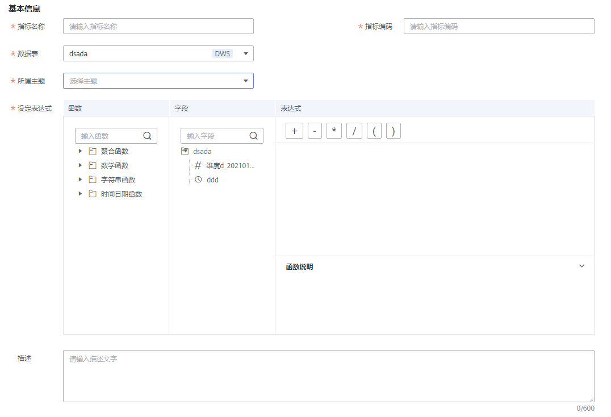

# 新建原子指标

原子指标是对指标统计逻辑、具体算法的一个抽象。为了从根源上解决定义、研发不一致的问题，指标定义明确设计统计逻辑（即计算逻辑），不需要ETL二次或者重复研发，从而提升了研发效率，也保证了统计结果的一致性。

## 背景信息

原子指标来源于事实表：

-   原子指标是为了构建应用统计分析所需的衍生指标，而定义的数据组件，因此只可以基于事实逻辑表明细数据表来创建。
-   衍生指标无来源表，它归属于每个组合成它的原始的原子指标的来源表。

原子指标与衍生指标的关系：

-   原子指标的计算逻辑修改生效后，会直接更新应用于相关的衍生指标。
-   原子指标删除英文名，需要校验下游是否有衍生指标使用，如果有，则无法删除。
-   目前原子指标在被下游使用的情况下，支持变更英文名。
-   原子指标的更改会影响下游衍生指标。

## 前提条件

-   您已创建并发布事实表，且事实表已通过审核，具体操作请参见[新建事实表](新建事实表.md)。

## 新建原子指标并发布

1.  在DGC控制台首页，选择对应工作空间的“规范设计“模块，进入规范设计页面。

    **图 1**  选择规范设计  
    

2.  在规范设计控制台，单击左侧导航树中的“技术指标“，选择“原子指标“页签进入原子指标页面。
3.  在左侧主题目录中选中一个主题，然后单击“新建“按钮，开始新建原子指标。
4.  在新建原子指标页面，参考[表1](#table1288254693916)配置参数，然后单击“发布“。

    **图 2**  新建原子指标  
    

    **表 1**  新建原子指标参数说明

    
    <table><thead align="left"><tr id="row1988254610393"><th class="cellrowborder" valign="top" width="15.83%" id="mcps1.2.3.1.1">
参数名称

    </th>
    <th class="cellrowborder" valign="top" width="84.17%" id="mcps1.2.3.1.2">
说明

    </th>
    </tr>
    </thead>
    <tbody><tr id="row1088204613913"><td class="cellrowborder" valign="top" width="15.83%" headers="mcps1.2.3.1.1 ">
指标名称

    </td>
    <td class="cellrowborder" valign="top" width="84.17%" headers="mcps1.2.3.1.2 ">
只能包含中文、英文字母、数字和下划线，且以中文或英文字母开头。

    </td>
    </tr>
    <tr id="row888224613394"><td class="cellrowborder" valign="top" width="15.83%" headers="mcps1.2.3.1.1 ">
指标编码

    </td>
    <td class="cellrowborder" valign="top" width="84.17%" headers="mcps1.2.3.1.2 ">
只能包含英文字母、数字和下划线，且以英文字母开头。

    </td>
    </tr>
    <tr id="row1834911317359"><td class="cellrowborder" valign="top" width="15.83%" headers="mcps1.2.3.1.1 ">
数据表

    </td>
    <td class="cellrowborder" valign="top" width="84.17%" headers="mcps1.2.3.1.2 ">
在下拉列表中选择一个已发布的事实表，如果表很多，您也可以在下拉列表的输入框中输入表名称搜索事实表。如果您尚未创建事实表，请参见<a href="新建事实表.md#zh-cn_topic_0171848092_section21241338088">新建事实表并发布</a>进行创建并发布。

    </td>
    </tr>
    <tr id="row16882204673910"><td class="cellrowborder" valign="top" width="15.83%" headers="mcps1.2.3.1.1 ">
所属主题

    </td>
    <td class="cellrowborder" valign="top" width="84.17%" headers="mcps1.2.3.1.2 ">
原子指标所属的主题信息。当“数据表”选择事实表后，将自动显示事实表所属的主题信息，您也可以单击“选择主题”进行选择。

    </td>
    </tr>
    <tr id="row118828460398"><td class="cellrowborder" valign="top" width="15.83%" headers="mcps1.2.3.1.1 ">
设定表达式

    </td>
    <td class="cellrowborder" valign="top" width="84.17%" headers="mcps1.2.3.1.2 ">
根据实际情况选择所需要的函数和字段，并设定表达式。

    </td>
    </tr>
    <tr id="row1371861512363"><td class="cellrowborder" valign="top" width="15.83%" headers="mcps1.2.3.1.1 ">
描述

    </td>
    <td class="cellrowborder" valign="top" width="84.17%" headers="mcps1.2.3.1.2 ">
描述信息。支持的长度为0~600个字符。

    </td>
    </tr>
    </tbody>
    </table>

5.  在弹出框中单击“确认提交”，提交审核。
6.  （可选）参考步骤[3](#li1888114467397)\~步骤[5](#li1188234618398)，完成其他原子指标的发布。
7.  等待审核人员审核。

    审核通过后，原子指标就创建好了。

## 管理原子指标

1.  在规范设计控制台，单击左侧导航树中的“技术指标“，选择“原子指标“页签，进入原子指标页面。

    **图 3**  管理原子指标  
    

2.  您可以根据实际需要选择如下操作。

    
    <table><thead align="left"><tr id="zh-cn_topic_0169427298_row167461051211"><th class="cellrowborder" valign="top" width="37.9%" id="mcps1.1.3.1.1">
当需要...

    </th>
    <th class="cellrowborder" valign="top" width="62.1%" id="mcps1.1.3.1.2">
则...

    </th>
    </tr>
    </thead>
    <tbody><tr id="zh-cn_topic_0169427298_row1674695011"><td class="cellrowborder" valign="top" width="37.9%" headers="mcps1.1.3.1.1 ">
新建

    </td>
    <td class="cellrowborder" valign="top" width="62.1%" headers="mcps1.1.3.1.2 ">
执行<a href="#zh-cn_topic_0169427298_section2012674313338">新建原子指标并发布</a>。

    </td>
    </tr>
    <tr id="zh-cn_topic_0169427298_row137468516113"><td class="cellrowborder" valign="top" width="37.9%" headers="mcps1.1.3.1.1 ">
编辑

    </td>
    <td class="cellrowborder" valign="top" width="62.1%" headers="mcps1.1.3.1.2 ">
执行<a href="#li2054015512277">3</a>。

    </td>
    </tr>
    <tr id="zh-cn_topic_0169427298_row1746651110"><td class="cellrowborder" valign="top" width="37.9%" headers="mcps1.1.3.1.1 ">
发布

    </td>
    <td class="cellrowborder" valign="top" width="62.1%" headers="mcps1.1.3.1.2 ">
执行<a href="#li1354145162717">4</a>。

    </td>
    </tr>
    <tr id="row2427104717564"><td class="cellrowborder" valign="top" width="37.9%" headers="mcps1.1.3.1.1 ">
查看发布历史

    </td>
    <td class="cellrowborder" valign="top" width="62.1%" headers="mcps1.1.3.1.2 ">
执行<a href="#li228701155712">5</a>。

    </td>
    </tr>
    <tr id="zh-cn_topic_0169427298_row195105118312"><td class="cellrowborder" valign="top" width="37.9%" headers="mcps1.1.3.1.1 ">
下线

    </td>
    <td class="cellrowborder" valign="top" width="62.1%" headers="mcps1.1.3.1.2 ">
执行<a href="#li65410542714">6</a>。

    </td>
    </tr>
    <tr id="zh-cn_topic_0169427298_row9597213538"><td class="cellrowborder" valign="top" width="37.9%" headers="mcps1.1.3.1.1 ">
删除

    </td>
    <td class="cellrowborder" valign="top" width="62.1%" headers="mcps1.1.3.1.2 ">
执行<a href="#li95419562710">7</a>。

    </td>
    </tr>
    </tbody>
    </table>

3.  编辑
    1.  在需要编辑的原子指标右侧，单击“编辑“，进入编辑原子指标页面。
    2.  根据实际需要编辑相关内容。
    3.  单击“发布“。如果您暂时不想发布，可以先单击“保存“，稍后再发布。

4.  发布
    1.  在需要发布的原子指标右侧，单击“发布“，弹出“提交发布“对话框。
    2.  在下拉菜单中选择审核人。
    3.  单击“确认提交“。

5.  查看发布历史
    1.  在列表中，找到所需查看的原子指标，单击“更多 \> 发布历史“，将显示“发布历史“页面。
    2.  在“发布历史”中，您可以查看原子指标的发布历史和版本对比信息。

6.  下线
    1.  在需要下线的原子指标右侧，单击“更多 \> 下线“，系统弹出“提交下线“对话框。
    2.  在下拉菜单中选择审核人。
    3.  单击“确认提交“。

        > **说明：** 
        >下线及删除原子指标的前提是无依赖引用，即无衍生指标引用。

7.  删除
    1.  勾选需要删除的原子指标，单击上方“更多 \> 下线“，系统弹出“删除“对话框。
    2.  单击“是“。

