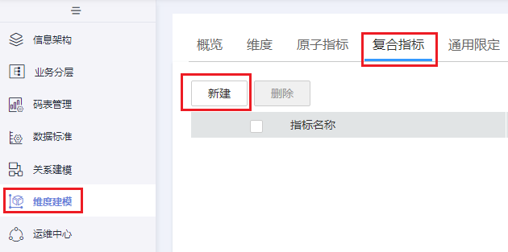

# 新建复合指标

复合指标即常见的统计指标。为保证统计指标标准、规范、无二义性地生成。

复合指标=原子指标+维度+业务限定。

-   原子指标：明确统计口径，即计算逻辑。
-   业务限定：统计的业务范围，筛选出符合业务规则的记录（类似于SQL中where后面的条件，不包括时间区间）。

## 前提条件

-   在新建复合指标之前，请先确认原子指标已经新建并通过审核。
-   如果复合指标将用到时间限定或通用限定，请先确认时间限定和通用限定已经新建并通过审核。

## 新建复合指标并发布

1.  [登录DAYU控制台](https://console.huaweicloud.com/dayu/)，找到所需要的DAYU实例，单击实例卡片上的“进入控制台”，进入概览页面。

    选择“空间管理”页签，完成工作空间的创建。

    在工作空间列表中，找到所需要的工作空间。

1.  单击相应工作空间的“规范设计“。

    系统跳转至规范设计页面。

1.  在规范设计页面，单击左侧导航树中的“维度建模“，选择“复合指标“页签，然后单击“新建“按钮，开始新建复合指标。

    **图 1**  复合指标页面1  
    

2.  如下图所示配置参数，然后单击“发布“，提交发布审核。

    **图 2**  新建复合指标  
    

    **表 1**  新建复合指标参数说明

    
    <table><thead align="left"><tr id="zh-cn_topic_0169427300_row174184401085"><th class="cellrowborder" valign="top" width="14.39%" id="mcps1.2.3.1.1">
参数名称

    </th>
    <th class="cellrowborder" valign="top" width="85.61%" id="mcps1.2.3.1.2">
说明

    </th>
    </tr>
    </thead>
    <tbody><tr id="zh-cn_topic_0169427300_row44191340689"><td class="cellrowborder" valign="top" width="14.39%" headers="mcps1.2.3.1.1 ">
原子指标

    </td>
    <td class="cellrowborder" valign="top" width="85.61%" headers="mcps1.2.3.1.2 ">
选择原子指标。只有审核通过的原子指标，才会出现在下拉列表中。

    </td>
    </tr>
    <tr id="zh-cn_topic_0169427300_row8419194017819"><td class="cellrowborder" valign="top" width="14.39%" headers="mcps1.2.3.1.1 ">
业务分层

    </td>
    <td class="cellrowborder" valign="top" width="85.61%" headers="mcps1.2.3.1.2 ">
显示所属的业务分层。

    </td>
    </tr>
    <tr id="zh-cn_topic_0169427300_row24206406819"><td class="cellrowborder" valign="top" width="14.39%" headers="mcps1.2.3.1.1 ">
统计维度

    </td>
    <td class="cellrowborder" valign="top" width="85.61%" headers="mcps1.2.3.1.2 ">
在下拉列表中，选择一个或多个维度。

    </td>
    </tr>
    <tr id="zh-cn_topic_0169427300_row742018401589"><td class="cellrowborder" valign="top" width="14.39%" headers="mcps1.2.3.1.1 ">
时间限定

    </td>
    <td class="cellrowborder" valign="top" width="85.61%" headers="mcps1.2.3.1.2 ">
在下拉框中选择所需要的时间限定。

    </td>
    </tr>
    <tr id="zh-cn_topic_0169427300_row17420154019812"><td class="cellrowborder" valign="top" width="14.39%" headers="mcps1.2.3.1.1 ">
通用限定

    </td>
    <td class="cellrowborder" valign="top" width="85.61%" headers="mcps1.2.3.1.2 ">
单击“选择”，可选择一个或多个通用限定。

    </td>
    </tr>
    <tr id="zh-cn_topic_0169427300_row15421184018812"><td class="cellrowborder" valign="top" width="14.39%" headers="mcps1.2.3.1.1 ">
描述

    </td>
    <td class="cellrowborder" valign="top" width="85.61%" headers="mcps1.2.3.1.2 ">
描述信息。支持的长度为0~600个字符。

    </td>
    </tr>
    </tbody>
    </table>

3.  在弹出框中单击“确认提交”，提交审核。
4.  （可选）参考步骤[3](#zh-cn_topic_0169427300_li18544163517720)\~[5](#zh-cn_topic_0169427300_li1544113519714)，完成其他复合指标的发布。
5.  等待审核人员审核。

    审核通过后，复合指标就创建好了。

## 运行复合指标并查看结果

在源数据导入事实表之后，您可以运行复合指标并查看运行结果。复合指标的运行结果不会被写入汇总表中。

1.  在规范设计页面，单击左侧导航树中的“维度建模“，选择“复合指标“页签，进入复合指标页面。

    **图 3**  复合指标页面2  
    

2.  在复合指标列表中，找到所需要的复合指标，单击其所在行的“更多 \> 运行“。
3.  等运行成功后，单击“更多 \> 查看运维信息“进入运维中心页面。在列表中找到所需要的复合指标，单击名称前的下拉按钮，可以展开运行记录列表。

    **图 4**  运维中心页面  
    

4.  单击“查看运行日志“，可以查看相应的运行日志和运行结果。

    **图 5**  运行结果  
    

5.  当不再需要运行该复合指标时，单击“停止调度“停止运行。

## 管理复合指标

1.  在规范设计页面，单击左侧导航树中的“维度建模“，选择“复合指标“页签，进入复合指标页面。

    **图 6**  复合指标页面3  
    

2.  您可以根据实际需要选择如下操作。

    
    <table><thead align="left"><tr id="zh-cn_topic_0169427300_row167461051211"><th class="cellrowborder" valign="top" width="37.9%" id="mcps1.1.3.1.1">
当需要...

    </th>
    <th class="cellrowborder" valign="top" width="62.1%" id="mcps1.1.3.1.2">
则...

    </th>
    </tr>
    </thead>
    <tbody><tr id="zh-cn_topic_0169427300_row1674695011"><td class="cellrowborder" valign="top" width="37.9%" headers="mcps1.1.3.1.1 ">
新建

    </td>
    <td class="cellrowborder" valign="top" width="62.1%" headers="mcps1.1.3.1.2 ">
执行<a href="#zh-cn_topic_0169427300_section39831040124813">新建复合指标并发布</a>。

    </td>
    </tr>
    <tr id="zh-cn_topic_0169427300_row137468516113"><td class="cellrowborder" valign="top" width="37.9%" headers="mcps1.1.3.1.1 ">
编辑

    </td>
    <td class="cellrowborder" valign="top" width="62.1%" headers="mcps1.1.3.1.2 ">
执行<a href="#li12839256152718">3</a>。

    </td>
    </tr>
    <tr id="zh-cn_topic_0169427300_row1746651110"><td class="cellrowborder" valign="top" width="37.9%" headers="mcps1.1.3.1.1 ">
发布

    </td>
    <td class="cellrowborder" valign="top" width="62.1%" headers="mcps1.1.3.1.2 ">
执行<a href="#li17839165620275">4</a>。

    </td>
    </tr>
    <tr id="zh-cn_topic_0169427300_row87708551950"><td class="cellrowborder" valign="top" width="37.9%" headers="mcps1.1.3.1.1 ">
下线

    </td>
    <td class="cellrowborder" valign="top" width="62.1%" headers="mcps1.1.3.1.2 ">
执行<a href="#li19839115617277">5</a>。

    </td>
    </tr>
    <tr id="zh-cn_topic_0169427300_row1756919531059"><td class="cellrowborder" valign="top" width="37.9%" headers="mcps1.1.3.1.1 ">
运行

    </td>
    <td class="cellrowborder" valign="top" width="62.1%" headers="mcps1.1.3.1.2 ">
执行<a href="#li4839155610273">6</a>。

    </td>
    </tr>
    <tr id="zh-cn_topic_0169427300_row195105118312"><td class="cellrowborder" valign="top" width="37.9%" headers="mcps1.1.3.1.1 ">
查看运维信息

    </td>
    <td class="cellrowborder" valign="top" width="62.1%" headers="mcps1.1.3.1.2 ">
执行<a href="#li11839195616279">7</a>。

    </td>
    </tr>
    <tr id="zh-cn_topic_0169427300_row9597213538"><td class="cellrowborder" valign="top" width="37.9%" headers="mcps1.1.3.1.1 ">
删除

    </td>
    <td class="cellrowborder" valign="top" width="62.1%" headers="mcps1.1.3.1.2 ">
执行<a href="#li48394564278">8</a>。

    </td>
    </tr>
    </tbody>
    </table>

3.  编辑
    1.  在需要编辑的复合指标右侧，单击“编辑“，进入编辑复合指标页面。
    2.  根据实际需要编辑相关内容。
    3.  单击“发布“。

        > **说明：**   
        >1.  复合指标仅支持修改基本信息，不能修改复合组合逻辑。  

4.  发布
    1.  在需要发布的复合指标右侧，单击“发布“，弹出“提交发布“对话框。
    2.  在下拉菜单中选择审核人。
    3.  单击“确定提交“。

5.  下线
    1.  在需要下线的复合指标右侧，单击“下线“，系统弹出“提交下线“对话框。
    2.  在下拉菜单中选择审核人。
    3.  单击“确认提交“。

6.  运行

    在需要运行的复合指标右侧，选择“更多 \> 运行“，系统提示运行成功。

7.  查看运维信息

    在需要运行的复合指标右侧，选择“更多 \> 查看运维信息“，跳转到[运维中心](运维中心.md)页面。

8.  删除
    1.  勾选需要删除的复合指标，单击左上角“删除“，系统弹出“删除“对话框。
    2.  单击“确定“。

