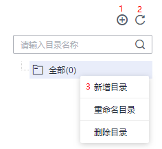

# 新建指标

管理所有业务指标，包括指标的来源、定义等，使用目录维护业务指标。

注意，数据质量模块的指标与规范设计模块的业务指标、技术指标当前是相互独立的，不支持交互。

## 前提条件

在DGC控制台的“_实例_  \> 进入控制台 \> 空间管理 \> 数据质量 \> 业务指标监控 \> 指标管理”页面创建归属目录。基于某个数据连接创建指标，需要选择指标目录，请参见[图1](#fig19294195415194)创建归属目录。

**图 1**  新建指标的归属目录  

**表 1**  导航栏按键说明

<table><thead align="left"><tr id="zh-cn_topic_0141836087_row352545110274"><th class="cellrowborder" valign="top" width="12.15%" id="mcps1.2.3.1.1">
序号

</th>
<th class="cellrowborder" valign="top" width="87.85%" id="mcps1.2.3.1.2">
说明

</th>
</tr>
</thead>
<tbody><tr id="zh-cn_topic_0141836087_row352525182710"><td class="cellrowborder" valign="top" width="12.15%" headers="mcps1.2.3.1.1 ">
1

</td>
<td class="cellrowborder" valign="top" width="87.85%" headers="mcps1.2.3.1.2 ">
新建目录。

</td>
</tr>
<tr id="zh-cn_topic_0141836087_row55274511271"><td class="cellrowborder" valign="top" width="12.15%" headers="mcps1.2.3.1.1 ">
2

</td>
<td class="cellrowborder" valign="top" width="87.85%" headers="mcps1.2.3.1.2 ">
刷新目录。

</td>
</tr>
<tr id="zh-cn_topic_0141836087_row205282051102719"><td class="cellrowborder" valign="top" width="12.15%" headers="mcps1.2.3.1.1 ">
3

</td>
<td class="cellrowborder" valign="top" width="87.85%" headers="mcps1.2.3.1.2 ">
选择全部，单击右键，可新建目录、重命名目录和删除目录。

</td>
</tr>
</tbody>
</table>

## 新建指标

1.  在DGC控制台首页，选择对应工作空间的“数据质量“模块，进入数据质量页面。

    **图 2**  选择数据质量  
    

1.  选择“业务指标监控  \>  指标管理“。
2.  单击“新建“，在弹出的对话框中，参见[表2](#zh-cn_topic_0141836087_table17370943112118)配置相关参数。

    **表 2**  配置业务指标参数

    
    <table><thead align="left"><tr id="zh-cn_topic_0141836087_row836964332120"><th class="cellrowborder" valign="top" width="21.07%" id="mcps1.2.3.1.1">
参数名

    </th>
    <th class="cellrowborder" valign="top" width="78.93%" id="mcps1.2.3.1.2">
说明

    </th>
    </tr>
    </thead>
    <tbody><tr id="zh-cn_topic_0141836087_row173692437211"><td class="cellrowborder" valign="top" width="21.07%" headers="mcps1.2.3.1.1 ">
指标名称

    </td>
    <td class="cellrowborder" valign="top" width="78.93%" headers="mcps1.2.3.1.2 ">
业务指标的名称，只能包含中文、英文字母、数字、“_”，且长度为1~64个字符。

    </td>
    </tr>
    <tr id="zh-cn_topic_0141836087_row2370114312212"><td class="cellrowborder" valign="top" width="21.07%" headers="mcps1.2.3.1.1 ">
数据连接

    </td>
    <td class="cellrowborder" valign="top" width="78.93%" headers="mcps1.2.3.1.2 ">
从下拉列表中选择已创建的数据连接。

    
 说明： 
<ul id="zh-cn_topic_0141836087_ul16451852155519"><li>支持的数据连接类型：DWS、PostgreSQL、MRS Hive、DLI和MySql。</li><li>指标都是基于数据连接的，所以在建立指标之前需要先到元数据管理模块中建立数据连接。</li></ul>
    

    </td>
    </tr>
    <tr id="zh-cn_topic_0141836087_row3370174311218"><td class="cellrowborder" valign="top" width="21.07%" headers="mcps1.2.3.1.1 ">
数据库/队列

    </td>
    <td class="cellrowborder" valign="top" width="78.93%" headers="mcps1.2.3.1.2 ">
选择指标运行的数据库。

    
 说明： 

当数据源为DLI时，需要选择运行的队列。

    

    </td>
    </tr>
    <tr id="zh-cn_topic_0141836087_row163701643102117"><td class="cellrowborder" valign="top" width="21.07%" headers="mcps1.2.3.1.1 ">
指标描述

    </td>
    <td class="cellrowborder" valign="top" width="78.93%" headers="mcps1.2.3.1.2 ">
为更好的识别业务指标 ，此处加以描述信息。描述信息长度不能超过4096个字符。

    </td>
    </tr>
    <tr id="zh-cn_topic_0141836087_row173701243192117"><td class="cellrowborder" valign="top" width="21.07%" headers="mcps1.2.3.1.1 ">
指标目录

    </td>
    <td class="cellrowborder" valign="top" width="78.93%" headers="mcps1.2.3.1.2 ">
业务指标的存储目录，可选择已创建的目录。目录创建请参见<a href="#fig19294195415194">图1</a>。

    </td>
    </tr>
    <tr id="zh-cn_topic_0141836087_row537018432215"><td class="cellrowborder" valign="top" width="21.07%" headers="mcps1.2.3.1.1 ">
来源类型

    </td>
    <td class="cellrowborder" valign="top" width="78.93%" headers="mcps1.2.3.1.2 ">
支持“自定义”。

    
用户自定义SQL语句，定义指标的来源。

    </td>
    </tr>
    </tbody>
    </table>

