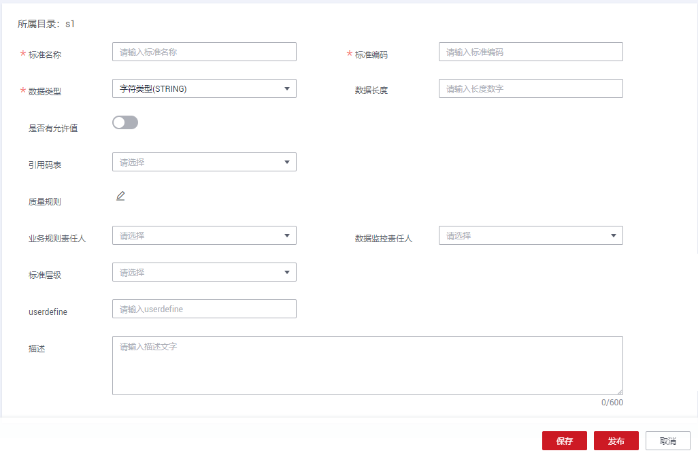
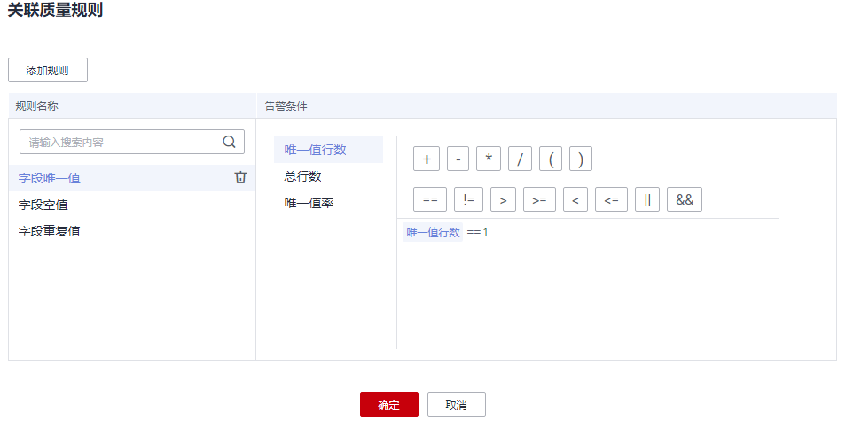

# 新建数据标准

数据标准是用于描述公司层面需共同遵守的数据含义和业务规则，它描述了公司层面对某个数据的共同理解，这些理解一旦确定下来，就应作为企业层面的标准在企业内被共同遵守。

数据标准，也称数据元，由一组属性规定其定义、标识、表示和允许值的数据单元，是不可再分的最小数据单元。您可以将数据标准关联到各个业务上的数据库中。其中，标识符、数据类型、表示格式、值域是数据交换的基础，它们用于描述表的字段元信息，规范字段所存储的数据信息。

本章节介绍如何创建数据标准，创建好的数据标准，可用于在关系建模中新建业务表时与业务表中的字段相关联，从而约束业务表中的字段遵从指定的数据标准。

## 新建数据标准目录

1.  在DGC控制台首页，选择对应工作空间的“规范设计“模块，进入规范设计页面。

    **图 1**  选择规范设计  
    

1.  在规范设计控制台，单击左侧导航树中的“数据标准“。
2.  首次进入数据湖治理中心的数据标准页面，会显示制定数据标准模板的页面，在“可选项”中勾选所需要的选项，添加自定义项，完成后单击“确定“。

    保存模板后，如需修改，您也可以进入“配置中心 \> 标准模板管理”页面修改模板，详情请参见[标准模板管理](配置中心.md#zh-cn_topic_0189687297_section1936343520116)。在新建数据标准时，将需要设置此处模板中选中的选项。

3.  在“数据标准“页面，在目录树上，单击一个目录，然后单击按钮在该目录下新建一个目录。首次新建目录时选择在根目录下新建目录。

    **图 2**  数据标准页面  
    

4.  在弹出窗口中配置如下参数，然后单击“确定“。

    **图 3**  新建数据标准目录  
    

    **表 1**  参数描述

    
    <table><thead align="left"><tr id="zh-cn_topic_0189641496_row1667010516314"><th class="cellrowborder" valign="top" width="19.96%" id="mcps1.2.3.1.1">
参数名称

    </th>
    <th class="cellrowborder" valign="top" width="80.04%" id="mcps1.2.3.1.2">
说明

    </th>
    </tr>
    </thead>
    <tbody><tr id="zh-cn_topic_0189641496_row76702511632"><td class="cellrowborder" valign="top" width="19.96%" headers="mcps1.2.3.1.1 ">
目录名称

    </td>
    <td class="cellrowborder" valign="top" width="80.04%" headers="mcps1.2.3.1.2 ">
只能包含中文、英文字母、数字和下划线。

    </td>
    </tr>
    <tr id="zh-cn_topic_0189641496_row7670195110319"><td class="cellrowborder" valign="top" width="19.96%" headers="mcps1.2.3.1.1 ">
选择目录

    </td>
    <td class="cellrowborder" valign="top" width="80.04%" headers="mcps1.2.3.1.2 ">
在已有的目录中选择一个目录，新建的目录将创建在所选择的目录中。

    </td>
    </tr>
    </tbody>
    </table>

## 新建数据标准

1.  在“数据标准“页面的目录树中，选择一个目录，然后单击“新建“按钮新建一个数据标准。
2.  在新建数据标准页面中，请参考[表2](#zh-cn_topic_0189641496_table27766365314)配置参数，然后单击“发布“。

    在新建数据标准页面中，仅显示在“配置中心 \> 标准模板管理“中已勾选的参数和已添加的自定义参数。[表2](#zh-cn_topic_0189641496_table27766365314)中所示为选中数据标准模板中的所有参数并添加了一个自定义参数的场景。有关配置数据标准模板的详细信息，请参见[标准模板管理](配置中心.md#zh-cn_topic_0189687297_section1936343520116)。

    **图 4**  新建数据标准  
    

    **表 2**  数据标准参数说明

    
    <table><thead align="left"><tr id="zh-cn_topic_0189641496_row197762036123115"><th class="cellrowborder" valign="top" width="20.05%" id="mcps1.2.3.1.1">
参数名称

    </th>
    <th class="cellrowborder" valign="top" width="79.95%" id="mcps1.2.3.1.2">
说明

    </th>
    </tr>
    </thead>
    <tbody><tr id="zh-cn_topic_0189641496_row27761336103113"><td class="cellrowborder" valign="top" width="20.05%" headers="mcps1.2.3.1.1 ">
*标准名称

    </td>
    <td class="cellrowborder" valign="top" width="79.95%" headers="mcps1.2.3.1.2 ">
要求本工作空间内唯一，且只能包含中文、英文字母、数字、左右括号、空格、中划线和下划线，且以中文或英文字母开头。

    </td>
    </tr>
    <tr id="zh-cn_topic_0189641496_row677633619314"><td class="cellrowborder" valign="top" width="20.05%" headers="mcps1.2.3.1.1 ">
*标准编码

    </td>
    <td class="cellrowborder" valign="top" width="79.95%" headers="mcps1.2.3.1.2 ">
要求本工作空间内唯一，用于唯一标识一条数据标准记录。只能包含英文字母、数字、左右括号、空格和下划线，且以英文字母开头。

    </td>
    </tr>
    <tr id="zh-cn_topic_0189641496_row135291059122711"><td class="cellrowborder" valign="top" width="20.05%" headers="mcps1.2.3.1.1 ">
*数据类型

    </td>
    <td class="cellrowborder" valign="top" width="79.95%" headers="mcps1.2.3.1.2 ">
数据类型有：STRING、BIGINT、DOUBLE、TIMESTAMP、DATE、BOOLEAN、DECIMAL。

    
不同的系统数据类型可能存在差异，系统内部会做类型转换。如果未找到所需要的数据类型，您可以参考<a href="配置中心.md#section06381835171">字段类型管理</a>添加数据类型。

    </td>
    </tr>
    <tr id="zh-cn_topic_0189641496_row21151471282"><td class="cellrowborder" valign="top" width="20.05%" headers="mcps1.2.3.1.1 ">
数据长度

    </td>
    <td class="cellrowborder" valign="top" width="79.95%" headers="mcps1.2.3.1.2 ">
可以为空，或者输入1~10000之间的数值。数据长度为空时，对数据长度不做限制。

    
如果输入了数据长度标准，当数据类型为STRING时，会为关联改标准的属性创建数据质量作业，其他类型暂不支持创建质量作业。

    </td>
    </tr>
    <tr id="zh-cn_topic_0189641496_row145356136286"><td class="cellrowborder" valign="top" width="20.05%" headers="mcps1.2.3.1.1 ">
是否有允许值

    </td>
    <td class="cellrowborder" valign="top" width="79.95%" headers="mcps1.2.3.1.2 ">
当开启时，请输入允许值。

    </td>
    </tr>
    <tr id="zh-cn_topic_0189641496_row01160176285"><td class="cellrowborder" valign="top" width="20.05%" headers="mcps1.2.3.1.1 ">
引用码表

    </td>
    <td class="cellrowborder" valign="top" width="79.95%" headers="mcps1.2.3.1.2 ">
选择已创建的码表并选择相应的“码表字段”，这样就可以将码表字段和数据标准相关联。如果未创建码表，请参见<a href="新建码表.md">新建码表</a>进行创建。在“配置中心 &gt; 功能配置”页面中的“模型设计业务流程步骤 &gt; 创建质量作业”勾选的情况下，当引用码表的数据标准被关系建模的业务表关联后，如果表发布成功，系统将会在DGC数据质量中自动创建一个质量作业，并根据数据标准以及码表分别生成相应的质量规则。如果当前表已经发布已有质量作业，则系统会自动更新质量作业，新增根据数据标准以及码表生成的质量规则。

    </td>
    </tr>
    <tr id="zh-cn_topic_0189641496_row14252101011283"><td class="cellrowborder" valign="top" width="20.05%" headers="mcps1.2.3.1.1 ">
质量规则

    </td>
    <td class="cellrowborder" valign="top" width="79.95%" headers="mcps1.2.3.1.2 ">
在“配置中心 &gt; 功能配置”页面中的“模型设计业务流程步骤 &gt; 创建质量作业”勾选的情况下，数据标准设置质量规则后，如果将表关联该数据标准，表在发布成功后，系统将会在DGC数据质量中自动创建一个质量作业，质量作业中会包含此处添加的质量规则。如果当前表已经发布，则系统会自动更新质量作业。

    
单击弹出“关联质量规则”对话框，单击“添加规则”进行设置。

    
例如，添加名称为“字段唯一值”规则，选中该规则后单击“确定”，在“告警条件”中输入告警条件表达式，然后按照此方法添加其他规则后，单击“确定”。

    
告警条件表达式，由告警参数和逻辑运算符组成。在质量作业运行时，系统将计算出告警条件表达式的结果，并根据表达式的结果是否为真来判断是否触发告警。如果表达式的结果为真则触发质量告警，结果为假则不触发质量告警。

    
在此处的“关联质量规则”对话框中，每个质量规则的“告警参数”以按钮形式列出。

    
<b>图1 </b>关联质量规则界面 

    </td>
    </tr>
    <tr id="zh-cn_topic_0189641496_row1970695516281"><td class="cellrowborder" valign="top" width="20.05%" headers="mcps1.2.3.1.1 ">
业务规则责任人

    </td>
    <td class="cellrowborder" valign="top" width="79.95%" headers="mcps1.2.3.1.2 ">
在下拉框中选择业务规则责任人。该责任人为质量规则制定责任人。只有工作空间管理员或开发者、运维者角色的用户才可以设置为责任人。

    </td>
    </tr>
    <tr id="zh-cn_topic_0189641496_row2573162132917"><td class="cellrowborder" valign="top" width="20.05%" headers="mcps1.2.3.1.1 ">
数据监控责任人

    </td>
    <td class="cellrowborder" valign="top" width="79.95%" headers="mcps1.2.3.1.2 ">
在下拉框中选择数据监控责任人。该责任人为质量规则实施责任人。只有工作空间管理员或开发者、运维者角色的用户才可以设置为责任人。

    </td>
    </tr>
    <tr id="zh-cn_topic_0189641496_row498615852814"><td class="cellrowborder" valign="top" width="20.05%" headers="mcps1.2.3.1.1 ">
标准层级

    </td>
    <td class="cellrowborder" valign="top" width="79.95%" headers="mcps1.2.3.1.2 "><ul id="ul1116012409276"><li>global：全局级别。</li><li>domain：非全局级别。</li></ul>
    </td>
    </tr>
    <tr id="row195281041145514"><td class="cellrowborder" valign="top" width="20.05%" headers="mcps1.2.3.1.1 ">
用户自定义字段

    </td>
    <td class="cellrowborder" valign="top" width="79.95%" headers="mcps1.2.3.1.2 ">
该配置项是在DGC规范设计的“配置中心 &gt; 标准模板管理”中添加的自定义项。您可以根据实际情况添加一个或多个自定义项，名称可以自己定义。有关添加自定义项的更多信息，请参见<a href="配置中心.md#zh-cn_topic_0189687297_section1936343520116">标准模板管理</a>。

    </td>
    </tr>
    <tr id="zh-cn_topic_0189641496_row1578653953215"><td class="cellrowborder" valign="top" width="20.05%" headers="mcps1.2.3.1.1 ">
描述

    </td>
    <td class="cellrowborder" valign="top" width="79.95%" headers="mcps1.2.3.1.2 ">
描述信息。支持的长度为0~600个字符。

    </td>
    </tr>
    </tbody>
    </table>

3.  单击“保存“，完成新建数据标准操作。

## 导入数据标准

1.  在规范设计控制台，单击左侧的“数据标准“，进入数据标准页面。
2.  在数据标准的目录结构中，选择一个指定的目录名称，然后单击上方“更多 \> 导入“，弹出对话框如下图所示。

    **图 6**  导入数据标准  
    

3.  在导入配置页签内，选择是否“更新已有数据“。已有数据是通过标准编码唯一标识的，即如果导入模板中的某个标准编码在当前工作空间下已经存在，则系统会认为导入模板中标准编码所在的这组数据为已有数据。
4.  在导入配置页签内，单击“下载数据标准导入模板”下载模板。打开模板，请根据业务需求填写好模板中的相关参数并保存。

    模板中的参数说明如[表3](#table1154801111352)、[表4](#table15493113351)所示，其中名称前带“\*”的参数为必填参数，名称前未带“\*”的参数为可选参数。

    **表 3**  标准Sheet页参数说明

    
    <table><thead align="left"><tr id="row1754741193518"><th class="cellrowborder" valign="top" width="19.96%" id="mcps1.2.3.1.1">
参数名称

    </th>
    <th class="cellrowborder" valign="top" width="80.04%" id="mcps1.2.3.1.2">
说明

    </th>
    </tr>
    </thead>
    <tbody><tr id="row18547141123513"><td class="cellrowborder" valign="top" width="19.96%" headers="mcps1.2.3.1.1 ">
目录

    </td>
    <td class="cellrowborder" valign="top" width="80.04%" headers="mcps1.2.3.1.2 ">
导入的数据标准所属的目录。

    </td>
    </tr>
    <tr id="row7547711163516"><td class="cellrowborder" valign="top" width="19.96%" headers="mcps1.2.3.1.1 ">
*标准名称

    </td>
    <td class="cellrowborder" valign="top" width="80.04%" headers="mcps1.2.3.1.2 ">
数据标准的中文名称。只能包含中文、英文字母、数字、左右括号、空格、中划线和下划线，且以中文或英文字母开头。

    </td>
    </tr>
    <tr id="row6547111112355"><td class="cellrowborder" valign="top" width="19.96%" headers="mcps1.2.3.1.1 ">
*标准编码

    </td>
    <td class="cellrowborder" valign="top" width="80.04%" headers="mcps1.2.3.1.2 ">
数据标准的英文名称，用于唯一标识一条数据标准记录。只能包含英文字母、数字、左右括号、空格和下划线，且以英文字母开头。

    </td>
    </tr>
    <tr id="row115471611193519"><td class="cellrowborder" valign="top" width="19.96%" headers="mcps1.2.3.1.1 ">
*数据类型

    </td>
    <td class="cellrowborder" valign="top" width="80.04%" headers="mcps1.2.3.1.2 ">
数据类型有：STRING、BIGINT、DOUBLE、TIMESTAMP、DATE、BOOLEAN、DECIMAL。

    
不同的系统数据类型可能存在差异，系统内部会做类型转换。如果未找到所需要的数据类型，您可以参考<a href="配置中心.md#section06381835171">字段类型管理</a>添加数据类型。

    </td>
    </tr>
    <tr id="row145471311193513"><td class="cellrowborder" valign="top" width="19.96%" headers="mcps1.2.3.1.1 ">
数据长度

    </td>
    <td class="cellrowborder" valign="top" width="80.04%" headers="mcps1.2.3.1.2 ">
可以为空，或者输入1~10000之间的数值。数据长度为空时，对数据长度不做限制。

    
如果输入了数据长度标准，当数据类型为STRING时，会为关联改标准的属性创建数据质量作业，其他类型暂不支持创建质量作业。

    </td>
    </tr>
    <tr id="row5547181117352"><td class="cellrowborder" valign="top" width="19.96%" headers="mcps1.2.3.1.1 ">
是否有允许值

    </td>
    <td class="cellrowborder" valign="top" width="80.04%" headers="mcps1.2.3.1.2 ">
true表示有允许值，false表示没有允许值。

    </td>
    </tr>
    <tr id="row20548151163515"><td class="cellrowborder" valign="top" width="19.96%" headers="mcps1.2.3.1.1 ">
允许值

    </td>
    <td class="cellrowborder" valign="top" width="80.04%" headers="mcps1.2.3.1.2 ">
当参数“是否有允许值”为true时，必须设置“允许值”。

    
支持添加多个允许值，最多支持20个。多个允许值之间以逗号分隔，例如“1,2,3”。

    </td>
    </tr>
    <tr id="row16548101111358"><td class="cellrowborder" valign="top" width="19.96%" headers="mcps1.2.3.1.1 ">
引用码表

    </td>
    <td class="cellrowborder" valign="top" width="80.04%" headers="mcps1.2.3.1.2 ">
填写已创建的码表名称。

    </td>
    </tr>
    <tr id="row19548101117352"><td class="cellrowborder" valign="top" width="19.96%" headers="mcps1.2.3.1.1 ">
码表字段

    </td>
    <td class="cellrowborder" valign="top" width="80.04%" headers="mcps1.2.3.1.2 ">
当“引用码表”不为空时，请设置该引用码表中的“码表字段”，这样就可以将码表字段和数据标准相关联。

    </td>
    </tr>
    <tr id="row154871123513"><td class="cellrowborder" valign="top" width="19.96%" headers="mcps1.2.3.1.1 ">
业务规则责任人

    </td>
    <td class="cellrowborder" valign="top" width="80.04%" headers="mcps1.2.3.1.2 ">
填写业务规则责任人。只有工作空间管理员或开发者、运维者角色的用户才可以设置为责任人。

    </td>
    </tr>
    <tr id="row654814114358"><td class="cellrowborder" valign="top" width="19.96%" headers="mcps1.2.3.1.1 ">
数据监控责任人

    </td>
    <td class="cellrowborder" valign="top" width="80.04%" headers="mcps1.2.3.1.2 ">
填写数据监控责任人。只有工作空间管理员或开发者、运维者角色的用户才可以设置为责任人。

    </td>
    </tr>
    <tr id="row454811110354"><td class="cellrowborder" valign="top" width="19.96%" headers="mcps1.2.3.1.1 ">
标准层级

    </td>
    <td class="cellrowborder" valign="top" width="80.04%" headers="mcps1.2.3.1.2 "><ul id="ul1354851123517"><li>global：全局级别。</li><li>domain：非全局级别。</li></ul>
    </td>
    </tr>
    <tr id="row2548211203519"><td class="cellrowborder" valign="top" width="19.96%" headers="mcps1.2.3.1.1 ">
描述

    </td>
    <td class="cellrowborder" valign="top" width="80.04%" headers="mcps1.2.3.1.2 ">
描述信息。支持的长度0~600字符。

    </td>
    </tr>
    <tr id="row1354841173513"><td class="cellrowborder" valign="top" width="19.96%" headers="mcps1.2.3.1.1 ">
用户自定义字段（可选）

    </td>
    <td class="cellrowborder" valign="top" width="80.04%" headers="mcps1.2.3.1.2 ">
如果在定制数据标准模板时，您添加了一个或多个自定义字段，则在导入模板中也需要填写相应的字段，如果未添加自定义字段，则无需填写。关于定制数据标准模板的更多信息，请参见<a href="配置中心.md#zh-cn_topic_0189687297_section1936343520116">标准模板管理</a>。

    </td>
    </tr>
    </tbody>
    </table>

    在“质量规则“Sheet页中，可以配置数据标准所需添加的质量规则。在“配置中心 \> 功能配置“页面中的“模型设计业务流程步骤 \> 创建质量作业“勾选的情况下，数据标准设置质量规则后，如果将表关联该数据标准，表在发布成功后，系统将会在DGC数据质量模块中自动创建一个质量作业，质量作业中会包含此处添加的质量规则。如果当前表已经发布，则系统会自动更新质量作业。

    **表 4**  质量规则Sheet页参数说明

    
    <table><thead align="left"><tr id="row754981133513"><th class="cellrowborder" valign="top" width="19.96%" id="mcps1.2.3.1.1">
参数名称

    </th>
    <th class="cellrowborder" valign="top" width="80.04%" id="mcps1.2.3.1.2">
说明

    </th>
    </tr>
    </thead>
    <tbody><tr id="row25491911173518"><td class="cellrowborder" valign="top" width="19.96%" headers="mcps1.2.3.1.1 ">
*标准编码

    </td>
    <td class="cellrowborder" valign="top" width="80.04%" headers="mcps1.2.3.1.2 ">
需要添加质量规则的数据标准编码

    </td>
    </tr>
    <tr id="row205495118351"><td class="cellrowborder" valign="top" width="19.96%" headers="mcps1.2.3.1.1 ">
规则名称

    </td>
    <td class="cellrowborder" valign="top" width="80.04%" headers="mcps1.2.3.1.2 ">
填写已有的规则名称。在DGC控制台左上角的模块下拉列表中选择“数据质量”进入DGC数据质量控制台，然后您可以进入“规则模板”页面查看已有的规则名称。

    </td>
    </tr>
    <tr id="row125496112353"><td class="cellrowborder" valign="top" width="19.96%" headers="mcps1.2.3.1.1 ">
告警配置

    </td>
    <td class="cellrowborder" valign="top" width="80.04%" headers="mcps1.2.3.1.2 ">
告警条件表达式，由告警参数和逻辑运算符组成。在质量作业运行时，系统将计算出告警条件表达式的结果，并根据表达式的结果是否为真来判断是否触发告警。如果表达式的结果为真则触发质量告警，结果为假则不触发质量告警。

    
在告警条件表达式中，告警参数以${1}、${2}、${3}等变量名称表示，变量名即代表所指定的质量规则的告警参数，变量$1代表第一个告警参数，$2代表第二个告警参数，以此类推。在DGC控制台左上角的模块下拉列表中选择“数据质量”进入DGC数据质量控制台，然后您可以进入“规则模板”页面在“结果说明”一列中查看质量规则支持的告警参数。

    
例如：${1}&gt;100

    </td>
    </tr>
    <tr id="row14549711123517"><td class="cellrowborder" valign="top" width="19.96%" headers="mcps1.2.3.1.1 ">
正则表达式

    </td>
    <td class="cellrowborder" valign="top" width="80.04%" headers="mcps1.2.3.1.2 ">
只有当“规则名称”配置为“正则表达式校验”或者“合法性校验”时，需要配置正则表达式。

    </td>
    </tr>
    </tbody>
    </table>

5.  返回“导入数据标准”对话框，选择上一步配置好的数据标准模板文件，然后单击“上传文件“。

    如果上传的模板文件校验不通过，请修改正确后，再重新上传。

6.  在导入对话框中，导入结果会在“上次导入“页面中显示。如果导入成功，单击“关闭“完成导入。如果导入失败，您可以查看失败原因，将模板文件修改正确后，再重新上传。

    **图 7**  上次导入结果  
    

## 管理数据标准

在DGC规范设计控制台，单击左侧导航树中的“数据标准“，进入数据标准页面。您可以对数据标准进行管理。

**图 8**  数据标准列表  

在数据标准页面，可以执行以下操作：

-   **搜索**

    在数据标准上方，设置标准，创建人、审核人和修改时间等筛选条件，然后单击“搜索”可以查找指定的数据标准。

    找到指定的数据标准后，可以执行以下操作：

    -   编辑
    -   发布
    -   下线

-   **导入**

    单击“更多 \> 导入”，可以导入数据标准，下载导入模板，填写模板并上传，然后单击“确定“。

-   **导出**
    -   导出指定目录中的数据标准

        在数据标准目录结构中，选中一个目录，单击数据标准列表上方的“更多 \> 导出”，可以导出该目录下的所有的数据标准。

    -   导出指定的数据标准

        在数据标准列表中，选中需要导出的数据标准，然后单击列表上方的“更多 \> 导出”，可以导出所选中的数据标准。

-   **删除**

    勾选标准后单击“更多 \> 删除”，可以删除数据标准，其中待发布，已发布和待下线状态的数据标准不可被删除。且被引用的数据标准不可被删除。

-   **发布**

    选中需要发布的数据标准，单击“发布”，可发布待发布的数据标准。

## 导出数据标准

1.  在规范设计控制台，单击左侧的“数据标准“，进入数据标准页面。
2.  在数据标准的目录结构中，选择一个指定的目录名称并单击右键，然后单击“导出“即可。

