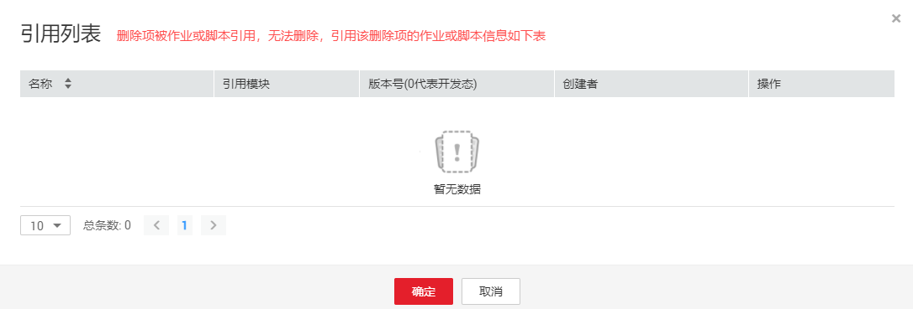

# 新建数据连接

通过创建数据连接，您可以在数据开发模块中对相应服务进行更多数据操作，例如：管理数据库、管理命名空间、管理数据库模式、管理数据表。

在同一个数据连接下，可支持多个作业运行和多个脚本开发，当数据连接保存的信息发生变化时，您只需在连接管理中编辑修改该数据连接的信息。

## 新建数据连接

数据开发模块的数据连接，是基于管理中心的数据连接完成的，创建方法请参考[创建数据连接](创建数据连接.md)。

## 查看连接引用

当用户需要查看某个连接被引用的情况时，可以参考如下操作查看引用。

1.  登录DGC控制台。选择对应工作空间的“数据开发“模块，进入数据开发页面。

    **图 1**  选择数据开发  
    

2.  在数据开发主界面的左侧导航栏，选择“数据开发  \>  脚本开发“。
3.  单击，进入连接目录列表。
4.  在连接目录中，右键单击对应的连接，选择“查看引用”，弹出“引用列表“窗口。
5.  在引用列表窗口，可以查看该连接被引用的情况。

    **图 2**  引用列表  
    

