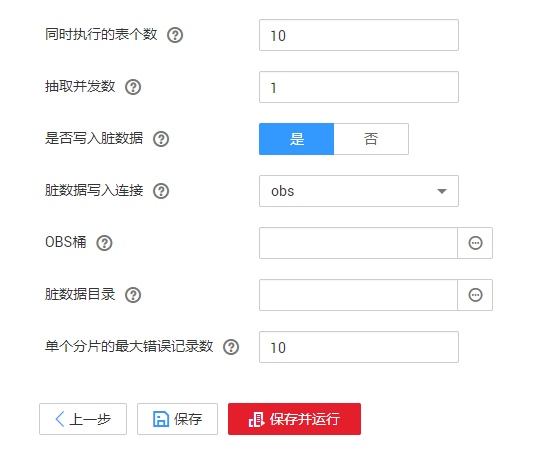

# 新建整库迁移作业

## 操作场景

CDM支持在同构、异构数据源之间进行整库迁移，迁移原理与[新建表/文件迁移作业](新建表-文件迁移作业.md#dgc_01_0046)相同，关系型数据库的每张表、Redis的每个键前缀、Elasticsearch的每个类型、MongoDB的每个集合都会作为一个子任务并发执行。

支持整库迁移的数据源请参见[整库迁移支持的数据源类型](支持的数据源.md#zh-cn_topic_0000001147970137_zh-cn_topic_0108275392_section2459343715638)。

## 自动建表时的字段类型映射

CDM迁移数据库时支持在目的端自动建表。CDM在数据仓库服务（Data Warehouse Service，简称DWS）中自动建表时，DWS的表与源表的字段类型映射关系如[图1](#zh-cn_topic_0108275370_zh-cn_topic_0108275392_fig662181513539)所示。例如使用CDM将Oracle整库迁移到DWS，CDM在DWS上自动建表，会将Oracle的**NUMBER\(3,0\)**字段映射到DWS的**SMALLINT**。

**图 1**  DWS端自动建表时的字段映射  

## 前提条件

-   已[新建连接](新建连接.md#dgc_01_0024)。
-   CDM集群与待迁移数据源可以正常通信。

## 操作步骤

1.  进入CDM主界面，单击左侧导航上的“集群管理“，选择集群后的“作业管理“。
2.  选择“整库迁移  \>  新建作业“，进入作业参数配置界面。

    **图 2**  创建整库迁移作业  
    

3.  配置源端作业参数，根据待迁移的数据库类型配置对应参数，如[表1](#zh-cn_topic_0108275370_table14973632102118)所示。

    **表 1**  源端作业参数

    
    <table><thead align="left"><tr id="zh-cn_topic_0108275370_row20487414102118"><th class="cellrowborder" valign="top" width="22.900000000000002%" id="mcps1.2.5.1.1">
源端数据库类型

    </th>
    <th class="cellrowborder" valign="top" width="17.64%" id="mcps1.2.5.1.2">
源端参数

    </th>
    <th class="cellrowborder" valign="top" width="46.489999999999995%" id="mcps1.2.5.1.3">
参数说明

    </th>
    <th class="cellrowborder" valign="top" width="12.97%" id="mcps1.2.5.1.4">
取值样例

    </th>
    </tr>
    </thead>
    <tbody><tr id="zh-cn_topic_0108275370_row54909470102118"><td class="cellrowborder" rowspan="3" valign="top" width="22.900000000000002%" headers="mcps1.2.5.1.1 "><ul id="zh-cn_topic_0108275370_ul21600492111710"><li>DWS</li><li>FusionInsight LibrA</li><li>MySQL</li><li>PostgreSQL</li><li>SQL Server</li><li>Oracle</li><li>IBM Db2</li><li>SAP HANA</li><li>MYCAT</li><li>达梦数据库 DM</li></ul>
    </td>
    <td class="cellrowborder" valign="top" width="17.64%" headers="mcps1.2.5.1.2 ">
模式或表空间

    </td>
    <td class="cellrowborder" valign="top" width="46.489999999999995%" headers="mcps1.2.5.1.3 ">
“使用SQL语句”选择“否”时，显示该参数，表示待抽取数据的模式或表空间名称。单击输入框后面的按钮可进入模式选择界面，用户也可以直接输入模式或表空间名称。

    
如果选择界面没有待选择的模式或表空间，请确认对应连接里的帐号是否有元数据查询的权限。

    </td>
    <td class="cellrowborder" valign="top" width="12.97%" headers="mcps1.2.5.1.4 ">
schema

    </td>
    </tr>
    <tr id="zh-cn_topic_0108275370_row7145183822214"><td class="cellrowborder" valign="top" headers="mcps1.2.5.1.1 ">
Where子句

    </td>
    <td class="cellrowborder" valign="top" headers="mcps1.2.5.1.2 ">
该参数适用于整库迁移中的所有子表，配置子表抽取范围的Where子句，不配置时抽取整表。如果待迁移的表中没有Where子句的字段，则迁移失败。

    
该参数支持配置为时间宏变量，实现抽取指定日期的数据，详细说明请参见<a href="https://support.huaweicloud.com/bestpractice-dgc/dgc_05_0005.html" target="_blank" rel="noopener noreferrer">关系数据库增量迁移</a>。

    </td>
    <td class="cellrowborder" valign="top" headers="mcps1.2.5.1.3 ">
age &gt; 18 and age &lt;= 60

    </td>
    </tr>
    <tr id="zh-cn_topic_0108275370_row669875135320"><td class="cellrowborder" valign="top" headers="mcps1.2.5.1.1 ">
分区字段是否允许空值

    </td>
    <td class="cellrowborder" valign="top" headers="mcps1.2.5.1.2 ">
选择分区字段是否允许空值。

    </td>
    <td class="cellrowborder" valign="top" headers="mcps1.2.5.1.3 ">
是

    </td>
    </tr>
    <tr id="zh-cn_topic_0108275370_row2584351151019"><td class="cellrowborder" valign="top" width="22.900000000000002%" headers="mcps1.2.5.1.1 ">
HIVE

    </td>
    <td class="cellrowborder" valign="top" width="17.64%" headers="mcps1.2.5.1.2 ">
数据库名称

    </td>
    <td class="cellrowborder" valign="top" width="46.489999999999995%" headers="mcps1.2.5.1.3 ">
待迁移的数据库名称，源连接中配置的用户需要拥有读取该数据库的权限。

    </td>
    <td class="cellrowborder" valign="top" width="12.97%" headers="mcps1.2.5.1.4 ">
hivedb

    </td>
    </tr>
    <tr id="zh-cn_topic_0108275370_row689892910317"><td class="cellrowborder" rowspan="2" valign="top" width="22.900000000000002%" headers="mcps1.2.5.1.1 ">
HBASE

    
CloudTable

    </td>
    <td class="cellrowborder" valign="top" width="17.64%" headers="mcps1.2.5.1.2 ">
起始时间

    </td>
    <td class="cellrowborder" valign="top" width="46.489999999999995%" headers="mcps1.2.5.1.3 ">
起始时间（包含该值）。格式为'yyyy-MM-dd hh:mm:ss', 支持dateformat时间宏变量函数。例如："2017-12-31 20:00:00" 或 "${dateformat(yyyy-MM-dd, -1, DAY)} 02:00:00" 或 ${dateformat(yyyy-MM-dd HH:mm:ss, -1, DAY)}

    </td>
    <td class="cellrowborder" valign="top" width="12.97%" headers="mcps1.2.5.1.4 ">
-

    </td>
    </tr>
    <tr id="zh-cn_topic_0108275370_row101613497313"><td class="cellrowborder" valign="top" headers="mcps1.2.5.1.1 ">
终止时间

    </td>
    <td class="cellrowborder" valign="top" headers="mcps1.2.5.1.2 ">
终止时间（不包含该值）。格式为'yyyy-MM-dd hh:mm:ss', 支持dateformat时间宏变量函数。例如："2018-01-01 20:00:00" 或 "${dateformat(yyyy-MM-dd, -1, DAY)} 02:00:00" 或 "${dateformat(yyyy-MM-dd HH:mm:ss, -1, DAY)}"

    </td>
    <td class="cellrowborder" valign="top" headers="mcps1.2.5.1.3 ">
-

    </td>
    </tr>
    <tr id="zh-cn_topic_0108275370_row8272123132715"><td class="cellrowborder" valign="top" width="22.900000000000002%" headers="mcps1.2.5.1.1 ">
Redis

    </td>
    <td class="cellrowborder" valign="top" width="17.64%" headers="mcps1.2.5.1.2 ">
键过滤字符

    </td>
    <td class="cellrowborder" valign="top" width="46.489999999999995%" headers="mcps1.2.5.1.3 ">
填写键过滤字符后，将迁移符合条件的键。例如：a*, 迁移所有:*

    </td>
    <td class="cellrowborder" valign="top" width="12.97%" headers="mcps1.2.5.1.4 ">
-

    </td>
    </tr>
    <tr id="zh-cn_topic_0108275370_row71301631104116"><td class="cellrowborder" rowspan="2" valign="top" width="22.900000000000002%" headers="mcps1.2.5.1.1 ">
DDS

    
MongoDB

    </td>
    <td class="cellrowborder" valign="top" width="17.64%" headers="mcps1.2.5.1.2 ">
数据库名称

    </td>
    <td class="cellrowborder" valign="top" width="46.489999999999995%" headers="mcps1.2.5.1.3 ">
待迁移的数据库名称，源连接中配置的用户需要拥有读取该数据库的权限。

    </td>
    <td class="cellrowborder" valign="top" width="12.97%" headers="mcps1.2.5.1.4 ">
mongodb

    </td>
    </tr>
    <tr id="zh-cn_topic_0108275370_row123132291558"><td class="cellrowborder" valign="top" headers="mcps1.2.5.1.1 ">
查询筛选

    </td>
    <td class="cellrowborder" valign="top" headers="mcps1.2.5.1.2 ">
创建用于匹配文档的筛选器。例如：{HTTPStatusCode:{$gt:"400",$lt:"500"},HTTPMethod:"GET"}。

    </td>
    <td class="cellrowborder" valign="top" headers="mcps1.2.5.1.3 ">
-

    </td>
    </tr>
    <tr id="zh-cn_topic_0108275370_row1977478125915"><td class="cellrowborder" valign="top" width="22.900000000000002%" headers="mcps1.2.5.1.1 ">
Elasticsearch

    
CSS

    </td>
    <td class="cellrowborder" valign="top" width="17.64%" headers="mcps1.2.5.1.2 ">
索引

    </td>
    <td class="cellrowborder" valign="top" width="46.489999999999995%" headers="mcps1.2.5.1.3 ">
待抽取数据的索引，支持配置为通配符，一次迁移多个符合通配符条件的索引。例如这里配置为cdm*时，CDM将迁移所有名称为cdm开头的索引：cdm01、cdmB3、cdm_45……

    
如果源端配置为迁移多个索引时，目的端的作业参数“索引”将不允许配置。

    </td>
    <td class="cellrowborder" valign="top" width="12.97%" headers="mcps1.2.5.1.4 ">
cdm*

    </td>
    </tr>
    </tbody>
    </table>

4.  配置目的端作业参数，根据待导入数据的云服务配置对应参数，如[表2](#zh-cn_topic_0108275370_table17764626124115)所示。

    **表 2**  目的端作业参数

    
    <table><thead align="left"><tr id="zh-cn_topic_0108275370_row176419264415"><th class="cellrowborder" valign="top" width="22.900000000000002%" id="mcps1.2.5.1.1">
源端数据库类型

    </th>
    <th class="cellrowborder" valign="top" width="17.61%" id="mcps1.2.5.1.2">
源端参数

    </th>
    <th class="cellrowborder" valign="top" width="46.52%" id="mcps1.2.5.1.3">
参数说明

    </th>
    <th class="cellrowborder" valign="top" width="12.97%" id="mcps1.2.5.1.4">
取值样例

    </th>
    </tr>
    </thead>
    <tbody><tr id="zh-cn_topic_0108275370_row117651926154112"><td class="cellrowborder" valign="top" width="22.900000000000002%" headers="mcps1.2.5.1.1 "><ul id="zh-cn_topic_0108275370_ul13765426174118"><li>DWS</li><li>FusionInsight LibrA</li><li>MySQL</li><li>PostgreSQL</li><li>SQL Server</li></ul>
    

    </td>
    <td class="cellrowborder" valign="top" width="17.61%" headers="mcps1.2.5.1.2 ">
-

    </td>
    <td class="cellrowborder" valign="top" width="46.52%" headers="mcps1.2.5.1.3 ">
整库迁移到关系数据库时，目的端作业参数请参见<a href="配置关系数据库目的端参数.md#dgc_01_0068">配置关系数据库目的端参数</a>。

    </td>
    <td class="cellrowborder" valign="top" width="12.97%" headers="mcps1.2.5.1.4 ">
schema

    </td>
    </tr>
    <tr id="zh-cn_topic_0108275370_row137651926124113"><td class="cellrowborder" valign="top" width="22.900000000000002%" headers="mcps1.2.5.1.1 ">
MRS HIVE

    </td>
    <td class="cellrowborder" valign="top" width="17.61%" headers="mcps1.2.5.1.2 ">
-

    </td>
    <td class="cellrowborder" valign="top" width="46.52%" headers="mcps1.2.5.1.3 ">
整库迁移到MRS HIVE时，目的端作业参数请参见<a href="配置Hive目的端参数.md#dgc_01_0066">配置Hive目的端参数</a>。

    </td>
    <td class="cellrowborder" valign="top" width="12.97%" headers="mcps1.2.5.1.4 ">
hivedb

    </td>
    </tr>
    <tr id="zh-cn_topic_0108275370_row11765126184113"><td class="cellrowborder" valign="top" width="22.900000000000002%" headers="mcps1.2.5.1.1 ">
MRS HBASE

    
CloudTable

    </td>
    <td class="cellrowborder" valign="top" width="17.61%" headers="mcps1.2.5.1.2 ">
-

    </td>
    <td class="cellrowborder" valign="top" width="46.52%" headers="mcps1.2.5.1.3 ">
整库迁移到MRSHBASE或CloudTable时，目的端作业参数请参见<a href="配置HBase-CloudTable目的端参数.md#dgc_01_0064">配置HBase/CloudTable目的端参数</a>。

    </td>
    <td class="cellrowborder" valign="top" width="12.97%" headers="mcps1.2.5.1.4 ">
是

    </td>
    </tr>
    <tr id="zh-cn_topic_0108275370_row1348316045113"><td class="cellrowborder" valign="top" width="22.900000000000002%" headers="mcps1.2.5.1.1 ">
MRS HDFS

    </td>
    <td class="cellrowborder" valign="top" width="17.61%" headers="mcps1.2.5.1.2 ">
-

    </td>
    <td class="cellrowborder" valign="top" width="46.52%" headers="mcps1.2.5.1.3 ">
整库迁移到MRS HDFS时，目的端作业参数请参见<a href="配置HDFS目的端参数.md#dgc_01_0063">配置HDFS目的端参数</a>。

    </td>
    <td class="cellrowborder" valign="top" width="12.97%" headers="mcps1.2.5.1.4 ">
-

    </td>
    </tr>
    <tr id="zh-cn_topic_0108275370_row18537102919517"><td class="cellrowborder" valign="top" width="22.900000000000002%" headers="mcps1.2.5.1.1 ">
OBS

    </td>
    <td class="cellrowborder" valign="top" width="17.61%" headers="mcps1.2.5.1.2 ">
-

    </td>
    <td class="cellrowborder" valign="top" width="46.52%" headers="mcps1.2.5.1.3 ">
整库迁移到OBS时，目的端作业参数请参见<a href="配置OBS目的端参数.md#dgc_01_0062">配置OBS目的端参数</a>。

    </td>
    <td class="cellrowborder" valign="top" width="12.97%" headers="mcps1.2.5.1.4 ">
-

    </td>
    </tr>
    <tr id="zh-cn_topic_0108275370_row7765192644117"><td class="cellrowborder" valign="top" width="22.900000000000002%" headers="mcps1.2.5.1.1 ">
DCS

    </td>
    <td class="cellrowborder" valign="top" width="17.61%" headers="mcps1.2.5.1.2 ">
-

    </td>
    <td class="cellrowborder" valign="top" width="46.52%" headers="mcps1.2.5.1.3 ">
整库迁移到DCS时，目的端作业参数请参见<a href="配置DCS目的端参数.md#dgc_01_0070">配置DCS目的端参数</a>。

    </td>
    <td class="cellrowborder" valign="top" width="12.97%" headers="mcps1.2.5.1.4 ">
-

    </td>
    </tr>
    <tr id="zh-cn_topic_0108275370_row6765112614116"><td class="cellrowborder" rowspan="2" valign="top" width="22.900000000000002%" headers="mcps1.2.5.1.1 ">
DDS

    </td>
    <td class="cellrowborder" valign="top" width="17.61%" headers="mcps1.2.5.1.2 ">
数据库名称

    </td>
    <td class="cellrowborder" valign="top" width="46.52%" headers="mcps1.2.5.1.3 ">
待迁移的数据库名称，源连接中配置的用户需要拥有读取该数据库的权限。

    </td>
    <td class="cellrowborder" valign="top" width="12.97%" headers="mcps1.2.5.1.4 ">
mongodb

    </td>
    </tr>
    <tr id="zh-cn_topic_0108275370_row876542619416"><td class="cellrowborder" valign="top" headers="mcps1.2.5.1.1 ">
迁移行为

    </td>
    <td class="cellrowborder" valign="top" headers="mcps1.2.5.1.2 ">
新增

    
有则替换，无则新增

    
替换

    </td>
    <td class="cellrowborder" valign="top" headers="mcps1.2.5.1.3 ">
-

    </td>
    </tr>
    <tr id="zh-cn_topic_0108275370_row8766182694120"><td class="cellrowborder" valign="top" width="22.900000000000002%" headers="mcps1.2.5.1.1 ">
CSS

    </td>
    <td class="cellrowborder" valign="top" width="17.61%" headers="mcps1.2.5.1.2 ">
索引

    </td>
    <td class="cellrowborder" valign="top" width="46.52%" headers="mcps1.2.5.1.3 ">
待抽取数据的索引，支持配置为通配符，一次迁移多个符合通配符条件的索引。例如这里配置为cdm*时，CDM将迁移所有名称为cdm开头的索引：cdm01、cdmB3、cdm_45……

    
如果源端配置为迁移多个索引时，目的端的作业参数“索引”将不允许配置。

    </td>
    <td class="cellrowborder" valign="top" width="12.97%" headers="mcps1.2.5.1.4 ">
cdm*

    </td>
    </tr>
    </tbody>
    </table>

5.  如果是关系型数据库整库迁移，则作业参数配置完成后，单击“下一步“会进入表的选择界面，您可以根据自己的需求选择迁移哪些表到目的端。
6.  单击“下一步“配置任务参数。

    **图 3**  任务参数  
    

    各参数说明如[表3](#zh-cn_topic_0108275370_zh-cn_topic_0108275458_table62790900104257)所示。

    **表 3**  任务配置参数

    
    <table><thead align="left"><tr id="zh-cn_topic_0108275370_zh-cn_topic_0108275458_row65473362104257"><th class="cellrowborder" valign="top" width="22.240000000000002%" id="mcps1.2.4.1.1">
参数

    </th>
    <th class="cellrowborder" valign="top" width="59.09000000000001%" id="mcps1.2.4.1.2">
说明

    </th>
    <th class="cellrowborder" valign="top" width="18.67%" id="mcps1.2.4.1.3">
取值样例

    </th>
    </tr>
    </thead>
    <tbody><tr id="zh-cn_topic_0108275370_row1367218544311"><td class="cellrowborder" valign="top" width="22.240000000000002%" headers="mcps1.2.4.1.1 ">
同时执行的表个数

    </td>
    <td class="cellrowborder" valign="top" width="59.09000000000001%" headers="mcps1.2.4.1.2 ">
抽取时并发执行的表的数量。

    </td>
    <td class="cellrowborder" valign="top" width="18.67%" headers="mcps1.2.4.1.3 ">
3

    </td>
    </tr>
    <tr id="zh-cn_topic_0108275370_row10953185715313"><td class="cellrowborder" valign="top" width="22.240000000000002%" headers="mcps1.2.4.1.1 ">
抽取并发数

    </td>
    <td class="cellrowborder" valign="top" width="59.09000000000001%" headers="mcps1.2.4.1.2 ">
设置同时执行的抽取任务数，一般保持默认即可。

    </td>
    <td class="cellrowborder" valign="top" width="18.67%" headers="mcps1.2.4.1.3 ">
1

    </td>
    </tr>
    <tr id="zh-cn_topic_0108275370_zh-cn_topic_0108275458_row52808246153537"><td class="cellrowborder" valign="top" width="22.240000000000002%" headers="mcps1.2.4.1.1 ">
是否写入脏数据

    </td>
    <td class="cellrowborder" valign="top" width="59.09000000000001%" headers="mcps1.2.4.1.2 ">
选择是否记录脏数据，默认不记录脏数据。

    </td>
    <td class="cellrowborder" valign="top" width="18.67%" headers="mcps1.2.4.1.3 ">
是

    </td>
    </tr>
    <tr id="zh-cn_topic_0108275370_zh-cn_topic_0108275458_row9411130214937"><td class="cellrowborder" valign="top" width="22.240000000000002%" headers="mcps1.2.4.1.1 ">
脏数据写入连接

    </td>
    <td class="cellrowborder" valign="top" width="59.09000000000001%" headers="mcps1.2.4.1.2 ">
当“是否写入脏数据”为“是”才显示该参数。

    
脏数据要写入的连接，目前只支持写入到OBS连接。

    </td>
    <td class="cellrowborder" valign="top" width="18.67%" headers="mcps1.2.4.1.3 ">
obs_link

    </td>
    </tr>
    <tr id="zh-cn_topic_0108275370_zh-cn_topic_0108275458_row22967022215317"><td class="cellrowborder" valign="top" width="22.240000000000002%" headers="mcps1.2.4.1.1 ">
OBS桶

    </td>
    <td class="cellrowborder" valign="top" width="59.09000000000001%" headers="mcps1.2.4.1.2 ">
当“脏数据写入连接”为OBS类型的连接时，才显示该参数。

    
写入脏数据的OBS桶的名称。

    </td>
    <td class="cellrowborder" valign="top" width="18.67%" headers="mcps1.2.4.1.3 ">
dirtydata

    </td>
    </tr>
    <tr id="zh-cn_topic_0108275370_zh-cn_topic_0108275458_row39573864104257"><td class="cellrowborder" valign="top" width="22.240000000000002%" headers="mcps1.2.4.1.1 ">
脏数据目录

    </td>
    <td class="cellrowborder" valign="top" width="59.09000000000001%" headers="mcps1.2.4.1.2 ">
“是否写入脏数据”选择为“是”时，该参数才显示。

    
OBS上存储脏数据的目录，只有在配置了脏数据目录的情况下才会记录脏数据。

    
用户可以进入脏数据目录，查看作业执行过程中处理失败的数据或者被清洗过滤掉的数据，针对该数据可以查看源数据中哪些数据不符合转换、清洗规则。

    </td>
    <td class="cellrowborder" valign="top" width="18.67%" headers="mcps1.2.4.1.3 ">
/user/dirtydir

    </td>
    </tr>
    <tr id="zh-cn_topic_0108275370_zh-cn_topic_0108275458_row45605180153618"><td class="cellrowborder" valign="top" width="22.240000000000002%" headers="mcps1.2.4.1.1 ">
单个分片的最大错误记录数

    </td>
    <td class="cellrowborder" valign="top" width="59.09000000000001%" headers="mcps1.2.4.1.2 ">
当“是否写入脏数据”为“是”才显示该参数。

    
单个map的错误记录超过设置的最大错误记录数则任务自动结束，已经导入的数据不支持回退。推荐使用临时表作为导入的目标表，待导入成功后再改名或合并到最终数据表。

    </td>
    <td class="cellrowborder" valign="top" width="18.67%" headers="mcps1.2.4.1.3 ">
0

    </td>
    </tr>
    </tbody>
    </table>

7.  单击“保存“，或者“保存并运行“。

    作业任务启动后，每个待迁移的表都会生成一个子任务，单击整库迁移的作业名称，可查看子任务列表。

