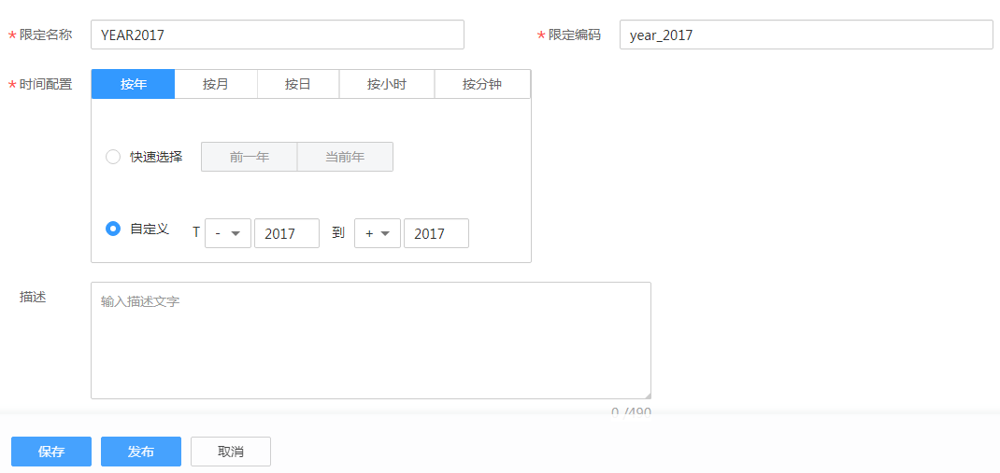

# 新建时间限定

原子指标是计算逻辑的标准化定义，时间限定则是条件限制的标准化定义。为保障所有统计指标统一、标准、规范地构建，时间限定在业务板块内唯一，并唯一归属于一个来源逻辑表，计算逻辑也以该来源逻辑表模型的字段为基础进行定义。由于一个时间限定的定义可能来自于归属不同数据域的多个逻辑表，因此一个时间限定可能归属于多个数据域。

## 新建时间限定并发布

1.  在DGC控制台首页，选择对应工作空间的“规范设计“模块，进入规范设计页面。

    **图 1**  选择规范设计  
    

2.  在规范设计控制台，单击左侧导航树中的“技术指标“，选择“时间限定“页签。
3.  进入时间限定页面后，单击“新建“按钮。
4.  在新建时间限定页面，参考[表1](#table18469131994611)配置参数，然后单击“发布“。

    **图 2**  时间限定  
    

    **表 1**  新建时间限定参数说明

    
    <table><thead align="left"><tr id="row0469181954618"><th class="cellrowborder" valign="top" width="15.83%" id="mcps1.2.3.1.1">
参数名称

    </th>
    <th class="cellrowborder" valign="top" width="84.17%" id="mcps1.2.3.1.2">
说明

    </th>
    </tr>
    </thead>
    <tbody><tr id="row446921912461"><td class="cellrowborder" valign="top" width="15.83%" headers="mcps1.2.3.1.1 ">
限定名称

    </td>
    <td class="cellrowborder" valign="top" width="84.17%" headers="mcps1.2.3.1.2 ">
只能包含中文、英文字母、数字和下划线，且必须以中文或英文字母开头。

    </td>
    </tr>
    <tr id="row10469819124613"><td class="cellrowborder" valign="top" width="15.83%" headers="mcps1.2.3.1.1 ">
限定编码

    </td>
    <td class="cellrowborder" valign="top" width="84.17%" headers="mcps1.2.3.1.2 ">
只能包含英文字母、数字和下划线，且必须以英文字母开头。

    </td>
    </tr>
    <tr id="row6469111910466"><td class="cellrowborder" valign="top" width="15.83%" headers="mcps1.2.3.1.1 ">
时间配置

    </td>
    <td class="cellrowborder" valign="top" width="84.17%" headers="mcps1.2.3.1.2 ">
可选择“按年”、“按月”、“按日”、“按小时”或“按分钟”，然后根据需要选择“快速选择”或“自定义”进行时间条件的设置。

    </td>
    </tr>
    <tr id="row1946918195462"><td class="cellrowborder" valign="top" width="15.83%" headers="mcps1.2.3.1.1 ">
描述

    </td>
    <td class="cellrowborder" valign="top" width="84.17%" headers="mcps1.2.3.1.2 ">
描述信息。支持的长度0~490字符。

    </td>
    </tr>
    </tbody>
    </table>

5.  在弹出框中单击“确认提交”，提交发布审核。
6.  等待审核人员审核。

    审核通过后，时间限定就创建好了。

## 管理时间限定

1.  在规范设计控制台，单击左侧导航树中的“技术指标“，选择“时间限定“页签，进入时间限定页面。

    **图 3**  时间限定页面  
    

2.  您可以根据实际需要选择如下操作。

    
    <table><thead align="left"><tr id="zh-cn_topic_0169427442_row167461051211"><th class="cellrowborder" valign="top" width="37.9%" id="mcps1.1.3.1.1">
当需要...

    </th>
    <th class="cellrowborder" valign="top" width="62.1%" id="mcps1.1.3.1.2">
则...

    </th>
    </tr>
    </thead>
    <tbody><tr id="zh-cn_topic_0169427442_row1718912178219"><td class="cellrowborder" valign="top" width="37.9%" headers="mcps1.1.3.1.1 ">
新建

    </td>
    <td class="cellrowborder" valign="top" width="62.1%" headers="mcps1.1.3.1.2 ">
执行<a href="#zh-cn_topic_0169427442_section12931330310">新建时间限定并发布</a>。

    </td>
    </tr>
    <tr id="zh-cn_topic_0169427442_row137468516113"><td class="cellrowborder" valign="top" width="37.9%" headers="mcps1.1.3.1.1 ">
编辑

    </td>
    <td class="cellrowborder" valign="top" width="62.1%" headers="mcps1.1.3.1.2 ">
执行<a href="#li367549172317">3</a>。

    </td>
    </tr>
    <tr id="zh-cn_topic_0169427442_row1746651110"><td class="cellrowborder" valign="top" width="37.9%" headers="mcps1.1.3.1.1 ">
发布

    </td>
    <td class="cellrowborder" valign="top" width="62.1%" headers="mcps1.1.3.1.2 ">
执行<a href="#li186715497233">4</a>。

    </td>
    </tr>
    <tr id="row12474112811489"><td class="cellrowborder" valign="top" width="37.9%" headers="mcps1.1.3.1.1 ">
发布历史

    </td>
    <td class="cellrowborder" valign="top" width="62.1%" headers="mcps1.1.3.1.2 ">
执行<a href="#li84726392483">5</a>。

    </td>
    </tr>
    <tr id="zh-cn_topic_0169427442_row195105118312"><td class="cellrowborder" valign="top" width="37.9%" headers="mcps1.1.3.1.1 ">
下线

    </td>
    <td class="cellrowborder" valign="top" width="62.1%" headers="mcps1.1.3.1.2 ">
执行<a href="#li1767449102313">6</a>。

    </td>
    </tr>
    <tr id="zh-cn_topic_0169427442_row9597213538"><td class="cellrowborder" valign="top" width="37.9%" headers="mcps1.1.3.1.1 ">
删除

    </td>
    <td class="cellrowborder" valign="top" width="62.1%" headers="mcps1.1.3.1.2 ">
执行<a href="#li76712493237">7</a>。

    </td>
    </tr>
    </tbody>
    </table>

3.  编辑
    1.  在需要编辑的时间限定右侧，单击“编辑“，进入编辑时间限定页面。
    2.  根据实际需要编辑相关内容。
    3.  单击“保存“，保存该时间限定信息；或者单击“发布“，发布该时间限定信息。

4.  发布
    1.  在需要发布的时间限定右侧，单击“发布“，弹出“提交发布“对话框。
    2.  在下拉菜单中选择审核人。
    3.  单击“确认提交“。

5.  发布历史
    1.  在列表中，找到所需查看的时间限定，单击“更多 \> 发布历史“，将显示“发布历史“页面。
    2.  在“发布历史”中，您可以查看时间限定的发布历史和版本对比信息。

6.  下线
    1.  在需要下线的时间限定右侧，单击“更多 \> 下线“，系统弹出“提交下线“对话框。
    2.  在下拉菜单中选择审核人。
    3.  单击“确认提交“。

        > **说明：** 
        >下线及删除时间限定的前提是无依赖引用，即衍生指标引用。

7.  删除
    1.  勾选需要删除的时间限定，单击页面上方“删除“，系统弹出“删除“对话框。
    2.  单击“是“。

