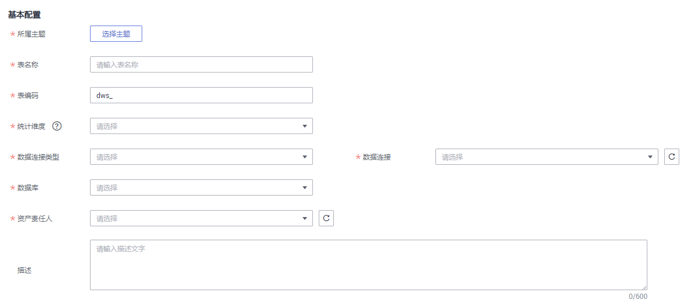
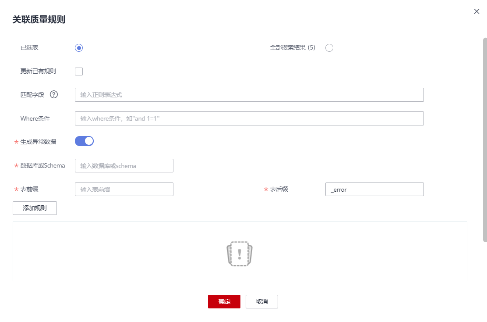
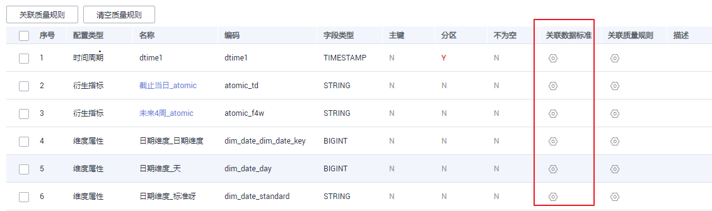
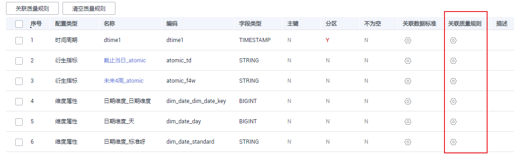

# 新建汇总表

汇总逻辑表是由一个特定的分析对象（如会员）及其相关的统计指标组成的。组成一个汇总逻辑表的统计指标都具有相同的统计粒度（如会员），汇总逻辑表面向用户提供了以统计粒度（如会员）为主题的所有统计数据（如会员主题集市）。

汇总表分为“手工创建”和“自动汇聚”，此处仅描述手工创建场景。

> **说明：** 
>如果在“规范设计 \> 配置中心 \> 功能配置“页面中开启了“模型设计业务流程步骤 \> 创建数据开发作业”（默认为关闭），发布汇总表时，系统将在数据开发中自动创建一个数据开发作业，作业名称以“_数据库名称\_表编码_”开头。您可以进入“数据开发 \> 作业开发“页面查看作业。该作业默认没有调度配置，需要您自行在数据开发模块中设置。

## 前提条件

在创建汇总表之前，请先确认您已完成维度、维度表、事实表和衍生指标/复合指标的新建、发布与审核。

## 新建汇总表并发布

1.  在DGC控制台首页，选择对应工作空间的“规范设计“模块，进入规范设计页面。

    **图 1**  选择规范设计  
    

2.  在规范设计控制台，单击左侧导航树中的“维度建模“，然后选择“汇总表“页签。
3.  在左侧主题目录中选中一个主题，然后单击“新建“按钮，开始创建汇总表。
4.  在“新建汇总表”页面，完成如下配置：
    1.  设置“基本配置”参数：

        **图 2**  汇总表基本配置  
        

        **表 1**  基本配置参数说明

        
        <table><thead align="left"><tr id="zh-cn_topic_0172166856_row581145416366"><th class="cellrowborder" valign="top" width="17.64%" id="mcps1.2.3.1.1">
参数说明

        </th>
        <th class="cellrowborder" valign="top" width="82.36%" id="mcps1.2.3.1.2">
说明

        </th>
        </tr>
        </thead>
        <tbody><tr id="zh-cn_topic_0172166856_row08175413363"><td class="cellrowborder" valign="top" width="17.64%" headers="mcps1.2.3.1.1 ">
所属主题

        </td>
        <td class="cellrowborder" valign="top" width="82.36%" headers="mcps1.2.3.1.2 ">
单击“选择主题”，选择表所属的主题域分组、主题域和业务对象。

        </td>
        </tr>
        <tr id="zh-cn_topic_0172166856_row181754113610"><td class="cellrowborder" valign="top" width="17.64%" headers="mcps1.2.3.1.1 ">
表名称

        </td>
        <td class="cellrowborder" valign="top" width="82.36%" headers="mcps1.2.3.1.2 ">
设置表名称。只能包含中文、英文字母、数字、左右括号、中划线和下划线，且以中文和英文字母开头。

        </td>
        </tr>
        <tr id="zh-cn_topic_0172166856_row88112541363"><td class="cellrowborder" valign="top" width="17.64%" headers="mcps1.2.3.1.1 ">
表编码

        </td>
        <td class="cellrowborder" valign="top" width="82.36%" headers="mcps1.2.3.1.2 ">
设置表英文名称。只能包含英文字母、数字和下划线，且以英文字母开头。

        </td>
        </tr>
        <tr id="row1075895184714"><td class="cellrowborder" valign="top" width="17.64%" headers="mcps1.2.3.1.1 ">
统计维度

        </td>
        <td class="cellrowborder" valign="top" width="82.36%" headers="mcps1.2.3.1.2 ">
选择统计维度。在下拉列表中只会显示来源于衍生指标的统计维度。

        
当汇总表完成新建后，“统计维度”指定的维度的所有维度属性，都将被自动添加到汇总表中，成为汇总表中的字段。您可以在完成汇总表的新建后，进入汇总表页面，单击汇总表名称查看详情中的表字段信息。

        </td>
        </tr>
        <tr id="zh-cn_topic_0172166856_row58119547362"><td class="cellrowborder" valign="top" width="17.64%" headers="mcps1.2.3.1.1 ">
数据连接类型

        </td>
        <td class="cellrowborder" valign="top" width="82.36%" headers="mcps1.2.3.1.2 ">
请选择和维度表、事实表相同的数据连接类型。

        </td>
        </tr>
        <tr id="zh-cn_topic_0172166856_row781354203617"><td class="cellrowborder" valign="top" width="17.64%" headers="mcps1.2.3.1.1 ">
数据连接

        </td>
        <td class="cellrowborder" valign="top" width="82.36%" headers="mcps1.2.3.1.2 ">
维度建模建议使用统一的数据连接。

        </td>
        </tr>
        <tr id="zh-cn_topic_0172166856_row1282135418361"><td class="cellrowborder" valign="top" width="17.64%" headers="mcps1.2.3.1.1 ">
数据库

        </td>
        <td class="cellrowborder" valign="top" width="82.36%" headers="mcps1.2.3.1.2 ">
选择数据库。

        </td>
        </tr>
        <tr id="row657755016414"><td class="cellrowborder" valign="top" width="17.64%" headers="mcps1.2.3.1.1 ">
队列

        </td>
        <td class="cellrowborder" valign="top" width="82.36%" headers="mcps1.2.3.1.2 ">
DLI队列。该参数仅DLI连接类型有效。

        </td>
        </tr>
        <tr id="row76067568411"><td class="cellrowborder" valign="top" width="17.64%" headers="mcps1.2.3.1.1 ">
schema

        </td>
        <td class="cellrowborder" valign="top" width="82.36%" headers="mcps1.2.3.1.2 ">
DWS或POSTGRESQL的模式。该参数在DWS或POSTGRESQL连接类型有效。

        </td>
        </tr>
        <tr id="row154301153124118"><td class="cellrowborder" valign="top" width="17.64%" headers="mcps1.2.3.1.1 ">
表类型

        </td>
        <td class="cellrowborder" valign="top" width="82.36%" headers="mcps1.2.3.1.2 ">
DWS连接类型的表支持以下表类型：

        <ul id="ul44087216447"><li>DWS_ROW：行存表。行存储是指将表按行存储到硬盘分区上。</li><li>DWS_COLUMN：列存表。列存储是指将表按列存储到硬盘分区上。</li></ul>
        
MRS_HIVE仅支持HIVE_TABLE类型。

        </td>
        </tr>
        <tr id="row17857142254619"><td class="cellrowborder" valign="top" width="17.64%" headers="mcps1.2.3.1.1 ">
DISTRIBUTE BY

        </td>
        <td class="cellrowborder" valign="top" width="82.36%" headers="mcps1.2.3.1.2 ">
该参数仅DWS连接类型有效。DWS表当前支持复制（Replication）和散列（Hash）两种分布策略。用户可选取多个字段。

        <ul id="ul1734212913469"><li><strong id="b1234314299462">REPLICATION方式</strong>：在每一个DN节点上存储一份全量表数据。这种存储方式的优点是每个DN上都有此表的全量数据，在join操作中可以避免数据重分布操作，从而减小网络开销；缺点是每个DN都保留了表的完整数据，造成数据的冗余。一般情况下只有较小的维度表才会定义为Replication表。</li><li><strong id="b16343132944617">HASH方式</strong>：采用这种分布方式，需要为用户表指定一个分布列（distribute key）。当插入一条记录时，系统会根据分布列的值进行hash运算后，将数据存储在对应的DN中。对于Hash分布表，在读/写数据时可以利用各个节点的IO资源，大大提升表的读/写速度。一般情况下大表（1000000条记录以上）定义为Hash表。</li></ul>
        </td>
        </tr>
        <tr id="zh-cn_topic_0172166856_row1782354103620"><td class="cellrowborder" valign="top" width="17.64%" headers="mcps1.2.3.1.1 ">
资产责任人

        </td>
        <td class="cellrowborder" valign="top" width="82.36%" headers="mcps1.2.3.1.2 ">
在下拉框中选择资产责任人。只有工作空间管理员或开发者、运维者角色的用户才可以设置为责任人。

        </td>
        </tr>
        <tr id="zh-cn_topic_0172166856_row28219545362"><td class="cellrowborder" valign="top" width="17.64%" headers="mcps1.2.3.1.1 ">
描述

        </td>
        <td class="cellrowborder" valign="top" width="82.36%" headers="mcps1.2.3.1.2 ">
描述信息。支持的长度为0~600个字符。

        </td>
        </tr>
        </tbody>
        </table>

    2.  在“时间分区“区域，输入字段编码以及选择数据类型。当表发布成功后，在往表里写数据时，将根据该时间分区字段进行分区。

        **图 3**  时间周期配置  
        

    3.  在“指标配置”区域，单击“添加”，可以添加一个或多个与所指定的“统计维度“相关联的衍生指标或复合指标。

        **图 4**  指标配置  
        

5.  单击“发布“，并在弹出框中单击“确认提交”，提交审核。
6.  请联系审核人员审核汇总表，等待审核通过。

    审核通过后，汇总表就会在数据库中自动创建。

7.  返回“维度建模 \> 汇总表“页面，在列表中找到刚发布的汇总表，在“同步状态“一列中可以查看汇总表的同步状态。
    -   如果同步状态均显示成功，则说明汇总表发布成功，汇总表在数据库中已创建成功。
    -   如果同步状态中存在失败，可单击该汇总表所在行的“更多 \> 发布历史“，然后在展开的页面中进入“发布日志”页签查看日志。请根据错误日志定位失败原因，问题解决后，您可以在汇总表页面勾选该汇总表，再单击列表上方的“更多 \> 同步“尝试重新同步。如果问题仍未能解决，请联系技术支持人员协助处理。

## 管理汇总表

1.  在规范设计控制台，单击左侧导航树中的“维度建模“，选择“汇总表“页签，进入汇总表页面。

    **图 5**  汇总表页面  
    

2.  您可以根据实际需要选择如下操作。

    
    <table><thead align="left"><tr id="zh-cn_topic_0172166856_row167461051211"><th class="cellrowborder" valign="top" width="37.9%" id="mcps1.1.3.1.1">
当需要...

    </th>
    <th class="cellrowborder" valign="top" width="62.1%" id="mcps1.1.3.1.2">
则...

    </th>
    </tr>
    </thead>
    <tbody><tr id="zh-cn_topic_0172166856_row1674695011"><td class="cellrowborder" valign="top" width="37.9%" headers="mcps1.1.3.1.1 ">
新建

    </td>
    <td class="cellrowborder" valign="top" width="62.1%" headers="mcps1.1.3.1.2 ">
执行<a href="#zh-cn_topic_0172166856_section692617199341">新建汇总表并发布</a>。

    </td>
    </tr>
    <tr id="zh-cn_topic_0172166856_row137468516113"><td class="cellrowborder" valign="top" width="37.9%" headers="mcps1.1.3.1.1 ">
编辑

    </td>
    <td class="cellrowborder" valign="top" width="62.1%" headers="mcps1.1.3.1.2 ">
执行<a href="#li206174174312">3</a>。

    </td>
    </tr>
    <tr id="zh-cn_topic_0172166856_row1746651110"><td class="cellrowborder" valign="top" width="37.9%" headers="mcps1.1.3.1.1 ">
发布

    </td>
    <td class="cellrowborder" valign="top" width="62.1%" headers="mcps1.1.3.1.2 ">
执行<a href="#li46177173317">4</a>。

    </td>
    </tr>
    <tr id="row16800374110"><td class="cellrowborder" valign="top" width="37.9%" headers="mcps1.1.3.1.1 ">
发布历史

    </td>
    <td class="cellrowborder" valign="top" width="62.1%" headers="mcps1.1.3.1.2 ">
执行<a href="#li13365101417916">5</a>。

    </td>
    </tr>
    <tr id="row192659274"><td class="cellrowborder" valign="top" width="37.9%" headers="mcps1.1.3.1.1 ">
预览SQL

    </td>
    <td class="cellrowborder" valign="top" width="62.1%" headers="mcps1.1.3.1.2 ">
执行<a href="#li16969191718916">6</a>。

    </td>
    </tr>
    <tr id="zh-cn_topic_0172166856_row195105118312"><td class="cellrowborder" valign="top" width="37.9%" headers="mcps1.1.3.1.1 ">
下线

    </td>
    <td class="cellrowborder" valign="top" width="62.1%" headers="mcps1.1.3.1.2 ">
执行<a href="#li261731713110">7</a>。

    </td>
    </tr>
    <tr id="row1024019902410"><td class="cellrowborder" valign="top" width="37.9%" headers="mcps1.1.3.1.1 ">
关联质量规则

    </td>
    <td class="cellrowborder" valign="top" width="62.1%" headers="mcps1.1.3.1.2 ">
执行<a href="#li883315112509">8</a>。

    </td>
    </tr>
    <tr id="zh-cn_topic_0172166856_row9597213538"><td class="cellrowborder" valign="top" width="37.9%" headers="mcps1.1.3.1.1 ">
删除

    </td>
    <td class="cellrowborder" valign="top" width="62.1%" headers="mcps1.1.3.1.2 ">
执行<a href="#li36179177313">9</a>。

    </td>
    </tr>
    </tbody>
    </table>

3.  编辑
    1.  在需要编辑的汇总表右侧，单击“编辑“，进入编辑汇总表页面。
    2.  根据实际需要编辑相关内容。
    3.  单击“发布“。

4.  发布
    1.  在需要发布的汇总表右侧，单击“发布“，弹出“提交发布“对话框。
    2.  在下拉菜单中选择审核人。
    3.  单击“确认提交“。

5.  查看发布历史
    1.  在汇总列表中，找到所需要的汇总表，在右侧单击“更多 \> 发布历史“，将显示“发布历史“页面。
    2.  如果“发布历史”中，您可以查看汇总表的发布历史记录、版本对比信息以及发布日志。

        如果“发布日志”中有错误日志，说明发布失败。您可以单击“重新同步“进行重试。

6.  预览SQL
    1.  在汇总表列表中，找到所需要的汇总表，在右侧单击“更多 \> 预览SQL“，弹出“预览SQL“对话框。
    2.  在“预览SQL”中，您可以查看SQL语句，也可以复制SQL。

7.  下线
    1.  在需要下线的汇总表右侧，单击“下线“，系统弹出“提交下线“对话框。
    2.  在下拉菜单中选择审核人。
    3.  单击“确认提交“。

        > **说明：** 
        >汇总表下线后，API的如何处理由客户在数据服务中根据实际情况决定，规范设计侧不会对API做任何处理。

8.  关联质量规则
    1.  在汇总表列表中，勾选所需要的关联质量规则汇总表，在上方单击“关联质量规则“，弹出“关联质量规则“对话框。
    2.  在“关联质量规则“对话框中，您可以批量给汇总表的字段添加规则并关联到字段。
    3.  单击“确定“。

9.  删除
    1.  勾选需要删除的汇总表，单击上方“更多 \> 删除“，系统弹出“删除“对话框。
    2.  单击“是“。

## 汇总表关联质量规则

1.  在规范设计控制台，选择“模型设计 \> 维度建模“，进入维度建模页面。
2.  单击“汇总表“页签，进入汇总表页面。
3.  在汇总表列表中，勾选需要关联质量规则的汇总表。单击“关联质量规则“。

    **图 6**  关联汇总表质量规则  
    

4.  在弹出的页面中配置关联质量规则参数。配置完成单击确定。

    -   **更新已有规则**：若勾选此项，新添加的规则会覆盖旧规则。
    -   **匹配字段**：此参数默认应用于所有字段，依据用户输入的正则表达式对字段进行过滤。
    -   **Where条件**：可依据用户输入的where条件对字段进行过滤。
    -   **生成异常数据**：勾选此项，表示异常数据讲按照配置的参数存储到规定的库中。
    -   **数据库或Schema**：勾选“生成异常数据“时显示此项，表示存储异常数据的数据库或Schema
    -   **表前缀**：勾选“生成异常数据“时显示此项，表示存储异常数据的表的前缀。
    -   **表后缀**：勾选“生成异常数据“时显示此项，表示存储异常数据的表的前缀。
    -   **添加规则**：单击“添加规则”进行设置。例如，添加名称为“字段唯一值”规则，选中该规则后单击“确定“，在“告警条件“中输入告警条件表达式，然后按照此方法添加其他规则后，单击“确定“。
    -   告警条件表达式，由告警参数和逻辑运算符组成。在质量作业运行时，系统将计算出告警条件表达式的结果，并根据表达式的结果是否为真来判断是否触发告警。如果表达式的结果为真则触发质量告警，结果为假则不触发质量告警。在此处的“关联质量规则“对话框中，每个质量规则的“告警参数“以按钮形式列出。

    **图 7**  汇总表关联质量规则  
    

## 汇总表字段关联数据标准

1.  在规范设计控制台，选择“模型设计 \> 维度建模“，进入维度建模页面。
2.  单击“汇总表“页签，进入汇总表页面。
3.  在汇总表列表中，单击需要关联数据标准的汇总表名称。
4.  在汇总表的详情页的表字段列表中，查找需要关联数据标准的字段，单击其所属的，配置单个表字段关联数据标准。

    **图 8**  汇总表字段关联数据标准  
    

5.  配置完成后，单击“确定“，完成汇总表字段关联数据标准。数据标准的来源请参考[新建数据标准](新建数据标准.md#zh-cn_topic_0189641496_section181715220144)。

    **图 9**  配置数据标准  
    

## 单个表字段关联质量规则

1.  在规范设计控制台，选择“模型设计 \> 维度建模“，进入维度建模页面。
2.  单击“汇总表“页签，进入汇总表页面。
3.  在汇总表列表中，单击需要关联质量规则的汇总表名称。
4.  在汇总表的详情页的表字段列表中，单击，配置单个表字段关联质量规则。

    **图 10**  汇总表单个字段关联质量规则  
    

5.  配置完成后，单击“确定“，完成汇总表字段关联质量规则。

    -   **更新已有规则**：若勾选此项，新添加的规则会覆盖旧规则。
    -   **添加规则**：单击“添加规则”进行设置。例如，添加名称为“字段唯一值”规则，选中该规则后单击“确定“，在“告警条件“中输入告警条件表达式，然后按照此方法添加其他规则后，单击“确定“。
    -   告警条件表达式，由告警参数和逻辑运算符组成。在质量作业运行时，系统将计算出告警条件表达式的结果，并根据表达式的结果是否为真来判断是否触发告警。如果表达式的结果为真则触发质量告警，结果为假则不触发质量告警。在此处的“关联质量规则“对话框中，每个质量规则的“告警参数“以按钮形式列出。

    **图 11**  配置质量规则  
    

## 表字段批量关联质量规则

1.  在规范设计控制台，选择“模型设计 \> 维度建模“，进入维度建模页面。
2.  单击“汇总表“页签，进入汇总表页面。
3.  在汇总表列表中，单击需要关联质量规则的汇总表名称。
4.  在汇总表的详情页的表字段列表中，勾选需要关联质量规则的表字段，单击关联质量规则。

    **图 12**  汇总表批量字段关联质量规则  
    

5.  在弹出的界面中添加规则，完成规则参数配置。

    -   **更新已有规则**：若勾选此项，新添加的规则会覆盖旧规则。
    -   **添加规则**：单击“添加规则”进行设置。例如，添加名称为“字段唯一值”规则，选中该规则后单击“确定“，在“告警条件“中输入告警条件表达式，然后按照此方法添加其他规则后，单击“确定“。
    -   告警条件表达式，由告警参数和逻辑运算符组成。在质量作业运行时，系统将计算出告警条件表达式的结果，并根据表达式的结果是否为真来判断是否触发告警。如果表达式的结果为真则触发质量告警，结果为假则不触发质量告警。在此处的“关联质量规则“对话框中，每个质量规则的“告警参数“以按钮形式列出。

    **图 13**  添加汇总表质量规则  
    

6.  配置完成后，单击“确定“，完成汇总表字段批量关联质量规则。

