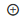
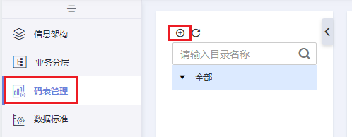
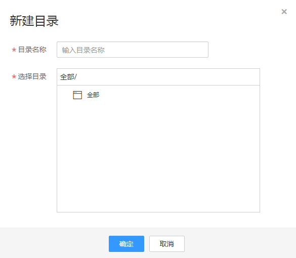
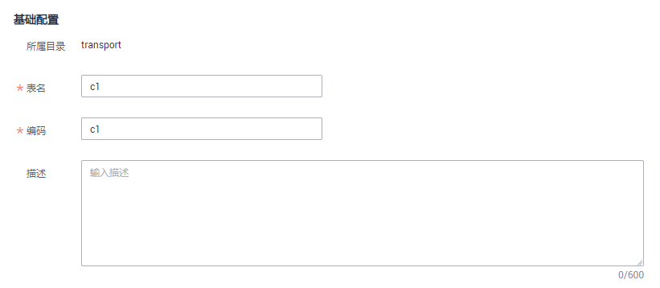
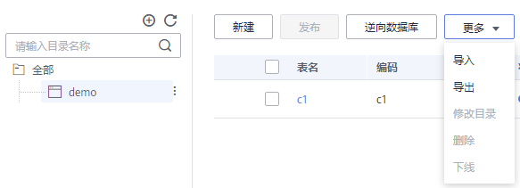
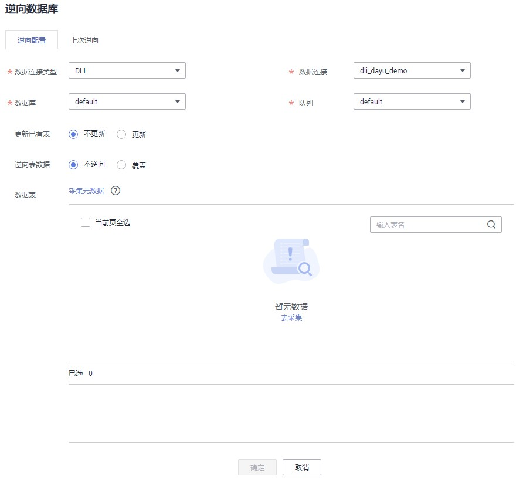
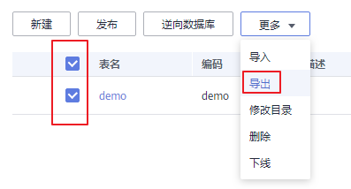
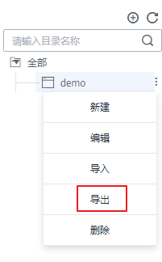
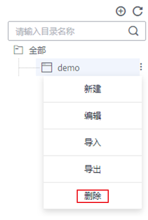

# 新建码表

码表，也称lookup表、数据字典表，一般由中英文名称编码组成，由可枚举数据构成，存储枚举数据名称与编码的映射关系。码表的作用主要有：

-   在数据清洗中用于标准化业务数据以及补充映射字段。
-   在质量监控中用于监控业务数据的值域范围。
-   在维度建模中可以引申为枚举维度。

## 新建码表并发布

手动新建码表，完成新建后可以参考[填写数值到码表中](#section1775021114542)添加码表记录。

1.  在DGC控制台首页，选择对应工作空间的“规范设计“模块，进入规范设计页面。

    **图 1**  选择规范设计  
    

2.  在规范设计控制台，单击左侧导航树中的“码表管理“。
3.  在“码表管理“页面的码表目录树中，选择一个目录，然后单击按钮在所选目录下新建目录。首次新建目录时，可选择在根目录下新建目录。

    **图 2**  码表管理页面  
    

4.  在弹出窗口中进行参数配置，单击“确定“。

    **图 3**  新建码表目录  
    

    **表 1**  参数描述

    
    <table><thead align="left"><tr id="zh-cn_topic_0189613897_row1667010516314"><th class="cellrowborder" valign="top" width="19.96%" id="mcps1.2.3.1.1">
参数名称

    </th>
    <th class="cellrowborder" valign="top" width="80.04%" id="mcps1.2.3.1.2">
说明

    </th>
    </tr>
    </thead>
    <tbody><tr id="zh-cn_topic_0189613897_row76702511632"><td class="cellrowborder" valign="top" width="19.96%" headers="mcps1.2.3.1.1 ">
目录名称

    </td>
    <td class="cellrowborder" valign="top" width="80.04%" headers="mcps1.2.3.1.2 ">
只能包含中文、英文字母、数字和下划线。

    </td>
    </tr>
    <tr id="zh-cn_topic_0189613897_row7670195110319"><td class="cellrowborder" valign="top" width="19.96%" headers="mcps1.2.3.1.1 ">
选择目录

    </td>
    <td class="cellrowborder" valign="top" width="80.04%" headers="mcps1.2.3.1.2 ">
在已有的目录中选择一个目录，新建的目录将创建在所选择的目录中。

    </td>
    </tr>
    </tbody>
    </table>

5.  在目录树中单击刚建好的目录，然后单击上方“新建“按钮新建一个码表。
6.  在“新建码表“页面中，做如下配置：

    在“基础配置“区域，配置如下参数：

    **图 4**  基础配置  
    

    **表 2**  基础配置

    
    <table><thead align="left"><tr id="zh-cn_topic_0189613897_row197762036123115"><th class="cellrowborder" valign="top" width="14.149999999999999%" id="mcps1.2.3.1.1">
参数名称

    </th>
    <th class="cellrowborder" valign="top" width="85.85000000000001%" id="mcps1.2.3.1.2">
说明

    </th>
    </tr>
    </thead>
    <tbody><tr id="zh-cn_topic_0189613897_row27761336103113"><td class="cellrowborder" valign="top" width="14.149999999999999%" headers="mcps1.2.3.1.1 ">
表名

    </td>
    <td class="cellrowborder" valign="top" width="85.85000000000001%" headers="mcps1.2.3.1.2 ">
码表名称。只能包含中文、英文字母、数字、左右括号、中划线和下划线，且以中文或英文字母开头。

    </td>
    </tr>
    <tr id="zh-cn_topic_0189613897_row677633619314"><td class="cellrowborder" valign="top" width="14.149999999999999%" headers="mcps1.2.3.1.1 ">
编码

    </td>
    <td class="cellrowborder" valign="top" width="85.85000000000001%" headers="mcps1.2.3.1.2 ">
码表的英文名称。只能包含英文字母、数字和下划线，且以英文字母开头。

    </td>
    </tr>
    <tr id="zh-cn_topic_0189613897_row1578653953215"><td class="cellrowborder" valign="top" width="14.149999999999999%" headers="mcps1.2.3.1.1 ">
描述

    </td>
    <td class="cellrowborder" valign="top" width="85.85000000000001%" headers="mcps1.2.3.1.2 ">
描述信息。支持的长度为0~600个字符。

    </td>
    </tr>
    </tbody>
    </table>

    在“建表配置“中添加所需要的表字段，单击“新建“或可以添加新的字段，单击某个字段后的按钮可删除该字段。

    **图 5**  建表配置  
    

7.  单击“发布“，在提交发布对话框中，选择审核人，再单击“确认提交“提交审核。审核通过后，返回“码表管理”页面，在列表中可以查看已建好的码表且状态显示为“已发布“，已发布的码表才可被使用。

    > **说明：** 
    >如果当前用户已被添加为审核人，则可以勾选“自助审批“，单击“确认提交“后，码表状态显示为“已发布“。

## 填写数值到码表中

对于已创建的码表，您可以通过填写数值，增加码表记录。

1.  在规范设计控制台，单击左侧的“码表管理“，进入码表管理页面。
2.  在码表列表，找到所需要的码表，单击其所在行的“更多 \> 填写数值”。
3.  进入相应页面后，单击“新建”，并在弹出窗口中设置各字段的值。

    **图 6**  填写数值  
    

4.  完成后单击“确定”。或者您也可以单击“确定并继续”继续添加更多码表记录。

## 导入码表

Excel导入码表时, 码表名称需要限制在32个字符以内。

通过导入码表，可以导入新的码表，也可以往已有的码表中批量导入码表记录。如果码表记录比较多，建议采用导入方式。

1.  在规范设计控制台，单击左侧的“码表管理“，进入码表管理页面。
2.  在左侧的目录树中，选择一个目录，再单击“更多 \> 导入“。您也可以在所选择的码表目录上单击鼠标右键，然后选择菜单“导入“。

    **图 7**  码表页面  
    

3.  在“导入码表“对话框中，根据页面提示配置参数，然后单击“上传文件“。

    **图 8**  导入码表  
    

    **表 3**  导入配置参数说明

    
    <table><thead align="left"><tr id="row161161611676"><th class="cellrowborder" valign="top" width="20.05%" id="mcps1.2.3.1.1">
参数名

    </th>
    <th class="cellrowborder" valign="top" width="79.95%" id="mcps1.2.3.1.2">
说明

    </th>
    </tr>
    </thead>
    <tbody><tr id="row31161014712"><td class="cellrowborder" valign="top" width="20.05%" headers="mcps1.2.3.1.1 ">
更新已有表

    </td>
    <td class="cellrowborder" valign="top" width="79.95%" headers="mcps1.2.3.1.2 ">
在导入时是否更新已有的码表信息。在导入时，系统将按编码进行判断将要导入的码表在系统中是否已存在。支持以下选项：

    <ul id="ul8540103920159"><li><strong id="b5300141195316">不更新</strong>：当码表已存在时，将直接跳过，不更新。</li><li><strong id="b18586164411538">更新</strong>：当码表已存在时，更新已有的码表信息。如果码表处于“已发布”状态，码表更新后，您需要重新发布码表，才能使更新后的表生效。</li></ul>
    
在导入码表时，只有创建或更新操作，不会删除已有的码表。

    </td>
    </tr>
    <tr id="row171161411474"><td class="cellrowborder" valign="top" width="20.05%" headers="mcps1.2.3.1.1 ">
上传模板

    </td>
    <td class="cellrowborder" valign="top" width="79.95%" headers="mcps1.2.3.1.2 ">
选择所需导入的码表文件。所需导入的码表文件，可以通过以下两种方式获得。

    <ul id="ul235912201591"><li><strong id="b234121231317">下载码表模板并填写模板</strong>
在“导入配置”页签内，单击“下载码表导入模板”下载模板，然后根据业务需求填写好模板中的相关参数并保存。模板参数的详细描述，请参见<a href="#table85831368219">表4</a>。

    
码表模板填写说明：

    <ul id="ul10824299505"><li>模板中参数名称前带“*”的参数为必填参数，名称前未带“*”的参数为可选参数。</li><li>一个码表可以添加多个字段。</li><li>如果要导入多个码表，可以在模板文件中添加多个Sheet页，Sheet页的名称即为码表名称。</li><li>如果码表名称已存在，当“更新已有数据”设置为“更新”时，导入时会更新已有的码表。</li><li>如果码表名称不存在，导入时会新建该码表。</li></ul>
    </li><li><strong id="b614934034117">导出的码表文件</strong>
您可以将某个DGC实例的规范设计中已创建的码表导出到Excel文件中。导出后的文件可用于码表导入。码表导出操作请参见<a href="#zh-cn_topic_0189613897_section1941514304119">管理码表</a>。

    </li></ul>
    </td>
    </tr>
    </tbody>
    </table>

    **表 4**  码表导入模板参数

    
    <table><thead align="left"><tr id="row4583336328"><th class="cellrowborder" valign="top" width="19.96%" id="mcps1.2.3.1.1">
参数名称

    </th>
    <th class="cellrowborder" valign="top" width="80.04%" id="mcps1.2.3.1.2">
说明

    </th>
    </tr>
    </thead>
    <tbody><tr id="row1078215414199"><td class="cellrowborder" valign="top" width="19.96%" headers="mcps1.2.3.1.1 ">
目录

    </td>
    <td class="cellrowborder" valign="top" width="80.04%" headers="mcps1.2.3.1.2 ">
码表所属的目录。多级目录以“/”分隔，例如“dir01/dir02”。

    </td>
    </tr>
    <tr id="row758343612210"><td class="cellrowborder" valign="top" width="19.96%" headers="mcps1.2.3.1.1 ">
*表名称

    </td>
    <td class="cellrowborder" valign="top" width="80.04%" headers="mcps1.2.3.1.2 ">
码表名称。只能包含中文、英文字母、数字、左右括号、中划线和下划线，且以中文或英文字母开头。

    </td>
    </tr>
    <tr id="row6583936522"><td class="cellrowborder" valign="top" width="19.96%" headers="mcps1.2.3.1.1 ">
*表编码

    </td>
    <td class="cellrowborder" valign="top" width="80.04%" headers="mcps1.2.3.1.2 ">
码表的英文名称。只能包含英文字母、数字、下划线，且以英文字母开头。

    </td>
    </tr>
    <tr id="row1158316361520"><td class="cellrowborder" valign="top" width="19.96%" headers="mcps1.2.3.1.1 ">
表描述

    </td>
    <td class="cellrowborder" valign="top" width="80.04%" headers="mcps1.2.3.1.2 ">
码表的描述信息。支持的长度0~600个字符。

    </td>
    </tr>
    <tr id="row778679930"><td class="cellrowborder" valign="top" width="19.96%" headers="mcps1.2.3.1.1 ">
*字段名称

    </td>
    <td class="cellrowborder" valign="top" width="80.04%" headers="mcps1.2.3.1.2 ">
字段名称。只能包含中文、英文字母、数字、左右括号、空格、中划线和下划线，且以中文或英文字母开头。

    </td>
    </tr>
    <tr id="row13820102210319"><td class="cellrowborder" valign="top" width="19.96%" headers="mcps1.2.3.1.1 ">
*字段编码

    </td>
    <td class="cellrowborder" valign="top" width="80.04%" headers="mcps1.2.3.1.2 ">
字段编码。只能包含英文字母、数字、下划线，且以英文字母开头。

    </td>
    </tr>
    <tr id="row4673219935"><td class="cellrowborder" valign="top" width="19.96%" headers="mcps1.2.3.1.1 ">
*字段数据类型

    </td>
    <td class="cellrowborder" valign="top" width="80.04%" headers="mcps1.2.3.1.2 ">
支持的数据类型有：STRING、BIGINT、DOUBLE、TIMESTAMP、DATE、BOOLEAN、DECIMAL。

    </td>
    </tr>
    <tr id="row324951613314"><td class="cellrowborder" valign="top" width="19.96%" headers="mcps1.2.3.1.1 ">
字段描述

    </td>
    <td class="cellrowborder" valign="top" width="80.04%" headers="mcps1.2.3.1.2 ">
字段的描述信息。支持的长度0~600个字符。

    </td>
    </tr>
    <tr id="row1673513538183"><td class="cellrowborder" valign="top" width="19.96%" headers="mcps1.2.3.1.1 ">
是否生成标准

    </td>
    <td class="cellrowborder" valign="top" width="80.04%" headers="mcps1.2.3.1.2 "><ul id="ul1194523252010"><li>true：生成数据标准。</li><li>false：不生成数据标准。默认为false。</li></ul>
    
注意：如果要自动生成数据标准，还需在“配置中心 &gt; 标准模板管理”中勾选上“引用码表”选项。

    </td>
    </tr>
    </tbody>
    </table>

    如果导入时，需要同时导入码表记录，请在码表导入模板中新建一个命名为码表名称的Sheet页，并在该Sheet页中增加码表字段，每个字段为一列，列名由字段名称、换行、字段编码组成，然后再填写所需导入的码表数值。如果码表导入模板中已有码表名称的Sheet页，则无需再新建该Sheet页，您可以直接在该Sheet中填写所需导入的码表数值。

4.  导入结果会在“上次导入“页面中显示。如果导入成功，单击“关闭“完成导入。如果导入失败，您可以查看失败原因，将模板文件修改正确后，再重新上传。

## 通过逆向数据库导入码表

通过逆向数据库，您可以从其他数据源中将一个或多个已创建的数据库表导入到码表目录中，使其变成码表。

1.  在规范设计控制台，单击左侧导航树中的“码表管理“，进入码表管理页面。
2.  在左侧的码表目录树中，选中一个目录，然后在码表列表上方，单击“逆向数据库“。
3.  在“逆向数据库“对话框中，配置如下参数，然后单击“确定“。

    **表 5**  逆向数据库配置

    
    <table><thead align="left"><tr id="row131921448315"><th class="cellrowborder" valign="top" width="19.939999999999998%" id="mcps1.2.3.1.1">
参数名称

    </th>
    <th class="cellrowborder" valign="top" width="80.06%" id="mcps1.2.3.1.2">
说明

    </th>
    </tr>
    </thead>
    <tbody><tr id="row10192540319"><td class="cellrowborder" valign="top" width="19.939999999999998%" headers="mcps1.2.3.1.1 ">
数据连接类型

    </td>
    <td class="cellrowborder" valign="top" width="80.06%" headers="mcps1.2.3.1.2 ">
在下拉列表中将显示逆向数据库支持的数据连接类型，请选择所需要的数据连接类型。

    </td>
    </tr>
    <tr id="row171921647317"><td class="cellrowborder" valign="top" width="19.939999999999998%" headers="mcps1.2.3.1.1 ">
数据连接

    </td>
    <td class="cellrowborder" valign="top" width="80.06%" headers="mcps1.2.3.1.2 ">
选择数据连接。

    
如需从其他数据源逆向数据库到码表目录中，需要先在DGC管理中心创建一个数据连接，以便连接数据源。创建数据连接的操作，请参见<a href="创建数据连接.md">创建数据连接</a>。

    </td>
    </tr>
    <tr id="row181929411317"><td class="cellrowborder" valign="top" width="19.939999999999998%" headers="mcps1.2.3.1.1 ">
数据库

    </td>
    <td class="cellrowborder" valign="top" width="80.06%" headers="mcps1.2.3.1.2 ">
选择数据库。

    </td>
    </tr>
    <tr id="row593072332618"><td class="cellrowborder" valign="top" width="19.939999999999998%" headers="mcps1.2.3.1.1 ">
Schema

    </td>
    <td class="cellrowborder" valign="top" width="80.06%" headers="mcps1.2.3.1.2 ">
下拉选择Schema。该参数仅DWS模型的表有效。

    </td>
    </tr>
    <tr id="row1719210414310"><td class="cellrowborder" valign="top" width="19.939999999999998%" headers="mcps1.2.3.1.1 ">
队列

    </td>
    <td class="cellrowborder" valign="top" width="80.06%" headers="mcps1.2.3.1.2 ">
DLI队列。仅当“数据连接类型”选择“DLI”时，该参数有效。

    </td>
    </tr>
    <tr id="row3192154331"><td class="cellrowborder" valign="top" width="19.939999999999998%" headers="mcps1.2.3.1.1 ">
更新已有表

    </td>
    <td class="cellrowborder" valign="top" width="80.06%" headers="mcps1.2.3.1.2 ">
如果从其他数据源逆向过来的表，在码表中已存在同名的表，选择是否更新已有的码表。

    </td>
    </tr>
    <tr id="row1119324239"><td class="cellrowborder" valign="top" width="19.939999999999998%" headers="mcps1.2.3.1.1 ">
逆向表数据

    </td>
    <td class="cellrowborder" valign="top" width="80.06%" headers="mcps1.2.3.1.2 "><ul id="ul16270944105916"><li><strong id="b13270164412598">不逆向</strong>：逆向数据库时，将表导入到码表目录中，但是不导入表数据。您可以在完成逆向数据库后，参考<a href="#section1775021114542">填写数值到码表中</a>添加记录到码表中。</li><li><strong id="b11270134475910">覆盖</strong>：逆向数据库时，将表导入到码表目录中，同时将表数据导入到该码表中。</li></ul>
    </td>
    </tr>
    <tr id="row14193441235"><td class="cellrowborder" valign="top" width="19.939999999999998%" headers="mcps1.2.3.1.1 ">
数据表

    </td>
    <td class="cellrowborder" valign="top" width="80.06%" headers="mcps1.2.3.1.2 ">
选择一个或多个需导入的数据表。

    </td>
    </tr>
    </tbody>
    </table>

    **图 9**  逆向配置  
    

4.  逆向数据库的结果会在“上次逆向“页面中显示。如果逆向成功，单击“关闭“。如果逆向失败，您可以查看失败原因，问题解决后，选中失败的表，然后单击“重新逆向“进行重试。

    **图 10**  逆向结果  
    

## 导出码表

Excel导出码表时, 码表名称需要限制在32个字符以内。

1.  在规范设计控制台，单击左侧导航树中的“码表管理“，进入码表管理页面。
2.  导出码表。
    -   **导出码表**

        在码表列表中，选中所需导出的码表，然后单击“更多 \> 导出“。

        **图 11**  码表列表  
        

    -   **导出码表目录中的所有表**

        在码表目录树中，选中一个目录，单击鼠标右键，选择“导出“菜单。

        **图 12**  导出码表目录  
        

## 删除码表

码表被删除后，将无法恢复，请谨慎操作。删除码表时，如果码表为待发布、已发布或待下线状态，则无法删除。您需要对码表进行操作，使其变为其他状态时，才能删除该码表。

1.  在规范设计控制台，单击左侧导航树中的“码表管理“，进入码表管理页面。
2.  在码表列表中，选择要删除的码表，然后在列表上方单击“更多 \> 删除“。
3.  在弹出的确认对话框中，单击“是“进行删除。

## 删除码表目录

删除码表目录时，如果该目录或其子目录包含码表，则无法删除。您需要先删除其中的码表后，才能删除该目录。

1.  在规范设计控制台，单击左侧导航树中的“码表管理“，进入码表管理页面。
2.  在左侧码表目录树中，选择要删除的目录，单击鼠标右键，选择“删除“菜单。

    **图 13**  管理码表目录  
    

3.  在弹出的确认对话框中，单击“是“进行删除。

## 管理码表

建立好码表后，可以对码表进行查找、编辑、下线或删除等操作。

在规范设计控制台，单击左侧导航树中的“码表管理“，进入码表管理页面。您可以对码表进行管理。

**图 14**  码表管理  

-   **编辑**

    在码表列表中，找到所需要的码表，单击其所在行的“编辑“，即可编辑指定的码表。

-   **发布**

    在码表列表中，对于状态为“草稿”或“已驳回”的码表，单击其所在行的“发布“，并在弹出框中选择审核人并单击“确认提交”，即可发布该码表提交审核。等待审核人员审核通过后，码表就发布成功了。

-   **下线**

    在码表列表中，对于状态为“已发布”的码表，单击其所在行的“下线“，并在弹出框中选择审核人并单击“确认提交”，即可提交下线申请。等待审核人员审核通过后，码表就下线成功了。

