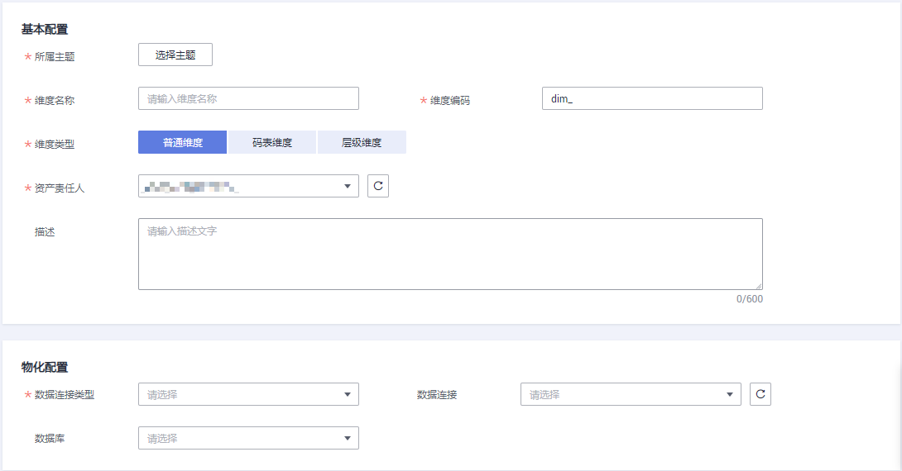
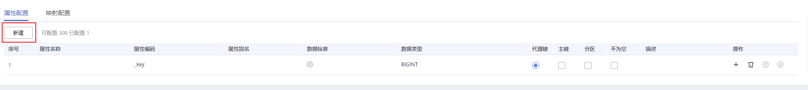
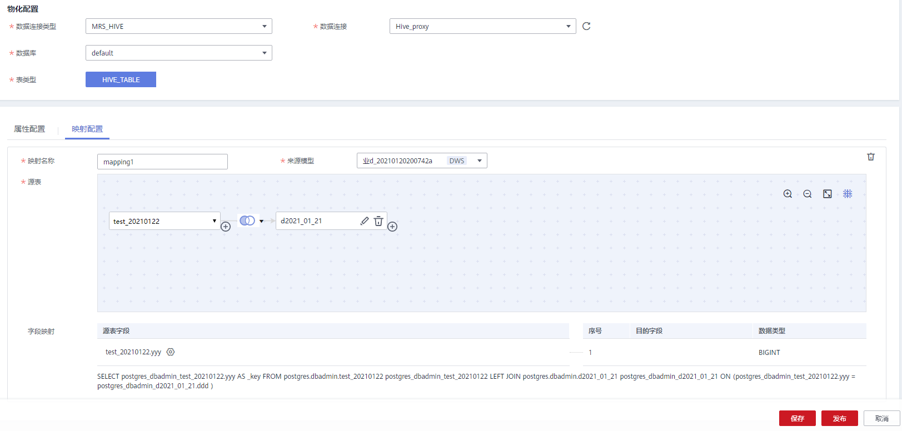
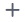
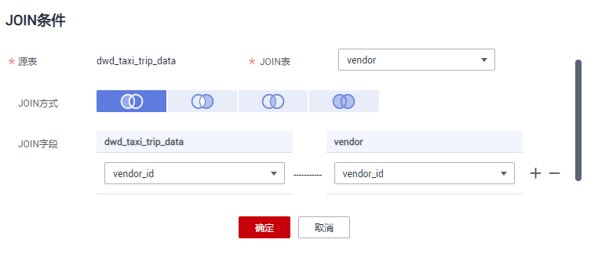
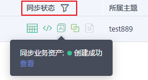
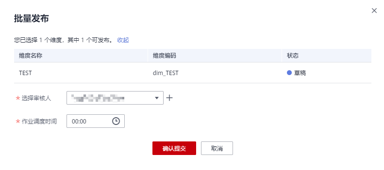
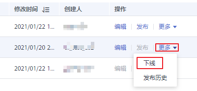
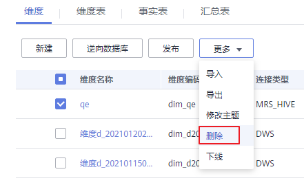

# 新建维度

维度是用于观察和分析业务数据的视角，支撑对数据汇聚、钻取、切片分析，用于SQL中的GROUP BY条件。维度多数具有层级结构，如：地理维度\(其中包括国家、地区、省以及城市等级别的内容\)、时间维度\(其中包括年度、季度、月度等级别的内容\)。创建维度，即从顶层规范业务中实体（或称主数据）的存在性及唯一性。

## 对系统的影响

维度发布并通过审核后，系统会自动创建与维度相对应的维度表，维度表的名称和编码均与维度相同。

## 新建维度并发布

1.  在DGC控制台首页，选择对应工作空间的“规范设计“模块，进入规范设计页面。

    **图 1**  选择规范设计  
    

2.  在规范设计控制台，单击左侧导航树中的“维度建模“，选择“维度”页签进入维度页面。
3.  在左侧主题目录中选中一个对象，然后单击“新建“开始新建维度。

    在新建维度之前，如果您尚未添加主题信息，请先参考[主题设计](主题设计.md)添加主题信息。

4.  在“新建维度“页面，根据页面提示配置参数。

    “基本配置“和“物化配置“，设置如下：

    **图 2**  配置参数  
    

    **表 1**  基本配置

    
    <table><thead align="left"><tr id="row962234213158"><th class="cellrowborder" valign="top" width="19.96%" id="mcps1.2.3.1.1">
参数名称

    </th>
    <th class="cellrowborder" valign="top" width="80.04%" id="mcps1.2.3.1.2">
说明

    </th>
    </tr>
    </thead>
    <tbody><tr id="row19252194603"><td class="cellrowborder" valign="top" width="19.96%" headers="mcps1.2.3.1.1 ">
所属主题

    </td>
    <td class="cellrowborder" valign="top" width="80.04%" headers="mcps1.2.3.1.2 ">
下拉框中选择相应的主题。

    </td>
    </tr>
    <tr id="row1862264241510"><td class="cellrowborder" valign="top" width="19.96%" headers="mcps1.2.3.1.1 ">
维度名称

    </td>
    <td class="cellrowborder" valign="top" width="80.04%" headers="mcps1.2.3.1.2 ">
只能包含中文、英文字母、数字、左右括号、中划线和下划线，且以中文和英文字母开头。

    </td>
    </tr>
    <tr id="row1362264210151"><td class="cellrowborder" valign="top" width="19.96%" headers="mcps1.2.3.1.1 ">
维度编码

    </td>
    <td class="cellrowborder" valign="top" width="80.04%" headers="mcps1.2.3.1.2 ">
在创建维度时，系统将自动创建以“维度编码”名称命名的维度表。只能包含英文字母、数字和下划线，且英文字母开头。

    </td>
    </tr>
    <tr id="row89617353016"><td class="cellrowborder" valign="top" width="19.96%" headers="mcps1.2.3.1.1 ">
维度类型

    </td>
    <td class="cellrowborder" valign="top" width="80.04%" headers="mcps1.2.3.1.2 "><ul id="ul115015151813"><li><strong id="b87711618417">普通维度</strong>：不具有层级结构的维度。</li><li><strong id="b612913225111">码表维度</strong>：基于码表创建的维度，其字段信息、数据与码表保持一致，表示内容是可枚举的维度。</li><li><strong id="b579512510113">层级维度</strong>：属性之间具有层级结构的维度。</li></ul>
    </td>
    </tr>
    <tr id="row153272015310"><td class="cellrowborder" valign="top" width="19.96%" headers="mcps1.2.3.1.1 ">
资产责任人

    </td>
    <td class="cellrowborder" valign="top" width="80.04%" headers="mcps1.2.3.1.2 ">
在下拉列表中选择维度所属的资产责任人。只有工作空间管理员或开发者、运维者角色的用户才可以设置为责任人。

    </td>
    </tr>
    <tr id="row1162315427155"><td class="cellrowborder" valign="top" width="19.96%" headers="mcps1.2.3.1.1 ">
描述

    </td>
    <td class="cellrowborder" valign="top" width="80.04%" headers="mcps1.2.3.1.2 ">
描述信息。支持的长度为0~600个字符。

    </td>
    </tr>
    </tbody>
    </table>

    **表 2**  物化配置

    
    <table><thead align="left"><tr id="zh-cn_topic_0189641497_row197762036123115"><th class="cellrowborder" valign="top" width="20.11%" id="mcps1.2.3.1.1">
参数名称

    </th>
    <th class="cellrowborder" valign="top" width="79.89%" id="mcps1.2.3.1.2">
说明

    </th>
    </tr>
    </thead>
    <tbody><tr id="zh-cn_topic_0189641497_row677633619314"><td class="cellrowborder" valign="top" width="20.11%" headers="mcps1.2.3.1.1 ">
数据连接类型

    </td>
    <td class="cellrowborder" valign="top" width="79.89%" headers="mcps1.2.3.1.2 ">
在下拉列表中选择数据连接类型。

    </td>
    </tr>
    <tr id="zh-cn_topic_0189641497_row16670834143220"><td class="cellrowborder" valign="top" width="20.11%" headers="mcps1.2.3.1.1 ">
数据连接

    </td>
    <td class="cellrowborder" valign="top" width="79.89%" headers="mcps1.2.3.1.2 ">
选择所需要的数据连接。

    
如果您还未创建与数据源之间的数据连接，请前往DGC管理中心控制台进行创建，详情请参见<a href="创建数据连接.md">创建数据连接</a>。

    </td>
    </tr>
    <tr id="zh-cn_topic_0189641497_row1136828135512"><td class="cellrowborder" valign="top" width="20.11%" headers="mcps1.2.3.1.1 ">
数据库

    </td>
    <td class="cellrowborder" valign="top" width="79.89%" headers="mcps1.2.3.1.2 ">
选择数据库。如果您还未创建数据库，可以前往DGC数据开发控制台进行创建，详情请参见<a href="新建数据库.md">新建数据库</a>。

    </td>
    </tr>
    <tr id="zh-cn_topic_0189641497_row3973174235516"><td class="cellrowborder" valign="top" width="20.11%" headers="mcps1.2.3.1.1 ">
队列

    </td>
    <td class="cellrowborder" valign="top" width="79.89%" headers="mcps1.2.3.1.2 ">
DLI队列。该参数仅DLI连接类型有效

    </td>
    </tr>
    <tr id="row137344483451"><td class="cellrowborder" valign="top" width="20.11%" headers="mcps1.2.3.1.1 ">
Schema

    </td>
    <td class="cellrowborder" valign="top" width="79.89%" headers="mcps1.2.3.1.2 ">
DWS或POSTGRESQL的模式。该参数在DWS或POSTGRESQL连接类型有效。

    </td>
    </tr>
    <tr id="row1264010091710"><td class="cellrowborder" valign="top" width="20.11%" headers="mcps1.2.3.1.1 ">
表类型

    </td>
    <td class="cellrowborder" valign="top" width="79.89%" headers="mcps1.2.3.1.2 ">
DWS表类型有：

    <ul id="ul44087216447"><li>DWS_ROW：行存表。行存储是指将表按行存储到硬盘分区上。</li><li>DWS_COLUMN：列存表。列存储是指将表按列存储到硬盘分区上。</li></ul>
    
MRS_HIVE类型仅支持HIVE_TABLE。

    </td>
    </tr>
    <tr id="row165439411820"><td class="cellrowborder" valign="top" width="20.11%" headers="mcps1.2.3.1.1 ">
DISTRIBUTE BY

    </td>
    <td class="cellrowborder" valign="top" width="79.89%" headers="mcps1.2.3.1.2 ">
该参数仅DWS连接类型有效。可选取多个字段。

    <ul id="ul127771830202310"><li><strong id="dgc_01_0612_b1868451921417">REPLICATION</strong>：在每一个DN节点上存储一份全量表数据。这种存储方式的优点是每个DN上都有此表的全量数据，在join操作中可以避免数据重分布操作，从而减小网络开销；缺点是每个DN都保留了表的完整数据，造成数据的冗余。一般情况下只有较小的维度表才会定义为Replication表。</li><li><strong id="dgc_01_0612_b73401025161410">HASH</strong>：采用这种分布方式，需要为用户表指定一个分布列（distribute key）。当插入一条记录时，系统会根据分布列的值进行hash运算后，将数据存储在对应的DN中。对于Hash分布表，在读/写数据时可以利用各个节点的IO资源，大大提升表的读/写速度。一般情况下大表（1000000条记录以上）定义为Hash表。</li></ul>
    </td>
    </tr>
    </tbody>
    </table>

    在“属性配置“中添加维度属性，单击“新建“按钮，可以添加多个维度属性。

    **图 3**  属性配置  
    

    **表 3**  属性配置

    
    <table><thead align="left"><tr id="row1962317428155"><th class="cellrowborder" valign="top" width="20.22%" id="mcps1.2.3.1.1">
参数名称

    </th>
    <th class="cellrowborder" valign="top" width="79.78%" id="mcps1.2.3.1.2">
说明

    </th>
    </tr>
    </thead>
    <tbody><tr id="row1662317428156"><td class="cellrowborder" valign="top" width="20.22%" headers="mcps1.2.3.1.1 ">
属性名称

    </td>
    <td class="cellrowborder" valign="top" width="79.78%" headers="mcps1.2.3.1.2 ">
只能包含中文、英文字母、数字、左右括号、中划线和下划线，且以中文和英文字母开头。

    </td>
    </tr>
    <tr id="row1662384211157"><td class="cellrowborder" valign="top" width="20.22%" headers="mcps1.2.3.1.1 ">
属性编码

    </td>
    <td class="cellrowborder" valign="top" width="79.78%" headers="mcps1.2.3.1.2 ">
只能包含英文字母、数字和下划线，且英文字母开头。

    </td>
    </tr>
    <tr id="row1046113615253"><td class="cellrowborder" valign="top" width="20.22%" headers="mcps1.2.3.1.1 ">
数据标准

    </td>
    <td class="cellrowborder" valign="top" width="79.78%" headers="mcps1.2.3.1.2 ">
单击按钮可以选择一个数据标准与字段相关联。在“配置中心 &gt; 功能配置”页面中的“模型设计业务流程步骤 &gt; 创建质量作业”勾选的情况下，将字段关联数据标准后，维度发布上线后，就会自动生成一个质量作业，每个关联了数据标准的字段会生成一个质量规则，基于数据标准对字段进行质量监控，您可以前往DGC数据质量模块的“质量作业”页面进行查看。

    
如果您还未创建数据标准，请参见<a href="新建数据标准.md">新建数据标准</a>进行创建。

    </td>
    </tr>
    <tr id="row146231642161511"><td class="cellrowborder" valign="top" width="20.22%" headers="mcps1.2.3.1.1 ">
数据类型

    </td>
    <td class="cellrowborder" valign="top" width="79.78%" headers="mcps1.2.3.1.2 ">
根据原始数据定义数据类型。

    </td>
    </tr>
    <tr id="row1362374201517"><td class="cellrowborder" valign="top" width="20.22%" headers="mcps1.2.3.1.1 ">
代理键

    </td>
    <td class="cellrowborder" valign="top" width="79.78%" headers="mcps1.2.3.1.2 ">
请根据业务需求选择合适的字段作为代理键。系统默认第一个维度属性为代理键。

    </td>
    </tr>
    <tr id="row20568132914137"><td class="cellrowborder" valign="top" width="20.22%" headers="mcps1.2.3.1.1 ">
主键

    </td>
    <td class="cellrowborder" valign="top" width="79.78%" headers="mcps1.2.3.1.2 ">
请根据业务需求选择合适的字段作为主键。

    </td>
    </tr>
    <tr id="row166231442201510"><td class="cellrowborder" valign="top" width="20.22%" headers="mcps1.2.3.1.1 ">
分区

    </td>
    <td class="cellrowborder" valign="top" width="79.78%" headers="mcps1.2.3.1.2 ">
是否设置为分区字段。

    </td>
    </tr>
    <tr id="row206241342141514"><td class="cellrowborder" valign="top" width="20.22%" headers="mcps1.2.3.1.1 ">
不为空

    </td>
    <td class="cellrowborder" valign="top" width="79.78%" headers="mcps1.2.3.1.2 ">
是否限制该字段不为空。

    </td>
    </tr>
    <tr id="row1862454211519"><td class="cellrowborder" valign="top" width="20.22%" headers="mcps1.2.3.1.1 ">
描述

    </td>
    <td class="cellrowborder" valign="top" width="79.78%" headers="mcps1.2.3.1.2 ">
输入维度属性的描述信息。

    </td>
    </tr>
    </tbody>
    </table>

    在“映射配置“页签，单击“新建映射“，创建维度与事实表的映射。需配置如下参数：

    **图 4**  映射配置  
    

    **表 4**  映射参数

    
    <table><thead align="left"><tr id="dgc_01_0606_row9103103404018"><th class="cellrowborder" valign="top" width="15.76%" id="mcps1.2.3.1.1">
参数名称

    </th>
    <th class="cellrowborder" valign="top" width="84.24000000000001%" id="mcps1.2.3.1.2">
说明

    </th>
    </tr>
    </thead>
    <tbody><tr id="dgc_01_0606_row210314341408"><td class="cellrowborder" valign="top" width="15.76%" headers="mcps1.2.3.1.1 ">
映射名称

    </td>
    <td class="cellrowborder" valign="top" width="84.24000000000001%" headers="mcps1.2.3.1.2 ">
只能包含中文、英文字母、数字和下划线。

    </td>
    </tr>
    <tr id="dgc_01_0606_row31031134124016"><td class="cellrowborder" valign="top" width="15.76%" headers="mcps1.2.3.1.1 ">
来源模型

    </td>
    <td class="cellrowborder" valign="top" width="84.24000000000001%" headers="mcps1.2.3.1.2 ">
在下拉列表中选择一个已创建的关系模型。如果未创建关系模型，请参见<a href="物理模型设计.md">物理模型设计</a>进行创建。

    </td>
    </tr>
    <tr id="dgc_01_0606_row710313411408"><td class="cellrowborder" valign="top" width="15.76%" headers="mcps1.2.3.1.1 ">
源表

    </td>
    <td class="cellrowborder" valign="top" width="84.24000000000001%" headers="mcps1.2.3.1.2 ">
选择数据来源的表，如果数据来源于一个模型中的多个表，可以单击表名后的按钮为该表和其他表之间设置JOIN。

    <ol id="dgc_01_0606_ol143116274386"><li>选择一种“JOIN方式”，“JOIN方式”从左到右依次表示left JOIN、right JOIN、inner JOIN、outer JOIN。</li><li>在“JOIN字段”中设置JOIN条件，JOIN条件一般选择源表和JOIN表中含义相同的字段，单击或按钮增加或删除JOIN条件。JOIN条件之间是and的关系。</li><li>单击“确定”完成设置。</li><li>设置JOIN后，如果想删除JOIN表，单击所需删除的表名后的按钮就可以删除该JOIN表。</li></ol>
    
<b>图1 </b>JOIN条件 

    </td>
    </tr>
    <tr id="dgc_01_0606_row12104133414014"><td class="cellrowborder" valign="top" width="15.76%" headers="mcps1.2.3.1.1 ">
字段映射

    </td>
    <td class="cellrowborder" valign="top" width="84.24000000000001%" headers="mcps1.2.3.1.2 ">
为来源于当前映射的字段，依次选择一个含义相同的源字段。如果表字段来源于多个模型，您需要新建多个映射，每个映射中，您只需要为来源于当前映射的字段设置源字段，其他字段可以不设置。

    </td>
    </tr>
    </tbody>
    </table>

    在映射区域的右上角，单击按钮，可以删除指定的映射，单击可以收起映射区域。

5.  配置完成后，单击“发布“。
6.  在弹出对话框中，选择审核人，单击“确认提交“，完成发布。
7.  可以参照步骤[3](#li16622154291517)\~步骤[6](#li136246429151)，完成其他维度的创建和发布。
8.  完成所有维度的新建和发布之后，需要等待审核人员审核。

    审核通过后，系统会自动创建与维度相对应的维度表，维度表的名称和编码均与维度相同。在“维度建模”页面，选择“维度表”页签，可以查看建好的维度表。

    在维度表列表中，在“同步状态“一列中可以查看维度表的同步状态。

    **图 6**  维度表的同步状态  
    

    -   如果同步状态均显示成功，则说明维度发布成功，维度表在数据库中创建成功。
    -   如果同步状态中存在失败，可单击该维度表所在行的“发布历史“，然后在展开的页面中进入“发布日志”页签查看日志。请根据错误日志定位失败原因，问题解决后，您可以返回维度表页面勾选该维度表，再单击列表上方的“同步“按钮尝试重新同步。如果问题仍未能解决，请联系技术支持人员协助处理。

## 编辑维度

1.  在规范设计控制台，单击左侧导航树中的“维度建模“，进入相应页面后，选择“维度”页签。
2.  在维度列表中找到需要编辑的维度，单击“编辑“，进入编辑维度页面。

    **图 7**  编辑维度  
    

3.  根据实际需要编辑维度的相关信息，参数配置请参考[配置参数](#li18622742181513)。
4.  单击“保存“，保存所做的修改。或者，单击“发布“，发布修改后维度。

## 发布维度

如果新建了维度但并未发布，可以执行以下步骤发布维度：

1.  在规范设计控制台，单击左侧导航树中的“维度建模“，进入相应页面后，选择“维度”页签。
2.  在维度列表中找到需要发布的维度，单击“发布“。

    **图 8**  发布维度  
    

3.  在弹出对话框中，选择审核人，单击“确认提交“，完成发布。

您也可以执行以下步骤批量发布维度：

1.  在规范设计控制台，单击左侧导航树中的“维度建模“，进入相应页面后，选择“维度”页签。
2.  在维度列表中勾选需要发布的维度，单击列表上方的“发布“。

    **图 9**  批量发布维度  
    

3.  在弹出对话框中，选择审核人和作业调度时间，单击“确认提交“，完成发布。

    注意，此处“作业调度时间”指的是维度发布后，自动创建质量作业的调度时间。

    **图 10**  批量发布维度  
    

## 下线维度

对于已发布的维度，可以执行以下步骤下线维度：

1.  在规范设计控制台，单击左侧导航树中的“维度建模“，进入相应页面后，选择“维度”页签。
2.  在维度列表中找到需要下线的维度，单击“下线“。

    **图 11**  下线维度  
    

3.  在弹出对话框中，选择审核人，然后单击“确认提交“，完成维度的下线。

## 删除维度

如果您已不再需要某个维度，可以删除该维度。如果待删除的维度已发布，则无法执行删除操作，您必须先将该维度下线后，才能执行删除操作，具体操作请参见[下线维度](#zh-cn_topic_0171848089_section12843562212)。

1.  在规范设计控制台，单击左侧导航树中的“维度建模“，进入相应页面后，选择“维度”页签。
2.  在维度列表中找到需要删除的维度，勾选该维度，然后单击维度列表上方“更多“中的“删除“按钮。

    **图 12**  删除  
    

3.  在系统弹出的“删除“对话框中，确认无误后，单击“确定“将维度删除。

    删除弹框中的“删除物理表“勾选后，删除时将同步删除数据库里的物理表

