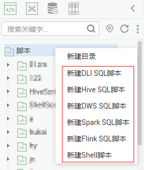

# 新建脚本

DLF的脚本开发功能支持在线编辑、调试和执行脚本，开发脚本前请先新建脚本。

## 新建目录（可选）

如果已存在可用的目录，可以不用新建目录。

1.  在数据开发主界面的左侧导航栏，选择“数据开发  \>  脚本开发“。
2.  在脚本目录中，右键单击目录名称，选择“新建目录“。
3.  在弹出的“新建目录“页面，配置如[表1](#zh-cn_topic_0104967364_table198901741223)所示的参数。

    **表 1**  脚本目录参数

    
    <table><thead align="left"><tr id="zh-cn_topic_0104967364_row78906419215"><th class="cellrowborder" valign="top" width="30.830000000000002%" id="mcps1.2.3.1.1">
参数

    </th>
    <th class="cellrowborder" valign="top" width="69.17%" id="mcps1.2.3.1.2">
说明

    </th>
    </tr>
    </thead>
    <tbody><tr id="zh-cn_topic_0104967364_row2890941923"><td class="cellrowborder" valign="top" width="30.830000000000002%" headers="mcps1.2.3.1.1 ">
目录名称

    </td>
    <td class="cellrowborder" valign="top" width="69.17%" headers="mcps1.2.3.1.2 ">
脚本目录的名称，只能包含英文字母、数字、中文字符、“_”、“-”，且长度为1~32个字符。

    </td>
    </tr>
    <tr id="zh-cn_topic_0104967364_row169062418212"><td class="cellrowborder" valign="top" width="30.830000000000002%" headers="mcps1.2.3.1.1 ">
选择目录

    </td>
    <td class="cellrowborder" valign="top" width="69.17%" headers="mcps1.2.3.1.2 ">
选择该脚本目录的父级目录，父级目录默认为根目录。

    </td>
    </tr>
    </tbody>
    </table>

4.  单击“确定“，新建目录。

## 新建脚本

DLF目前支持新建以下几种脚本，用户可根据需要新建相应的脚本。

-   DLI SQL脚本
-   Hive SQL脚本
-   DWS SQL脚本
-   Spark SQL脚本
-   Flink SQL脚本
-   RDS SQL脚本
-   Shell脚本

## 前提条件

脚本的最大配额是1000，请确保当前脚本的数量未达到最大配额。

## 操作步骤

1.  在数据开发主界面的左侧导航栏，选择“数据开发  \>  脚本开发“。
2.  新建脚本的方式有如下两种：

    方式一：在“右侧区域“，单击“新建SQL脚本“/“新建Shell脚本“。

    **图 1**  新建SQL脚本（方式一）  
    

    **图 2**  新建Shell脚本（方式一）  
    

    方式二：在脚本目录中，右键单击目录名称，选择新建相应的脚本。

    **图 3**  新建脚本（方式二）  
    

3.  进入脚本开发页面，具体操作请参见[开发SQL脚本](开发SQL脚本.md)、[开发Shell脚本](开发Shell脚本.md)。

