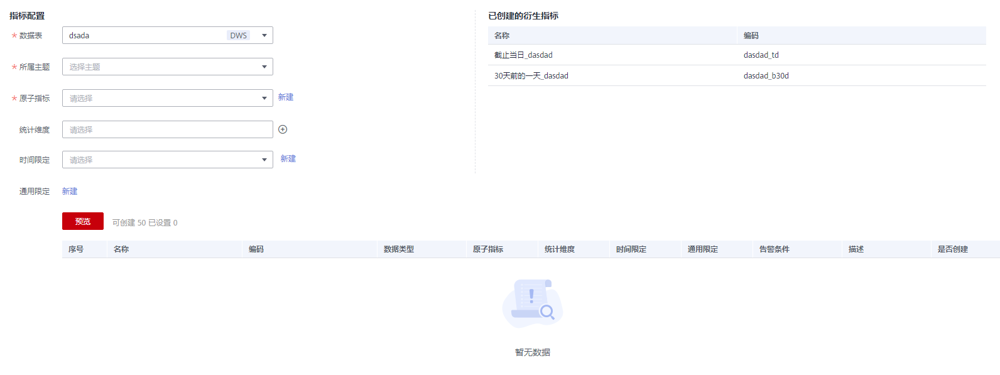

# 新建衍生指标

衍生指标是原子指标通过添加限定、维度卷积而成，限定、维度均来源于原子指标中的属性。发布衍生指标时，会自动生成一张汇总表，可在“汇总表-自动汇聚”下查看。

衍生指标=原子指标+统计维度+时间限定+通用限定。

-   **原子指标**：明确统计口径，即计算逻辑。
-   **统计维度**：用于观察和分析业务数据的视角，支撑对数据进行汇聚、钻取、切片分析，用于SQL中的GROUP BY条件。
-   **时间限定**：时间限定是时间条件限制的标准化定义。
-   **通用限定**：统计的业务范围，筛选出符合业务规则的记录（类似于SQL中where后面的条件，不包括时间区间）。

## 前提条件

-   在新建衍生指标之前，请先确认原子指标已经新建并通过审核。
-   如果衍生指标将使用统计维度或时间限定，请先确认维度或时间限定已经新建并通过审核。

## 新建衍生指标并发布

1.  在DGC控制台首页，选择对应工作空间的“规范设计“模块，进入规范设计页面。

    **图 1**  选择规范设计  
    

2.  在规范设计控制台，单击左侧导航树中的“技术指标“，选择“衍生指标“页签进入衍生指标页面。
3.  在左侧的主题目录中选中一个主题，然后单击“新建“按钮，开始新建衍生指标。
4.  在新建衍生指标页面，根据页面提示配置参数。

    **图 2**  新建衍生指标  
    

    **表 1**  新建衍生指标参数说明

    
    <table><thead align="left"><tr id="row11705174116477"><th class="cellrowborder" valign="top" width="14.39%" id="mcps1.2.3.1.1">
参数名称

    </th>
    <th class="cellrowborder" valign="top" width="85.61%" id="mcps1.2.3.1.2">
说明

    </th>
    </tr>
    </thead>
    <tbody><tr id="row8477123481318"><td class="cellrowborder" valign="top" width="14.39%" headers="mcps1.2.3.1.1 ">
数据表

    </td>
    <td class="cellrowborder" valign="top" width="85.61%" headers="mcps1.2.3.1.2 ">
在下拉列表中选择即可。

    </td>
    </tr>
    <tr id="row1170513419476"><td class="cellrowborder" valign="top" width="14.39%" headers="mcps1.2.3.1.1 ">
原子指标

    </td>
    <td class="cellrowborder" valign="top" width="85.61%" headers="mcps1.2.3.1.2 ">
选择原子指标。

    </td>
    </tr>
    <tr id="row12705841144717"><td class="cellrowborder" valign="top" width="14.39%" headers="mcps1.2.3.1.1 ">
所属主题

    </td>
    <td class="cellrowborder" valign="top" width="85.61%" headers="mcps1.2.3.1.2 ">
显示所属的主题信息。

    </td>
    </tr>
    <tr id="row3705124154711"><td class="cellrowborder" valign="top" width="14.39%" headers="mcps1.2.3.1.1 ">
统计维度

    </td>
    <td class="cellrowborder" valign="top" width="85.61%" headers="mcps1.2.3.1.2 ">
在下拉列表中，选择一个或多个维度。此处只能选择原子指标所关联的事实表中的属性。

    </td>
    </tr>
    <tr id="row87057411477"><td class="cellrowborder" valign="top" width="14.39%" headers="mcps1.2.3.1.1 ">
时间限定

    </td>
    <td class="cellrowborder" valign="top" width="85.61%" headers="mcps1.2.3.1.2 ">
在下拉框中选择所需要的时间限定，并选择关联的字段。系统预置了一些时间限定，如果不能满足需求，请参考<a href="新建时间限定.md">新建时间限定</a>进行创建。

    </td>
    </tr>
    <tr id="row970514110471"><td class="cellrowborder" valign="top" width="14.39%" headers="mcps1.2.3.1.1 ">
通用限定

    </td>
    <td class="cellrowborder" valign="top" width="85.61%" headers="mcps1.2.3.1.2 ">
如需设置通用限定，可以单击“新建”按钮新建一个或多个通用限定。

    
如<a href="#fig4101146521">图3</a>所示，在新建通用限定区域，通过以下配置新建一个通用限定。

    <ul id="ul666615365112"><li><strong id="b037362716126">限定名称</strong>：指定通用限定的名称。</li><li><strong id="b1275183019122">添加条件(且)</strong>：单击该下拉框，选择“且条件”或者“或条件”可以添加相应的条件，然后在字段下拉框中选择一个字段，并根据页面提示设置条件。您可以添加多个条件。
在某个条件后面单击删除按钮，可以将该条件删除。

    </li><li><strong id="b4896103361218">添加公式(且)</strong>：单击该下拉框，选择“且公式”或者“或公式”可以添加相应的公式，然后再单击“编辑公式”按钮，在弹出对话框中选择所需要的“函数”和“字段”，并设置“表达式”。
在某个公式后面单击删除按钮，可以将该公式删除。

    </li></ul>
    
<b>图1 </b>通用限定 

    </td>
    </tr>
    <tr id="row10875576919"><td class="cellrowborder" valign="top" width="14.39%" headers="mcps1.2.3.1.1 ">
告警配置

    </td>
    <td class="cellrowborder" valign="top" width="85.61%" headers="mcps1.2.3.1.2 ">
由衍生指标和表达式组成，表达式由告警参数和逻辑运算符组成。在指标运行时，系统将计算出告警条件表达式的结果，并根据表达式的结果是否为真来判断是否触发告警。如果表达式的结果为真则触发质量告警，结果为假则不触发质量告警。

    </td>
    </tr>
    <tr id="row137051641184715"><td class="cellrowborder" valign="top" width="14.39%" headers="mcps1.2.3.1.1 ">
描述

    </td>
    <td class="cellrowborder" valign="top" width="85.61%" headers="mcps1.2.3.1.2 ">
描述信息。支持的长度为0~600个字符。

    </td>
    </tr>
    </tbody>
    </table>

5.  在页面下方，单击“试运行“按钮，然后在弹出框中单击“试运行“按钮，测试所设置的衍生指标是否可以正常运行。

    如果试运行失败，请根据错误提示定位错误原因，将配置修改正确后，再单击“试运行“按钮进行重试。

6.  如果试运行成功，单击“发布“，提交发布审核。
7.  在弹出框中单击“确认提交”，提交审核。
8.  （可选）参考步骤[2](#li1970404114710)\~步骤[7](#li8705174144717)，完成其他衍生指标的发布。
9.  等待审核人员审核。

    审核通过后，衍生指标就创建好了。

## 管理衍生指标

进入规范设计的“技术指标 \> 衍生指标“页面，您可以对衍生指标进行编辑、发布、下线、查看发布历史或删除操作。

**图 4**  管理衍生指标  

1.  在规范设计控制台，单击左侧导航树中的“技术指标“，选择“衍生指标“页签，进入衍生指标页面。
2.  您可以根据实际需要选择如下操作。

    
    <table><thead align="left"><tr id="zh-cn_topic_0169427300_row167461051211"><th class="cellrowborder" valign="top" width="37.9%" id="mcps1.1.3.1.1">
当需要...

    </th>
    <th class="cellrowborder" valign="top" width="62.1%" id="mcps1.1.3.1.2">
则...

    </th>
    </tr>
    </thead>
    <tbody><tr id="zh-cn_topic_0169427300_row1674695011"><td class="cellrowborder" valign="top" width="37.9%" headers="mcps1.1.3.1.1 ">
新建

    </td>
    <td class="cellrowborder" valign="top" width="62.1%" headers="mcps1.1.3.1.2 ">
执行<a href="#zh-cn_topic_0169427300_section39831040124813">新建衍生指标并发布</a>。

    </td>
    </tr>
    <tr id="zh-cn_topic_0169427300_row137468516113"><td class="cellrowborder" valign="top" width="37.9%" headers="mcps1.1.3.1.1 ">
编辑

    </td>
    <td class="cellrowborder" valign="top" width="62.1%" headers="mcps1.1.3.1.2 ">
执行<a href="#li12839256152718">3</a>。

    </td>
    </tr>
    <tr id="zh-cn_topic_0169427300_row1746651110"><td class="cellrowborder" valign="top" width="37.9%" headers="mcps1.1.3.1.1 ">
发布

    </td>
    <td class="cellrowborder" valign="top" width="62.1%" headers="mcps1.1.3.1.2 ">
执行<a href="#li17839165620275">4</a>。

    </td>
    </tr>
    <tr id="row1723810371113"><td class="cellrowborder" valign="top" width="37.9%" headers="mcps1.1.3.1.1 ">
查看发布历史

    </td>
    <td class="cellrowborder" valign="top" width="62.1%" headers="mcps1.1.3.1.2 ">
执行<a href="#li16611939213">5</a>

    </td>
    </tr>
    <tr id="row8621940415"><td class="cellrowborder" valign="top" width="37.9%" headers="mcps1.1.3.1.1 ">
预览SQL

    </td>
    <td class="cellrowborder" valign="top" width="62.1%" headers="mcps1.1.3.1.2 ">
执行<a href="#li12291591422">6</a>

    </td>
    </tr>
    <tr id="zh-cn_topic_0169427300_row87708551950"><td class="cellrowborder" valign="top" width="37.9%" headers="mcps1.1.3.1.1 ">
下线

    </td>
    <td class="cellrowborder" valign="top" width="62.1%" headers="mcps1.1.3.1.2 ">
执行<a href="#li19839115617277">7</a>。

    </td>
    </tr>
    <tr id="zh-cn_topic_0169427300_row9597213538"><td class="cellrowborder" valign="top" width="37.9%" headers="mcps1.1.3.1.1 ">
删除

    </td>
    <td class="cellrowborder" valign="top" width="62.1%" headers="mcps1.1.3.1.2 ">
执行<a href="#li48394564278">9</a>。

    </td>
    </tr>
    </tbody>
    </table>

3.  编辑
    1.  在需要编辑的衍生指标右侧，单击“编辑“，进入编辑衍生指标页面。
    2.  根据实际需要编辑相关内容。
    3.  在页面下方，单击“试运行“按钮，然后在弹出框中单击“试运行“按钮，测试所设置的衍生指标是否可以正常运行。

        如果试运行失败，请根据错误提示定位错误原因，将配置修改正确后，再单击“试运行“按钮进行重试。

    4.  如果试运行成功，单击“发布“，提交发布审核。

4.  发布
    1.  在需要发布的衍生指标右侧，单击“发布“，弹出“提交发布“对话框。
    2.  在下拉菜单中选择审核人。
    3.  单击“确认提交“。

5.  查看发布历史
    1.  在列表中，找到需要查看的衍生指标，在右侧单击“更多 \> 发布历史“，将显示“发布历史“页面。
    2.  在“发布历史”中，您可以查看衍生指标的发布历史和版本对比信息。

6.  预览SQL
    1.  在列表中，找到所需要的衍生指标，在右侧单击“更多 \> 预览SQL“，弹出“预览SQL“对话框。
    2.  在“预览SQL”中，您可以查看SQL语句，也可以复制SQL。

7.  下线
    1.  在需要下线的衍生指标右侧，单击“更多 \> 下线“，系统弹出“提交下线“对话框。
    2.  在下拉菜单中选择审核人。
    3.  单击“确认提交“。

8.  查看汇总表

    在需要查看汇总表的指标右侧，选择“更多 \> 查看汇总表“，跳转到汇总表页面。

9.  删除
    1.  在衍生指标列表中，勾选需要删除的衍生指标，单击页面上方“更多 \> 删除“，系统弹出“删除“对话框。
    2.  单击“是“。

