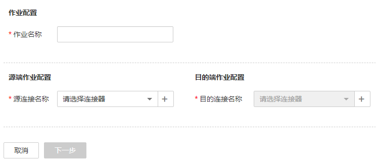
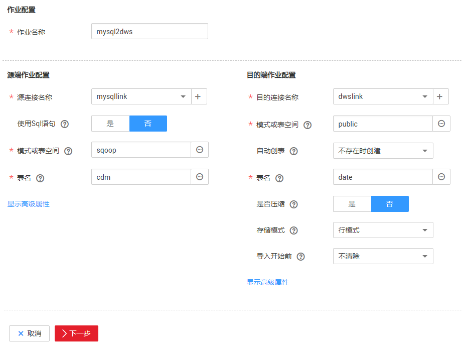
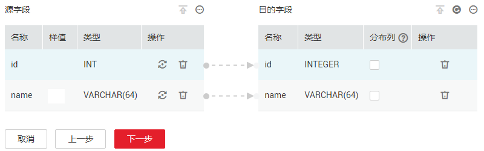
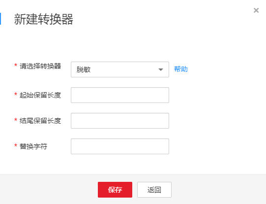

# 新建表/文件迁移作业

## 操作场景

CDM可以实现在同构、异构数据源之间进行表或文件级别的数据迁移，支持表/文件迁移的数据源请参见[CDM支持的数据源](https://support.huaweicloud.com/productdesc-cdm/cdm_01_0095.html)。

适用于数据上云、云服务间数据交换、云上数据回流到本地业务系统。

## 前提条件

-   已[新建连接](新建连接.md)。
-   CDM集群与待迁移数据源可以正常通信。

## 操作步骤

1.  [登录DAYU控制台](https://console.huaweicloud.com/dayu/)，找到所需要的DAYU实例，单击实例卡片上的“进入控制台”，进入概览页面。

    选择“空间管理”页签，完成工作空间的创建。

    在工作空间列表中，找到所需要的工作空间。

1.  单击相应工作空间的“数据集成“。

    系统跳转至数据集成页面。

1.  选择批量数据迁移集群管理，进入集群管理界面。选择集群后的“作业管理“。
2.  单击“表/文件迁移  \>  新建作业“，进入作业配置界面。

    **图 1**  新建表/文件迁移的作业  
    

3.  选择源连接、目的连接：
    1.  作业名称：用户自定义任务名称，名称由英文字母、下划线或者数字组成，长度必须在1到256个字符之间，例如“oracle2obs\_t“。
    2.  源连接名称：选择待迁移数据的数据源，作业运行时将从此端复制导出数据。
    3.  目的连接名称：选择将数据迁移到哪个数据源，作业运行时会将数据导入此端。

4.  如果此处没有可选的连接，可单击“+“添加或者在“连接管理“界面中添加，具体操作请参见[新建连接](新建连接.md)。
5.  选择源连接后，配置作业参数，例如迁移MySQL到DWS时，如[图2](#zh-cn_topic_0108275458_fig22447296174853)所示。

    **图 2**  新建作业  
    

    每种数据源对应的作业参数不一样，其它类型数据源的作业参数请根据[表1](#zh-cn_topic_0108275458_table14973632102118)和[表2](#zh-cn_topic_0108275458_table64470284115654)选择。

    **表 1**  源端作业参数说明

    
    <table><thead align="left"><tr id="zh-cn_topic_0108275458_row20487414102118"><th class="cellrowborder" valign="top" width="30%" id="mcps1.2.4.1.1">
源端类型

    </th>
    <th class="cellrowborder" valign="top" width="40%" id="mcps1.2.4.1.2">
说明

    </th>
    <th class="cellrowborder" valign="top" width="30%" id="mcps1.2.4.1.3">
参数配置

    </th>
    </tr>
    </thead>
    <tbody><tr id="zh-cn_topic_0108275458_row54909470102118"><td class="cellrowborder" valign="top" width="30%" headers="mcps1.2.4.1.1 "><ul id="zh-cn_topic_0108275458_ul18636430135610"><li>OBS</li><li>阿里云OSS</li><li>七牛云KODO</li><li>腾讯云COS</li></ul>
    </td>
    <td class="cellrowborder" valign="top" width="40%" headers="mcps1.2.4.1.2 ">
支持以CSV、JSON、CarbonData格式或二进制格式抽取数据，其中二进制方式不解析文件内容，性能快，适合文件迁移。

    
暂不支持导入数据到阿里云OSS、七牛云KODO、腾讯云COS。

    </td>
    <td class="cellrowborder" valign="top" width="30%" headers="mcps1.2.4.1.3 ">
参见<a href="配置对象存储源端参数.md">配置对象存储源端参数</a>。

    </td>
    </tr>
    <tr id="zh-cn_topic_0108275458_row22465714102118"><td class="cellrowborder" valign="top" width="30%" headers="mcps1.2.4.1.1 "><ul id="zh-cn_topic_0108275458_ul512454321014"><li>MRS HDFS</li><li>FusionInsight HDFS</li><li>Apache HDFS</li></ul>
    </td>
    <td class="cellrowborder" valign="top" width="40%" headers="mcps1.2.4.1.2 ">
支持以CSV、Parquet或二进制格式抽取HDFS数据，支持多种压缩格式。

    </td>
    <td class="cellrowborder" valign="top" width="30%" headers="mcps1.2.4.1.3 ">
参见<a href="配置HDFS源端参数.md">配置HDFS源端参数</a>。

    </td>
    </tr>
    <tr id="zh-cn_topic_0108275458_row39360206102118"><td class="cellrowborder" valign="top" width="30%" headers="mcps1.2.4.1.1 "><ul id="zh-cn_topic_0108275458_ul156301658131120"><li>MRS HBase</li><li>FusionInsight HBase</li><li>Apache HBase</li><li>CloudTable</li></ul>
    </td>
    <td class="cellrowborder" valign="top" width="40%" headers="mcps1.2.4.1.2 ">
支持从MRS、FusionInsight HD、开源Apache Hadoop的HBase，或CloudTable服务导出数据，用户需要知道HBase表的所有列族和字段名。

    </td>
    <td class="cellrowborder" valign="top" width="30%" headers="mcps1.2.4.1.3 ">
参见<a href="配置HBase-CloudTable源端参数.md">配置HBase/CloudTable源端参数</a>。

    </td>
    </tr>
    <tr id="zh-cn_topic_0108275458_row44356635102118"><td class="cellrowborder" valign="top" width="30%" headers="mcps1.2.4.1.1 ">
MRS Hive

    </td>
    <td class="cellrowborder" valign="top" width="40%" headers="mcps1.2.4.1.2 ">
支持从Hive导出数据，使用JDBC接口抽取数据。

    
Hive作为数据源，CDM自动使用Hive数据分片文件进行数据分区。

    </td>
    <td class="cellrowborder" valign="top" width="30%" headers="mcps1.2.4.1.3 ">
参见<a href="配置Hive源端参数.md">配置Hive源端参数</a>。

    </td>
    </tr>
    <tr id="zh-cn_topic_0108275458_row39564001104154"><td class="cellrowborder" valign="top" width="30%" headers="mcps1.2.4.1.1 "><ul id="zh-cn_topic_0108275458_ul59703381316"><li>FTP</li><li>SFTP</li><li>NAS</li><li>SFS Turbo</li></ul>
    </td>
    <td class="cellrowborder" valign="top" width="40%" headers="mcps1.2.4.1.2 ">
支持以CSV、JSON或二进制格式抽取FTP/SFTP/NAS/SFS的数据。

    </td>
    <td class="cellrowborder" valign="top" width="30%" headers="mcps1.2.4.1.3 ">
参见<a href="配置FTP-SFTP-NAS-SFS源端参数.md">配置FTP/SFTP/NAS/SFS源端参数</a>。

    </td>
    </tr>
    <tr id="zh-cn_topic_0108275458_row480315388201"><td class="cellrowborder" valign="top" width="30%" headers="mcps1.2.4.1.1 "><ul id="zh-cn_topic_0108275458_ul1324644112014"><li>HTTP</li><li>HTTPS</li></ul>
    </td>
    <td class="cellrowborder" valign="top" width="40%" headers="mcps1.2.4.1.2 ">
用于读取一个公网HTTP/HTTPS URL的文件，包括第三方对象存储的公共读取场景和网盘场景。

    
当前只支持从HTTP/HTTPS URL导出数据，不支持导入。

    </td>
    <td class="cellrowborder" valign="top" width="30%" headers="mcps1.2.4.1.3 ">
参见<a href="配置HTTP-HTTPS源端参数.md">配置HTTP/HTTPS源端参数</a>。

    </td>
    </tr>
    <tr id="zh-cn_topic_0108275458_row21323854102118"><td class="cellrowborder" valign="top" width="30%" headers="mcps1.2.4.1.1 "><ul id="zh-cn_topic_0108275458_ul112531201645"><li>数据仓库（DWS）</li><li>云数据库 MySQL</li><li>云数据库 SQL Server</li><li>云数据库 PostgreSQL</li><li>分布式数据库中间件（DDM）</li></ul>
    </td>
    <td class="cellrowborder" valign="top" width="40%" headers="mcps1.2.4.1.2 ">
支持从云端的数据库服务导出数据。

    </td>
    <td class="cellrowborder" rowspan="3" valign="top" width="30%" headers="mcps1.2.4.1.3 ">
从这些数据源导出数据时，CDM使用JDBC接口抽取数据，源端作业参数相同，详细请参见<a href="配置关系数据库源端参数.md">配置关系数据库源端参数</a>。

    </td>
    </tr>
    <tr id="zh-cn_topic_0108275458_row565171182014"><td class="cellrowborder" valign="top" headers="mcps1.2.4.1.1 "><ul id="zh-cn_topic_0108275458_ul08187101908"><li>FusionInsight LibrA</li><li>Derecho（GaussDB）</li></ul>
    </td>
    <td class="cellrowborder" valign="top" headers="mcps1.2.4.1.2 ">
支持从FusionInsight LibrA、Derecho导出数据。

    </td>
    </tr>
    <tr id="zh-cn_topic_0108275458_row5232720152118"><td class="cellrowborder" valign="top" headers="mcps1.2.4.1.1 "><ul id="zh-cn_topic_0108275458_ul1484353713574"><li>MySQL</li><li>PostgreSQL</li><li>Oracle</li><li>IBM Db2</li><li>Microsoft SQL Server</li></ul>
    </td>
    <td class="cellrowborder" valign="top" headers="mcps1.2.4.1.2 ">
这些非云服务的数据库，既可以是用户在本地数据中心自建的数据库，也可以是用户在ECS上部署的，还可以是第三方云上的数据库服务。

    </td>
    </tr>
    <tr id="zh-cn_topic_0108275458_row27158404104251"><td class="cellrowborder" valign="top" width="30%" headers="mcps1.2.4.1.1 "><ul id="zh-cn_topic_0108275458_ul1772220420226"><li>MongoDB</li><li>文档数据库服务（DDS）</li></ul>
    </td>
    <td class="cellrowborder" valign="top" width="40%" headers="mcps1.2.4.1.2 ">
支持从MongoDB或DDS导出数据。

    </td>
    <td class="cellrowborder" valign="top" width="30%" headers="mcps1.2.4.1.3 ">
参见<a href="配置MongoDB-DDS源端参数.md">配置MongoDB/DDS源端参数</a>。

    </td>
    </tr>
    <tr id="zh-cn_topic_0108275458_row47473059115023"><td class="cellrowborder" valign="top" width="30%" headers="mcps1.2.4.1.1 ">
Redis

    </td>
    <td class="cellrowborder" valign="top" width="40%" headers="mcps1.2.4.1.2 ">
支持从开源Redis导出数据。

    </td>
    <td class="cellrowborder" valign="top" width="30%" headers="mcps1.2.4.1.3 ">
参见<a href="配置Redis源端参数.md">配置Redis源端参数</a>。

    </td>
    </tr>
    <tr id="zh-cn_topic_0108275458_row3465350616546"><td class="cellrowborder" valign="top" width="30%" headers="mcps1.2.4.1.1 ">
数据接入服务（DIS）

    </td>
    <td class="cellrowborder" valign="top" width="40%" headers="mcps1.2.4.1.2 ">
目前仅支持从DIS导出数据到云搜索服务、Apache Kafka、DMS Kafka。

    </td>
    <td class="cellrowborder" valign="top" width="30%" headers="mcps1.2.4.1.3 ">
参见<a href="配置DIS源端参数.md">配置DIS源端参数</a>。

    </td>
    </tr>
    <tr id="zh-cn_topic_0108275458_row52458452113617"><td class="cellrowborder" valign="top" width="30%" headers="mcps1.2.4.1.1 "><ul id="zh-cn_topic_0108275458_ul33901539135620"><li>Apache Kafka</li><li>DMS Kafka</li></ul>
    </td>
    <td class="cellrowborder" valign="top" width="40%" headers="mcps1.2.4.1.2 ">
目前仅支持从Kafka导出数据到云搜索服务、DMS Kafka、DIS。

    </td>
    <td class="cellrowborder" valign="top" width="30%" headers="mcps1.2.4.1.3 ">
参见<a href="配置Apache-Kafka-DMS-Kafka源端参数.md">配置Apache Kafka/DMS Kafka源端参数</a>。

    </td>
    </tr>
    <tr id="zh-cn_topic_0108275458_row335911454241"><td class="cellrowborder" valign="top" width="30%" headers="mcps1.2.4.1.1 "><ul id="zh-cn_topic_0108275458_ul67101657696"><li>云搜索服务</li><li>Elasticsearch</li></ul>
    </td>
    <td class="cellrowborder" valign="top" width="40%" headers="mcps1.2.4.1.2 ">
支持从云搜索服务或Elasticsearch导出数据。

    </td>
    <td class="cellrowborder" valign="top" width="30%" headers="mcps1.2.4.1.3 ">
参见<a href="配置Elasticsearch或云搜索服务源端参数.md">配置Elasticsearch或云搜索服务源端参数</a>。

    </td>
    </tr>
    </tbody>
    </table>

6.  配置目的端作业参数，根据目的端数据类型配置对应的参数，具体如[表2](#zh-cn_topic_0108275458_table64470284115654)所示。

    **表 2**  目的端作业参数说明

    
    <table><thead align="left"><tr id="zh-cn_topic_0108275458_row45377303115654"><th class="cellrowborder" valign="top" width="30%" id="mcps1.2.4.1.1">
目的端类型

    </th>
    <th class="cellrowborder" valign="top" width="40%" id="mcps1.2.4.1.2">
说明

    </th>
    <th class="cellrowborder" valign="top" width="30%" id="mcps1.2.4.1.3">
参数配置

    </th>
    </tr>
    </thead>
    <tbody><tr id="zh-cn_topic_0108275458_row49171659115654"><td class="cellrowborder" valign="top" width="30%" headers="mcps1.2.4.1.1 ">
OBS

    </td>
    <td class="cellrowborder" valign="top" width="40%" headers="mcps1.2.4.1.2 ">
支持使用CSV、CarbonData或二进制格式批量传输大量文件到OBS。

    </td>
    <td class="cellrowborder" valign="top" width="30%" headers="mcps1.2.4.1.3 ">
参见<a href="配置OBS目的端参数.md">配置OBS目的端参数</a>。

    </td>
    </tr>
    <tr id="zh-cn_topic_0108275458_row30767814115654"><td class="cellrowborder" valign="top" width="30%" headers="mcps1.2.4.1.1 "><ul id="zh-cn_topic_0108275458_ul1675817273305"><li>MRS HDFS</li><li>FusionInsight HDFS</li><li>Apache HDFS</li></ul>
    </td>
    <td class="cellrowborder" valign="top" width="40%" headers="mcps1.2.4.1.2 ">
导入数据到HDFS时，支持设置压缩格式。

    </td>
    <td class="cellrowborder" valign="top" width="30%" headers="mcps1.2.4.1.3 ">
参见<a href="配置HDFS目的端参数.md">配置HDFS目的端参数</a>。

    </td>
    </tr>
    <tr id="zh-cn_topic_0108275458_row49314570115654"><td class="cellrowborder" valign="top" width="30%" headers="mcps1.2.4.1.1 "><ul id="zh-cn_topic_0108275458_ul564511548334"><li>MRS HBase</li><li>FusionInsight HBase</li><li>Apache HBase</li><li>CloudTable</li></ul>
    </td>
    <td class="cellrowborder" valign="top" width="40%" headers="mcps1.2.4.1.2 ">
支持导入数据到HBase，创建新HBase表时支持设置压缩算法。

    </td>
    <td class="cellrowborder" valign="top" width="30%" headers="mcps1.2.4.1.3 ">
参见<a href="配置目的端HBase-CloudTable目的端参数.md">配置目的端HBase/CloudTable目的端参数</a>。

    </td>
    </tr>
    <tr id="zh-cn_topic_0108275458_row21911446115654"><td class="cellrowborder" valign="top" width="30%" headers="mcps1.2.4.1.1 ">
MRS Hive

    </td>
    <td class="cellrowborder" valign="top" width="40%" headers="mcps1.2.4.1.2 ">
支持快速导入数据到MRS的Hive。

    </td>
    <td class="cellrowborder" valign="top" width="30%" headers="mcps1.2.4.1.3 ">
参见<a href="配置Hive目的端参数.md">配置Hive目的端参数</a>。

    </td>
    </tr>
    <tr id="zh-cn_topic_0108275458_row19307113115654"><td class="cellrowborder" valign="top" width="30%" headers="mcps1.2.4.1.1 "><ul id="zh-cn_topic_0108275458_ul1027312207414"><li>FTP</li><li>SFTP</li><li>NAS</li><li>SFS Turbo</li></ul>
    </td>
    <td class="cellrowborder" valign="top" width="40%" headers="mcps1.2.4.1.2 ">
FTP/SFTP/NAS作为目的端的场景，常用于将云端数据分析结果回迁到本地业务系统。

    </td>
    <td class="cellrowborder" valign="top" width="30%" headers="mcps1.2.4.1.3 ">
参见<a href="配置FTP-SFTP-NAS-SFS目的端参数.md">配置FTP/SFTP/NAS/SFS目的端参数</a>。

    </td>
    </tr>
    <tr id="zh-cn_topic_0108275458_row24726917115654"><td class="cellrowborder" valign="top" width="30%" headers="mcps1.2.4.1.1 "><ul id="zh-cn_topic_0108275458_ul122829305514"><li>数据仓库（DWS）</li><li>云数据库 MySQL</li><li>云数据库 SQL Server</li><li>云数据库 PostgreSQL</li><li>分布式数据库中间件（DDM）</li></ul>
    </td>
    <td class="cellrowborder" valign="top" width="40%" headers="mcps1.2.4.1.2 ">
支持导入数据到云端的数据库服务。

    </td>
    <td class="cellrowborder" rowspan="3" valign="top" width="30%" headers="mcps1.2.4.1.3 ">
使用JDBC接口导入数据，参见<a href="配置关系数据库目的端参数.md">配置关系数据库目的端参数</a>。

    <ul id="zh-cn_topic_0108275458_ul84531656133818"><li>导入到DWS时，支持使用Copy接口或GDS组件提高导入性能，可在<a href="配置关系数据库连接.md">创建DWS连接</a>时的“导入模式”参数中选择。</li><li>导入到云数据库 MySQL服务时，支持使用MySQL的LOAD DATA功能加快数据导入，提高导入数据到MySQL数据库的性能。可在<a href="配置关系数据库连接.md">创建MySQL连接</a>时的“使用本地API”参数中启用该功能。</li></ul>
    </td>
    </tr>
    <tr id="zh-cn_topic_0108275458_row16870132913431"><td class="cellrowborder" valign="top" headers="mcps1.2.4.1.1 ">
FusionInsight LibrA

    </td>
    <td class="cellrowborder" valign="top" headers="mcps1.2.4.1.2 ">
支持将数据导入到FusionInsight LibrA，不支持导入Derecho（GaussDB）。

    </td>
    </tr>
    <tr id="zh-cn_topic_0108275458_row20730163014320"><td class="cellrowborder" valign="top" headers="mcps1.2.4.1.1 ">
MySQL

    </td>
    <td class="cellrowborder" valign="top" headers="mcps1.2.4.1.2 ">
既可以支持用户本地数据中心自建的MySQL，也可以是用户在ECS上自建的MySQL，还可以是第三方云的MySQL服务。

    </td>
    </tr>
    <tr id="zh-cn_topic_0108275458_row88441057017"><td class="cellrowborder" valign="top" width="30%" headers="mcps1.2.4.1.1 ">
文档数据库服务（DDS）

    </td>
    <td class="cellrowborder" valign="top" width="40%" headers="mcps1.2.4.1.2 ">
支持导入数据到DDS，不支持导入到本地MongoDB。

    </td>
    <td class="cellrowborder" valign="top" width="30%" headers="mcps1.2.4.1.3 ">
参见<a href="配置DDS目的端参数.md">配置DDS目的端参数</a>。

    </td>
    </tr>
    <tr id="zh-cn_topic_0108275458_row66503875115654"><td class="cellrowborder" valign="top" width="30%" headers="mcps1.2.4.1.1 ">
分布式缓存服务（DCS）

    </td>
    <td class="cellrowborder" valign="top" width="40%" headers="mcps1.2.4.1.2 ">
支持导入数据到DCS，支持“String”或“Hashmap”两种值存储方式。不支持导入数据到本地Redis。

    </td>
    <td class="cellrowborder" valign="top" width="30%" headers="mcps1.2.4.1.3 ">
参见<a href="配置DCS目的端参数.md">配置DCS目的端参数</a>。

    </td>
    </tr>
    <tr id="zh-cn_topic_0108275458_row3644235894149"><td class="cellrowborder" valign="top" width="30%" headers="mcps1.2.4.1.1 "><ul id="zh-cn_topic_0108275458_ul15722104420911"><li>云搜索服务</li><li>Elasticsearch</li></ul>
    </td>
    <td class="cellrowborder" valign="top" width="40%" headers="mcps1.2.4.1.2 ">
支持导入数据到Elasticsearch或云搜索服务。

    </td>
    <td class="cellrowborder" valign="top" width="30%" headers="mcps1.2.4.1.3 ">
参见<a href="配置Elasticsearch或云搜索服务目的端参数.md">配置Elasticsearch或云搜索服务目的端参数</a>。

    </td>
    </tr>
    <tr id="zh-cn_topic_0108275458_row101211044135113"><td class="cellrowborder" valign="top" width="30%" headers="mcps1.2.4.1.1 ">
数据湖探索（DLI）

    </td>
    <td class="cellrowborder" valign="top" width="40%" headers="mcps1.2.4.1.2 ">
支持导入数据到DLI服务。

    </td>
    <td class="cellrowborder" valign="top" width="30%" headers="mcps1.2.4.1.3 ">
参见<a href="配置DLI目的端参数.md">配置DLI目的端参数</a>。

    </td>
    </tr>
    </tbody>
    </table>

7.  作业参数配置完成后，单击“下一步“进入字段映射的操作页面。

    如果是文件类数据源（FTP/SFTP/NAS/HDFS/OBS）之间相互迁移数据，且源端“文件格式“配置为“二进制格式“（即不解析文件内容直接传输），则没有字段映射这一步骤。

    其他场景下，CDM会自动匹配源端和目的端数据表字段，需用户检查字段映射关系和时间格式是否正确，例如：源字段类型是否可以转换为目的字段类型。

    **图 3**  字段映射  
    

    > **说明：**   
    >-   如果字段映射关系不正确，用户可以通过拖拽字段来调整映射关系。  
    >-   如果在字段映射界面，CDM通过获取样值的方式无法获得所有列（例如从HBase/CloudTable/MongoDB导出数据时，CDM有较大概率无法获得所有列），则可以单击后选择“添加新字段“来手动增加，确保导入到目的端的数据完整。  
    >-   如果是导入到数据仓库服务（DWS），则还需在目的字段中选择分布列，建议按如下顺序选取分布列：  
    >    1.  有主键可以使用主键作为分布列。  
    >    2.  多个数据段联合做主键的场景，建议设置所有主键作为分布列。  
    >    3.  在没有主键的场景下，如果没有选择分布列，DWS会默认第一列作为分布列，可能会有数据倾斜风险。  

8.  CDM支持字段内容转换，如果需要可单击操作列下，进入转换器列表界面，再单击“新建转换器“。

    **图 4**  新建转换器  
    

    CDM支持以下转换器：

    1.  脱敏：隐藏字符串中的关键数据。
    2.  例如要将“12345678910“转换为“123\*\*\*\*8910“，则参数配置如下：
        1.  “起始保留长度“为“3“。
        2.  “结尾保留长度“为“4“.。
        3.  “替换字符“为“\*“。

    3.  去前后空格：自动删除字符串前后的空值。
    4.  字符串反转：自动反转字符串，例如将“ABC“转换为“CBA“。
    5.  字符串替换：将选定的字符串替换。
    6.  表达式转换：使用JSP表达式语言（Expression Language）对当前字段或整行数据进行转换，详细请参见[字段转换](字段转换.md)。
    7.  去换行：将字段中的换行符（\\n、\\r、\\r\\n）删除。

9.  单击“下一步“配置任务参数，单击“显示高级属性“展开可选参数。

    **图 5**  任务参数  
    

    各参数说明如[表3](#zh-cn_topic_0108275458_table62790900104257)所示。

    **表 3**  任务配置参数

    
    <table><thead align="left"><tr id="zh-cn_topic_0108275458_row65473362104257"><th class="cellrowborder" valign="top" width="22.240000000000002%" id="mcps1.2.4.1.1">
参数

    </th>
    <th class="cellrowborder" valign="top" width="59.09000000000001%" id="mcps1.2.4.1.2">
说明

    </th>
    <th class="cellrowborder" valign="top" width="18.67%" id="mcps1.2.4.1.3">
取值样例

    </th>
    </tr>
    </thead>
    <tbody><tr id="zh-cn_topic_0108275458_row275513314335"><td class="cellrowborder" valign="top" width="22.240000000000002%" headers="mcps1.2.4.1.1 ">
作业失败重试

    </td>
    <td class="cellrowborder" valign="top" width="59.09000000000001%" headers="mcps1.2.4.1.2 ">
如果作业执行失败，可选择自动重试三次或者不重试。

    
建议仅对文件类作业或启用了导入阶段表的数据库作业配置自动重试，避免自动重试重复写入数据导致数据不一致。

    </td>
    <td class="cellrowborder" valign="top" width="18.67%" headers="mcps1.2.4.1.3 ">
不重试

    </td>
    </tr>
    <tr id="zh-cn_topic_0108275458_row3631134372219"><td class="cellrowborder" valign="top" width="22.240000000000002%" headers="mcps1.2.4.1.1 ">
作业分组

    </td>
    <td class="cellrowborder" valign="top" width="59.09000000000001%" headers="mcps1.2.4.1.2 ">
选择作业的分组，默认分组为“DEFAULT”。在CDM“作业管理”界面，支持作业分组显示、按组批量启动作业、按分组导出作业等操作。

    </td>
    <td class="cellrowborder" valign="top" width="18.67%" headers="mcps1.2.4.1.3 ">
DEFAULT

    </td>
    </tr>
    <tr id="zh-cn_topic_0108275458_row30305653162435"><td class="cellrowborder" valign="top" width="22.240000000000002%" headers="mcps1.2.4.1.1 ">
是否定时执行

    </td>
    <td class="cellrowborder" valign="top" width="59.09000000000001%" headers="mcps1.2.4.1.2 ">
如果选择“是”，可以配置作业自动启动的时间、重复周期和有效期，具体请参见<a href="配置定时任务.md">配置定时任务</a>。

    </td>
    <td class="cellrowborder" valign="top" width="18.67%" headers="mcps1.2.4.1.3 ">
否

    </td>
    </tr>
    <tr id="zh-cn_topic_0108275458_row16101193015491"><td class="cellrowborder" valign="top" width="22.240000000000002%" headers="mcps1.2.4.1.1 ">
抽取并发数

    </td>
    <td class="cellrowborder" valign="top" width="59.09000000000001%" headers="mcps1.2.4.1.2 ">
设置同时执行的抽取任务数，一般保持默认即可。

    </td>
    <td class="cellrowborder" valign="top" width="18.67%" headers="mcps1.2.4.1.3 ">
1

    </td>
    </tr>
    <tr id="zh-cn_topic_0108275458_row29830202153334"><td class="cellrowborder" valign="top" width="22.240000000000002%" headers="mcps1.2.4.1.1 ">
加载（写入）并发数

    </td>
    <td class="cellrowborder" valign="top" width="59.09000000000001%" headers="mcps1.2.4.1.2 ">
加载（写入）时并发执行的Loader数量。

    
仅当HBase或Hive作为目的数据源时该参数才显示。

    </td>
    <td class="cellrowborder" valign="top" width="18.67%" headers="mcps1.2.4.1.3 ">
3

    </td>
    </tr>
    <tr id="zh-cn_topic_0108275458_row52808246153537"><td class="cellrowborder" valign="top" width="22.240000000000002%" headers="mcps1.2.4.1.1 ">
是否写入脏数据

    </td>
    <td class="cellrowborder" valign="top" width="59.09000000000001%" headers="mcps1.2.4.1.2 ">
选择是否记录脏数据，默认不记录脏数据。

    </td>
    <td class="cellrowborder" valign="top" width="18.67%" headers="mcps1.2.4.1.3 ">
是

    </td>
    </tr>
    <tr id="zh-cn_topic_0108275458_row9411130214937"><td class="cellrowborder" valign="top" width="22.240000000000002%" headers="mcps1.2.4.1.1 ">
脏数据写入连接

    </td>
    <td class="cellrowborder" valign="top" width="59.09000000000001%" headers="mcps1.2.4.1.2 ">
当“是否写入脏数据”为“是”才显示该参数。

    
脏数据要写入的连接，目前只支持写入到OBS连接。

    </td>
    <td class="cellrowborder" valign="top" width="18.67%" headers="mcps1.2.4.1.3 ">
obs_link

    </td>
    </tr>
    <tr id="zh-cn_topic_0108275458_row22967022215317"><td class="cellrowborder" valign="top" width="22.240000000000002%" headers="mcps1.2.4.1.1 ">
OBS桶

    </td>
    <td class="cellrowborder" valign="top" width="59.09000000000001%" headers="mcps1.2.4.1.2 ">
当“脏数据写入连接”为OBS类型的连接时，才显示该参数。

    
写入脏数据的OBS桶的名称。

    </td>
    <td class="cellrowborder" valign="top" width="18.67%" headers="mcps1.2.4.1.3 ">
dirtydata

    </td>
    </tr>
    <tr id="zh-cn_topic_0108275458_row39573864104257"><td class="cellrowborder" valign="top" width="22.240000000000002%" headers="mcps1.2.4.1.1 ">
脏数据目录

    </td>
    <td class="cellrowborder" valign="top" width="59.09000000000001%" headers="mcps1.2.4.1.2 ">
“是否写入脏数据”选择为“是”时，该参数才显示。

    
OBS上存储脏数据的目录，只有在配置了脏数据目录的情况下才会记录脏数据。

    
用户可以进入脏数据目录，查看作业执行过程中处理失败的数据或者被清洗过滤掉的数据，针对该数据可以查看源数据中哪些数据不符合转换、清洗规则。

    </td>
    <td class="cellrowborder" valign="top" width="18.67%" headers="mcps1.2.4.1.3 ">
/user/dirtydir

    </td>
    </tr>
    <tr id="zh-cn_topic_0108275458_row45605180153618"><td class="cellrowborder" valign="top" width="22.240000000000002%" headers="mcps1.2.4.1.1 ">
单个分片的最大错误记录数

    </td>
    <td class="cellrowborder" valign="top" width="59.09000000000001%" headers="mcps1.2.4.1.2 ">
当“是否写入脏数据”为“是”才显示该参数。

    
单个map的错误记录超过设置的最大错误记录数则任务自动结束，已经导入的数据不支持回退。推荐使用临时表作为导入的目标表，待导入成功后再改名或合并到最终数据表。

    </td>
    <td class="cellrowborder" valign="top" width="18.67%" headers="mcps1.2.4.1.3 ">
0

    </td>
    </tr>
    <tr id="zh-cn_topic_0108275458_row1290616161888"><td class="cellrowborder" valign="top" width="22.240000000000002%" headers="mcps1.2.4.1.1 ">
作业运行完是否删除

    </td>
    <td class="cellrowborder" valign="top" width="59.09000000000001%" headers="mcps1.2.4.1.2 ">
选择作业执行后的操作：<ul id="zh-cn_topic_0108275458_ul1614319128911"><li>不删除：作业执行完不删除。</li><li>成功后删除：仅作业执行成功时删除该作业，适合海量一次性作业。</li><li>删除：作业执行完删除该作业，不管执行成功或失败都会删除。</li></ul>
    

    </td>
    <td class="cellrowborder" valign="top" width="18.67%" headers="mcps1.2.4.1.3 ">
不删除

    </td>
    </tr>
    </tbody>
    </table>

10. 单击“保存“，或者“保存并运行“回到作业管理界面，可查看作业状态。

    > **说明：**   
    >作业状态有New，Pending，Booting，Running，Failed，Succeeded。  
    >其中“Pending“表示正在等待系统调度该作业，“Booting“表示正在分析待迁移的数据。  

