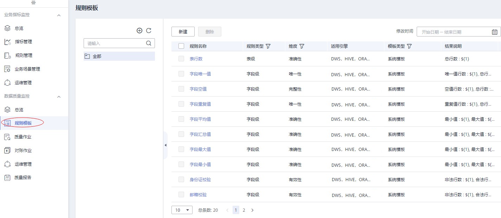
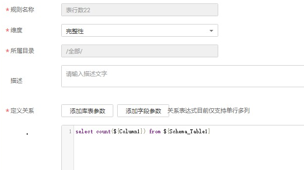
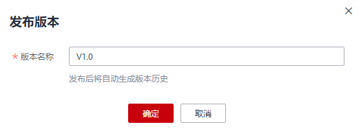
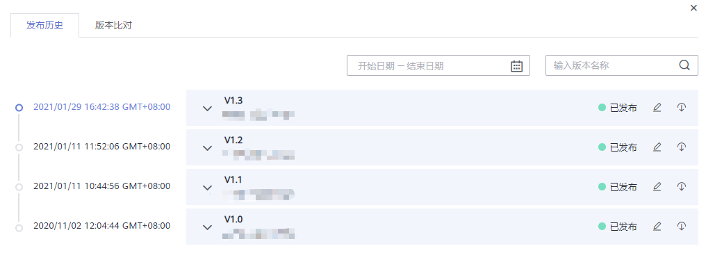
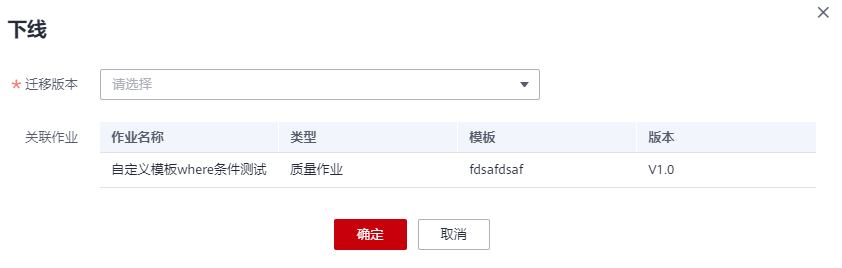
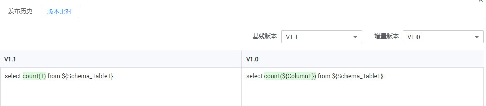

# 新建规则模板

创建规则是数据质量的核心，数据质量支持对离线数据的监控，您可根据表的实际需要创建规则。目前创建规则的方式包括模板规则和自定义规则。

系统内置的模板规则共计20种，分为库级规则、表级规则、字段级规则和跨字段级规则四种类型。当系统内置规则模板不足以满足您的需求，请参见下文自定义规则模板。

1.  选择“数据质量监控  \>  规则模板“，单击“新建“，在弹出的新建规则模板页面中进行配置。

    **图 1**  新建规则模板  
    

2.  在弹出的新建规则模板页面中输入规则名称，选择规则匹配的维度，定义SQL模板并对输出结果进行说明。
    -   维度：数据质量支持从完整性、有效性、及时性、一致性、准确性、唯一性六个维度进行单列、跨列、跨行和跨表的分析。自定义质量规则时，请对此规则进行维度匹配。
    -   定义关系：输入SQL语句，实现对数据的查找。
        -   样例：统计表行数，输入select count\($\{Column1\}\) from $\{Schema\_Table1\}。其中$\{Column1\}通过单击“添加字段参数”生成，$\{Schema\_Table1\} 通过单击“添加库表参数”生成。

    -   输出结果说明：对SQL获得结果的每一列进行说明，列说明之间用逗号进行分隔。
        -   样例：当定义关系设置为，select max（$\{Column1\}）,min\($\{Column2\}\) from $\{Schema\_Table1\}，则输出结果说明为“最大值，最小值”。结果说明应该与 关系定义的输出结果顺序一一对应。

            **图 2**  配置规则模板  
            

3.  单击“确定“后，系统默认发布此规则模板，版本名称默认为V1.0。

## 管理规则模板

自定义规则模板不支持直接修改已发布的历史版本。当您有修改需求，可以通过发布新版本以修改规则模板，并可以选择下线历史版本且将待下线历史版本关联的作业迁移到新版本上。具体请参见如下操作。

1.  选择“数据质量监控  \>  规则模板“，在规则模板列表中找到待修改的规则模板，单击操作列的“发布“。

    **图 3**  发布规则模板  
    

2.  支持修改维度，修改输出结果说明和重新定义关系。
3.  单击“发布新版本“，在提交发布对话框中，重新设置版本名称，并确认发布。

    **图 4**  发布新版本  
    

4.  提交发布后，单击操作列的“发布历史“，可以查看该规则模板的发布记录，支持查看变化信息、修改版本名称、下线对应版本等。

    **图 5**  发布历史界面  
    

5.  如需下线历史版本，点击历史版本最右侧的“下线”按钮。
    -   如果该版本没有关联作业，点击确认即可下线。
    -   如果该版本存在关联作业，需要选择迁移版本，将新版本与作业关联后，点击确认才能完成下线。

        **图 6**  迁移版本并下线  
        

6.  发布历史处支持进行版本比对，直观展示修改点。

    **图 7**  比对版本  
    

