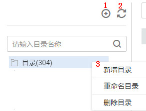

# 新建质量作业

质量作业可将创建的规则应用到建好的表中进行质量监控。

## 前提条件

在DGC控制台数据质量模块，“数据质量监控  \>  质量作业“页面创建归属目录。基于某个数据连接创建质量作业，需要选择作业归属目录，请参见[图1](#zh-cn_topic_0141836100_fig104618412258)创建归属目录。

**图 1**  新建质量作业的归属目录  

**表 1**  导航栏按键说明

<table><thead align="left"><tr id="zh-cn_topic_0141836100_row352545110274"><th class="cellrowborder" valign="top" width="11.42%" id="mcps1.2.3.1.1">
序号

</th>
<th class="cellrowborder" valign="top" width="88.58%" id="mcps1.2.3.1.2">
说明

</th>
</tr>
</thead>
<tbody><tr id="zh-cn_topic_0141836100_row352525182710"><td class="cellrowborder" valign="top" width="11.42%" headers="mcps1.2.3.1.1 ">
1

</td>
<td class="cellrowborder" valign="top" width="88.58%" headers="mcps1.2.3.1.2 ">
新建目录。

</td>
</tr>
<tr id="zh-cn_topic_0141836100_row55274511271"><td class="cellrowborder" valign="top" width="11.42%" headers="mcps1.2.3.1.1 ">
2

</td>
<td class="cellrowborder" valign="top" width="88.58%" headers="mcps1.2.3.1.2 ">
刷新目录。

</td>
</tr>
<tr id="zh-cn_topic_0141836100_row205282051102719"><td class="cellrowborder" valign="top" width="11.42%" headers="mcps1.2.3.1.1 ">
3

</td>
<td class="cellrowborder" valign="top" width="88.58%" headers="mcps1.2.3.1.2 ">
选择目录 ，单击右键，可新建目录、删除目录和对目录重命名。

</td>
</tr>
</tbody>
</table>

## 配置流程

1.  在DGC控制台首页，选择对应工作空间的“数据质量“模块，进入数据质量页面。

    **图 2**  选择数据质量  
    

1.  选择“数据质量监控  \>  质量作业“。
2.  单击“新建“，在弹出的对话框中，参见[表2](#zh-cn_topic_0141836100_table17370943112118)配置相关参数。

    **表 2**  配置作业参数

    
    <table><thead align="left"><tr id="zh-cn_topic_0141836100_row836964332120"><th class="cellrowborder" valign="top" width="21.08%" id="mcps1.2.3.1.1">
参数名

    </th>
    <th class="cellrowborder" valign="top" width="78.92%" id="mcps1.2.3.1.2">
说明

    </th>
    </tr>
    </thead>
    <tbody><tr id="zh-cn_topic_0141836100_row173692437211"><td class="cellrowborder" valign="top" width="21.08%" headers="mcps1.2.3.1.1 ">
作业名称

    </td>
    <td class="cellrowborder" valign="top" width="78.92%" headers="mcps1.2.3.1.2 ">
质量作业的名称，只能包含中文、英文字母、数字、“_”，且长度为1~64个字符。

    </td>
    </tr>
    <tr id="zh-cn_topic_0141836100_row16252121211388"><td class="cellrowborder" valign="top" width="21.08%" headers="mcps1.2.3.1.1 ">
描述

    </td>
    <td class="cellrowborder" valign="top" width="78.92%" headers="mcps1.2.3.1.2 ">
为更好的识别数据质量作业，此处加以描述信息。描述信息长度不能超过256个字符。

    </td>
    </tr>
    <tr id="zh-cn_topic_0141836100_row7610014183811"><td class="cellrowborder" valign="top" width="21.08%" headers="mcps1.2.3.1.1 ">
所属目录

    </td>
    <td class="cellrowborder" valign="top" width="78.92%" headers="mcps1.2.3.1.2 ">
数据质量作业的存储目录，可选择已创建的目录。目录创建请参见<a href="#zh-cn_topic_0141836100_fig104618412258">图1</a>。

    </td>
    </tr>
    <tr id="zh-cn_topic_0141836100_row175042052183919"><td class="cellrowborder" valign="top" width="21.08%" headers="mcps1.2.3.1.1 ">
作业级别

    </td>
    <td class="cellrowborder" valign="top" width="78.92%" headers="mcps1.2.3.1.2 ">
支持提示、一般、严重和致命四种级别，作业级别决定发出通知消息的模板样式。

    </td>
    </tr>
    </tbody>
    </table>

3.  单击“下一步“，进入规则配置页面。您需要点击规则卡片中的，然后参见[表3](#zh-cn_topic_0141836100_table7770194025911)配置数据质量规则。您也可选择添加质量规则，创建完成后单击下一步，即可将创建的所有规则应用到已建好的表中。

    **图 3**  打开质量作业规则配置  
    

    **表 3**  配置模板规则

    
    <table><thead align="left"><tr id="zh-cn_topic_0141836100_row277044035913"><th class="cellrowborder" valign="top" width="16.3%" id="mcps1.2.4.1.1">
添加方式

    </th>
    <th class="cellrowborder" valign="top" width="15.690000000000001%" id="mcps1.2.4.1.2">
配置

    </th>
    <th class="cellrowborder" valign="top" width="68.01%" id="mcps1.2.4.1.3">
说明

    </th>
    </tr>
    </thead>
    <tbody><tr id="zh-cn_topic_0141836100_row1677011403594"><td class="cellrowborder" rowspan="7" valign="top" width="16.3%" headers="mcps1.2.4.1.1 ">
来源对象

    </td>
    <td class="cellrowborder" valign="top" width="15.690000000000001%" headers="mcps1.2.4.1.2 ">
规则类型

    </td>
    <td class="cellrowborder" valign="top" width="68.01%" headers="mcps1.2.4.1.3 ">
包括库级规则、表级规则、字段级规则、跨字段级规则和自定义规则，自定义规则可针对表中的具体字段配置监控规则。此处选择为表级规则，页面中其他设置项对应为表级规则配置项。

    </td>
    </tr>
    <tr id="zh-cn_topic_0141836100_row145216212112"><td class="cellrowborder" valign="top" headers="mcps1.2.4.1.1 ">
数据连接

    </td>
    <td class="cellrowborder" valign="top" headers="mcps1.2.4.1.2 ">
从下拉列表中选择已创建的数据连接。

    
 说明： 

规则都是基于数据连接的，所以在建立数据质量规则之前需要先到管理中心模块中建立数据连接。

    

    </td>
    </tr>
    <tr id="zh-cn_topic_0141836100_row132411806219"><td class="cellrowborder" valign="top" headers="mcps1.2.4.1.1 ">
数据库

    </td>
    <td class="cellrowborder" valign="top" headers="mcps1.2.4.1.2 ">
选择配置的数据质量规则所应用到的数据库。

    
 说明： 
<ul id="ul73111932193612"><li>数据库基于已建立的数据连接。</li><li>当“规则类型”选择“库级规则”，数据对象选择对应的数据库即可。</li></ul>
    

    </td>
    </tr>
    <tr id="zh-cn_topic_0141836100_row194615722013"><td class="cellrowborder" valign="top" headers="mcps1.2.4.1.1 ">
数据表

    </td>
    <td class="cellrowborder" valign="top" headers="mcps1.2.4.1.2 ">
选择配置的数据质量规则所应用到的表。

    
 说明： 
<ul id="ul298416214592"><li>数据表与数据库强相关，基于已选择的数据库。</li><li>当“规则类型”选择“表级规则”，数据对象选择对应的数据表。</li></ul>
    

    </td>
    </tr>
    <tr id="row9401637398"><td class="cellrowborder" valign="top" headers="mcps1.2.4.1.1 ">
失败策略

    </td>
    <td class="cellrowborder" valign="top" headers="mcps1.2.4.1.2 ">
选择是否勾选“忽略规则错误”。

    </td>
    </tr>
    <tr id="zh-cn_topic_0141836100_row171461819144410"><td class="cellrowborder" valign="top" headers="mcps1.2.4.1.1 ">
选择字段

    </td>
    <td class="cellrowborder" valign="top" headers="mcps1.2.4.1.2 ">
当“规则类型”选择“字段级规则”，数据对象选择对应数据表中的字段。

    
 说明： 

数据质量字段级别校验不支持对字段名为单个字母（例如：a,b,c,d...等）的字段进行校验。

    

    </td>
    </tr>
    <tr id="row360811281145"><td class="cellrowborder" valign="top" headers="mcps1.2.4.1.1 ">
参考数据对象

    </td>
    <td class="cellrowborder" valign="top" headers="mcps1.2.4.1.2 ">
当“规则类型”选择“跨字段级规则”，需要配置该参数，选择参考的数据字段。

    </td>
    </tr>
    <tr id="zh-cn_topic_0141836100_row1312417243450"><td class="cellrowborder" rowspan="3" valign="top" width="16.3%" headers="mcps1.2.4.1.1 ">
规则模板

    </td>
    <td class="cellrowborder" valign="top" width="15.690000000000001%" headers="mcps1.2.4.1.2 ">
模板名称

    </td>
    <td class="cellrowborder" valign="top" width="68.01%" headers="mcps1.2.4.1.3 ">
选择系统内置的或者用户自定义的规则模板。

    
 说明： 

模板类型与规则类型强相关。

    <ul id="zh-cn_topic_0141836100_ul17382842105917"><li>当规则类型选择“库级规则”，当前系统已内置的模板类型为“数据库空值扫描”。</li><li>当规则类型选择“表级规则”，当前系统内置的模板类型为“表行数”和“数据表空值扫描”两种。</li><li>当规则类型选择“字段级规则”，当前系统已匹配内置多种模板类型，例如“电话号码合法性校验”、“IP地址合法性校验”、“邮箱合法性校验”等。</li><li>当规则类型选择“跨字段级规则”，当前系统已内置的模板类型为“字段一致性校验”。</li><li>除去系统内置规则模板外，您也可关联自定义的规则模板。自定义规则模板的方法请参见<a href="新建规则模板.md">新建规则模板</a>。</li></ul>
    

    </td>
    </tr>
    <tr id="row726512507402"><td class="cellrowborder" valign="top" headers="mcps1.2.4.1.1 ">
版本

    </td>
    <td class="cellrowborder" valign="top" headers="mcps1.2.4.1.2 ">
选择规则模板的版本。

    </td>
    </tr>
    <tr id="row99002304264"><td class="cellrowborder" valign="top" headers="mcps1.2.4.1.1 ">
权重

    </td>
    <td class="cellrowborder" valign="top" headers="mcps1.2.4.1.2 ">
设置规则的权重，支持按照字段级别设置权重。权重范围：【1-9】，整数。默认值为5。

    </td>
    </tr>
    <tr id="zh-cn_topic_0141836100_row165288546138"><td class="cellrowborder" valign="top" width="16.3%" headers="mcps1.2.4.1.1 ">
自定义SQL

    </td>
    <td class="cellrowborder" valign="top" width="15.690000000000001%" headers="mcps1.2.4.1.2 ">
SQL

    </td>
    <td class="cellrowborder" valign="top" width="68.01%" headers="mcps1.2.4.1.3 ">
输入完整的SQL语句，定义如何对数据对象进行数据质量监控。

    </td>
    </tr>
    <tr id="zh-cn_topic_0141836100_row27706404592"><td class="cellrowborder" rowspan="10" valign="top" width="16.3%" headers="mcps1.2.4.1.1 ">
告警条件

    </td>
    <td class="cellrowborder" valign="top" width="15.690000000000001%" headers="mcps1.2.4.1.2 ">
告警表达式

    </td>
    <td class="cellrowborder" valign="top" width="68.01%" headers="mcps1.2.4.1.3 ">
使用实际值替换规则模板中定义的“结果说明”变量，计算出结果作为告警条件。

    </td>
    </tr>
    <tr id="zh-cn_topic_0141836100_row166451937205716"><td class="cellrowborder" valign="top" headers="mcps1.2.4.1.1 ">
告警参数

    </td>
    <td class="cellrowborder" valign="top" headers="mcps1.2.4.1.2 ">
设置告警条件的告警参数，此参数来源于规则模板的输出结果。

    </td>
    </tr>
    <tr id="zh-cn_topic_0141836100_row11521241195717"><td class="cellrowborder" valign="top" headers="mcps1.2.4.1.1 ">
逻辑运算符

    </td>
    <td class="cellrowborder" valign="top" headers="mcps1.2.4.1.2 ">
将多个告警参数进行逻辑运算，组成更复杂的告警条件。

    </td>
    </tr>
    <tr id="row176617537292"><td class="cellrowborder" valign="top" headers="mcps1.2.4.1.1 ">
质量评分

    </td>
    <td class="cellrowborder" valign="top" headers="mcps1.2.4.1.2 ">
“规则类型”为“自定义规则”时，呈现此参数。

    
当前仅支持对内置规则模板结果说明中带有“比率”、“值率”字样的规则进行质量评分。自定义模板暂不支持进行质量评分。

    </td>
    </tr>
    <tr id="row09651620213"><td class="cellrowborder" valign="top" headers="mcps1.2.4.1.1 ">
生成异常数据

    </td>
    <td class="cellrowborder" valign="top" headers="mcps1.2.4.1.2 ">
开启“生成异常数据”开关，单击“选择库表”可将质量作业中不符合设定规则的异常数据存储在异常表中。

    
 说明： 
<ul id="ul1495823194413"><li>自定义规则模板，不支持生成异常数据。</li><li>系统内置模板，“表级规则”中的“表行数” 模板。“字段级规则”中的“字段平均值”、“字段汇总值”、“字段最大值”、“字段最小值”模板不支持生成异常数据。</li></ul>
    

    </td>
    </tr>
    <tr id="row199431641247"><td class="cellrowborder" valign="top" headers="mcps1.2.4.1.1 ">
异常表

    </td>
    <td class="cellrowborder" valign="top" headers="mcps1.2.4.1.2 ">
单击选择库表，可以配置输出表名的前后缀。

    </td>
    </tr>
    <tr id="row18698431185118"><td class="cellrowborder" valign="top" headers="mcps1.2.4.1.1 ">
输出配置

    </td>
    <td class="cellrowborder" valign="top" headers="mcps1.2.4.1.2 "><ul id="ul662614920386"><li>输出规则配置：勾选，则可在异常表中显示质量作业的配置信息，方便查看异常数据产生的源头。</li><li>输出空值：勾选，则当空值不满足设定规则时，可在异常表中输出空值。</li></ul>
    </td>
    </tr>
    <tr id="row71834341399"><td class="cellrowborder" valign="top" headers="mcps1.2.4.1.1 ">
异常数据数量

    </td>
    <td class="cellrowborder" valign="top" headers="mcps1.2.4.1.2 ">
可选择输出全部的异常数据，或者设定数量的异常数据。

    </td>
    </tr>
    <tr id="row1031428104715"><td class="cellrowborder" valign="top" headers="mcps1.2.4.1.1 ">
异常表SQL

    </td>
    <td class="cellrowborder" valign="top" headers="mcps1.2.4.1.2 ">
生成异常数据的SQL，指定输出哪些数据是异常数据。

    </td>
    </tr>
    <tr id="row15514142520111"><td class="cellrowborder" valign="top" headers="mcps1.2.4.1.1 ">
查看相同规则

    </td>
    <td class="cellrowborder" valign="top" headers="mcps1.2.4.1.2 ">
单击，创建质量作业时，

    <ul id="ul134513341109"><li>能够根据表和字段判断规则的重复性。</li><li>提示已存在相关子规则和质量作业，您可看到已有规则。</li></ul>
    </td>
    </tr>
    <tr id="zh-cn_topic_0141836100_row137708405593"><td class="cellrowborder" valign="top" width="16.3%" headers="mcps1.2.4.1.1 ">
计算引擎

    </td>
    <td class="cellrowborder" valign="top" width="15.690000000000001%" headers="mcps1.2.4.1.2 ">
集群类型

    </td>
    <td class="cellrowborder" valign="top" width="68.01%" headers="mcps1.2.4.1.3 ">
选择运行质量作业的引擎。仅数据连接为DLI类型时，此参数有效。

    </td>
    </tr>
    <tr id="zh-cn_topic_0141836100_row167991006566"><td class="cellrowborder" valign="top" width="16.3%" headers="mcps1.2.4.1.1 ">
计算范围

    </td>
    <td class="cellrowborder" valign="top" width="15.690000000000001%" headers="mcps1.2.4.1.2 ">
选择扫描区域

    </td>
    <td class="cellrowborder" valign="top" width="68.01%" headers="mcps1.2.4.1.3 ">
用来确定所配置的某条规则应检查的范围。

    <ul id="zh-cn_topic_0141836100_ul9808149112315"><li>勾选全表扫描，则遍历所有表。</li><li>勾选条件扫描，输入where条件后，精确定位分区查询数据，不需要全表扫描查询。</li></ul>
    </td>
    </tr>
    </tbody>
    </table>

4.  单击“下一步”，设置告警配置信息。
5.  单击“下一步“，设置订阅配置信息，如果需要接收SMN通知，打开通知状态，选择通知类型和SMN服务主体。
6.  单击“下一步“，选择调度方式，支持单次调度和周期调度两种方式，周期调度的相关参数配置请参见[表4](#zh-cn_topic_0141836100_table75621469441)。配置完成后单击“提交”。

    > **说明：** 
    >1.  单次调度会产生手动任务的实例，手动任务的特点是没有调度依赖，只需要手动触发即可。
    >2.  周期调度会产生周期实例，周期实例是周期任务达到启用调度所配置的周期性运行时间时，被自动调度起来的实例快照。
    >3.  周期任务每调度一次，便生成一个实例工作流。您可以对已调度起的实例任务进行日常的运维管理，如查看运行状态，对任务进行终止、重跑等操作。

    **表 4**  配置周期调度参数

    
    <table><thead align="left"><tr id="zh-cn_topic_0141836100_row1656214694416"><th class="cellrowborder" valign="top" width="27.58%" id="mcps1.2.3.1.1">
参数名

    </th>
    <th class="cellrowborder" valign="top" width="72.42%" id="mcps1.2.3.1.2">
说明

    </th>
    </tr>
    </thead>
    <tbody><tr id="zh-cn_topic_0141836100_row152800363813"><td class="cellrowborder" valign="top" width="27.58%" headers="mcps1.2.3.1.1 ">
生效日期

    </td>
    <td class="cellrowborder" valign="top" width="72.42%" headers="mcps1.2.3.1.2 ">
调度任务的生效日期。

    </td>
    </tr>
    <tr id="zh-cn_topic_0141836100_row65623466445"><td class="cellrowborder" valign="top" width="27.58%" headers="mcps1.2.3.1.1 ">
调度周期

    </td>
    <td class="cellrowborder" valign="top" width="72.42%" headers="mcps1.2.3.1.2 ">
选择调度任务的执行周期，并配置相关参数。

    <ul id="zh-cn_topic_0141836100_ul9562114610446"><li>分钟</li><li>小时</li><li>天</li><li>周
 说明： 
<ul id="zh-cn_topic_0141836100_ul75431855121011"><li>调度周期选择分钟/小时，需配置调度的开始时间、间隔时间和结束时间。开始时间目前支持设置到分钟级别，进行错峰调度。</li><li>调度周期选择天，需要配置调度时间，即确定了调度任务于每天的几时几分启用。</li><li>调度周期选择周，需要配置生效时间和调度时间，即确定了调度任务于周几的几时几分启用。</li></ul>
    

    </li></ul>
    </td>
    </tr>
    </tbody>
    </table>

