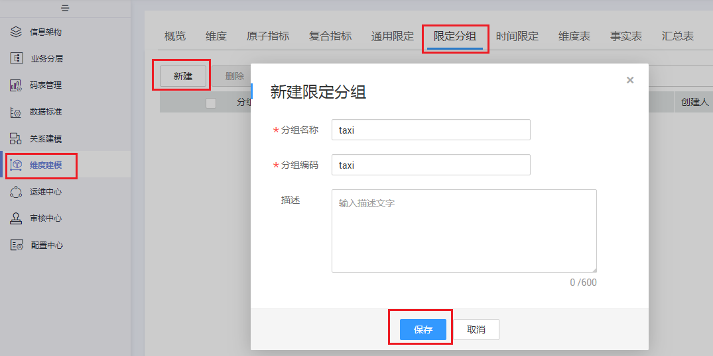

# 新建限定分组

原子指标是计算逻辑的标准化定义，限定分组则是条件限制的标准化定义。为保障所有统计指标统一、标准、规范地构建，限定分组在业务板块内唯一。

## 新建限定分组

在创建通用限定之前，需要先创建限定分组。

1.  [登录DAYU控制台](https://console.huaweicloud.com/dayu/)，找到所需要的DAYU实例，单击实例卡片上的“进入控制台”，进入概览页面。

    选择“空间管理”页签，完成工作空间的创建。

    在工作空间列表中，找到所需要的工作空间。

1.  单击相应工作空间的“规范设计“。

    系统跳转至规范设计页面。

1.  在规范设计页面，单击左侧导航树中的“维度建模“，选择“限定分组“页签。
2.  在“限定分组“页面，单击“新建“按钮，然后输入分组名称和编码，单击“保存“。

    **图 1**  新建限定分组  
    

    **表 1**  新建限定分组参数说明

    
    <table><thead align="left"><tr id="zh-cn_topic_0169427441_row323485355919"><th class="cellrowborder" valign="top" width="16.509999999999998%" id="mcps1.2.3.1.1">
参数名称

    </th>
    <th class="cellrowborder" valign="top" width="83.49%" id="mcps1.2.3.1.2">
说明

    </th>
    </tr>
    </thead>
    <tbody><tr id="zh-cn_topic_0169427441_row92340532595"><td class="cellrowborder" valign="top" width="16.509999999999998%" headers="mcps1.2.3.1.1 ">
分组名称

    </td>
    <td class="cellrowborder" valign="top" width="83.49%" headers="mcps1.2.3.1.2 ">
只能包含中文、英文字母、数字和下划线，且必须以中文或英文字母开头。

    </td>
    </tr>
    <tr id="zh-cn_topic_0169427441_row122346531594"><td class="cellrowborder" valign="top" width="16.509999999999998%" headers="mcps1.2.3.1.1 ">
分组编码

    </td>
    <td class="cellrowborder" valign="top" width="83.49%" headers="mcps1.2.3.1.2 ">
只能包含英文字母、数字和下划线，且必须以英文字母开头。

    </td>
    </tr>
    <tr id="zh-cn_topic_0169427441_row1923475320596"><td class="cellrowborder" valign="top" width="16.509999999999998%" headers="mcps1.2.3.1.1 ">
描述

    </td>
    <td class="cellrowborder" valign="top" width="83.49%" headers="mcps1.2.3.1.2 ">
描述信息。支持的长度0~600字符。

    </td>
    </tr>
    </tbody>
    </table>

## 管理限定分组

限定分组创建好之后，您可以进入规范设计的“维度建模 \> 限定分组“页面，对限定分组进行管理。

**图 2**  限定分组页面  

-   **编辑限定分组**
    1.  在需要编辑的限定分组右侧，单击“编辑“，弹出“编辑限定分组“对话框。
    2.  根据实际需要编辑相关内容。
    3.  单击“保存“。

-   **删除限定分组**
    1.  勾选需要删除的限定分组，单击左上角“删除“，系统弹出“删除“对话框。
    2.  单击“确定“。

