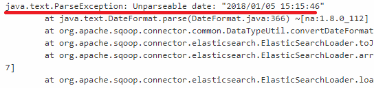
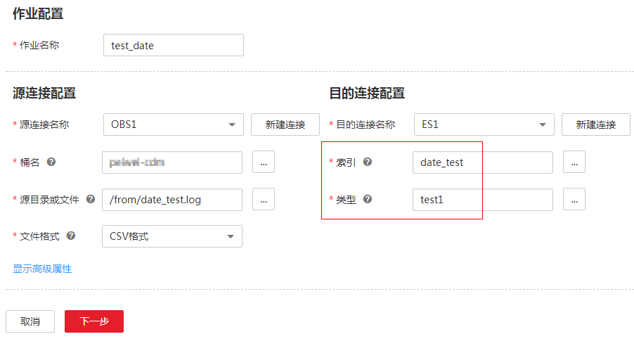
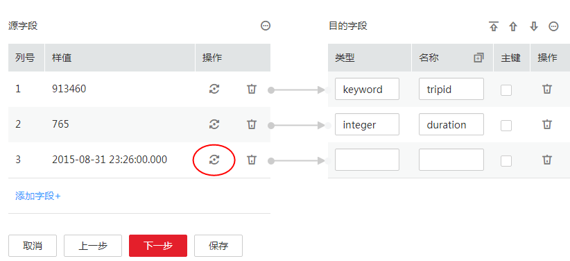
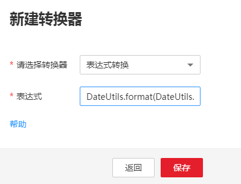

# 日志提示解析日期格式失败时怎么处理？

## 问题描述

在使用CDM迁移其他数据源到云搜索服务（Cloud Search Service）的时候，作业执行失败，日志提示“Unparseable date“，如[图1](#zh-cn_topic_0108275310_fig1635573022818)所示。

**图 1**  日志提示信息  

## 原因分析

云搜索服务对于时间类型有一个特殊处理：如果存储的时间数据不带时区信息，在Kibana可视化的时候，Kibana会认为该时间为GMT标准时间。

在中国区则会产生显示时间少8小时的现象。因此在CDM迁移数据到云搜索服务的时候，如果是通过CDM自动创建的索引和类型（例如[图2](#zh-cn_topic_0108275310_fig0791174202510)中，目的端的“date\_test“和“test1“在云搜索服务中不存在时，CDM会在云搜索服务中自动创建该索引和类型），则CDM默认会将时间类型字段的格式设置为“yyyy-MM-dd HH:mm:ss.SSS Z“的标准格式，例如“2018-01-08 08:08:08.666 +0800“。

**图 2**  作业配置  

此时，从其他数据源导入数据到云搜索服务时，如果源端数据中的日期格式不完全满足标准格式，例如“2018/01/05 15:15:46“，则CDM作业会执行失败，日志提示无法解析日期格式。需要通过CDM配置字段转换器，将日期字段的格式转换为云搜索服务的目的端格式。

## 解决方法

1.  编辑作业，进入作业的字段映射步骤，在源端的时间格式字段后面，选择新建转换器，如[图3](#zh-cn_topic_0108275310_fig115290014018)所示。

    **图 3**  新建转换器03  
    

2.  转换器类型选择“表达式转换“，目前表达式转换支持字符串和日期类型的函数，语法和Java的字符串和时间格式函数非常相似，可以查看[表达式转换](字段转换.md#zh-cn_topic_0108275447_section3561010716314)了解如何编写表达式。
3.  本例中源时间格式是“yyyy/MM/dd HH:mm:ss“，要将其转换成“yyyy-MM-dd HH:mm:ss.SSS Z“，需要经过如下几步：

    1.  添加时区信息“+0800“到原始日期字符串的尾部，对应的表达式为：**value+" +0800"**。
    2.  使用原始日期格式来解析字符串，将字符串解析为一个日期对象。可以使用DateUtils.parseDate函数来解析，语法是：**DateUtils.parseDate\(String value, String format\)**。
    3.  将日期对象格式化成目标格式的字符串，可以使用DateUtils.format函数来格式化，语法是**DateUtils.format\(Date date, String format\)**。

    因此本例中串起来完整的表达式是：**DateUtils.format\(DateUtils.parseDate\(value+" +0800","yyyy/MM/dd HH:mm:ss Z"\),"yyyy-MM-dd HH:mm:ss.SSS Z"\)**，如[图4](#zh-cn_topic_0108275310_fig115220341101)所示。

    **图 4**  配置表达式01  
    

4.  保存转换器配置，再保存并运行作业，可解决云搜索服务的解析日期格式失败问题。

