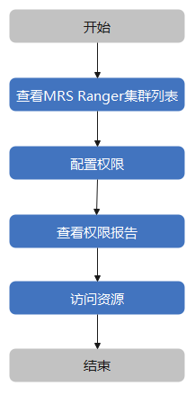

# 权限管理简介

访问权限控制是数据安全提供的一项资源访问权限的功能，您可以创建权限策略，并通过这些策略实现资源的访问控制，按需为用户分配最小权限，从而降低企业数据信息安全风险。

权限访问控制功能特性：

-   集中式访问控制

    数据安全支持多MRS集群管控，同时针对每个MRS集群中HDFS、Hive、HBase、Yarn、Kafka、Storm、Elasticsearch 七大主要服务提供权限访问控制，后续会增加更多云服务的权限控制，用户只要学习一次，即可方便的管理其他云服务的访问权限控制，使您能够在一个统一界面对多个MRS服务进行访问权限控制。这种集中式的管理权限，有效避免了权限管控的分散导致的管理难题。

-   丰富的权限策略配置

    数据安全提供了丰富的权限策略配置，包括资源细粒度的权限控制，允许访问、允许访问例外、拒绝访问、拒绝访问例外全方位的用户访问控制，支持配置权限策略生效时间以及配合可覆盖选项达到灵活控制访问的目的。

-   实现对MRS服务中的资源进行精细访问控制

    数据安全使您能够以更精细的粒度授予对MRS中服务资源的访问权限，帮助您的公司实施最小授权原则。您可以创建精细的资源访问控制策略，这些策略有助于确保在授予对MRS资源的访问权限时运用适当的安全控制措施。

-   全面的权限报告

    方便管理员查看各个用户的权限策略详情。

-   详细的授权、鉴权日志审计

    数据安全提供了详细的授权日志、鉴权日志，协助用户通过日志识别非法操作和高危操作，做到把控数据风险的目标。

## 使用流程

您可通过[图1](#fig204102392282)了解访问权限管理流程。

**图 1**  访问权限管理流程图  

1.  [查看MRS Ranger集群列表](查看MRS-Ranger集群列表.md)

    查看被纳管的MRS Ranger集群组件资源配置信息，为资源权限配置操作提供参考。

2.  [配置权限](配置资源权限.md)

    创建权限策略，配置资源权限。

3.  [查看权限报告](查看权限报告.md)

    查看资源配置权限策略及详情。

4.  访问资源

    用户访问已经完成了权限策略配置的资源。

## 支持访问控制的MRS组件及权限列表

Ranger通过插件的方式对MRS集群（MRS集群版本为3.0.0及以上）中的组件进行集成。通过Ranger可以对组件进行细粒度的访问权限控制。目前已经支持的组件及相关权限如[表1](#table23037523175)所示。

**表 1**  支持的组件及权限列表

<table><thead align="left"><tr id="row133031452171718"><th class="cellrowborder" valign="top" width="32.05%" id="mcps1.2.3.1.1">
组件名

</th>
<th class="cellrowborder" valign="top" width="67.95%" id="mcps1.2.3.1.2">
权限说明

</th>
</tr>
</thead>
<tbody><tr id="row1303185215171"><td class="cellrowborder" valign="top" width="32.05%" headers="mcps1.2.3.1.1 ">
HDFS

</td>
<td class="cellrowborder" valign="top" width="67.95%" headers="mcps1.2.3.1.2 ">
HDFS文件的权限：

<ul id="ul8510174016157"><li>Read：读权限</li><li>Write：写权限</li><li>Excute：执行权限</li></ul>
</td>
</tr>
<tr id="row133035524175"><td class="cellrowborder" valign="top" width="32.05%" headers="mcps1.2.3.1.1 ">
Hive

</td>
<td class="cellrowborder" valign="top" width="67.95%" headers="mcps1.2.3.1.2 ">
Hive数据库、数据表、列的权限：

<ul id="ul119971631114512"><li>Select：查询权限</li><li>Update：更新权限</li><li>Create：创建权限</li><li>Drop：drop操作权限</li><li>Alter：alter操作权限</li><li>All：所有执行权限</li><li>Temporary UDF Admin：临时UDF管理权限</li></ul>
</td>
</tr>
<tr id="row123042526177"><td class="cellrowborder" valign="top" width="32.05%" headers="mcps1.2.3.1.1 ">
Yarn

</td>
<td class="cellrowborder" valign="top" width="67.95%" headers="mcps1.2.3.1.2 ">
Yarn队列权限：

<ul id="ul17371225473"><li>submit-app：提交队列任务权限</li><li>admin-queue：管理队列任务权限</li></ul>
</td>
</tr>
<tr id="row1304852111720"><td class="cellrowborder" valign="top" width="32.05%" headers="mcps1.2.3.1.1 ">
HBase

</td>
<td class="cellrowborder" valign="top" width="67.95%" headers="mcps1.2.3.1.2 ">
HBase列、列族的权限：

<ul id="ul67401311194711"><li>Read：读权限</li><li>Write：写权限</li><li>Create：创建权限</li><li>Admin：管理员权限</li></ul>
</td>
</tr>
<tr id="row2304165216177"><td class="cellrowborder" valign="top" width="32.05%" headers="mcps1.2.3.1.1 ">
Kafka

</td>
<td class="cellrowborder" valign="top" width="67.95%" headers="mcps1.2.3.1.2 ">
Kafka的Topic权限：

<ul id="ul847352554716"><li>Publish：生产权限</li><li>Consume：消费权限</li><li>Configure：topic扩容权限</li><li>Describe：查询权限</li><li>Create：创建主题权限</li><li>Delete：删除主题权限</li><li>Describe Configs：查询配置权限</li><li>Alter Configs：修改配置权限</li></ul>
</td>
</tr>
<tr id="row1830415527177"><td class="cellrowborder" valign="top" width="32.05%" headers="mcps1.2.3.1.1 ">
Storm

</td>
<td class="cellrowborder" valign="top" width="67.95%" headers="mcps1.2.3.1.2 ">
Storm的Topology权限：

<ul id="ul1551258124915"><li>Submit Topology：提交拓扑</li><li>File Upload：上传文件</li><li>File DownLoad：下载文件</li><li>Kill Topology：删除拓扑</li><li>Rebalance：Rebalance权限</li><li>Activate：激活权限</li><li>Deactivate：去激活权限</li><li>Get Topology Conf：获取拓扑配置</li><li>Get Topology：获取拓扑</li><li>Get User Topology：获取用户拓扑</li><li>Get Topology Info：获取拓扑信息</li><li>Upload New Credential：上传新的凭证</li></ul>
</td>
</tr>
<tr id="row33541047145314"><td class="cellrowborder" valign="top" width="32.05%" headers="mcps1.2.3.1.1 ">
Elasticsearch

</td>
<td class="cellrowborder" valign="top" width="67.95%" headers="mcps1.2.3.1.2 ">
Elasticsearch索引的权限：

<ul id="ul4401164415315"><li>all：所有执行权限</li><li>monitor：监控权限</li><li>manage：管理权限</li><li>view_index_metadata：查看索引元数据权限</li><li>read：读权限</li><li>read_cross_cluster：跨集群读权限</li><li>index：写、更新权限</li><li>create：当前版本暂不支持create权限</li><li>delete：文档删除权限</li><li>write：写权限</li><li>delete_index：删除索引权限</li><li>create_index：创建索引权限</li></ul>
</td>
</tr>
</tbody>
</table>

