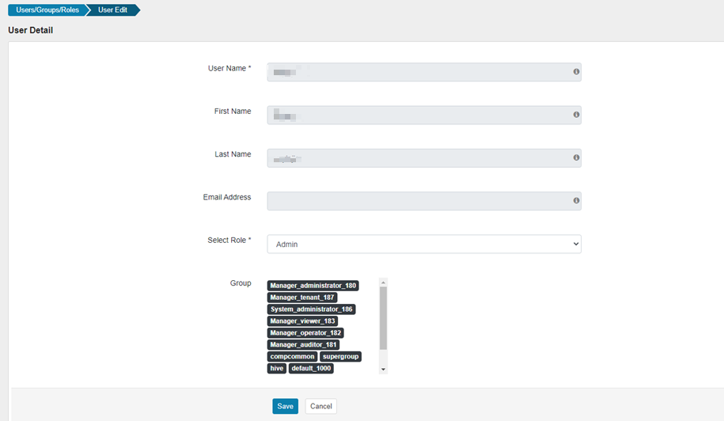
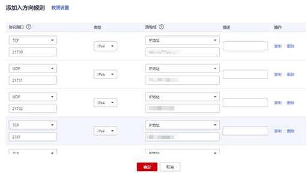
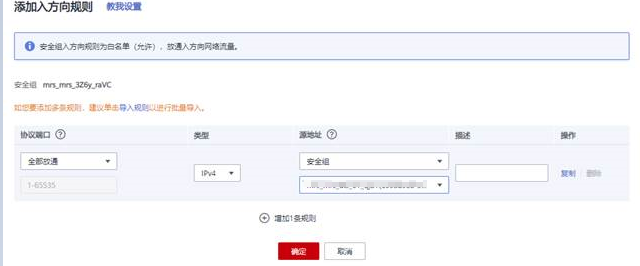
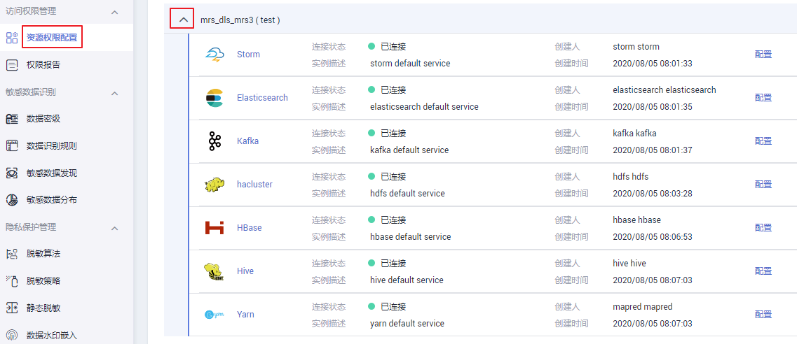
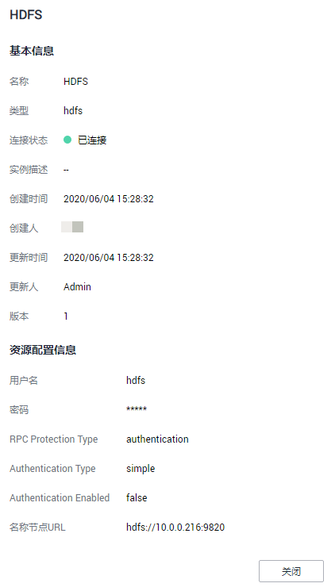

# 查看MRS Ranger集群列表

本章主要介绍如何查看被纳入数据安全管理的MRS Ranger集群。被纳管的MRS Ranger集群指的是创建了Ranger连接的MRS集群。

## 前提条件

MRS为非全托管服务，无法直接与非全托管服务进行连接。云数据迁移集群提供了与非全托管服务通信的代理，所以创建MRS Ranger的数据连接时，请选择一个云数据迁移集群，方法参见[创建连接](#section02133385153)。

## 创建连接

1.  购买MRS安全模式集群，购买时需要勾选Ranger服务及需要控制权限的组件，参考[创建集群](https://support.huaweicloud.com/usermanual-mrs/mrs_01_0513.html)

    注意：购买时需要开启**“Kerberos认证”**。

2.  创建MRS用户来管理权限，参考[创建MRS安全集群的kerberos认证用户](创建数据连接.md#section52193714195)。

    在rangerAdmin管理页面使用Ranger默认管理用户rangeradmin登录（第一次登录需要修改密码），参考[登录Ranger管理页面](https://support.huaweicloud.com/cmpntguide-mrs/mrs_01_1850.html)，登录密码参考[用户信息一览表](https://support.huaweicloud.com/usermanual-mrs/admin_guide_000239.html)中系统内部用户rangeradmin用户。

    在菜单点击settings按钮进入设置页面，几分钟后搜索刚刚建好的kerberos认证用户（需要几分钟时间同步到rangeradmin系统）。

    点击该用户进入权限设置页面，将role权限下拉框选为admin，点击“确定“。

    **图 1**  创建MRS用户  
    

3.  购买云数据迁移集群，参考[创建CDM集群](创建CDM集群.md)。

    注意：集群VPC必须与MRS集群节点处于同一个VPC内。

4.  配置安全组，开放必要端口，请参考[如何配置安全组](https://support.huaweicloud.com/usermanual-ecs/zh-cn_topic_0140323152.html)。此步骤是为了确保云数据迁移集群能够与该MRS集群通信。

    配置MRS集群的安全组策略：

    **方法一：**

    开放部分端口提供给云数据迁移集群的内网ip。必须开通的端口如下：

    -   KrbServer的tcp端口21730 和udp端口（21732，21731）；
    -   Zookeeper的端口（2181）；
    -   MRS Manager的端口（9022）；
    -   RangerAdmin的端口（21405）；

        **图 2**  添加入方向规则  
        

    **方法二：**

    将云数据迁移集群的安全组全部放开给MRS集群安全组。

    **图 3**  添加入方向规则界面  
    

5.  在管理中心创建“数据连接类型“为“MapReduce服务（MRS Ranger）“并且MRS集群版本为3.0.0及以上的MRS Ranger数据连接。如何创建请参考[创建数据连接](创建数据连接.md)。

## 查看MRS Ranger集群的服务详情

1.  在DGC控制台首页，选择对应工作空间的“数据安全“模块，进入数据安全页面。

    **图 4**  选择数据安全  
    

2.  单击数据安全控制台左侧导航树中的“资源权限配置“，进入资源权限配置页面。选择待查看的MRS集群，查看被纳管的MRS集群。

    **图 5**  查看被纳管的MRS集群  
    

3.  在服务列表中，单击待查看服务的名称，查看服务组件的基本信息和资源配置信息。

    **图 6**  服务详情  
    

