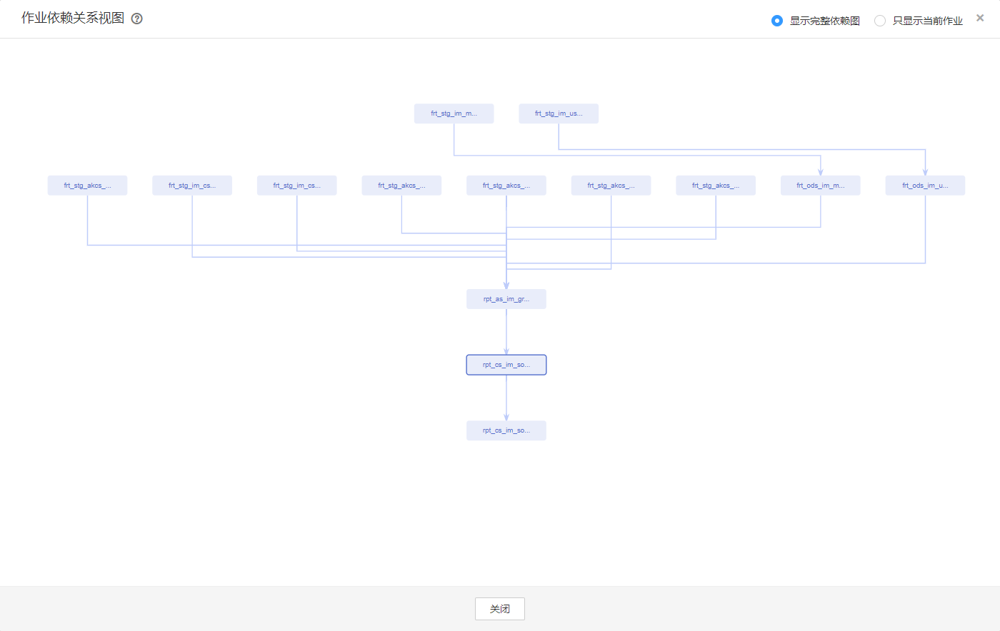

# 查看作业依赖关系图

您可以通过查看作业依赖关系视图，直观查看该作业关联的上下游作业。

## 前提条件

已经在[开发作业](开发作业.md)的作业调度配置中设置了依赖作业，否则视图中仅能展示当前作业节点，无法展示具备依赖关系的上下游作业节点。

## 操作步骤

1.  登录DGC控制台。选择对应工作空间的“数据开发“模块，进入数据开发页面。

    **图 1**  选择数据开发  
    

2.  在数据开发主界面的左侧导航栏，选择“数据开发  \>  作业开发“。
3.  在作业目录中选择需要查看的作业，右键单击作业名称，选择“查看作业依赖关系图“，界面弹出“作业依赖关系视图“页面。

    **图 2**  作业依赖关系视图  
    

4.  在弹出的“作业依赖关系视图“页面，支持如下操作：
    -   视图右上角支持“显示完整依赖图“和“只显示当前作业“。
    -   鼠标滚轮可放大、缩小关系图。
    -   鼠标按住空白处，可自由拖拽用以查看完整关系图。
    -   鼠标按住节点处，可自由拖拽当前节点位置。
    -   鼠标光标悬停在作业节点上，该作业节点会被标记为绿色，上游作业会被标记为青蓝色，下游作业会被标记为橙黄色。

        **图 3**  上下游作业节点标记  
        

    -   在作业节点上左键单击，可选择该节点，再次点击即可取消选择。
    -   在作业节点上右键单击，可进行查看作业、复制节点名称、展开上/下游作业、选择/取消该节点的上/下游节点等操作。

        **图 4**  作业节点操作  
        

