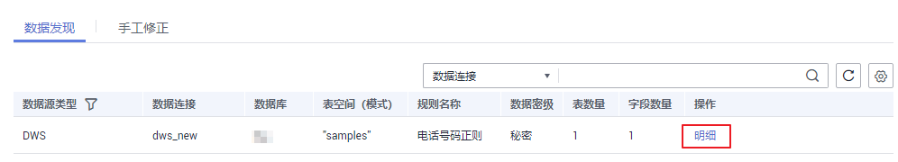
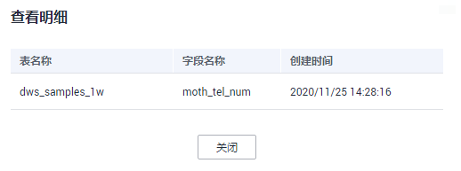
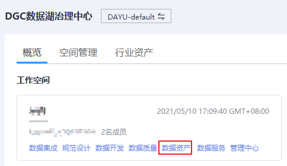
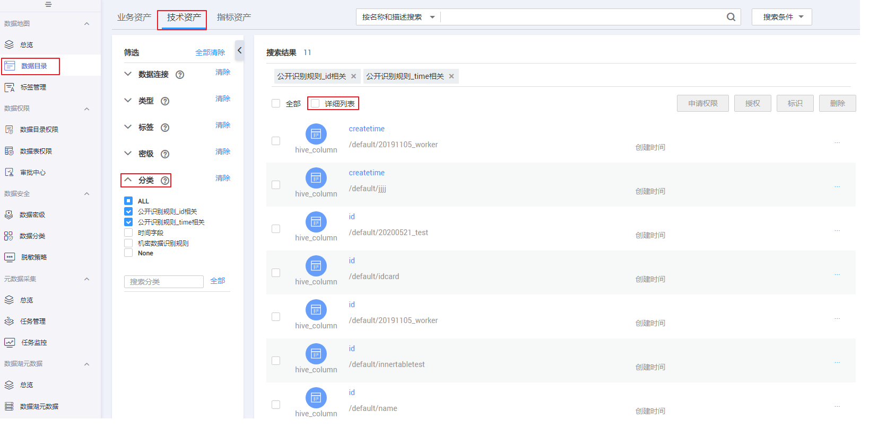

# 查看敏感数据分布

本章主要介绍如何数据发现和手工修正。

数据发现：敏感数据识别任务完成后，可以通过查看敏感数据明细和数据资产侧查看敏感数据操作来查看识别结果。

手工修正：自动识别敏感数据完成后，您可根据具体情况进行手工修正，选择手动同步敏感数据到数据资产或从数据资产中删除该数据。

## 前提条件

完成敏感数据识别任务的创建和运行，如何创建和运行敏感数据识别任务请参见[创建敏感数据发现任务](发现敏感数据.md#section191138181)和[调度运行敏感数据发现任务](发现敏感数据.md#section1526433521717)。

## 查看敏感数据明细

1.  在DGC控制台首页，选择对应工作空间的“数据安全“模块，进入数据安全页面。

    **图 1**  选择数据安全  
    

2.  单击左侧导航树中的“敏感数据分布“，进入敏感数据分布页面，选择“数据发现“页签。您可以通过查询功能，快速定位数据源名称。找到待查看的敏感数据，单击“明细“

    **图 2**  数据发现  
    

3.  查看敏感数据明细内容。

    **图 3**  查看明细内容  
    

## 数据资产侧查看敏感数据

**前提条件：**确保敏感数据发现任务运行前，数据资产中已采集到该字段数据，数据采集请参考[任务管理](任务管理.md)。

**操作步骤：**

1.  在DGC控制台首页，选择对应工作空间的“数据资产“模块，进入数据资产页面。

    **图 4**  选择数据资产  
    

1.  单击左侧导航树中的“数据目录“，打开“技术资产“页签。
2.  在页面左侧勾选“密级“和“分类“，页面右侧根据搜索条件同步显示搜索结果。

    **图 5**  数据资产侧查看敏感数据  
    

3.  勾选搜索结果上方的“详细列表“，搜索结果将显示数据详细信息供用户查看，也可以单击名称查看详情。

## 手工修正数据状态

**前提条件：**确保敏感数据发现任务运行前，数据资产中已采集到该字段数据，数据采集请参考[任务管理](任务管理.md)。

**操作步骤：**

1.  在DGC控制台首页，选择对应工作空间的“数据安全“模块，进入数据安全页面。

    **图 6**  选择数据安全  
    

2.  单击左侧导航树中的“敏感数据分布“，进入敏感数据分布页面。
3.  在页面上方单击“手工修正“，查找待修正的敏感数据，单击“使无效“或“使有效“，手工修正数据状态。

    使无效：表示从数据资产中删除该数据。

    使有效：表示将手动同步该敏感数据到数据资产。

