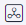
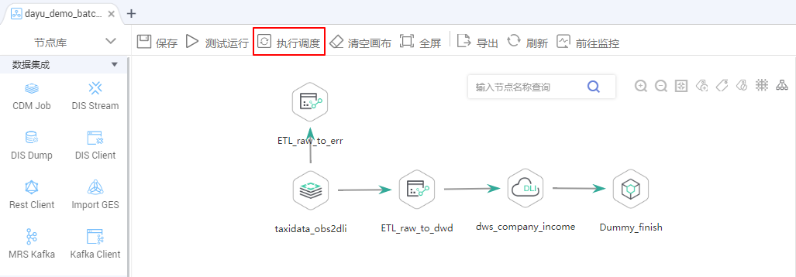

# 查看数据血缘

当数据开发模块中的作业已完成血缘关系配置后，启动作业调度，并在数据资产模块在进行元数据采集任务，则可以在数据资产模块可视化查看数据血缘关系。

## 前提条件

已完成血缘关系的自动配置或手工配置，请参见[配置数据血缘](配置数据血缘.md)。

## 启动作业调度

1.  登录DGC控制台。选择对应工作空间的“数据开发“模块，进入数据开发页面。

    **图 1**  选择数据开发  
    

2.  在数据开发控制台，单击左侧导航栏中的作业开发按钮，进入作业开发页面后，打开已完成血缘配置的作业。
3.  在数据开发中，当作业进行“执行调度”时，系统开始解析血缘关系。

    > **说明：** 
    >测试运行不会解析血缘。

    **图 2**  作业调度  
    

## 新建元数据采集任务

如果已创建元数据采集任务，此操作可跳过。

1.  在DGC控制台首页，选择对应工作空间的“数据资产“模块，进入数据资产页面。

    **图 3**  选择数据资产  
    

2.  请参见[任务管理](任务管理.md)，新建元数据采集任务。

## 查看数据血缘关系

1.  在DGC控制台首页，选择对应工作空间的“数据资产“模块，进入数据资产页面。

    **图 4**  选择数据资产  
    

2.  在“数据目录 \> 技术资产“页面，可以对数据开发的作业、节点、表进行查询。

    在“类型“筛选区域，单击“全部“按钮并勾选“Job“、“Node“和“Table“类型，然后单击“确定“。数据开发中的作业对应于Job类型，节点对应于Node类型，表对应于Table类型。

    > **说明：** 
    >数据开发中的作业信息不属于任何一个数据连接，故如果在搜索条件中勾选数据连接，则查询不到结果。

    **图 5**  选择类型  
    

3.  在数据资产搜索结果中，类型名称末尾带“\_job“的数据资产为作业，单击某一作业名称，可以查看该作业的详情。在作业的详情页面进入“作业“Tab页，单击“编辑“可跳转到数据开发的作业编辑页面。

    **图 6**  查看作业  
    

4.  在数据资产搜索结果中，类型名称末尾带“\_node“的数据资产为节点，单击某一节点名称，可以查看节点的详情。在节点（需是支持血缘的节点类型）详情页面，可以查看节点的血缘信息。

    -   单击血缘图中节点左右两端“+”、“-”图标，可以进一步展开查看血缘的上下链路。
    -   单击血缘图中的某一个节点，可以查看该节点的详情。
    -   进入“作业“Tab页，单击“编辑“可跳转到数据开发的作业编辑页面。

    **图 7**  查看节点血缘  
    

5.  在数据资产搜索结果中，图标为表格的数据资产为表，单击某一表名称，可以查看表的详情。在详情页面，可以查看表的血缘信息。

    -   单击血缘图中表左右两端“+”、“-”图标，可以进一步展开查看血缘的上下链路。
    -   单击血缘图中的某一个表，可以查看该表的详情。

    **图 8**  查看表血缘  
    

